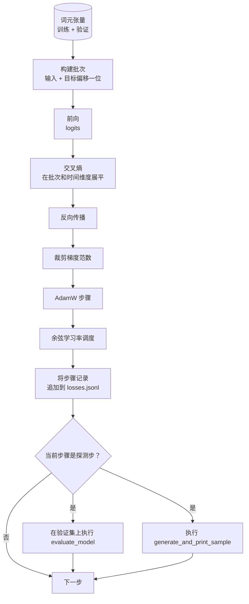

# 训练循环与评估

> 不进行测量的循环是在撒谎。本节内容构建驱动 GPT 模型的训练循环：带权重衰减拆分的 AdamW、预热加余弦学习率调度、`calc_loss_batch` 辅助函数、在保留数据上执行的 `evaluate_model` 评估、每 K 步进行一次的 `generate_and_print_sample` 定性采样，以及可供后续绘图的 JSONL 损失日志。这个相同的框架可训练你将构建的任何解码器大型语言模型。

**类型：** 构建
**语言：** Python
**前置条件：** 第 19 阶段第 30 至 35 课
**预计时长：** 约 90 分钟

## 学习目标

- 构建一个训练循环，针对下一个词元预测，以正确的输入与目标对齐方式计算交叉熵损失。
- 配置 AdamW 优化器，将权重衰减应用于权重张量，而不应用于 LayerNorm 或偏置张量。
- 实现具有线性预热和余弦衰减的学习率调度，并能读取随时间变化的学习率。
- 使用 `evaluate_model` 在保留数据划分上进行评估，使不同运行之间的评估损失具有可比性。
- 每 K 步使用 `generate_and_print_sample` 生成定性样本，在损失曲线之前捕捉发散迹象。
- 将每一步的损失持久化到 JSONL 格式，以便你可以重新加载、绘图，并将训练日志作为交付物提交。

## 问题

一个只打印损失而不做其他事情训练脚本在三个方面有所不足。它无法告诉你损失是否因正确的原因在下降（模型可能过拟合训练集而从未真正学习）。它无法告诉你发散是否正在开始（损失可能在某一步骤飙升然后恢复，也可能在某一步骤飙升后崩溃）。它无法告诉你模型学到了什么（损失是一个标量，而生成的样本是一整段文字）。如果训练循环不进行测量，这三个不足都将被隐藏。

本节的训练循环从三个方面进行测量。每一步的训练批次损失。每 K 步的保留数据批次损失。每 K 步从固定提示生成的延续文本。训练日志以 JSONL 格式保存，使得生成的产物成为训练循环的见证。

## 概念


```mermaid
flowchart TB
  D[(词元张量<br/>训练 + 验证)] --> B[构建批次<br/>输入 + 目标偏移一位]
  B --> F[前向<br/>logits]
  F --> L[交叉熵<br/>在批次和时间维度展平]
  L --> Bw[反向传播]
  Bw --> Cg[裁剪梯度范数]
  Cg --> Step[AdamW 步骤]
  Step --> Sched[余弦学习率调度]
  Sched --> JL[将步骤记录<br/>追加到 losses.jsonl]
  JL --> Probe{当前步骤是探测步？}
  Probe -- 是 --> Eval[在验证集上执行 evaluate_model]
  Probe -- 是 --> Sample[执行 generate_and_print_sample]
  Probe -- 否 --> Next[下一步]
  Eval --> Next
  Sample --> Next
```

两个不太直观的部分是损失对齐和 AdamW 衰减拆分。

### 损失对齐

模型在每个位置预测下一个词元。如果输入批次包含词元 `[t0, t1, t2, t3]`，则目标批次必须为 `[t1, t2, t3, t4]`。交叉熵在展平后的形状 `(batch * seq, vocab)` 上计算，对应的展平目标形状为 `(batch * seq,)`。如果忘记偏移，训练出来的模型将预测自身，损失会收敛到零但学不到任何有用信息。

### AdamW 衰减拆分

权重衰减正则化的是权重张量，而不是归一化缩放参数或偏置。对 LayerNorm 缩放参数施加衰减会逐渐将其推向零，从而破坏归一化。对偏置施加衰减在数学上无害，但浪费计算资源。标准的拆分方式是：矩阵形状的张量（线性层权重、嵌入表）应用衰减，而任何看起来像缩放或偏移的参数则不应用。

### 预热加余弦调度

预热阶段在前几百步将学习率从零逐渐提升到目标值，使优化器状态有足够的时间初始化。余弦衰减在剩余步数中将学习率逐渐降回接近零，使最终阶段以小步长微调权重。这种组合是开放权重大语言模型训练中最常见的调度方式，因为它消除了训练的前一千步和后一千步中大部分脆弱环节。

### 保留数据评估

`evaluate_model` 从验证划分中加载固定数量的批次，累计损失，除以批次数后返回结果。无需梯度计算，不使用 Dropout。在相同种子和相同划分条件下，该数值在不同运行间是可复现的。将保留数据上的损失与训练损失并列展示，是发现过拟合的方式。

### 作为早期信号的定性采样

一个训练损失持续下降但生成样本全是同一个词元的模型已经出现了问题。一个损失曲线看似平坦但生成样本逐渐变成连贯词语的模型正在学习。定性探测的运行速度比阅读完整曲线更快，并且能捕捉到标量损失无法发现的模式。

## 构建它

`code/main.py` 实现了以下功能：

- `make_batches(token_ids, batch_size, context_length)`：将长词元张量切分为输入-目标对。
- `calc_loss_batch(model, inputs, targets)`：执行前向传播、展平操作，并返回标量交叉熵损失。
- `evaluate_model(model, val_loader, max_batches)`：不计算梯度，迭代固定数量的验证批次，返回平均损失。
- `generate_and_print_sample(model, prompt, max_new_tokens)`：对固定提示运行第 35 课的生成函数并打印结果。
- `build_param_groups(model, weight_decay)`：生成两个分组的 AdamW 参数列表。
- `cosine_with_warmup(step, warmup_steps, total_steps, max_lr, min_lr)`：返回给定步数下的学习率。
- `train(...)`：运行训练循环，将结果持久化到 `outputs/losses.jsonl`，每隔 `eval_every` 步打印评估损失和采样结果。
- 一个演示程序：在合成数据上训练一个小型模型若干步，写入 JSONL 日志，并在探测点打印评估损失和样本。该演示在 CPU 上运行时间远低于一分钟。

运行它：

```bash
python3 code/main.py
```

输出：每一步的损失行、每个探测步的评估损失、每个探测步的生成样本，以及一个最终的 `outputs/losses.jsonl` 文件（可使用 `json.loads` 逐行加载）。

## 技术栈

- `torch`：用于自动求导、优化器和模块。
- `main.py`：在本地重新实现了第 35 课的 `GPTModel` 及其支持模块。

## 生产环境中的常见模式

以下三种模式能将课本式的训练循环变成可以通宵运行的生产代码。

**梯度范数裁剪不可妥协。** 一个糟糕的批次（异常数据、学习率尖峰、数值边缘情况）会产生巨大的梯度，从而摧毁数小时的训练成果。在 `backward` 之后、`step` 之前执行 `torch.nn.utils.clip_grad_norm_(params, max_norm=1.0)`，确保优化器保持在安全范围内。裁剪值是一个自由参数；取 1 是适用于大多数情况的默认值。

**可恢复的 JSONL 日志，而非 Pickle 状态。** 将每一步的损失记录以 `{"step": int, "train_loss": float, "lr": float}` 格式追加到 JSONL 文件中，具有持久性：任何崩溃都会留下可读的产物，你可以使用 grep 搜索，用三十行 Python 代码绘图，还可以通过读取最后一步来恢复训练。Pickle 状态将你绑定到生成该文件时的精确模块布局，这在重构过程中非常脆弱。

**从固定切片中抽取的评估批次。** 验证词元在脚本启动时一次性切分为批次，而非动态生成。可重现性依赖于评估批次在不同运行间保持一致；否则，比较两次运行的评估损失时，衡量结果既包含模型的变化也包含批次打乱的影响。

## 使用它

- 本节中的训练循环与在真实数据上训练 1.24 亿参数模型使用的是同样的框架。将合成词元张量替换为 `datasets` 风格的数据加载器，训练循环即可原封不动地运行。
- JSONL 日志是将训练运行转化为证据的可交付物。下一课将使用它来比较新训练的检查点与预训练检查点。
- 定性样本探测是标量损失无法替代的全面检查手段。

## 练习

1. 为 `weight_decay_groups()` 添加单元测试，确认缩放参数和偏置参数归入无衰减分组，而线性层和嵌入层权重归入衰减分组。
2. 将合成的随机词元替换为来自小型文本文件的字节，使演示程序在可读内容上进行训练。验证生成的样本使用了文件中存在的字符。
3. 在余弦调度中增加一个 `min_lr` 下限（设置为 `max_lr` 的百分之十），并重新绘图。
4. 除了 JSONL 日志之外，每 `eval_every` 步保存一个检查点。添加一个 `resume_from` 标志，能够重新加载模型状态和优化器状态。
5. 在损失旁边记录每一步的吞吐量（每秒处理的词元数），并确认其保持在一个稳定的范围内。

## 关键术语

| 术语 | 通常说法 | 实际含义 |
|------|---------|---------|
| 损失对齐 | "偏移一位" | 输入词元在位置 0..T-1，目标词元在位置 1..T；交叉熵在展平后的形状上计算 |
| 衰减拆分 | "两个分组" | AdamW 对矩阵形状的张量应用权重衰减，对缩放或偏置张量不应用 |
| 预热 | "斜坡上升" | 学习率在固定步数内从零爬升至目标值，以便优化器状态完成初始化 |
| 评估批次 | "保留批次" | 验证词元张量的一个固定切片，在脚本启动时一次性切好，每次探测时使用相同的部分 |
| 定性探测 | "样本打印" | 每 K 步从固定提示生成一段简短的文本并打印，用于捕捉单独依赖损失无法发现的故障模式 |

## 延伸阅读

- 第 19 阶段第 35 课：了解训练循环驱动的模型。
- 第 19 阶段第 37 课：了解如何将预训练权重加载到同一模型中。
- 第 10 阶段第 04 课（预训练迷你 GPT）：了解在真实数据上的完整流程。
- 第 10 阶段第 10 课（评估）：了解除交叉熵损失之外更广泛的评估维度。
