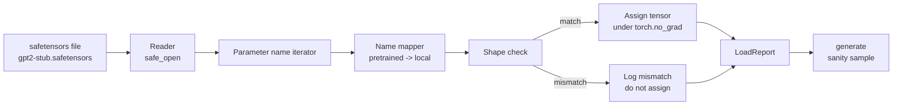

# Carregando Pesos Pré-treinados

> Treinar um modelo de 124 milhões de parâmetros do zero é uma decisão de orçamento; carregar um checkpoint publicado é uma terça-feira. Esta lição carrega pesos pré-treinados estilo GPT-2 de um arquivo safetensors na exata arquitetura da lição 35, caminha o mapeamento de nomes de parâmetros pedaço por pedaço, e faz uma geração de sanidade para provar que o carregamento funcionou. Sem rede, sem loaders de terceiros, sem magia opaca.

**Tipo:** Construção
**Idiomas:** Python
**Pré-requisitos:** Lições 30 a 36 da Fase 19
**Tempo:** ~90 minutos

## Objetivos de Aprendizado

- Ler um arquivo safetensors com a biblioteca Python `safetensors` e inespecificaçãoionar nomes e formatos dos tensores.
- Mapear cada nome de parâmetro pré-treinado para um parâmetro dentro do modelo GPT da lição 35.
- Lidar com as duas convenções de nomes que diferem entre os pesos GPT-2 publicados e o modelo desta trilha: `wte/wpe/h.N.attn.c_attn/c_proj` e `mlp.c_fc/c_proj` versus os nomes locais `tok_embed/pos_embed/blocks.N.attn.qkv/out_proj` e `mlp.fc1/fc2`.
- Detectar e recusar um incompatibilidade de formato com um erro claro antes que qualquer atribuição de peso aconteça.
- Gerar uma continuação curta com os pesos carregados e confirmar que os tokens vêm da distribuição carregada, não da aleatoriamente inicializada.

## O Problema

Pesos publicados não são empacotados para sua arquitetura. Eles carregam os nomes que a implementação original usou. O arquivo pré-treinado tem `transformer.h.0.attn.c_attn.weight` com formato `(2304, 768)`; seu modelo espera `blocks.0.attn.qkv.weight` com formato `(2304, 768)` (que é a mesma matriz em uma convenção de layout diferente) ou seu modelo usa `nn.Linear` que armazena a matriz transposta. O mesmo parâmetro aparece com três identidades sutilmente diferentes (nome, formato, layout de bytes) e o loader tem que reconciliar todas as três.

Um loader que copia cegamente coloca o tensor certo no lugar errado e você tem um modelo que gera nonsense. Um loader que se recusa a copiar quando o formato difere mas não registra nada te deixa adivinhando qual tensor falhou em ser colocado. O loader nesta lição é explícito: toda atribuição é registrada, todo formato é verificado, e um `LoadReport` resume acertos, falhas e incompatibilidades de formato para que você possa ler o que aconteceu.

## O Conceito



O mapeador de nomes é apenas uma função de string para string. A verificação de formato é um if. A atribuição acontece dentro de `torch.no_grad()` para que o autograd não rastreie o carregamento. O relatório armazena o resultado de cada nome.

### A convenção de nomes do GPT-2

Pesos GPT-2 publicados vivem sob nomes como:

| Nome pré-treinado | Formato | Significado |
|-------------------|---------|-------------|
| `wte.weight` | (50257, 768) | Embedding de token |
| `wpe.weight` | (1024, 768) | Embedding de posição |
| `h.N.ln_1.weight` | (768,) | Escala da LayerNorm 1 no bloco N |
| `h.N.ln_1.bias` | (768,) | Deslocamento da LayerNorm 1 no bloco N |
| `h.N.attn.c_attn.weight` | (768, 2304) | Peso linear QKV fundido |
| `h.N.attn.c_attn.bias` | (2304,) | Bias linear QKV fundido |
| `h.N.attn.c_proj.weight` | (768, 768) | Projeção de saída da attention |
| `h.N.attn.c_proj.bias` | (768,) | Bias da projeção de saída da attention |
| `h.N.ln_2.weight` | (768,) | Escala da LayerNorm 2 |
| `h.N.ln_2.bias` | (768,) | Deslocamento da LayerNorm 2 |
| `h.N.mlp.c_fc.weight` | (768, 3072) | Peso MLP fc1 |
| `h.N.mlp.c_fc.bias` | (3072,) | Bias MLP fc1 |
| `h.N.mlp.c_proj.weight` | (3072, 768) | Peso MLP fc2 |
| `h.N.mlp.c_proj.bias` | (768,) | Bias MLP fc2 |
| `ln_f.weight` | (768,) | Escala da LayerNorm final |
| `ln_f.bias` | (768,) | Deslocamento da LayerNorm final |

Duas surpresas para planejar. As lineares `c_attn`, `c_proj`, `c_fc` são armazenadas com a matriz transposta em relação ao que `nn.Linear.weight` espera. O loader transpoe durante a atribuição. A cabeça de LM não está no arquivo; o modelo depende de weight tying com `wte`, então a cabeça é definida por aliasing uma vez que `wte` aterrissa.

### A convenção de nomes local

O modelo nesta trilha usa nomes descritivos:

| Nome local | Significado |
|------------|-------------|
| `tok_embed.weight` | Embedding de token |
| `pos_embed.weight` | Embedding de posição |
| `blocks.N.ln1.scale` | Escala da LayerNorm 1 no bloco N |
| `blocks.N.ln1.shift` | Deslocamento da LayerNorm 1 |
| `blocks.N.attn.qkv.weight` | QKV fundido |
| `blocks.N.attn.qkv.bias` | Bias QKV fundido |
| `blocks.N.attn.out_proj.weight` | Projeção de saída da attention |
| `blocks.N.attn.out_proj.bias` | Bias da projeção de saída |
| `blocks.N.ln2.scale` | Escala da LayerNorm 2 |
| `blocks.N.ln2.shift` | Deslocamento da LayerNorm 2 |
| `blocks.N.mlp.fc1.weight` | MLP fc1 |
| `blocks.N.mlp.fc1.bias` | Bias MLP fc1 |
| `blocks.N.mlp.fc2.weight` | MLP fc2 |
| `blocks.N.mlp.fc2.bias` | Bias MLP fc2 |
| `final_ln.scale` | Escala da LayerNorm final |
| `final_ln.shift` | Deslocamento da LayerNorm final |

O mapeamento é uma função fixa. A lição o fornece como um dict que o loader itera.

### O fixture stub

Pesos GPT-2 reais têm 0,5 GB. A demo não baixa eles; ela gera um fixture safetensors pequeno na primeira execução, com a exata convenção de nomes GPT-2 e formatos apropriados para um modelo de 12 blocos com d_model 192 em vez de 768. O fixture tem a estrutura certa para exercitar cada caminho de código no loader. Troque o fixture pelo arquivo real e o loader funciona sem modificação.

## Construa

`code/main.py` implementa:

- Uma réplica pequena do `GPTModel` da lição 35 para que esta lição seja autocontida.
- `make_pretrained_to_local(num_layers)` que expande as entradas por camada.
- `load_safetensors(model, path)` que itera nomes, os mapeia, verifica formato, transpoe os pesos no estilo conv1d e atribui sob `torch.no_grad()`. Retorna um `LoadReport`.
- `make_stub_safetensors(path, cfg)` que gera um arquivo fixture com a exata convenção de nomes pré-treinados.
- Uma demo que cria `outputs/gpt2-stub.safetensors` na primeira execução, constrói um modelo novo, captura uma continuação gerada a partir de inicialização aleatória, carrega o stub, captura outra continuação, imprime ambas e verifica que são diferentes (o carregamento realmente mudou o modelo).

Execute:

```bash
python3 code/main.py
```

Saída: o caminho do fixture, um log de carregamento por nome, um resumo do `LoadReport`, uma continuação antes do carregamento, uma continuação depois do carregamento, e uma incompatibilidade de formato em um único tensor intencionalmente ruim injetado no fixture para que o caminho de falha seja exercitado.

## Stack

- `safetensors` para o formato em disco e um leitor streaming.
- `torch` para o modelo e a matemática de atribuição.
- Sem `transformers`, sem `huggingface_hub`, sem chamadas de rede.

## Padrões de produção no mundo real

Três padrões fazem o loader sobreviver ao contato com pesos que você não criou.

**Sempre valide o arquivo antes de qualquer atribuição.** Abra o arquivo, liste cada tensor com seu dtype e formato, rode o mapeamento completo com verificações de formato e só comece a atribuir no sucesso. Modelos pela metade são máquinas de falha silenciosa.

**Registre cada atribuição com o nome de origem e o nome de destino.** Quando algo parece errado, o log te diz qual tensor aterrissou onde; a alternativa é ler hexdumps. O dataclass `LoadReport` nesta lição rastreia listas de `loaded`, `missing`, `unexpected` e `shape_mismatch` e imprime um resumo no final.

**A cabeça de LM é um alias de weight tying, não uma cópia separada.** Definir `model.lm_head.weight = model.tok_embed.weight` após carregar `tok_embed` é o padrão canônico. Copiar a matriz de embedding em um novo parâmetro `lm_head.weight` quebra o tying e silenciosamente dobra sua contagem de parâmetros.

## Use

- O loader funciona para qualquer arquivo safetensors que usa a convenção de nomes pré-treinados. Arquivos GPT-2 reais (small / medium / large / xl) funcionam sem mudanças de código; apenas a configuração do modelo difere.
- O mesmo padrão se estende a LLaMA, Mistral, Qwen quando você atualiza o mapa de nomes. As verificações de formato e o relatório permanecem idênticos.
- Geração de sanidade após um carregamento é um gate rápido: se as amostras pós-carregamento parecem as amostras pré-carregamento, o carregamento não mudou o modelo, o que significa que o mapeamento silenciosamente perdeu todos os tensores.

## Exercícios

1. Adicione um argumento `dtype` ao loader que converte cada tensor para um dtype alvo (`bfloat16`, `float16`, `float32`) durante a atribuição. Confirme que um modelo `float32` pode ser convertido para `bfloat16` e ainda gerar.
2. Adicione um argumento `expected_layers` que se recusa a carregar um checkpoint cujos índices `h.N` não correspondem ao `num_layers` do modelo.
3. Conecte o loader na função de geração da lição 35 e produza duas amostras lado a lado: uma de inicialização aleatória, uma do fixture carregado.
4. Adicione um caminho de exportação: escreva o estado atual do modelo em um novo arquivo safetensors usando a convenção de nomes pré-treinados. Faça round-trip no loader e confirme que o relatório tem zero incompatibilidades de formato.
5. Estenda o `NAME_MAP` para lidar com a convenção de nomes LLaMA (sem biases, RMSNorm, layout qkv fundido) e reexecute o loader em um fixture LLaMA stub que você gerar.

## Termos-Chave

| Termo | O que as pessoas dizem | O que realmente significa |
|-------|----------------------|--------------------------|
| Mapa de nomes | "Remapeamento de chaves" | A função de nomes de tensor pré-treinados para nomes de parâmetros locais; normalmente um dict literal com uma entrada por índice de camada expandido em um loop |
| Incompatibilidade de formato | "Formato ruim" | O tensor pré-treinado existe sob o nome mapeado mas suas dimensões discordam do parâmetro local; o loader se recusa a atribuir e registra o par |
| Transposição no carregamento | "Layout conv1d" | GPT-2 publicado armazena projeções de attention e MLP na transposta do que nn.Linear espera; o loader transpoe durante a atribuição |
| Alias de weight tying | "LM head compartilhada" | Definir model.lm_head.weight = model.tok_embed.weight para que a cabeça e o embedding compartilhem armazenamento; a cabeça não está no arquivo por causa disso |
| Relatório de carregamento | "Resumo de cobertura" | Um pequeno dataclass que rastreia listas de loaded, missing, unexpected e shape_mismatch; imprimi-lo é como você diz se o carregamento funcionou |

## Leitura Complementar

- Fase 19 lição 35 para a arquitetura que recebe os pesos.
- Fase 19 lição 36 para o loop de treinamento que produz um checkpoint do mesmo formato.
- Fase 10 lição 11 (quantização) para o que fazer com os pesos carregados quando a memória está apertada.
- Fase 10 lição 13 (construindo um pipeline LLM completo) para o ciclo de vida completo ao redor de carregamento e inferência.
