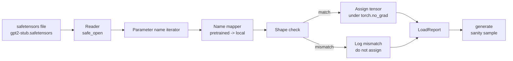

# Önceden Eğitimli Ağırlıkların Yüklenmesi

> 124 milyon parametreli bir modeli sıfırdan eğitmek bir bütçe kararıdır; yayınlanmış bir kontrol noktasının yüklenmesi Salı günüdür. Bu ders, bir Safetensors dosyasından önceden eğitilmiş GPT-2 tarzı ağırlıkları ders 35'teki tam mimariye yükler, parametre adı eşlemesini parça parça yürütür ve akıl sağlığı, yükün çalıştığını kanıtlamak için bir devam oluşturur. Ağ yok, üçüncü taraf yükleyici yok, opak büyü yok.

**Tür:** Yapım
**Diller:** Python
**Önkoşullar:** Aşama 19 dersleri 30'dan 36'ya
**Süre:** ~90 dakika

## Öğrenme Hedefleri

- `safetensors` Python kitaplığıyla bir emniyet tensörleri dosyasını okuyun ve tensör adlarını ve şekillerini inceleyin.
- Önceden eğitilmiş her parametre adını ders 35 GPT modeli içindeki bir parametreyle eşleştirin.
- Yayınlanan GPT-2 ağırlıkları ile bu parçadaki model arasında farklılık gösteren iki ad kuralını kullanın: `wte/wpe/h.N.attn.c_attn/c_proj` ve `mlp.c_fc/c_proj` ile yerel olarak adlandırılan `tok_embed/pos_embed/blocks.N.attn.qkv/out_proj` ve `mlp.fc1/fc2`.
- Herhangi bir ağırlık ataması gerçekleşmeden önce şekil uyumsuzluğunu net bir hatayla tespit edin ve reddedin.
- Yüklenen ağırlıklarla kısa bir devam oluşturun ve token'ların rastgele başlatılan dağıtımdan değil, yüklü dağıtımdan geldiğini doğrulayın.

## Sorun

Yayınlanan ağırlıklar mimariniz için paketlenmez. Kullanılan orijinal uygulamanın adlarını taşırlar. Önceden eğitilmiş dosyanın `transformer.h.0.attn.c_attn.weight` şekli `(2304, 768)` vardır; modeliniz `(2304, 768)` şeklinde `blocks.0.attn.qkv.weight` bekliyor (ki bu, farklı bir düzen kuralında aynı matristir) veya modeliniz, aktarılan matrisi saklayan `nn.Linear` kullanıyor. Aynı parametre üç farklı kimlikle (ad, şekil, bayt düzeni) ortaya çıkar ve yükleyicinin üçünü de uzlaştırması gerekir.

Körü körüne kopyalama yapan bir yükleyici, doğru tensörü yanlış yere koyar ve saçmalık üreten bir model elde edersiniz. Şekil farklı olduğunda kopyalamayı reddeden ancak hiçbir şeyi günlüğe kaydetmeyen bir yükleyici, hangi tensörün yere inmediğini tahmin etmenizi sağlar. Bu dersteki yükleyici açıktır: her atama günlüğe kaydedilir, her şekil kontrol edilir ve bir `LoadReport` isabetleri, eksikleri ve şekil uyumsuzluklarını özetler, böylece ne olduğunu okuyabilirsiniz.

## Konsept



Ad eşleştiricisi yalnızca dizeden dizeye bir işlevdir. Şekil kontrolü bir eğerdir. Atama `torch.no_grad()` içinde gerçekleştiğinden, otomatik geçiş yükü izlemez. Raporda her ismin sonucu yer alıyor.

### GPT-2 adlandırma kuralı

Yayınlanan GPT-2 ağırlıkları aşağıdaki gibi adlar altında yayınlanır:

| Önceden eğitilmiş ad | Şekil | Anlamı |
|-----------------|-------|---------|
| `wte.weight` | (50257, 768) | Token embedding |
| `wpe.weight` | (1024, 768) | Konum embedding |
| `h.N.ln_1.weight` | (768,) | N bloğunda LayerNorm 1 ölçeği |
| `h.N.ln_1.bias` | (768,) | N bloğunda LayerNorm 1 kayması |
| `h.N.attn.c_attn.weight` | (768, 2304) | Sigortalı QKV doğrusal ağırlık |
| `h.N.attn.c_attn.bias` | (2304,) | Sigortalı QKV doğrusal önyargı |
| `h.N.attn.c_proj.weight` | (768, 768) | Dikkat çıktı projeksiyonu |
| `h.N.attn.c_proj.bias` | (768,) | Dikkat çıktı projeksiyon önyargısı |
| `h.N.ln_2.weight` | (768,) | KatmanNorm 2 ölçeği |
| `h.N.ln_2.bias` | (768,) | KatmanNormu 2 kaydırma |
| `h.N.mlp.c_fc.weight` | (768, 3072) | MLP fc1 ağırlığı |
| `h.N.mlp.c_fc.bias` | (3072,) | MLP fc1 önyargısı |
| `h.N.mlp.c_proj.weight` | (3072, 768) | MLP fc2 ağırlığı |
| `h.N.mlp.c_proj.bias` | (768,) | MLP fc2 önyargısı |
| `ln_f.weight` | (768,) | Son KatmanNorm ölçeği |
| `ln_f.bias` | (768,) | Son KatmanNorm değişimi |

Planlanacak iki sürpriz. `c_attn`, `c_proj`, `c_fc` doğrusalları, matrisin `nn.Linear.weight` 'nin beklediğine göre transpoze edilmesiyle depolanır. Yükleyici atama sırasında transpoze olur. LM kafası dosyada hiç yok; model, ağırlığın `wte` ile bağlanmasına dayanır, dolayısıyla kafa, `wte` yere indiğinde takma adla ayarlanır.

### Yerel adlandırma kuralı

Bu parçadaki model açıklayıcı adlar kullanıyor:

| Yerel ad | Anlamı |
|------------|---------|
| `tok_embed.weight` | Token embedding |
| `pos_embed.weight` | Konum embedding |
| `blocks.N.ln1.scale` | N bloğunda LayerNorm 1 ölçeği |
| `blocks.N.ln1.shift` | KatmanNormu 1 kaydırma |
| `blocks.N.attn.qkv.weight` | Sigortalı QKV |
| `blocks.N.attn.qkv.bias` | Birleştirilmiş QKV önyargısı |
| `blocks.N.attn.out_proj.weight` | Dikkat çıktı projeksiyonu |
| `blocks.N.attn.out_proj.bias` | Çıkış projeksiyonu önyargısı |
| `blocks.N.ln2.scale` | KatmanNorm 2 ölçeği |
| `blocks.N.ln2.shift` | KatmanNormu 2 kaydırma |
| `blocks.N.mlp.fc1.weight` | MLP fc1 |
| `blocks.N.mlp.fc1.bias` | MLP fc1 önyargısı |
| `blocks.N.mlp.fc2.weight` | MLP fc2 |
| `blocks.N.mlp.fc2.bias` | MLP fc2 önyargısı |
| `final_ln.scale` | Son KatmanNorm ölçeği |
| `final_ln.shift` | Son KatmanNorm değişimi |

Haritalama sabit bir fonksiyondur. Ders bunu yükleyicinin yineleyeceği bir emir olarak gönderir.

### Saplama fikstürü

Gerçek GPT-2 ağırlıkları 0,5 GB'dir. Demo bunları indirmez; ilk çalıştırmada, tam GPT-2 adlandırma kuralına ve 768 yerine d_model 192'deki 12 bloklu modele uygun şekillere sahip küçük bir emniyet tensörleri fikstürü oluşturur. Fikstür, yükleyicideki her kod yolunu uygulamak için doğru yapıya sahiptir. Fikstürü gerçek dosyayla değiştirin ve yükleyici değişiklik yapılmadan çalışır.

## Build It — Kendin Geliştir

`code/main.py` şunu uygular:

- 35. dersin `GPTModel` küçük bir kopyası, dolayısıyla bu ders müstakildir.
- Katman başına girişleri genişleten `make_pretrained_to_local(num_layers)` .
- `load_safetensors(model, path)` adları yineler, onları eşleştirir, şekli kontrol eder, conv1d tarzı ağırlıkların yerini değiştirir ve `torch.no_grad()` altında atama yapar. Bir `LoadReport` döndürür.
- `make_stub_safetensors(path, cfg)` , tam olarak önceden eğitilmiş adlandırma kuralına sahip bir fikstür dosyası oluşturur.
- İlk çalıştırmada `outputs/gpt2-stub.safetensors` 'yi oluşturan, yeni bir model oluşturan, rastgele başlangıçtan oluşturulan bir sürekliliği yakalayan, saplamayı yükleyen, başka bir sürekliliği yakalayan, her ikisini de yazdıran ve ikisinin farklı olduğunu doğrulayan bir demo (yük aslında modeli değiştirdi).

Çalıştır:

```bash
python3 code/main.py
```

Çıktı: fikstür yolu, isme özel bir yük günlüğü, bir `LoadReport` özeti, yükten önce bir devam, yükten sonra bir devam ve arıza yolunun uygulanması için fikstüre kasıtlı olarak hatalı tek bir tensör enjekte edilen bir şekil uyumsuzluğu.

## Yığın

- Disk formatı ve akış okuyucusu için `safetensors` .
- Model ve atama matematiği için `torch` .
- `transformers` yok, `huggingface_hub` yok, ağ araması yok.

## Vahşi doğada üretim modelleri

Üç model, yükleyicinin sizin oluşturmadığınız ağırlıklarla temas halinde hayatta kalmasını sağlar.

**Herhangi bir atamadan önce her zaman dosyayı doğrulayın.** Dosyayı açın, her tensör adını dtype ve şekliyle birlikte listeleyin, tam eşlemeyi şekil kontrolleriyle çalıştırın ve yalnızca başarı elde edildiğinde atamaya başlayın. Yarı yüklü modeller sessiz arıza makineleridir.

**Her atamayı kaynak adı ve hedef adı ile günlüğe kaydedin.** Bir şeyler ters göründüğünde, günlük size hangi tensörün nereye indiğini söyler; alternatif ise hexdumps okumaktır. Bu dersteki `LoadReport` veri sınıfı, `loaded`, `missing`, `unexpected` ve `shape_mismatch` listelerini izler ve sonunda bir özet yazdırır.

**LM kafası ağırlık bağlama takma adıdır, ayrı bir kopya değildir.** `tok_embed` yüklendikten sonra `model.lm_head.weight = model.tok_embed.weight` ayarı kanonik kalıptır. embedding matrisini yeni bir `lm_head.weight` parametresine kopyalamak bağı koparır ve parametre sayınızı sessizce iki katına çıkarır.

## Use It — Hazır Araçla Uygula

- Yükleyici, önceden eğitilmiş adlandırma kuralını kullanan herhangi bir güvenlik tensörü dosyası için çalışır. Gerçek GPT-2 dosyaları (küçük / orta / büyük / xl) kod değişikliği olmadan çalışır; yalnızca model yapılandırması farklıdır.
- İsim haritasını güncellediğinizde aynı model LLaMA, Mistral, Qwen ağırlıkları için de geçerlidir. Şekil kontrolleri ve rapor aynı kalır.
- Bir yükten sonra akıl sağlığının oluşması hızlı bir geçittir: eğer yükleme sonrası örnekler ön yükleme örneklerine benziyorsa, yük modeli değiştirmemiştir; bu, eşlemenin sessizce her tensörü kaçırdığı anlamına gelir.

## Egzersizler

1. Atama sırasında her tensörü bir hedef dtype'e (`bfloat16`, `float16`, `float32`) aktaran yükleyiciye bir `dtype` argümanı ekleyin. Bir `float32` modelinin `bfloat16` 'ye indirilebileceğini ve yine de oluşturulabileceğini doğrulayın.
2. `h.N` endeksleri modelin `num_layers` ile eşleşmeyen bir kontrol noktasının yüklenmesini reddeden bir `expected_layers` argümanı ekleyin.
3. Yükleyiciyi ders 35 oluşturma fonksiyonuna takın ve iki yan yana örnek üretin: biri rastgele başlangıçtan, diğeri yüklenen fikstürden.
4. Bir dışa aktarma yolu ekleyin: önceden eğitilmiş adlandırma kuralını kullanarak mevcut model durumunu yeni bir güvenlik algılayıcıları dosyasına yazın. Yükleyiciyi gidiş-dönüş çalıştırın ve raporda sıfır şekil uyumsuzluğu olduğunu doğrulayın.
5. LLaMA adlandırma kuralını (önyargı yok, RMSNorm, birleştirilmiş qkv düzeni) işlemek için `NAME_MAP` 'yi genişletin ve oluşturduğunuz saplama LLaMA fikstüründe yükleyiciyi yeniden çalıştırın.

## Anahtar Terimler

| Dönem | İnsanlar ne diyor | Aslında ne anlama geliyor |
|------|-----------------|------------------------|
| İsim haritası | "Anahtarın yeniden eşlenmesi" | Önceden eğitilmiş tensör adlarından yerel parametre adlarına kadar olan fonksiyon; genellikle bir döngü boyunca genişletilen katman dizini başına bir giriş içeren değişmez bir dict |
| Şekil uyumsuzluğu | "Kötü şekil" | Önceden eğitilmiş tensör eşlenen ad altında mevcuttur ancak boyutları yerel parametreyle uyuşmamaktadır; yükleyici çifti atamayı reddediyor ve günlüğe kaydediyor |
| Yükte aktarma | "Dönüşüm1 düzeni" | Yayınlanan GPT-2, dikkati ve MLP projeksiyonlarını nn.Linear 'nin beklediği şeyin aktarımında saklar; yükleyici atama sırasında yer değiştirir |
| Ağırlık bağlama takma adı | "Paylaşılan LM kafası" | model.lm_head.weight = model.tok_embed.weight 'yi baş ve embedding paylaşacak şekilde ayarlamak; bu nedenle kafa dosyada yok |
| Raporu yükle | "Kapsam özeti" | Yüklenen, eksik, beklenmeyen ve şekil_mismatch listelerini izleyen küçük bir veri sınıfı; yazdırma, yüklemenin başarılı olup olmadığını nasıl anlarsınız |

## Daha Fazla Okuma

- Ağırlıkları alan mimari için Aşama 19 ders 35.
- Aynı şekle sahip bir kontrol noktası oluşturan eğitim döngüsü için Aşama 19 ders 36.
- Bellek kısıtlı olduğunda yüklenen ağırlıklarla ne yapılacağına ilişkin Aşama 10 ders 11 (kuantizasyon).
- Yük ve inference etrafındaki tüm yaşam döngüsü için Aşama 10 ders 13 (eksiksiz bir LLM işlem hattı oluşturma).
