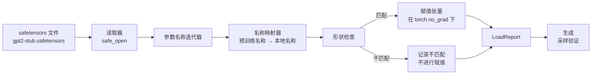

# 37 · 加载预训练权重

> 从头训练一个 1.24 亿参数的模型是一项预算决策；而加载一个已发布的检查点（checkpoint）只是周二日常。本课将预训练的 GPT-2 风格权重从 safetensors 文件加载到第 35 课中完全相同的模型架构里，逐段梳理参数名称映射，并通过采样生成一段续写文本来验证加载是否成功。整个过程无需网络、无需第三方加载器，没有任何黑箱魔法。

**类型：** 构建
**语言：** Python
**前置：** 第 19 阶段第 30 至 36 课
**时长：** 约 90 分钟

## 学习目标

- 使用 `safetensors` Python 库读取 safetensors 文件，检查张量名称与形状。
- 将每个预训练参数名称映射到第 35 课 GPT 模型中的对应参数。
- 处理已发布 GPT-2 权重与本课程模型之间的两套命名差异：`wte/wpe/h.N.attn.c_attn/c_proj` 及 `mlp.c_fc/c_proj`，对应本地命名的 `tok_embed/pos_embed/blocks.N.attn.qkv/out_proj` 及 `mlp.fc1/fc2`。
- 在任何权重赋值之前检测并拒绝形状不匹配，给出清晰的错误提示。
- 使用加载后的权重生成一段短续写文本，确认词元来自加载后的分布而非随机初始化分布。

## 问题描述

已发布的权重并不是为你的架构打包的。它们携带的是原始实现所使用的名称。预训练文件中有形状为 `(2304, 768)` 的 `transformer.h.0.attn.c_attn.weight`；而你的模型期望的是形状同样为 `(2304, 768)` 的 `blocks.0.attn.qkv.weight`（同一矩阵只是布局约定不同），或者你的模型使用 `nn.Linear`，其内部以转置形式存储该矩阵。同一个参数会以三种微妙不同的身份出现（名称、形状、字节布局），加载器必须协调这三者。

盲目拷贝的加载器会把正确的张量放到错误的位置，得到的模型只会生成毫无意义的输出。而当一个张量形状不匹配就拒绝拷贝却什么都不记录的加载器，会让你苦苦猜测到底是哪个张量没加载成功。本课的加载器是显式的：每次赋值都记录日志，每个形状都经过校验，并且通过一个 `LoadReport` 汇总命中、缺失和形状不匹配的情况，让你一目了然地看到发生了什么。

## 核心概念



名称映射器只是一个从字符串到字符串的函数。形状检查只是一次 if 判断。赋值在 `torch.no_grad()` 内部进行，这样自动微分（autograd）不会追踪加载过程。报告对象持有每个名称的处理结果。

### GPT-2 命名约定

已发布的 GPT-2 权重按照如下命名方式组织：

| 预训练名称 | 形状 | 含义 |
|-----------------|-------|---------|
| `wte.weight` | (50257, 768) | 词元嵌入（Token embedding） |
| `wpe.weight` | (1024, 768) | 位置嵌入（Position embedding） |
| `h.N.ln_1.weight` | (768,) | 第 N 块的 LayerNorm 1 缩放 |
| `h.N.ln_1.bias` | (768,) | 第 N 块的 LayerNorm 1 偏移 |
| `h.N.attn.c_attn.weight` | (768, 2304) | 融合 QKV 线性层权重 |
| `h.N.attn.c_attn.bias` | (2304,) | 融合 QKV 线性层偏置 |
| `h.N.attn.c_proj.weight` | (768, 768) | 注意力输出投影 |
| `h.N.attn.c_proj.bias` | (768,) | 注意力输出投影偏置 |
| `h.N.ln_2.weight` | (768,) | LayerNorm 2 缩放 |
| `h.N.ln_2.bias` | (768,) | LayerNorm 2 偏移 |
| `h.N.mlp.c_fc.weight` | (768, 3072) | MLP fc1 权重 |
| `h.N.mlp.c_fc.bias` | (3072,) | MLP fc1 偏置 |
| `h.N.mlp.c_proj.weight` | (3072, 768) | MLP fc2 权重 |
| `h.N.mlp.c_proj.bias` | (768,) | MLP fc2 偏置 |
| `ln_f.weight` | (768,) | 最终 LayerNorm 缩放 |
| `ln_f.bias` | (768,) | 最终 LayerNorm 偏移 |

有两个意外需要提前考虑。`c_attn`、`c_proj`、`c_fc` 这些线性层以相对于 `nn.Linear.weight` 所期望的转置形式存储矩阵。加载器在赋值时进行转置。LM 头（语言模型头）根本不在文件中；模型依赖与 `wte` 的权重绑定（weight tying），因此头在 `wte` 加载完成后通过别名设置。

### 本地命名约定

本课程中的模型使用描述性名称：

| 本地名称 | 含义 |
|------------|---------|
| `tok_embed.weight` | 词元嵌入 |
| `pos_embed.weight` | 位置嵌入 |
| `blocks.N.ln1.scale` | 第 N 块的 LayerNorm 1 缩放 |
| `blocks.N.ln1.shift` | 第 N 块的 LayerNorm 1 偏移 |
| `blocks.N.attn.qkv.weight` | 融合 QKV |
| `blocks.N.attn.qkv.bias` | 融合 QKV 偏置 |
| `blocks.N.attn.out_proj.weight` | 注意力输出投影 |
| `blocks.N.attn.out_proj.bias` | 输出投影偏置 |
| `blocks.N.ln2.scale` | 第 N 块的 LayerNorm 2 缩放 |
| `blocks.N.ln2.shift` | 第 N 块的 LayerNorm 2 偏移 |
| `blocks.N.mlp.fc1.weight` | MLP fc1 |
| `blocks.N.mlp.fc1.bias` | MLP fc1 偏置 |
| `blocks.N.mlp.fc2.weight` | MLP fc2 |
| `blocks.N.mlp.fc2.bias` | MLP fc2 偏置 |
| `final_ln.scale` | 最终 LayerNorm 缩放 |
| `final_ln.shift` | 最终 LayerNorm 偏移 |

映射是一个固定的函数。本课将其以字典形式提供，由加载器遍历使用。

### 桩夹具文件

真实的 GPT-2 权重约 0.5 GB。演示程序不会下载它们；而是在首次运行时生成一个小型 safetensors 桩（stub）夹具（fixture）文件，采用完全一致的 GPT-2 命名约定，但形状适配一个 12 块、d_model 为 192 而非 768 的模型。该夹具文件结构正确，足以覆盖加载器中的每一条代码路径。将夹具替换为真实文件，加载器无需任何修改即可正常工作。

## 动手构建

`code/main.py` 实现了以下内容：

- 第 35 课 `GPTModel` 的小型复刻，使本课内容自包含。
- `make_pretrained_to_local(num_layers)` 展开逐层映射条目。
- `load_safetensors(model, path)` 遍历名称、进行映射、检查形状、对 conv1d 风格的权重执行转置，并在 `torch.no_grad()` 下赋值。返回一个 `LoadReport`。
- `make_stub_safetensors(path, cfg)` 生成一个采用精确预训练命名约定的夹具文件。
- 一个演示程序：首次运行时创建 `outputs/gpt2-stub.safetensors`，构建一个全新模型，捕获一次随机初始化后的生成续写文本，加载桩权重，再捕获一次续写，打印两者，并验证两次输出不同（说明加载确实改变了模型）。

运行方式：

```bash
python3 code/main.py
```

输出内容包括：夹具文件路径、逐名称的加载日志、`LoadReport` 摘要、加载前的续写文本、加载后的续写文本，以及一个有意注入夹具文件的错误张量所触发的形状不匹配信息，以覆盖失败路径。

## 技术栈

- `safetensors` 用于磁盘格式与流式读取。
- `torch` 用于模型和赋值计算。
- 不使用 `transformers`，不使用 `huggingface_hub`，无网络调用。

## 生产环境中的实战模式

以下三种模式能让加载器在接触到你未曾创建的权重时依然稳健运行。

**始终在任何赋值之前校验文件。** 打开文件，列出每个张量的名称及其 dtype 和形状，执行完整的映射与形状检查，只有在全部通过后才开始赋值。加载到一半的模型是无声故障的制造机。

**记录每一次赋值，包括来源名称和目标名称。** 当输出看起来不对劲时，日志会告诉你哪个张量被加载到了哪里；否则你只能去读十六进制转储。本课中的 `LoadReport` 数据类（dataclass）追踪 `loaded`、`missing`、`unexpected` 和 `shape_mismatch` 列表，并在最后打印摘要。

**LM 头是一个权重绑定别名，而非一份独立拷贝。** 在加载 `tok_embed` 之后设置 `model.lm_head.weight = model.tok_embed.weight` 是标准模式。将嵌入矩阵复制到一个新的 `lm_head.weight` 参数中会破坏绑定关系，并悄悄将你的参数量翻倍。

## 使用指南

- 该加载器适用于任何采用预训练命名约定的 safetensors 文件。真实的 GPT-2 文件（small / medium / large / xl）无需修改代码即可使用；只有模型配置不同。
- 同样的模式在更新名称映射后可以扩展到 LLaMA、Mistral、Qwen 的权重。形状检查和报告部分完全保持不变。
- 加载后的采样验证是一个快速关口：如果加载后的样本看起来和加载前一样，说明加载并未改变模型，也就是说映射悄无声息地漏掉了每一个张量。

## 练习

1. 为加载器添加一个 `dtype` 参数，在赋值时将每个张量转换为目标 dtype（`bfloat16`、`float16`、`float32`）。验证一个 `float32` 模型可以下转换为 `bfloat16` 后仍能正常生成。
2. 添加一个 `expected_layers` 参数，当检查点中 `h.N` 的索引与模型的 `num_layers` 不匹配时拒绝加载。
3. 将加载器接入第 35 课的生成函数，输出两段并排的样本：一段来自随机初始化，一段来自加载的夹具文件。
4. 添加导出路径：使用预训练命名约定将当前模型状态写入一个新的 safetensors 文件。做一次往返加载，确认报告的 shape_mismatch 为零。
5. 扩展 `NAME_MAP` 以处理 LLaMA 的命名约定（无偏置、RMSNorm、融合 qkv 布局），并在你生成的 LLaMA 桩夹具上重新运行加载器。

## 关键术语

| 术语 | 常见说法 | 实际含义 |
|------|-----------------|------------------------|
| 名称映射（Name map） | "键重映射" | 从预训练张量名称到本地参数名称的函数；通常是一个字面量字典，每个层索引条目通过循环展开 |
| 形状不匹配（Shape mismatch） | "形状不对" | 预训练张量在映射后的名称下存在，但其维度与本地参数不一致；加载器拒绝赋值并记录这一对 |
| 加载时转置（Transpose-on-load） | "Conv1d 布局" | 已发布的 GPT-2 以 nn.Linear 期望的转置形式存储注意力和 MLP 投影；加载器在赋值时进行转置 |
| 权重绑定别名（Weight tying alias） | "共享 LM 头" | 设置 model.lm_head.weight = model.tok_embed.weight，使头和嵌入共享存储；正因如此，头不在文件中 |
| 加载报告（Load report） | "覆盖率摘要" | 一个小型数据类，追踪 loaded、missing、unexpected 和 shape_mismatch 列表；打印它即可判断加载是否成功 |

## 扩展阅读

- 第 19 阶段第 35 课：接收这些权重的模型架构。
- 第 19 阶段第 36 课：产出相同形状检查点的训练循环。
- 第 10 阶段第 11 课（量化）：内存紧张时如何处理加载后的权重。
- 第 10 阶段第 13 课（构建完整的 LLM 流水线）：围绕加载与推理的完整生命周期。
