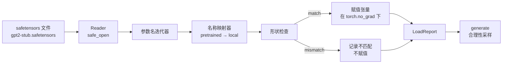

# 加载预训练权重（Loading Pretrained Weights）

> 译注：本文译自同目录 [`en.md`](./en.md)。术语遵循仓根 [TRANSLATION_GUIDE.md](../../../../TRANSLATION_GUIDE.md)。

> 从零训练一个 1.24 亿参数的模型是预算决策；加载一份发布出来的 checkpoint 不过是个普通的周二。本课会把 GPT-2 风格的预训练权重从一个 safetensors 文件里加载到第 35 课那套架构里，逐项走一遍参数名的映射，并跑一段续写来验证加载确实生效。无网络、无第三方加载器、无任何黑魔法。

**Type:** Build
**Languages:** Python
**Prerequisites:** Phase 19 lessons 30 to 36
**Time:** ~90 minutes

## 学习目标（Learning Objectives）

- 用 `safetensors` Python 库读取一个 safetensors 文件，并查看其中的张量名和形状。
- 把每一个预训练参数名映射到第 35 课那个 GPT 模型内部对应的参数上。
- 处理两种命名约定的差异：发布版 GPT-2 权重用的是 `wte/wpe/h.N.attn.c_attn/c_proj` 和 `mlp.c_fc/c_proj`，而本课程里本地用的是 `tok_embed/pos_embed/blocks.N.attn.qkv/out_proj` 和 `mlp.fc1/fc2`。
- 在任何赋值动作发生之前，检测出形状不匹配，并以清晰的报错拒绝加载。
- 用加载好的权重生成一段简短的续写，确认输出的 token 来自加载后的分布，而不是随机初始化的那个。

## 问题（The Problem）

发布出来的权重并不是为你的架构打包的。它们带着原始实现里使用的名字。预训练文件里有一个 `transformer.h.0.attn.c_attn.weight`，形状是 `(2304, 768)`；而你的模型里期望的是 `blocks.0.attn.qkv.weight`，形状是 `(2304, 768)`（其实是同一个矩阵，只是布局约定不同），又或者你的模型用的是 `nn.Linear`，存储时矩阵是转置过的。同一个参数会以三种细微不同的身份出现（名字、形状、字节布局），加载器必须把这三者全部对齐。

一个无脑复制的加载器会把对的张量放到错的位置上，结果就是一个生成胡言乱语的模型。一个在形状不一致时拒绝复制、却什么日志都不打的加载器，会让你只能靠猜来定位是哪个张量没落地。本课的加载器是显式的：每一次赋值都打日志、每一个形状都检查，并用一个 `LoadReport` 汇总命中、未命中和形状不匹配，让你能直接读懂发生了什么。

## 概念（The Concept）



名字映射器就是一个字符串到字符串的函数。形状检查就是一句 if。赋值动作放在 `torch.no_grad()` 里，autograd 不会跟踪这次加载。报告里保存每一个名字的处理结果。

### GPT-2 命名约定（The GPT-2 naming convention）

发布版 GPT-2 权重的名字是这样的：

| Pretrained name | Shape | Meaning |
|-----------------|-------|---------|
| `wte.weight` | (50257, 768) | Token embedding |
| `wpe.weight` | (1024, 768) | Position embedding |
| `h.N.ln_1.weight` | (768,) | LayerNorm 1 scale at block N |
| `h.N.ln_1.bias` | (768,) | LayerNorm 1 shift at block N |
| `h.N.attn.c_attn.weight` | (768, 2304) | Fused QKV linear weight |
| `h.N.attn.c_attn.bias` | (2304,) | Fused QKV linear bias |
| `h.N.attn.c_proj.weight` | (768, 768) | Attention output projection |
| `h.N.attn.c_proj.bias` | (768,) | Attention output projection bias |
| `h.N.ln_2.weight` | (768,) | LayerNorm 2 scale |
| `h.N.ln_2.bias` | (768,) | LayerNorm 2 shift |
| `h.N.mlp.c_fc.weight` | (768, 3072) | MLP fc1 weight |
| `h.N.mlp.c_fc.bias` | (3072,) | MLP fc1 bias |
| `h.N.mlp.c_proj.weight` | (3072, 768) | MLP fc2 weight |
| `h.N.mlp.c_proj.bias` | (768,) | MLP fc2 bias |
| `ln_f.weight` | (768,) | Final LayerNorm scale |
| `ln_f.bias` | (768,) | Final LayerNorm shift |

有两个意外要预先准备好。`c_attn`、`c_proj`、`c_fc` 这些 linear 在文件里存的矩阵相对于 `nn.Linear.weight` 期望的形式是转置过的。加载器在赋值时要把它转回来。LM head 根本不在文件里；模型靠和 `wte` 之间的权重绑定（weight tying）来工作，所以 `wte` 一旦落地，就把 head 用别名指过去。

### 本地命名约定（The local naming convention）

本课程里的模型用的是描述性的名字：

| Local name | Meaning |
|------------|---------|
| `tok_embed.weight` | Token embedding |
| `pos_embed.weight` | Position embedding |
| `blocks.N.ln1.scale` | LayerNorm 1 scale at block N |
| `blocks.N.ln1.shift` | LayerNorm 1 shift |
| `blocks.N.attn.qkv.weight` | Fused QKV |
| `blocks.N.attn.qkv.bias` | Fused QKV bias |
| `blocks.N.attn.out_proj.weight` | Attention output projection |
| `blocks.N.attn.out_proj.bias` | Output projection bias |
| `blocks.N.ln2.scale` | LayerNorm 2 scale |
| `blocks.N.ln2.shift` | LayerNorm 2 shift |
| `blocks.N.mlp.fc1.weight` | MLP fc1 |
| `blocks.N.mlp.fc1.bias` | MLP fc1 bias |
| `blocks.N.mlp.fc2.weight` | MLP fc2 |
| `blocks.N.mlp.fc2.bias` | MLP fc2 bias |
| `final_ln.scale` | Final LayerNorm scale |
| `final_ln.shift` | Final LayerNorm shift |

这个映射是一个固定的函数。本课把它写成一个 dict，加载器再去遍历它。

### Stub 替身文件（The stub fixture）

真正的 GPT-2 权重有 0.5 GB。这个 demo 不下载它；它会在首次运行时生成一个小型的 safetensors 替身文件，命名约定和真版 GPT-2 完全一致，形状则按一个 12 层、d_model 取 192（而非 768）的小模型来设。这个替身的结构足以把加载器里每一条代码路径都跑一遍。把替身换成真文件，加载器无需改一行代码就能继续工作。

## 动手实现（Build It）

`code/main.py` 实现了：

- 第 35 课 `GPTModel` 的一个小型复刻，让本课自包含。
- `make_pretrained_to_local(num_layers)`：按层数展开每层的条目。
- `load_safetensors(model, path)`：遍历名字、做映射、检查形状、对 conv1d 风格的权重做转置，并在 `torch.no_grad()` 下赋值。返回一个 `LoadReport`。
- `make_stub_safetensors(path, cfg)`：按预训练命名约定生成一个替身文件。
- 一个 demo：首次运行时创建 `outputs/gpt2-stub.safetensors`，构建一个全新模型，先从随机初始化采一段续写，再加载替身、再采一段续写，把两段都打印出来，并验证两段不同（说明加载确实改变了模型）。

跑起来：

```bash
python3 code/main.py
```

输出包含：替身文件路径、按名字打印的加载日志、`LoadReport` 汇总、加载前的续写、加载后的续写，以及一条形状不匹配——这条是有意注入到替身里的坏张量，用来把失败路径走一遍。

## 技术栈（Stack）

- `safetensors` 提供磁盘格式和流式读取器。
- `torch` 负责模型和赋值时的运算。
- 不用 `transformers`，不用 `huggingface_hub`，不发任何网络请求。

## 生产实践中的模式（Production patterns in the wild）

有三条模式，能让你的加载器在面对别人造的权重时不被打爆。

**任何赋值前都要先把文件验证一遍。** 打开文件，列出每一个张量的名字、dtype 和形状，跑完整的映射加上形状检查，只有全部成功才开始赋值。半加载状态的模型是静默失败机器。

**每次赋值都要带源名和目标名一起打日志。** 出问题时，日志能告诉你哪个张量去了哪里；不打日志的替代方案是去读 hexdump。本课里的 `LoadReport` dataclass 跟踪 `loaded`、`missing`、`unexpected`、`shape_mismatch` 几个列表，并在结束时打印一份汇总。

**LM head 是权重绑定的别名，不是单独的一份拷贝。** 加载完 `tok_embed` 后执行 `model.lm_head.weight = model.tok_embed.weight` 是标准做法。把 embedding 矩阵复制进一个全新的 `lm_head.weight` 参数会破坏权重绑定，并悄悄把你的参数量翻倍。

## 用起来（Use It）

- 这个加载器适用于任何使用预训练命名约定的 safetensors 文件。真版的 GPT-2 文件（small / medium / large / xl）都不需要改代码，只要换一下模型 config。
- 同样的模式在更新 name map 之后，可以扩展到 LLaMA、Mistral、Qwen 的权重。形状检查和报告这部分不变。
- 加载之后跑一次 sanity 生成是一道快捷闸门：如果加载后的样本看起来和加载前一模一样，说明加载没有改动模型，也就是映射悄无声息地把所有张量都漏掉了。

## 练习（Exercises）

1. 给加载器加一个 `dtype` 参数，在赋值时把每个张量转成目标 dtype（`bfloat16`、`float16`、`float32`）。验证一个 `float32` 模型可以被降到 `bfloat16` 并仍能正常生成。
2. 加一个 `expected_layers` 参数，当 checkpoint 的 `h.N` 索引和模型的 `num_layers` 对不上时，拒绝加载。
3. 把加载器接到第 35 课的生成函数里，输出两段并排样本：一段来自随机初始化，一段来自加载好的替身。
4. 加一条导出路径：把当前模型的 state 用预训练命名约定写到一个新的 safetensors 文件里。让加载器走一遍来回，确认报告里形状不匹配为零。
5. 扩展 `NAME_MAP` 以处理 LLaMA 命名约定（没有 bias、RMSNorm、fused qkv 布局），并对你自己生成的 LLaMA 替身文件再跑一次加载器。

## 关键术语（Key Terms）

| Term | What people say | What it actually means |
|------|-----------------|------------------------|
| Name map | "Key remapping" | 从预训练张量名到本地参数名的函数；通常是一个字面量 dict，每个 layer 索引一条，再在循环里展开 |
| Shape mismatch | "Bad shape" | 预训练张量在映射后的名字下确实存在，但维度和本地参数对不上；加载器拒绝赋值并把这一对记录下来 |
| Transpose-on-load | "Conv1d layout" | 发布版 GPT-2 把 attention 和 MLP 的投影按 nn.Linear 期望形式的转置来存；加载器在赋值时做一次转置 |
| Weight tying alias | "Shared LM head" | 执行 model.lm_head.weight = model.tok_embed.weight，让 head 和 embedding 共享一份存储；正因为如此，head 才不在文件里 |
| Load report | "Coverage summary" | 一个小 dataclass，跟踪 loaded、missing、unexpected、shape_mismatch 列表；打印它就是判断加载有没有成功的方式 |

## 延伸阅读（Further Reading）

- Phase 19 第 35 课：接收这些权重的那套架构。
- Phase 19 第 36 课：会产出同样形状 checkpoint 的训练循环。
- Phase 10 第 11 课（quantization，量化）：内存紧张时如何处理加载好的权重。
- Phase 10 第 13 课（构建完整的 LLM 流水线）：围绕加载和推理的完整生命周期。
