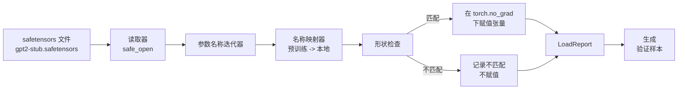

# 加载预训练权重

> 从头训练一个 1.24 亿参数的模型是预算决策；加载一个已发布的检查点只是周二的日常。本节课将第 35 课构建的精确架构中加载来自 safetensors 文件的预训练 GPT-2 风格权重，逐条解析参数名称映射，并通过生成一段续写来证明加载成功。无需网络、无需第三方加载器、无需黑魔法。

**类型：** 构建
**语言：** Python
**前置要求：** 第 19 阶段第 30–36 课
**时长：** ~90 分钟

## 学习目标

- 使用 `safetensors` Python 库读取 safetensors 文件，并检查张量的名称和形状。
- 将每个预训练参数名称映射到第 35 课 GPT 模型中的参数。
- 处理已发布 GPT-2 权重与本课程模型之间的两种命名约定差异：`wte/wpe/h.N.attn.c_attn/c_proj` 和 `mlp.c_fc/c_proj` 与本地命名的 `tok_embed/pos_embed/blocks.N.attn.qkv/out_proj` 和 `mlp.fc1/fc2`。
- 在任何权重赋值发生之前，检测形状不匹配并给出清晰错误信息予以拒绝。
- 使用加载的权重生成一段简短续写，并确认生成的 token 来自加载后的分布，而非随机初始化的分布。

## 问题

已发布的权重并非为你的架构打包。它们携带的是原始实现所用的名称。预训练文件中有 `transformer.h.0.attn.c_attn.weight`，形状为 `(2304, 768)`；你的模型期望的是 `blocks.0.attn.qkv.weight`，形状同样为 `(2304, 768)`（这是相同矩阵的不同布局约定），或者你的模型使用 `nn.Linear`，它以转置形式存储矩阵。同一个参数以三种细微不同的身份（名称、形状、字节布局）出现，加载器需要调和这三者。

盲目复制的加载器会把正确的张量放到错误的位置，从而生成无意义的输出。拒绝复制但只记录形状差异、不输出任何信息的加载器会让你无从猜测哪个张量未能加载成功。本节课的加载器是显式的：每次赋值都有日志记录，每个形状都经过检查，并通过 `LoadReport` 汇总命中、缺失和形状不匹配的情况，让你清楚了解发生了什么。

## 概念


```mermaid
flowchart LR
  SF[safetensors 文件<br/>gpt2-stub.safetensors] --> R[读取器<br/>safe_open]
  R --> N[参数名称迭代器]
  N --> M[名称映射器<br/>预训练 -> 本地]
  M --> S[形状检查]
  S -- 匹配 --> A[在 torch.no_grad<br/>下赋值张量]
  S -- 不匹配 --> E[记录不匹配<br/>不赋值]
  A --> RP[LoadReport]
  E --> RP
  RP --> G[生成<br/>验证样本]
```

名称映射器只是一个字符串到字符串的函数。形状检查是一个 if 语句。赋值发生在 `torch.no_grad()` 内部，因此 autograd 不会追踪加载过程。报告保存了每个名称的处理结果。

### GPT-2 命名约定

已发布的 GPT-2 权重使用如下名称：

| 预训练名称 | 形状 | 含义 |
|-----------------|-------|---------|
| `wte.weight` | (50257, 768) | Token 嵌入 |
| `wpe.weight` | (1024, 768) | 位置嵌入 |
| `h.N.ln_1.weight` | (768,) | 第 N 个块的 LayerNorm 1 缩放 |
| `h.N.ln_1.bias` | (768,) | 第 N 个块的 LayerNorm 1 偏移 |
| `h.N.attn.c_attn.weight` | (768, 2304) | 融合 QKV 线性权重 |
| `h.N.attn.c_attn.bias` | (2304,) | 融合 QKV 线性偏置 |
| `h.N.attn.c_proj.weight` | (768, 768) | 注意力输出投影 |
| `h.N.attn.c_proj.bias` | (768,) | 注意力输出投影偏置 |
| `h.N.ln_2.weight` | (768,) | LayerNorm 2 缩放 |
| `h.N.ln_2.bias` | (768,) | LayerNorm 2 偏移 |
| `h.N.mlp.c_fc.weight` | (768, 3072) | MLP fc1 权重 |
| `h.N.mlp.c_fc.bias` | (3072,) | MLP fc1 偏置 |
| `h.N.mlp.c_proj.weight` | (3072, 768) | MLP fc2 权重 |
| `h.N.mlp.c_proj.bias` | (768,) | MLP fc2 偏置 |
| `ln_f.weight` | (768,) | 最终 LayerNorm 缩放 |
| `ln_f.bias` | (768,) | 最终 LayerNorm 偏移 |

有两个需要注意的情况。`c_attn`、`c_proj`、`c_fc` 线性层存储的矩阵相对于 `nn.Linear.weight` 的期望是转置的。加载器在赋值时进行转置。LM 头根本不在文件中；模型依赖于与 `wte` 的权重绑定，因此在 `wte` 加载后通过别名设置 LM 头。

### 本地命名约定

本课程的模型使用描述性名称：

| 本地名称 | 含义 |
|------------|---------|
| `tok_embed.weight` | Token 嵌入 |
| `pos_embed.weight` | 位置嵌入 |
| `blocks.N.ln1.scale` | 第 N 个块的 LayerNorm 1 缩放 |
| `blocks.N.ln1.shift` | 第 N 个块的 LayerNorm 1 偏移 |
| `blocks.N.attn.qkv.weight` | 融合 QKV |
| `blocks.N.attn.qkv.bias` | 融合 QKV 偏置 |
| `blocks.N.attn.out_proj.weight` | 注意力输出投影 |
| `blocks.N.attn.out_proj.bias` | 输出投影偏置 |
| `blocks.N.ln2.scale` | LayerNorm 2 缩放 |
| `blocks.N.ln2.shift` | LayerNorm 2 偏移 |
| `blocks.N.mlp.fc1.weight` | MLP fc1 |
| `blocks.N.mlp.fc1.bias` | MLP fc1 偏置 |
| `blocks.N.mlp.fc2.weight` | MLP fc2 |
| `blocks.N.mlp.fc2.bias` | MLP fc2 偏置 |
| `final_ln.scale` | 最终 LayerNorm 缩放 |
| `final_ln.shift` | 最终 LayerNorm 偏移 |

映射是一个固定的函数。本节课将其作为一个字典提供，由加载器迭代使用。

### 存根夹具

真实的 GPT-2 权重有 0.5 GB。本演示不下载它们；它在首次运行时生成一个小的 safetensors 夹具，使用精确的 GPT-2 命名约定和适当的形状（适用于 d_model 为 192 而非 768 的 12 块模型）。该夹具具有正确的结构，能覆盖加载器中的每条代码路径。将夹具替换为真实文件后，加载器无需修改即可工作。

## 构建

`code/main.py` 实现了：

- 第 35 课 `GPTModel` 的一个小型副本，使本节课自成一体。
- `make_pretrained_to_local(num_layers)`，展开每层条目。
- `load_safetensors(model, path)`，迭代名称、映射、检查形状、转置 conv1d 风格的权重，并在 `torch.no_grad()` 下赋值。返回一个 `LoadReport`。
- `make_stub_safetensors(path, cfg)`，生成一个使用精确预训练命名约定的夹具文件。
- 一个演示：首次运行时创建 `outputs/gpt2-stub.safetensors`，构建一个新模型，捕获随机初始化下的一次生成续写，加载存根，捕获加载后的另一次续写，打印两者，并验证二者不同（加载确实改变了模型）。

运行方式：

```bash
python3 code/main.py
```

输出：夹具路径、逐名称加载日志、`LoadReport` 摘要、加载前的续写、加载后的续写，以及一个故意注入夹具中的形状不匹配张量（以覆盖失败路径）的形状不匹配信息。

## 技术栈

- `safetensors`：用于磁盘格式和流式读取器。
- `torch`：用于模型和赋值运算。
- 不使用 `transformers`、`huggingface_hub` 或网络调用。

## 生产环境中的常见模式

以下三种模式能让加载器在与非自创权重交互时保持稳健。

**始终在赋值前验证文件。** 打开文件，列出每个张量名称及其 dtype 和形状，运行完整的映射和形状检查，仅在成功后才开始赋值。加载一半的模型是静默失败的机器。

**记录每次赋值的源名称和目标名称。** 当出现问题时，日志会告诉你每个张量落在了哪里；否则你就只能去读十六进制转储了。本节课的 `LoadReport` 数据类追踪 `loaded`（已加载）、`missing`（缺失）、`unexpected`（意外）和 `shape_mismatch`（形状不匹配）列表，并在最后打印摘要。

**LM 头是一个权重绑定别名，而非独立副本。** 在加载 `tok_embed` 后设置 `model.lm_head.weight = model.tok_embed.weight` 是标准做法。将嵌入矩阵复制到一个新的 `lm_head.weight` 参数中会破坏绑定，并悄悄使参数数量翻倍。

## 使用方法

- 该加载器适用于任何使用预训练命名约定的 safetensors 文件。真实的 GPT-2 文件（small / medium / large / xl）无需修改代码即可使用；只需调整模型配置。
- 同样的模式也适用于 LLaMA、Mistral、Qwen 权重——只需更新名称映射。形状检查和报告保持不变。
- 加载后的验证生成是一个快速门控：如果加载后的样本看起来与加载前的样本相同，说明加载并未改变模型，这意味着映射悄悄地错过了所有张量。

## 练习

1. 为加载器添加一个 `dtype` 参数，在赋值时将每个张量转换为目标 dtype（`bfloat16`、`float16`、`float32`）。确认一个 `float32` 模型可以降为 `bfloat16` 并仍能生成。
2. 添加一个 `expected_layers` 参数，拒绝加载其 `h.N` 索引与模型的 `num_layers` 不匹配的检查点。
3. 将加载器接入第 35 课的生成函数，并排输出两个样本：一个来自随机初始化，一个来自加载的夹具。
4. 添加导出路径：使用预训练命名约定将当前模型状态写入一个新的 safetensors 文件。对加载器进行往返测试，确认报告中形状不匹配数为零。
5. 扩展 `NAME_MAP` 以处理 LLaMA 命名约定（无偏置、RMSNorm、融合 qkv 布局），并在你生成的 LLaMA 存根夹具上重新运行加载器。

## 关键术语

| 术语 | 通常说法 | 实际含义 |
|------|-----------------|------------------------|
| 名称映射 (Name map) | "键重映射" | 从预训练张量名称到本地参数名称的函数；通常是一个字面字典，每层索引通过循环展开得到一个条目 |
| 形状不匹配 (Shape mismatch) | "形状错误" | 预训练张量在映射名称下存在，但其维度与本地参数不一致；加载器拒绝赋值并记录该配对 |
| 加载时转置 (Transpose-on-load) | "Conv1d 布局" | 已发布的 GPT-2 以 nn.Linear 期望的转置形式存储注意力和 MLP 投影；加载器在赋值时进行转置 |
| 权重绑定别名 (Weight tying alias) | "共享 LM 头" | 设置 model.lm_head.weight = model.tok_embed.weight，使 LM 头和嵌入共享存储；因此文件中不包含 LM 头 |
| 加载报告 (Load report) | "覆盖情况摘要" | 一个小型数据类，追踪已加载、缺失、意外和形状不匹配的列表；打印它是判断加载是否成功的方式 |

## 延伸阅读

- 第 19 阶段第 35 课：接收权重的架构。
- 第 19 阶段第 36 课：生成相同形状检查点的训练循环。
- 第 10 阶段第 11 课（量化）：当内存紧张时如何处理加载的权重。
- 第 10 阶段第 13 课（构建完整的 LLM 流水线）：加载和推理的完整生命周期。
