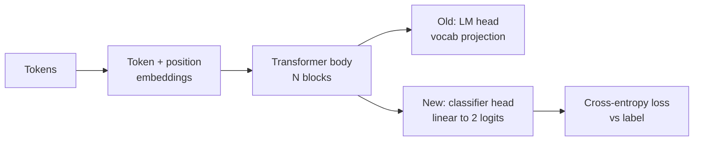
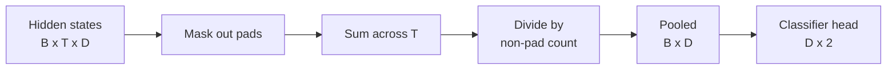
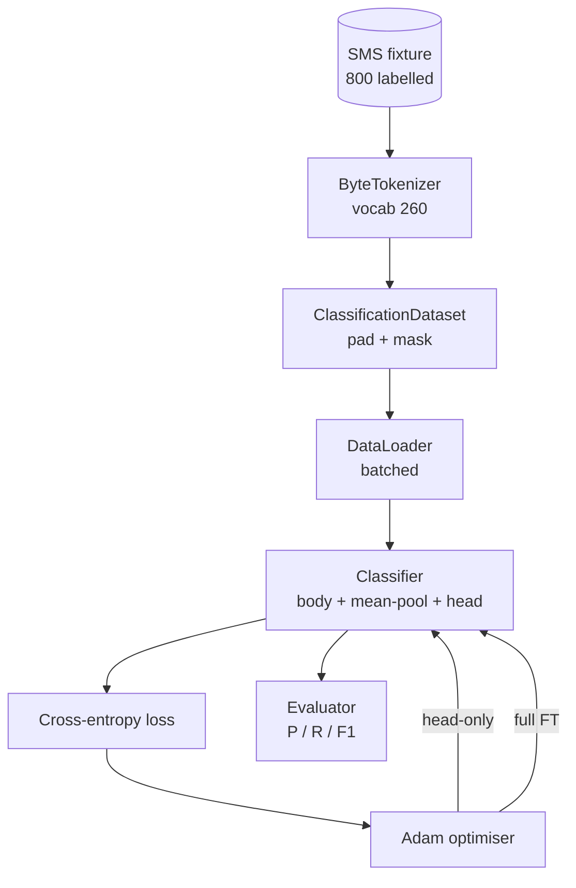

# Lição Capstone 38: Fine-Tuning de Classificador por Troca de Cabeça

> O primeiro capstone do Track B. Um modelo de linguagem pré-treinado é uma pilha de blocos de self-attention terminando em uma cabeça de previsão de token. Quando você quer spam vs ham, a cabeça está errada mas o corpo está na maioria certo. Esta lição arranca a cabeça, cola uma camada linear de duas classes na representação pooled e treina o classificador de duas formas diferentes: apenas a camada final, e fine-tuning completo. A avaliação é precisão, recall e F1 em um split reservado. Você aprende o que cada estratégia te compra e o que custa.

**Tipo:** Construção
**Idiomas:** Python (torch, numpy)
**Pré-requisitos:** Lições 30-37 da Fase 19 (trilha NLP LLM: tokenizador, tabela de embedding, bloco de attention, corpo do transformer, loop de pré-treinamento, checkpointing, geração, perplexidade)
**Tempo:** ~90 minutos

## Objetivos de Aprendizado

- Substituir uma cabeça de modelo de linguagem por uma cabeça de classificação sem reinicializar o corpo.
- Implementar dois regimes de treinamento: corpo congelado (apenas cabeça) e fine-tuning completo, compartilhando um loop de treinamento.
- Construir um pipeline de dados consciente do tokenizador que faz padding, mascara o padding e faz pooling da saída de attention.
- Computar precisão, recall, F1 e uma matriz de confusão a partir de logits brutos.
- Racionar sobre o trade-off entre contagem de parâmetros, tempo de treinamento e margem de manobra.

## O Problema

Você pré-treinou um pequeno transformer em um corpus genérico. A cabeça de saída projeta o último hidden state para um vocabulário de 1000 tokens. Agora você tem 800 mensagens SMS rotuladas como spam ou ham e quer um classificador binário. Três opções existem.

A opção errada é treinar um classificador novo do zero com 800 exemplos. O corpo do modelo pré-treinado já codifica estrutura útil: identidade de palavras, posição, co-ocorrência simples. Jogar fora desperdiça a computação que o construiu.

As duas opções certas são troca de cabeça com o corpo congelado e troca de cabeça com o corpo treinável. Treinamento apenas de cabeça é rápido, quase gratuito em memória e raramente overfitta com tão poucos dados. Fine-tuning completo é mais lento, pode overfittar em dados pequenos, mas alcança acurácia maior quando o domínio downstream deriva do corpus de pré-treinamento.

Esta lição constrói ambos para que você possa compará-los no mesmo fixture.

## O Conceito

O modelo é uma função `f_theta(tokens) -> hidden_states`. A cabeça é uma função `g_phi(hidden) -> logits`. Trocar cabeças significa manter `theta` e substituir `g_phi`. Os parâmetros do corpo são a parte cara. A cabeça é uma única camada linear.

Dois conjuntos de parâmetros treináveis importam:

- `theta` (o corpo): dezenas de milhares de pesos por bloco de attention.
- `phi` (a cabeça): `hidden_dim * num_classes` pesos mais um bias.

No treinamento apenas de cabeça, você computa gradientes contra `phi` e zera-os contra `theta`. PyTorch permite que você faça isso definindo `requires_grad=False` nos parâmetros do corpo. O otimizador então vê apenas a cabeça e o corpo fica congelado.

No fine-tuning completo, você permite que os gradientes fluiam por toda a pilha. Os pesos do corpo derivam para se encaixar no objetivo de classificação. O risco é esquecimento catastrófico em dados pequenos: o pré-treinamento do corpo é lavado por ruído de overfitting.

## A Questão do Pooling

Um classificador precisa de um vetor por sequência, não de um vetor por token. Três escolhas comuns:

- **Mean pool**: média dos hidden states pela sequência, ponderada pela máscara de attention.
- **CLS pool**: prepend um token eespecificaçãoial e use apenas sua saída. É o que o BERT faz.
- **Last-token pool**: use o último token não-padding. É o que classificadores GPT-fazem.

Esta lição usa mean pooling com ponderação explícita por máscara de attention. É o mais simples, dá um sinal estável entre comprimentos de sequência e não requer pré-treinamento de um token CLS.

## Os Dados

Oitocentas mensagens SMS, balanceadas 400 spam e 400 ham, são geradas deterministicamente em `code/main.py`. O gerador usa semente fixa, escolhe templates e substitui preenchimentos de slot e emite mensagens entre 5 e 25 tokens. Datasets reais têm ruído que este fixture não tem. O ponto do fixture é reprodutibilidade.

Os dados são divididos 80/20: 640 treino, 160 teste. As divisões são estratificadas para que o conjunto de teste mantenha o balanceamento 50/50. Um conjunto reservado com balanceamento conhecido permite que precisão e recall sejam lidos como números honestos.

## Métricas

Classificação binária com a classe 1 como positiva (spam). As contagens são:

- `TP`: predito spam, era spam.
- `FP`: predito spam, era ham.
- `FN`: predito ham, era spam.
- `TN`: predito ham, era ham.

As três métricas principais:

- `precision = TP / (TP + FP)`. Das mensagens sinalizadas como spam, qual fração realmente é?
- `recall = TP / (TP + FN)`. Do spam real, qual fração o modelo sinalizou?
- `F1 = 2 * P * R / (P + R)`. A média harmônica das duas.

Uma matriz de confusão imprime as quatro contagens como um grid 2x2. A demo escreve isso no stdout para ambos os regimes de treinamento.

## Arquitetura

O corpo é um transformer deliberadamente minúsculo: vocab 260, hidden 64, 4 cabeças, 2 blocos, sequência máxima 32. É pequeno o suficiente para treinar ambos os regimes até convergência dentro de noventa segundos na CPU. Ele não é pré-treinado na lição; em vez disso, o helper `pretrain_quick` faz cinco épocas de treinamento de LM no texto do mesmo fixture para dar ao corpo um ponto de partida não trivial. Isso mantém a lição autocontida.

## O que você vai construir

A implementação é um `main.py` mais um módulo de testes (`code/tests/test_main.py`).

1. `ByteTokenizer`: mapeia bytes para ids, reserva um id de pad.
2. `Block`: um bloco transformer com attention multi-head e camada feed-forward. Pre-norm.
3. `LMBody`: embeddings de token + posição mais uma pilha de blocos. Retorna hidden states.
4. `MeanPool`: média ponderada por máscara sobre o eixo da sequência.
5. `Classifier`: corpo, pool, cabeça linear. O corpo é a mesma instância entre regimes.
6. `freeze_body` e `unfreeze_body`: alternam `requires_grad` nos parâmetros do corpo.
7. `train_classifier`: um loop compartilhado. Aceita o modelo e um otimizador configurado para qualquer grupo de parâmetros que seja treinável.
8. `evaluate`: roda o conjunto de teste e retorna `Metrics(precision, recall, f1, confusion)`.
9. `run_demo`: pré-treina o corpo brevemente, depois treina e avalia apenas cabeça, depois completo, imprime ambos os relatórios e sai com zero.

## Por que a comparação importa

O regime apenas cabeça tipicamente treina mais rápido e subfitta mais graciosamente. Neste fixture, você tipicamente vê precisão próxima de 0,9 e recall próximo de 0,85 depois de vinte épocas de treinamento apenas de cabeça. Fine-tuning completo leva cerca de três vezes mais e fica dentro de alguns pontos para qualquer lado, dependendo da semente aleatória.

A lição não escolhe um vencedor. Ela te ensina a ler os números e o custo. Em 800 exemplos e um corpo minúsculo, apenas cabeça é a escolha certa. Em 80.000 exemplos e um corpo maior, fine-tuning completo começa a valer a pena. O contrato que você leva desta lição é a API: a mesma função `train_classifier` lida com ambos, e a alternância é uma chamada.

## Metas estendidas

- Adicione um terceiro regime que descongela apenas o último bloco. Isso às vezes é chamado de fine-tuning parcial. Custa menos que fine-tuning completo e aprende mais que apenas cabeça.
- Adicione um schedule de taxa de aprendizado. Um schedule cosseno na cabeça mais uma taxa constante menor no corpo é uma configuração comum de produção.
- Substitua mean pooling por um attention pool aprendido: uma pequena camada de attention com uma consulta aprendida. Isso frequentemente supera mean pool em sequências mais longas.

A implementação te dá os hooks. Os testes fixam o contrato. Os números são seus para empurrar.
