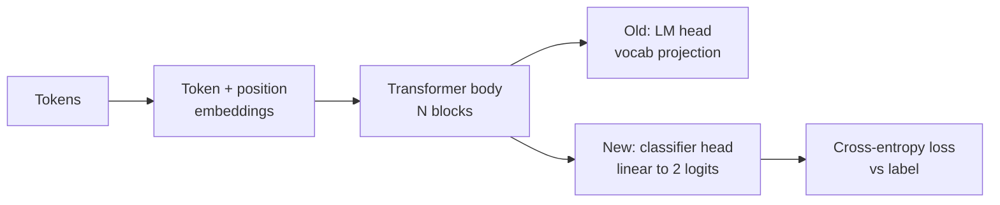
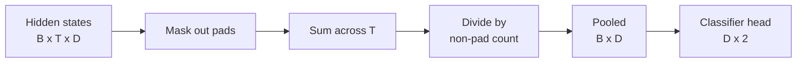
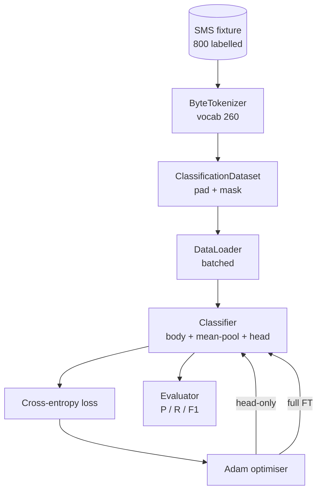

# Bitirme Dersi 38: Head Swap'tan Sınıflandırıcı Fine-Tuning

> B'nin ilk kapanış taşını takip edin. Önceden eğitilmiş bir dil modeli, token-tahmin başlığıyla biten bir kişisel dikkat blokları yığınıdır. Spam mı jambon mu istediğinizde, kafa yanlıştır ancak gövde çoğunlukla doğrudur. Bu ders işin kafasını koparır, havuzlanmış temsilin üzerine iki sınıflı bir doğrusal katman yapıştırır ve sınıflandırıcıyı iki farklı şekilde eğitir: yalnızca son katman ve tam fine-tuning. Değerlendirme, uzun süren bir bölünmede hassasiyet, geri çağırma ve F1'dir. Her stratejinin size ne kazandırdığını ve neye mal olduğunu öğrenirsiniz.

**Tür:** Yapım
**Diller:** Python (meşale, numpy)
**Önkoşullar:** Aşama 19 dersleri 30-37 (NLP LLM yolu: tokenizer, embedding tablo, dikkat bloğu, transformer gövde, eğitim öncesi döngü, kontrol noktası oluşturma, oluşturma, şaşkınlık)
**Süre:** ~90 dakika

## Öğrenme Hedefleri

- Gövdeyi yeniden başlatmadan dil modeli kafasını sınıflandırma başlığıyla değiştirin.
- İki eğitim rejimi uygulayın: donmuş gövde (yalnızca kafa) ve tam fine-tuning, bir eğitim döngüsünü paylaşın.
- Dikkat çıktısını dolduran, maskeleyen ve dikkat çıktısını bir araya toplayan, tokenfarkındalık sağlayan bir veri hattı oluşturun.
- Ham logitlerden hassasiyet, geri çağırma, F1 ve karışıklık matrisini hesaplayın.
- Parametre sayısı, eğitim süresi ve boşluk payı arasındaki dengenin nedeni.

## Sorun

Genel bir külliyat üzerinde küçük bir transformer'ya önceden eğitim verdiniz. Çıkış kafası, son gizli durumu 1000-token kelimelik bir sözlüğe yansıtır. Artık spam veya jambon etiketli 800 SMS mesajınız var ve ikili bir sınıflandırıcı istiyorsunuz. Üç seçenek mevcut.

Yanlış seçenek, 800 örnek üzerinde sıfırdan yeni bir sınıflandırıcı yetiştirmektir. Önceden eğitilmiş modelin gövdesi halihazırda kullanışlı yapıyı kodlamaktadır: kelime kimliği, konum, basit birlikte oluşum. Onu atmak, onu oluşturan bilgisayarın boşa gitmesine neden olur.

İki doğru seçenek, donmuş vücutla kafa değişimi ve eğitilebilir vücutla kafa değişimidir. Yalnızca kafaya dayalı eğitim hızlıdır, hafızada neredeyse ücretsizdir ve bu küçük verilerle nadiren aşırı uyum sağlar. Tam fine-tuning daha yavaştır, küçük verilere aşırı uyum sağlayabilir, ancak aşağı akış alanı ön eğitim kümesinden saptığında daha yüksek doğruluğa ulaşır.

Bu ders her ikisini de oluşturur, böylece bunları aynı fikstürde karşılaştırabilirsiniz.

## Konsept

Model bir `f_theta(tokens) -> hidden_states` fonksiyonudur. Baş bir `g_phi(hidden) -> logits` fonksiyonudur. Kafaları değiştirmek, `theta` 'yi tutmak ve `g_phi`'yi değiştirmek anlamına gelir. Vücudun parametreleri pahalı kısımdır. Kafa tek bir doğrusal katmandır.

Eğitilebilir iki parametre seti önemlidir:

- `theta` (beden): dikkat bloğu başına onbinlerce ağırlık.
- `phi` (baş): `hidden_dim * num_classes` ağırlık artı bir sapma.

Yalnızca kafa eğitiminde gradient'leri `phi` 'ya göre hesaplar ve bunları `theta`'ye göre sıfırlarsınız. PyTorch, gövde parametrelerinde `requires_grad=False` ayarını yaparak bunu yapmanızı sağlar. Optimize edici daha sonra yalnızca kafayı görür ve gövde donmuş halde kalır.

Tam fine-tuning'da, gradient'lerin tüm yığın boyunca geri akmasına izin verirsiniz. Vücudun ağırlıkları sınıflandırma amacına uyacak şekilde değişir. Risk, küçük verileri felaketle unutmaktır: Aşırı uyum gürültüsü nedeniyle vücudun ön eğitimi silinip gider.

## Havuzlama Sorusu

Bir sınıflandırıcının token başına bir vektöre değil, dizi başına bir vektöre ihtiyacı vardır. Üç ortak seçenek:

- **Ortalama havuz**: dikkat maskesiyle ağırlıklandırılan dizi boyunca gizli durumların ortalamasını alın.
- **CLS havuzu**: başına özel bir token ekleyin ve yalnızca çıktısını kullanın. BERT'in yaptığı da budur.
- **Son-token havuzu**: dolgusuz son token'ı kullanın. GPT sınıfı sınıflandırıcıların yaptığı budur.

Bu ders, açık dikkat maskesi ağırlıklandırması ile ortalama havuzlamayı kullanır. En basitidir, dizi uzunlukları boyunca kararlı bir sinyal verir ve bir CLS token'ın ön eğitimini gerektirmez.

## Veri

`code/main.py`'da 400'ü spam ve 400'ü jambon olmak üzere sekiz yüz SMS mesajı deterministik olarak oluşturulur. Jeneratör sabit bir tohum kullanır, şablonları seçer ve slot doldurucuları değiştirir ve 5 ila 25 tokens uzunluğunda mesajlar yayar. Gerçek dataset'lerde bu armatürde olmayan gürültü vardır. Fikstürün amacı tekrarlanabilirliktir.

Veriler 80/20'ye bölünmüştür: 640 tren, 160 test. Bölmeler katmanlandırılmıştır, böylece test seti 50/50 dengesini korur. Bilinen bir dengeye sahip uzun bir set, hassasiyetin ve hatırlamanın dürüst sayılar olarak okunmasını sağlar.

## Metrikler

Pozitif sınıf (spam) olarak sınıf 1 ile ikili sınıflandırma. Sayımlar şunlardır:

- `TP`: tahmin edilen spam, spam idi.
- `FP`: tahmin edilen spam, jambondu.
- `FN`: jambon olduğu tahmin edildi, spamdi.
- `TN`: tahmin edilen jambon, jambondu.

Üç başlık metriği:

- `precision = TP / (TP + FP)`. Spam olarak işaretlenen iletilerin gerçekte ne kadarı var?
- `recall = TP / (TP + FN)`. Model, gerçek spam'ın ne kadarını işaretledi?
- `F1 = 2 * P * R / (P + R)`. İkisinin harmonik ortalaması.

Bir karışıklık matrisi, dört sayımı 2x2'lik bir ızgara olarak yazdırır. Demo bunu her iki eğitim rejimi için de stdout'a yazar.

## Mimarlık

Gövde kasıtlı olarak küçük bir transformer: kelime bilgisi 260, gizli 64, 4 kafa, 2 blok, maksimum dizi 32'dir. Her iki rejimi de CPU'da doksan saniye içinde yakınsayacak şekilde eğitecek kadar küçüktür. Derste önceden eğitilmez; bunun yerine, `pretrain_quick` yardımcısı, gövdeye önemsiz olmayan bir başlangıç ​​noktası vermek için aynı fikstürün metni üzerinde beş dönemlik LM eğitimi yapar. Bu, dersin kendi kendine yetmesini sağlar.

## Ne inşa edeceksiniz

Uygulama bir `main.py` artı bir test modülünden (`code/tests/test_main.py`) oluşur.

1. `ByteTokenizer`: baytları kimliklerle eşleştirir, bir pad kimliği ayırır.
2. `Block`: çok kafalı dikkat ve ileri besleme katmanı olan bir transformer bloğu. Ön norm.
3. `LMBody`: token + konum embedding'lar artı bir blok yığını. Gizli durumları döndürür.
4. `MeanPool`: dizi ekseni üzerinden maske ağırlıklı ortalama.
5. `Classifier`: gövde, havuz, doğrusal kafa. Beden, rejimler arasında aynı örnektir.
6. `freeze_body` ve `unfreeze_body`: gövde parametrelerinde `requires_grad` 'yi açın.
7. `train_classifier`: bir paylaşılan döngü. Eğitilebilir olan parametre grubu için yapılandırılmış modeli ve optimize ediciyi kabul eder.
8. `evaluate`: test setini çalıştırır ve `Metrics(precision, recall, f1, confusion)` değerini döndürür.
9. `run_demo`: vücudu kısa süreliğine önceden eğitir, ardından yalnızca kafayı eğitir ve değerlendirir, ardından tamamen doldurur, her iki raporu da yazdırır ve sıfırdan çıkar.

## Karşılaştırma neden önemlidir?

Yalnızca kafa rejimi genellikle daha hızlı antrenman yapar ve daha zarif bir şekilde yetersiz uyum sağlar. Bu fikstürde genellikle yirmi dönemlik yalnızca kafa eğitimi sonrasında hassasiyeti 0,9'a yakın olarak görür ve 0,85'e yakın bir geri çağırmayı görürsünüz. Tam fine-tuning yaklaşık üç kat daha uzun sürer ve rastgele tohuma bağlı olarak her iki yönde de birkaç nokta yakınına iner.

Ders bir kazanan seçmez. Size sayıları ve maliyeti okumayı öğretir. 800 örnek ve küçük bir gövde üzerinde, yalnızca kafa doğru karardır. 80.000 örnekte ve daha büyük bir gövdede tam fine-tuning karşılığını almaya başlar. Bu dersten alacağınız sözleşme API'dir: aynı `train_classifier` işlevi her ikisini de yönetir ve geçiş tek bir çağrıdır.

## Hedefleri genişletme

- Yalnızca son bloğu çözen üçüncü bir rejim ekleyin. Buna bazen kısmi fine-tuning denir. Tam FT'den daha az maliyetlidir ve yalnızca kafadan daha fazlasını öğrenir.
- Bir öğrenme oranı planlayıcısı ekleyin. Başta bir kosinüs programı artı gövdede daha küçük bir sabit oran, yaygın bir üretim düzenidir.
- Ortalama havuzlamayı öğrenilmiş bir dikkat havuzuyla değiştirin: öğrenilmiş bir sorgu içeren küçük bir dikkat katmanı. Bu genellikle daha uzun dizilerde ortalama havuzu yener.

Uygulama size kancalar verir. Testler sözleşmeyi sabitliyor. Numaraları itmek sizindir.
