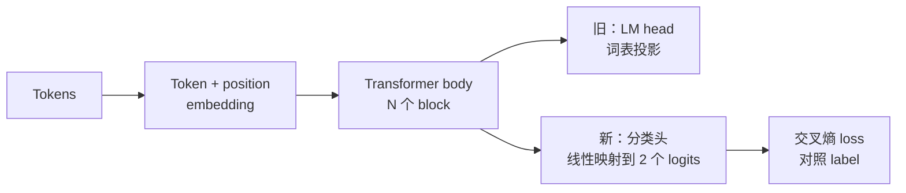
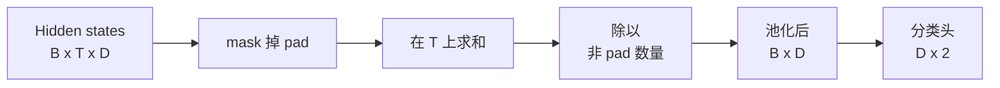
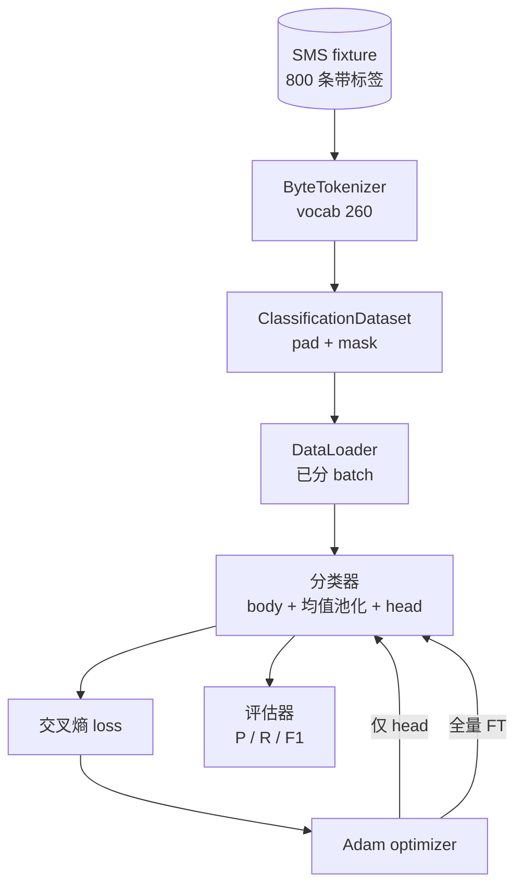

# 毕业课 38：通过换头实现分类器微调（Classifier Fine-Tuning by Head Swap）

> 译注：本文译自同目录 [`en.md`](./en.md)。术语遵循仓根 [TRANSLATION_GUIDE.md](../../../../TRANSLATION_GUIDE.md)。

> Track B 的第一个毕业项目。一个预训练语言模型本质上是若干 self-attention 块堆叠，最后接一个 token 预测头。当你想做 spam vs ham（垃圾短信 vs 正常短信）分类时，原来的头不对，但 body（主体）大部分是对的。本课把头扯下来，在 pooled（池化后）表示上粘一个二分类线性层，然后用两种方式训练这个分类器：只训练最后一层，以及完整 fine-tune（微调）。评估指标是留出集（held-out split）上的 precision、recall 和 F1。你会学到每种策略带来的收益和代价。

**Type:** Build
**Languages:** Python (torch, numpy)
**Prerequisites:** Phase 19 lessons 30-37（NLP LLM track：tokenizer、embedding 表、attention 块、transformer body、预训练循环、checkpointing、生成、perplexity）
**Time:** ~90 分钟

## 学习目标（Learning Objectives）

- 在不重新初始化 body 的前提下，把语言模型头替换成分类头。
- 实现两种训练范式：冻结 body（仅训练头）和完整 fine-tune，共用一个训练循环。
- 构建一条 tokenizer 友好的数据流水线，包含 padding、padding mask 和 attention 输出的 pooling。
- 从原始 logits 计算 precision、recall、F1 和混淆矩阵（confusion matrix）。
- 推理参数量、训练时长与上限收益（head-room）之间的权衡。

## 问题（Problem）

你已经在一个通用语料上预训练了一个小型 transformer。输出头把最后的隐藏状态投影到 1000 个 token 的词表上。现在你手头有 800 条标注了 spam 或 ham 的 SMS 短信，想训一个二分类器。有三个选择。

错误的选项是用这 800 条样本从零开始训练一个新分类器。预训练模型的 body 已经编码了有用的结构：词的身份、位置、简单的共现关系。把它扔掉等于浪费了之前训出它的算力。

两个对的选项是：换头但冻结 body，以及换头且 body 可训练。只训头很快，几乎不占额外显存，在数据这么少的时候也很难过拟合。完整 fine-tune 慢一些，在小数据上有过拟合风险，但当下游领域偏离预训练语料时能取得更高的准确率。

本课两种都实现，这样你能在同一个 fixture（固定数据样本）上比较它们。

## 概念（Concept）

模型是一个函数 `f_theta(tokens) -> hidden_states`。头是一个函数 `g_phi(hidden) -> logits`。换头意味着保留 `theta`、替换 `g_phi`。body 的参数是昂贵的那部分。头只是一个线性层。

有两组可训练参数值得关注：

- `theta`（body）：每个 attention 块上万个权重。
- `phi`（头）：`hidden_dim * num_classes` 个权重外加一个偏置。

只训头时，你只对 `phi` 计算梯度，把 `theta` 的梯度清零。在 PyTorch 里通过把 body 参数的 `requires_grad` 设为 `False` 即可。这样 optimizer 只看到头，body 保持冻结。

完整 fine-tune 时，梯度会回流穿过整个堆栈。body 的权重会朝分类目标漂移。风险在于小数据上的灾难性遗忘（catastrophic forgetting）：body 的预训练成果被过拟合噪声冲掉。

## Pooling 的选择（The Pooling Question）

分类器需要每条序列得到一个向量，而不是每个 token 一个。常见的三种选择：

- **Mean pool**：在序列维度上对隐藏状态做平均，权重由 attention mask 决定。
- **CLS pool**：在最前面加一个特殊 token，只用它的输出。这是 BERT 的做法。
- **Last-token pool**：用最后一个非 padding token。这是 GPT 系分类器的做法。

本课用带显式 attention mask 加权的 mean pooling。它最简单，在不同序列长度上信号稳定，也不需要预训练一个 CLS token。

## 数据（The Data）

800 条 SMS 短信，spam 和 ham 各 400 条均衡，由 `code/main.py` 确定性地生成。生成器使用固定种子，挑选模板并替换槽位填充词，输出长度在 5 到 25 个 token 之间的短信。真实数据集有这个 fixture 没有的噪声。fixture 的目标是可复现。

数据按 80/20 切分：640 训练，160 测试。切分是分层（stratified）的，让测试集保持 50/50 平衡。一个已知平衡的留出集，能让 precision 和 recall 读起来是诚实的数字。

## 指标（The Metrics）

二分类，类别 1 为正类（spam）。计数：

- `TP`：预测为 spam、实际是 spam。
- `FP`：预测为 spam、实际是 ham。
- `FN`：预测为 ham、实际是 spam。
- `TN`：预测为 ham、实际是 ham。

三个核心指标：

- `precision = TP / (TP + FP)`。被标为 spam 的短信里，有多少真的是？
- `recall = TP / (TP + FN)`。所有真正的 spam 里，模型标出了多少？
- `F1 = 2 * P * R / (P + R)`。两者的调和平均。

混淆矩阵以 2x2 网格打印这四个计数。demo 会把两种训练范式的混淆矩阵都写到 stdout。

## 架构（Architecture）

body 是一个刻意做小的 transformer：vocab 260，hidden 64，4 个 head，2 个 block，最大序列长度 32。它小到能在 CPU 上九十秒内把两种范式都训到收敛。课程里它没有真正预训练；取而代之的是 `pretrain_quick` 辅助函数在同一 fixture 的文本上做五个 epoch 的 LM 训练，给 body 一个非平凡的起点。这样课程是自包含的。

## 你将构建什么（What you will build）

实现是一个 `main.py` 加一个测试模块（`code/tests/test_main.py`）。

1. `ByteTokenizer`：把字节映射为 id，保留一个 pad id。
2. `Block`：一个 transformer 块，包含 multi-head attention 和一个前馈层。Pre-norm。
3. `LMBody`：token + 位置 embedding 加上若干个 block 的堆叠。返回隐藏状态。
4. `MeanPool`：在序列维度上做 mask 加权平均。
5. `Classifier`：body、pool、线性头。在两种范式之间共享同一个 body 实例。
6. `freeze_body` 和 `unfreeze_body`：切换 body 参数的 `requires_grad`。
7. `train_classifier`：一个共用循环。接收模型和一个为可训练参数组配置好的 optimizer。
8. `evaluate`：跑测试集，返回 `Metrics(precision, recall, f1, confusion)`。
9. `run_demo`：先简短预训练 body，然后训练并评估只训头的版本，再做完整 fine-tune，打印两份报告，正常退出。

## 为什么这个对比重要（Why the comparison matters）

只训头的范式通常训得更快，欠拟合得也更优雅。在这个 fixture 上，只训头跑二十个 epoch 后，你通常能看到 precision 接近 0.9、recall 接近 0.85。完整 fine-tune 要长大约三倍时间，落点在两侧几个百分点的范围内浮动，取决于随机种子。

本课不评胜负。它教你读懂数字和成本。在 800 条样本和一个很小的 body 上，只训头是正确选择。在 80,000 条样本和更大的 body 上，完整 fine-tune 开始有回报。你从本课带走的契约是 API：同一个 `train_classifier` 函数同时处理两种情况，切换只需一次调用。

## 进阶目标（Stretch goals）

- 增加第三种范式：只解冻最后一个 block。这有时被称作部分 fine-tune（partial fine-tuning）。它比完整 FT 便宜，比只训头学到更多。
- 加一个 learning rate 调度器（scheduler）。在头上用 cosine 调度、在 body 上用一个更小的常数学习率，是常见的生产配置。
- 把 mean pooling 换成学习到的 attention pool：一个带单个可学习 query 的小 attention 层。在更长的序列上往往胜过 mean pool。

实现给了你这些挂钩。测试钉住契约。数字留给你去推。
