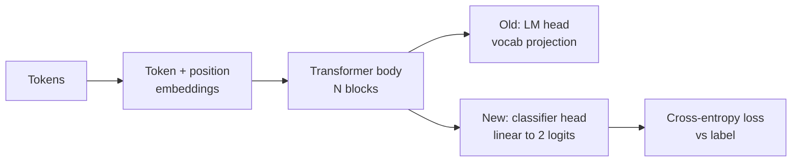
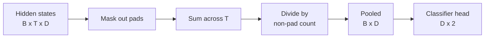
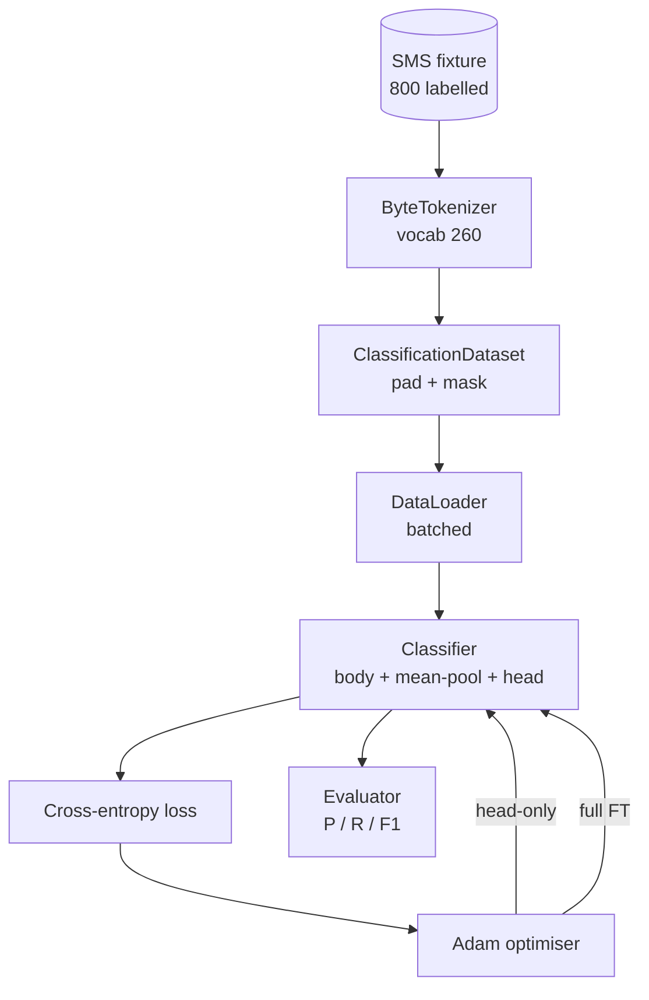

# 38 · 分类器微调：头层替换法

> Track B 的第一个综合项目（capstone）。一个预训练语言模型是由若干自注意力块堆叠而成的，末端是一个 token 预测头。当你要做「垃圾 vs 正常」的二分类时，原来的预测头是错的，但模型主体大致是对的。本课将摘掉旧头，在池化后的表示上粘接一个二类线性层，并以两种不同的方式训练分类器：仅训练最终层和全量微调（full fine-tuning）。评估指标包括精确率（precision）、召回率（recall）和 F1 值，并在留出验证集上计算。你将学到每种策略的收益和代价。

**类型：** 构建
**语言：** Python（torch, numpy）
**前置：** 第 19 阶段第 30–37 课（NLP LLM 路线：分词器、嵌入表、注意力块、Transformer 主体、预训练循环、检查点、生成、困惑度）
**时长：** 约 90 分钟

## 学习目标

- 将语言模型头替换为分类头，且不重新初始化模型主体。
- 实现两种训练模式：冻结主体（仅训练头）和全量微调，共享同一个训练循环。
- 构建一个感知分词器的数据管线（data pipeline），实现填充（padding）、对填充位进行掩码（masking），以及池化注意力输出。
- 基于原始 logits 计算精确率、召回率、F1 值和混淆矩阵（confusion matrix）。
- 理解参数规模、训练时间和提升空间之间的权衡。

## 问题描述

你在一个通用语料上预训练了一个小型 Transformer。其输出头将最后一个隐藏状态投影到一个 1000 token 的词汇表上。现在你有 800 条标注为垃圾（spam）或正常（ham）的短信，需要训练一个二分类器。你有三种选择。

错误的选择是从头训练一个全新的分类器，仅用 800 条样本。预训练模型的主体已经编码了有用的结构：词身份、位置、简单的共现关系。丢弃它就浪费了构建它所花费的算力。

两个正确的选择是通过头层替换来实现：冻结模型主体，或者让主体可训练。仅训练头的方案速度快、内存几乎免费，且在这种小数据量下很少过拟合。全量微调更慢、在小数据上容易过拟合，但当下游领域与预训练语料偏离较大时，准确率可能更高。

本课会同时实现这两种方案，让你在同样的实验设置下进行比较。

## 概念

模型是一个函数 `f_theta(tokens) -> hidden_states`。头是一个函数 `g_phi(hidden) -> logits`。头层替换意味着保留 `theta` 并替换 `g_phi`。模型主体的参数是昂贵的部分，而头只是一个线性层。

需要关注的两组可训练参数：

- `theta`（主体）：每个注意力块中有数万个权重。
- `phi`（头）：`hidden_dim * num_classes` 个权重加上一个偏置。

在仅训练头（head-only）的训练中，你仅对 `phi` 计算梯度，对 `theta` 则将梯度清零。PyTorch 允许你将主体参数的 `requires_grad` 设为 `False` 来实现这一点。优化器只看得到头，主体保持不变。

在全量微调中，你让梯度沿整个堆栈反向传播。主体的权重会漂移以适应分类目标。风险是在小数据上发生灾难性遗忘（catastrophic forgetting）：主体的预训练结果被过拟合噪声冲刷殆尽。

## 池化问题

分类器需要的是每个序列一个向量，而非每个 token 一个向量。常见的三种选择：

- **均值池化（mean pool）**：按注意力掩码加权，对序列所有隐藏状态求平均。
- **CLS 池化**：在序列前添加一个特殊 token，仅使用该 token 的输出。BERT 的做法。
- **末位 token 池化**：使用最后一个非填充 token。GPT 系列分类器的做法。

本课采用带显式注意力掩码加权的均值池化。它最简单，在不同序列长度下都能提供稳定的信号，并且不需要预训练 CLS token。

## 数据

共 800 条短信，垃圾与正常各 400 条，均衡分布，在 `code/main.py` 中以确定性方式生成。生成器使用固定种子，选择模板并替换槽位填充词，生成 5 到 25 个 token 长的消息。真实数据集中有噪声，而本课的固定数据集中没有——固定数据集的目的是保证可复现性（reproducibility）。

数据按 80/20 分割：640 条训练，160 条测试。采用分层分割（stratified），保证测试集的 50/50 均衡不变。一个已知分布的留出集让精确率和召回率成为可信的数字。

## 评估指标

二分类，将类别 1 作为正类（垃圾）。计数值为：

- `TP`：预测为垃圾，实际也是垃圾。
- `FP`：预测为垃圾，实际是正常。
- `FN`：预测为正常，实际是垃圾。
- `TN`：预测为正常，实际也是正常。

三项核心指标：

- `precision = TP / (TP + FP)`。被标记为垃圾的消息中，实际有多少比例确实是垃圾？
- `recall = TP / (TP + FN)`。实际垃圾中，模型识别出了多少比例？
- `F1 = 2 * P * R / (P + R)`。精确率和召回率的调和平均数。

混淆矩阵以 2x2 网格打印四项计数。演示程序会为标准输出打印两种训练模式的混淆矩阵。

## 架构

主体是一个刻意做得很小的 Transformer：词汇表 260，隐藏维度 64，4 个注意力头，2 个块，最大序列长度 32。它小到可以在 CPU 上 90 秒内让两种模式都训练到收敛。本课并不会事先预训练好它；取而代之的是 `pretrain_quick` 辅助函数，它会在同一批固定数据集上进行 5 个 epoch 的语言模型训练，让主体有一个非平凡的初始化。这样本课就可以自给自足。

## 你将构建的内容

实现代码为一个 `main.py` 加一个测试模块（`code/tests/test_main.py`）。

1. `ByteTokenizer`：将字节映射到 id，预留一个 pad id。
2. `Block`：一个带有多头注意力和前馈层的 Transformer 块，采用 Pre-norm。
3. `LMBody`：token 嵌入 + 位置嵌入，再加一组 Block 的堆叠。返回隐藏状态。
4. `MeanPool`：在序列维度上做掩码加权的平均。
5. `Classifier`：body + pool + linear head。body 在两种训练模式下共用同一个实例。
6. `freeze_body` 和 `unfreeze_body`：切换 body 参数的 `requires_grad`。
7. `train_classifier`：一个共享的训练循环。接收模型和一个为当前可训练参数组配置的优化器。
8. `evaluate`：运行测试集并返回 `Metrics(precision, recall, f1, confusion)`。
9. `run_demo`：先对 body 进行简短的预训练，然后分别训练和评估 head-only 模式和 full 模式，打印两份报告，正常退出。

## 为什么要做这个对比

仅训练头的模式通常训练更快，欠拟合时也更优雅。在这个固定数据集上，经过 20 个 epoch 的 head-only 训练，你通常能看到精确率接近 0.9，召回率接近 0.85。全量微调大约要多花三倍的时间，结果在一两个点内上下浮动，具体取决于随机种子。

本课不选一个赢家。它教你读懂数字和成本。在 800 条样本和一个小模型主体上，head-only 是正确的选择。在 80,000 条样本和一个更大的模型主体上，全量微调才开始起作用。你从本课带走的契约是 API：同一个 `train_classifier` 函数能处理两种模式，切换只需要一次调用。

## 延伸目标

- 添加第三种模式：仅解冻最后一个块。有时被称为部分微调（partial fine-tuning）。成本低于全量微调，但比仅训练头学得更多。
- 添加学习率调度器。对头使用余弦调度，对主体使用较小的恒定学习率，这是生产中常见配置。
- 将均值池化替换为可学习的注意力池化（learned attention pool）：一个带有一个可学习查询的小注意力层。在较长的序列上通常优于均值池化。

实现代码为你提供了钩子。测试锁定了契约。数字则由你来推动。
