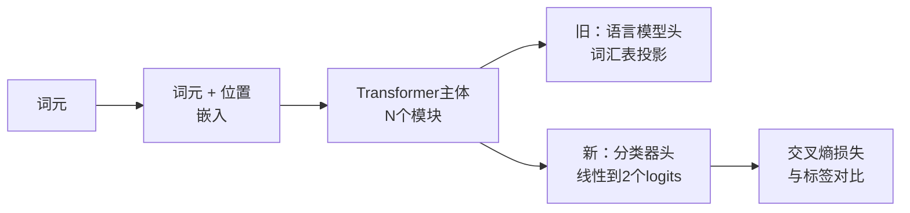
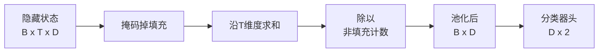
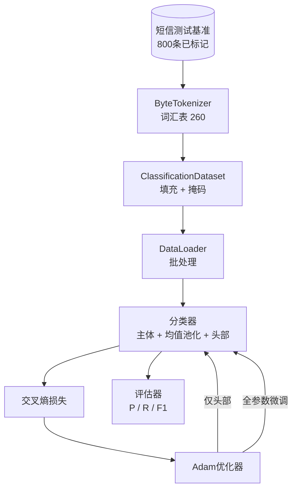

# 顶点课第38讲：通过头替换进行分类器微调

> 轨道B的第一个顶点项目。预训练语言模型是一个以词元预测头结尾的自注意力块堆叠。当你需要区分垃圾邮件和正常邮件时，头部是错误的，但主体基本正确。本节课将头部摘除，在池化表示上粘贴一个二类线性层，并以两种不同方式训练分类器：仅最后一层，以及全参数微调。评估指标是在留出集上的精确率、召回率和F1分数。你将了解每种策略带来的收益及其代价。

**类型：** 构建
**语言：** Python（torch, numpy）
**前置条件：** 阶段19第30-37讲（NLP大语言模型轨道：分词器、嵌入表、注意力模块、Transformer主体、预训练循环、检查点、生成、困惑度）
**用时：** 约90分钟

## 学习目标

- 在不重新初始化主体的情况下，将语言模型头替换为分类头。
- 实现两种训练模式：冻结主体（仅头部）和全参数微调，共用同一训练循环。
- 构建一个感知分词器的数据流水线，实现填充、掩码填充和池化注意力输出。
- 从原始logits计算精确率、召回率、F1分数和混淆矩阵。
- 分析参数量、训练时间与性能上限之间的权衡。

## 问题

你在一个通用语料库上预训练了一个小型Transformer。输出头将最后一层隐藏状态投影到一个1000词元的词汇表上。现在你有800条标记为垃圾或正常的短信，需要一个二分类器。存在三种选择。

错误的选择是在800条样本上从头训练一个全新的分类器。预训练模型的主体已经编码了有用的结构：词标识、位置、简单的共现关系。丢弃它会浪费构建它所花费的计算资源。

两个正确的选择是：主体冻结的头替换，以及主体可训练的头替换。仅头部训练速度快，内存消耗几乎为零，并且在如此少量数据下很少过拟合。全参数微调较慢，可能在少量数据上过拟合，但当下游领域与预训练语料库存在偏差时，可以达到更高的准确率。

本节课将构建两种方案，以便你在同一测试基准上进行比较。

## 概念

```mermaid
flowchart LR
  T[词元] --> E[词元 + 位置<br/>嵌入]
  E --> B[Transformer主体<br/>N个模块]
  B --> H1[旧：语言模型头<br/>词汇表投影]
  B --> H2[新：分类器头<br/>线性到2个logits]
  H2 --> L[交叉熵损失<br/>与标签对比]
```

模型是一个函数 `f_theta(词元) -> 隐藏状态`。头部是一个函数 `g_phi(隐藏状态) -> logits`。交换头部意味着保留 `theta` 并替换 `g_phi`。主体的参数是昂贵部分。头部仅是一个线性层。

两个可训练的参数集值得关注：

- `theta`（主体）：每个注意力模块数万个权重。
- `phi`（头部）：`隐藏维度 * 类别数` 个权重加上偏置。

在仅头部训练中，你计算针对 `phi` 的梯度，并将针对 `theta` 的梯度置零。PyTorch允许你通过设置主体参数的 `requires_grad=False` 来实现这一点。优化器于是只看到头部，主体保持冻结。

在全参数微调中，你让梯度流经整个堆叠。主体的权重会漂移以适应分类目标。风险在于少量数据上的灾难性遗忘：主体的预训练知识会被过拟合噪声冲刷掉。

## 池化问题

分类器需要每个序列一个向量，而不是每个词元一个向量。三种常见选择：

- **均值池化**：对序列中的隐藏状态取平均，按注意力掩码加权。
- **CLS池化**：前置一个特殊词元，仅使用其输出。BERT就是采用这种方式。
- **最后词元池化**：使用最后一个非填充词元。GPT类分类器采用这种方式。

本节课使用带有显式注意力掩码加权的均值池化。它最简单，在不同序列长度上提供稳定的信号，且不需要预训练CLS词元。

```mermaid
flowchart LR
  H[隐藏状态<br/>B x T x D] --> M[掩码掉填充]
  M --> S[沿T维度求和]
  S --> N[除以<br/>非填充计数]
  N --> P[池化后<br/>B x D]
  P --> C[分类器头<br/>D x 2]
```

## 数据

八百条短信，400条垃圾和400条正常均衡分布，在 `code/main.py` 中确定性生成。生成器使用固定种子，选取模板并替换插槽填充物，输出长度为5至25个词元的消息。真实数据集存在噪声，而此测试基准没有。该测试基准的意义在于可复现性。

数据按80/20分割：640条训练，160条测试。分割是分层的，以使测试集保持50/50的平衡。一个已知平衡的留出集使得精确率和召回率可以解读为诚实的数字。

## 评估指标

二分类，类别1为正类（垃圾邮件）。计数如下：

- `TP`：预测为垃圾，实际是垃圾。
- `FP`：预测为垃圾，实际是正常。
- `FN`：预测为正常，实际是垃圾。
- `TN`：预测为正常，实际是正常。

三个核心指标：

- `precision = TP / (TP + FP)`。被标记为垃圾的邮件中，实际是垃圾的比例是多少？
- `recall = TP / (TP + FN)`。在所有实际垃圾邮件中，模型标记出了多少比例？
- `F1 = 2 * P * R / (P + R)`。两者的调和平均值。

混淆矩阵将四个计数以2x2网格形式打印。演示程序对两种训练方案均输出此矩阵到标准输出。

## 架构

```mermaid
flowchart TD
  Toks[(短信测试基准<br/>800条已标记)] --> Tok[ByteTokenizer<br/>词汇表 260]
  Tok --> DS[ClassificationDataset<br/>填充 + 掩码]
  DS --> DL[DataLoader<br/>批处理]
  DL --> M[分类器<br/>主体 + 均值池化 + 头部]
  M --> L[交叉熵损失]
  L --> O[Adam优化器]
  O -->|仅头部| M
  O -->|全参数微调| M
  M --> E[评估器<br/>P / R / F1]
```

主体是一个特意设计的小型Transformer：词汇表260，隐藏维度64，4个注意力头，2个模块，最大序列长度32。它足够小，可以在90秒内在CPU上将两种方案训练至收敛。本节课不对其进行预训练；而是使用 `pretrain_quick` 辅助函数在同一测试基准的文本上执行5个epoch的语言模型训练，为主体提供一个非平凡的起点。这使得本节课保持自包含。

## 你将构建的内容

实现为一个 `main.py` 加上一个测试模块（`code/tests/test_main.py`）。

1. `ByteTokenizer`：将字节映射到ID，预留一个填充ID。
2. `Block`：一个包含多头注意力和前馈层的Transformer模块。采用预层归一化。
3. `LMBody`：词元 + 位置嵌入再加上一叠模块。返回隐藏状态。
4. `MeanPool`：基于掩码加权的序列轴平均。
5. `Classifier`：主体、池化、线性头。主体在不同方案间是同一个实例。
6. `freeze_body` 和 `unfreeze_body`：切换主体参数的 `requires_grad`。
7. `train_classifier`：一个共享循环。接受模型和一个针对可训练参数组配置的优化器。
8. `evaluate`：运行测试集并返回 `Metrics(precision, recall, f1, confusion)`。
9. `run_demo`：简短预训练主体，然后训练和评估仅头部方案，再训练和评估全参数微调方案，打印两份报告，并以零退出。

## 为什么比较很重要

仅头部方案通常训练更快，欠拟合更温和。在此测试基准上，经过二十个epoch的仅头部训练，你通常可以看到精确率接近0.9，召回率接近0.85。全参数微调大约需要三倍时间，结果相差几个百分点之内，具体取决于随机种子。

本节课不评判孰优孰劣。它教你阅读数据和代价。在800条样本和小型主体上，仅头部是正确选择。在80,000条样本和更大的主体上，全参数微调开始显现优势。你从本节课中获得的契约是API：同一个 `train_classifier` 函数处理两种方案，切换仅需一次调用。

## 拓展目标

- 添加第三种方案，仅解冻最后一个模块。这有时称为部分微调。它比全参数微调成本低，且比仅头部学习更多。
- 添加学习率调度器。头部使用余弦调度加上主体使用较小的恒定学习率是常见的生产配置。
- 将均值池化替换为可学习的注意力池化：一个小型注意力层加上一个可学习的查询向量。这通常在较长序列上优于均值池化。

实现为你提供了钩子。测试锁定了契约。数据由你来推动。
