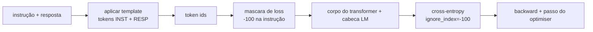
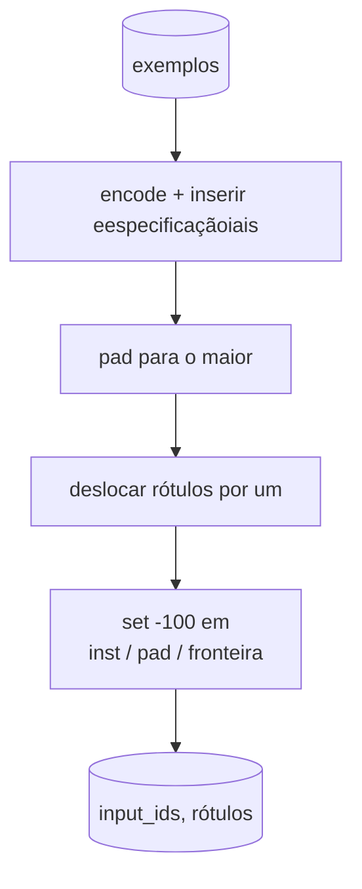
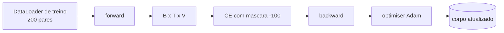

# Aula Capstone 39: Instruction Tuning por Supervised Fine-Tuning

> Um modelo base pré-treinado pode estender uma sequência mas não consegue seguir uma instrução. Supervised fine-tuning é a menor mudança que conserta isso: alimenta o modelo com exemplos pareados de instrução e resposta desejada, e treina o corpo para predizer os tokens da resposta. O truque é que voce quer que a loss conte apenas a resposta, não a instrução. Esta aula constrói um loop SFT estilo Alpaca com uma funcao de collate customizada que mascara tokens de instrução com `ignore_index=-100`, treina em 200 pares instrucao-resposta, e avalia em um split separado usando exact-match.

**Tipo:** Build
**Linguagens:** Python (torch, numpy)
**Prerequisitos:** Aulas 30-37 da Fase 19 (track NLP LLM: tokenizer, tabela de embedding, bloco de attention, corpo do transformer, loop de pre-treinamento, checkpoint, geracao, perplexidade)
**Tempo:** ~90 minutos

## Objetivos de Aprendizado

- Formatar dados pareados instrucao-resposta em uma sequencia causal unica com tokens de fronteira explicitos.
- Construir uma funcao de collate que mascara tokens de instrução de forma que cross-entropy conte apenas tokens de resposta.
- Treinar um corpo pequeno de transformer sob o objetivo SFT e observar a metrica de eval se mover.
- Implementar geracao por greedy e amostragem por temperatura que respeite a fronteira de inicio da resposta.
- Calcular exact-match no conjunto de validacao nas completions geradas.

## O Problema

Um modelo base treinado em next-token prediction nao tem ideia do que e uma instrução. Mostre a string `"Qual a capital da Franca?"` e ele vai continuar a questao ou inventar uma nova frase. O modelo tem a lingua mas nao tem o contrato de formato.

O contrato SFT e um template de string. Cada exemplo de treino vira uma sequencia unica com tres regioes:

```text
<INST> Qual a capital da Franca? <RESP> A capital da Franca e Paris.
```

Os tokens de fronteira sao tokens eespecificaçãoiais reservados no treinamento. O modelo aprende que tudo depois de `<RESP>` e a resposta, e a resposta e o que recebe nota. O objetivo de next-token do modelo base continua valendo; ele so e treinado em um corpus onde cada exemplo tem essa forma.

Mas ha um problema. Se voce alimenta a sequencia inteira em uma cross-entropy loss comum, voce esta treinando o modelo para tambem predizer os tokens de instrução. A instrução e dada. Voce quer gradiente zero nessas posicoes. A solucao e a mascara.

## O Conceito



`ignore_index` e uma funcionalidade de `torch.nn.functional.cross_entropy`. Qualquer posicao-alvo igual a `ignore_index` contribui zero de loss e zero de gradiente. A convencao no PyTorch e `-100`. A funcao de collate constroi dois tensores por exemplo: `input_ids` (a sequencia completa) e `rótulos` (uma copia de `input_ids` com as posicoes da instrução sobrescritas por `-100`).

O modelo ve a sequencia inteira durante o forward pass; a attention pode olhar para a instrução. A loss so conta tokens de resposta. E exatamente isso que voce quer: condicionar na instrução, predizer a resposta.

## Os Dados

Duzentos pares instrucao-resposta sao gerados deterministicamente em `main.py`. Eles cobrem seis tipos de tarefa:

- factual single-shot (capital de X)
- aritmetica
- extracao de lista
- resumo em uma frase
- codigo (print, sort)
- definicao

Cada tarefa tem uma instrução com template e uma resposta deterministica. Isso e intencionalmente simples. Exact-match e fragil, e a aula usa um fixture onde a resposta correta e uma string eespecificaçãoifica. Datasets SFT reais precisam de metricas fuzzy; o principio e identico.

Splits sao 160 treino, 40 teste. O conjunto de teste cobre os seis tipos de tarefa para que o exact-match por categoria possa ser reportado.

## Tokenizacao e Padding

O tokenizador e de nivel byte com tres eespecificaçãoiais reservados:

- `INST_ID = 256`: marca o inicio da regiao de instrução.
- `RESP_ID = 257`: marca a fronteira entre instrução e resposta.
- `PAD_ID = 258`: padding para batches de tamanho variavel.

A sequencia e `[INST] inst_bytes [RESP] resp_bytes [PAD]*`. A funcao de collate:

1. Tokeniza cada exemplo.
2. Faz padding de cada exemplo no batch para a sequencia mais longa.
3. Constroi `rótulos` = `input_ids` deslocado por um (target de LM causal), com:
   - A regiao de instrução substituida por `-100`.
   - A regiao de padding substituida por `-100`.
   - A propria posicao da fronteira `RESP_ID` substituida por `-100` (voce nao treina o modelo para predizer o token de fronteira; ele prediz o que vem a seguir).



O deslocamento e o truco causal padrao: a posicao `i` de `input_ids` prediz a posicao `i+1`, entao `rótulos[i] = input_ids[i+1]` (com a posicao final removida do input e a primeira removida do target). A mascara e aplicada depois do deslocamento para cair nas posicoes certas.

## Treinamento



O loop e o padrao PyTorch SFT. Adam, taxa de aprendizado por volta de 3e-4 a 1e-3, dez a vinte epocas neste fixture, sem scheduler. O modelo e pequeno o suficiente (hidden 96, 2 blocos, comprimento maximo 64) para treinar ate convergir em CPU dentro de dois minutos.

A cada quinta epoca o loop roda um passo pequeno de eval no conjunto de validacao e imprime exact-match. Ver o exact-match ir de 0.0 na epoca um para algo como 0.85 na epoca quinze e a recompensa da aula: voce ve o modelo aprendendo o formato e as respostas ao mesmo tempo.

## Geracao

No momento de eval o modelo recebe o prefixo da instrução `[INST] inst_bytes [RESP]` e gera tokens ate:

- a sequencia alcancar `max_len`, ou
- o modelo emitir uma heuristica de parada: dois bytes consecutivos de final de frase (`.`, `!`, `?`).

A aula traz greedy decoding mais um sampler opcional por temperatura. Exact-match usa greedy porque temperatura deixaria a metrica estocastica. Sistemas reais frequentemente amostram e depois julgam fuzzy; esse pipeline e a aula 41.

## Avaliacao por Exact-Match

Exact-match e a metrica de texto mais restritiva. A string da resposta predita e normalizada (lowercase, remover espacos, colapsar espacos duplos) e comparada com a resposta de referencia, normalizada da mesma forma. A metrica e 1 ou 0 por exemplo. O agregado e a media.

Pipelines SFT reais complementam exact-match com F1 a nivel de token (aula 41) e um modelo juiz. Exact-match continua util porque e ambiguo: se diz 0.7, exatamente 70 por cento das instrucoes de teste produziram a resposta dourada caractere por caractere.

## O que voce vai construir

A implementacao e um `main.py` mais testes.

1. `InstructionTokenizer`: encoder de nivel byte com eespecificaçãoiais reservados. Codifica tanto um prefixo de instrução quanto um par completo.
2. `make_dataset`: gera 200 pares em seis tipos de tarefa com seed fixa.
3. `SFTDataset`: retorna `(input_ids, rótulos)` por exemplo, ja com mascara preparada.
4. `sft_collate`: padding dinamico, constroi o tensor do batch, seta `-100` nas posicoes de instrução e padding.
5. `TinyGPT`: corpo do transformer mais cabeca LM com pesos compartilhados ou nao.
6. `train_sft`: o loop SFT, com hooks de eval por epoca.
7. `generate`: decodificacao causal a partir de um prefixo, greedy ou amostrada, com a heuristica de parada.
8. `exact_match`: comparacao de string normalizada, retorna float em `[0, 1]`.
9. `run_demo`: constroi os dados, treina por vinte epocas, avalia, imprime um breakdown por categoria, sai zero no sucesso.

## Por que a mascara importa

Sem a mascara, a loss trata tokens de instrução como targets. O modelo aprende a predizer a instrução. Esse e um objetivo diferente e produz um modelo pior de duas maneiras. Primeiro, a capacidade do modelo e desperdicada reconstruindo inputs que o usuario sempre fornece. Segundo, a loss da resposta e menor na soma de gradientes porque tokens de instrução outnumber tokens de resposta na maioria dos batches; a taxa de aprendizado efetiva do optimiser na parte que voce se importa e menor do que voce pretendia. A mascara nao e um polimento; e o objetivo.

## Metas extras

- Adicionar um warmup de taxa de aprendizado seguido de decrescimento coseno. SFT e mais sensivel a taxa de aprendizado que pre-treinamento.
- Adicionar log de loss por token e plotar a curva de loss durante o treinamento. Note que epocas iniciais sao dominadas por tokens de template (`<RESP>`, prefixos comuns) e epocas posteriores sao dominadas pelos tokens da resposta real.
- Estender o eval para BLEU-1 ou chrF. Exact-match subestima modelos que produzem uma parafrase com a mesma resposta.
- Adicionar um template de chat com formatacao multi-turn e treinar em um fixture que inclua follow-ups.

A implementacao te da o contrato de formato, a mascara, e o loop. A mudanca de objetivo de modelo base para seguidor de instrucoes e uma funcao de collate.
