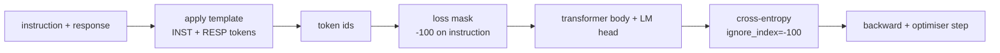
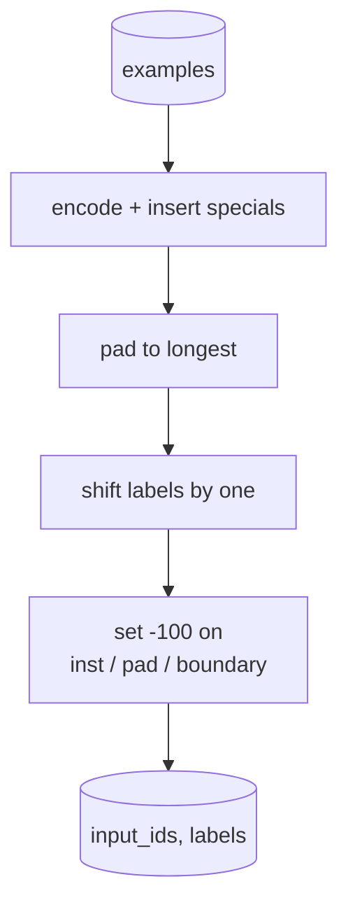
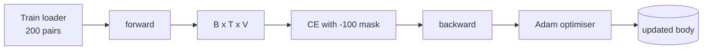

# Bitirme Dersi 39: Denetlenen Fine-Tuning Tarafından Talimat Ayarlaması

> Önceden eğitilmiş bir temel model, bir diziyi genişletebilir ancak bir talimatı takip edemez. Denetimli fine-tuning, bunu düzelten en küçük değişikliktir: modeli bir talimatın ve istenen yanıtın eşleştirilmiş örneklerini besleyin ve gövdeyi, token yanıtını tahmin etmesi için eğitin. İşin püf noktası, talimatın değil, yalnızca kaybın yanıtı saymasını istemenizdir. Bu ders, token talimatlarını `ignore_index=-100` ile maskeleyen, 200 talimat-yanıt çifti üzerinde eğitim veren ve tam eşleşmeyi kullanarak uzatılmış bir bölünmeyi değerlendiren özel bir harmanlama işlevine sahip Alpaka tarzı bir SFT döngüsü oluşturur.

**Tür:** Yapım
**Diller:** Python (meşale, numpy)
**Önkoşullar:** Aşama 19 dersleri 30-37 (NLP LLM yolu: tokenizer, embedding tablo, dikkat bloğu, transformer gövde, eğitim öncesi döngü, kontrol noktası oluşturma, oluşturma, şaşkınlık)
**Süre:** ~90 dakika

## Öğrenme Hedefleri

- Eşleştirilmiş talimat-yanıt verilerini, açık tokens sınırıyla tek bir nedensel dizi halinde biçimlendirin.
- Talimat token'ları maskeleyen bir harmanlama işlevi oluşturun, böylece çapraz entropi yalnızca token yanıtını sayar.
- SFT hedefi altında küçük bir transformer gövdesini eğitin ve değerlendirme metriğinin hareketini izleyin.
- Tepki-başlangıç ​​sınırına saygılı, açgözlü ve sıcaklık örneklemeli üretim uygulayın.
- Oluşturulan tamamlamalarda uzatılan tam eşleşmeyi hesaplayın.

## Sorun

Sonraki-token tahminine göre eğitilmiş bir temel modelin, talimatın ne olduğu hakkında hiçbir fikri yoktur. Ona `"What is the capital of France?"` dizisini gösterin, o da soruya devam edecek veya yeni bir cümle icat edecektir. Modelin dili var ancak format sözleşmesi yok.

SFT sözleşmesi bir dize şablonudur. Her eğitim örneği üç bölgeye sahip tek bir dizi haline gelir:

```text
<INST> What is the capital of France? <RESP> The capital of France is Paris.
```

Sınır token'lar eğitim zamanında ayrılan özel token'lardir. Model, `<RESP>` 'dan sonraki her şeyin yanıt olduğunu ve yanıtın notlandırılan şey olduğunu öğrenir. Temel modelin sonraki-token hedefi hâlâ geçerlidir; sadece her örneğin bu şekle sahip olduğu bir derlem üzerinde eğitilmiştir.

Ama bir sorun var. Dizinin tamamını vanilya çapraz entropi kaybına beslerseniz, modeli aynı zamanda token talimatlarını tahmin edecek şekilde eğitmiş olursunuz. Talimat veriliyor. Bu konumlarda sıfır gradient istiyorsunuz. Çözüm maskedir.

## Konsept



`ignore_index` , `torch.nn.functional.cross_entropy`'nin bir özelliğidir. `ignore_index` 'ye eşit olan herhangi bir hedef konumu, sıfır kayıp ve sıfır gradient'ye katkıda bulunur. PyTorch'taki kural `-100`'tır. Harmanlama işlevi örnek başına iki tensör oluşturur: `input_ids` (tam dizi) ve `labels` (talimat konumlarının üzerine `-100` tarafından yazılan `input_ids` 'nin bir kopyası).

Model, ileri geçiş sırasında tüm sıralamayı görür; dikkat talimatlara katılabilir. Kayıp yalnızca token yanıtını sayar. Tam olarak istediğiniz şey bu: talimattaki koşul, yanıtı tahmin etmek.

## Veri

`main.py`'da deterministik olarak iki yüz talimat-yanıt çifti oluşturulur. Altı görev türünü kapsarlar:

- gerçek tek çekim (X'in başkenti)
- aritmetik
- liste çıkarma
- tek cümlelik özet
- kod (yazdır, sırala)
- tanım

Her görevin şablonlu bir talimatı ve deterministik bir yanıtı vardır. Bu kasıtlı olarak basittir. Tam eşleşme kırılgandır ve derste doğru cevabın belirli bir dize olduğu bir fikstür kullanılır. Gerçek SFT dataset'ler bulanık metriklere ihtiyaç duyar; prensip aynıdır.

Bölmeler 160 tren, 40 testtir. Test seti altı görev türünün tümünü kapsadığından kategori bazında tam eşleşme raporlanabilir.

## Tokenizasyon ve Dolgu

tokeniser, üç ayrılmış özel öğeyle bayt düzeyindedir:

- `INST_ID = 256`: talimat bölgesinin başlangıcını işaretler.
- `RESP_ID = 257`: talimat ve yanıt arasındaki sınırı işaretler.
- `PAD_ID = 258`: değişken uzunluklu gruplar için dolgu.

Sıra `[INST] inst_bytes [RESP] resp_bytes [PAD]*`'dır. Harmanlama işlevi:

1. Tokenher örneği oluşturur.
2. Gruptaki her örneği gruptaki en uzun sıraya kadar doldurur.
3. Yapılar `labels` = `input_ids` bir birim kaydırıldı (nedensel LM hedefi):
- Talimat bölgesi `-100` ile değiştirildi.
- Dolgu bölgesi `-100` ile değiştirildi.
- `RESP_ID` sınır konumunun kendisi `-100` ile değiştirildi (modeli token sınırını tahmin edecek şekilde eğitmezsiniz; o takip edenleri tahmin eder).



Kaydırma standart nedensel hiledir: `input_ids` 'nin `i` konumu, `i+1` konumunu öngörür, dolayısıyla `labels[i] = input_ids[i+1]` (son konum girdiden düşürülür ve ilk konum hedeften bırakılır). Maske vardiyadan sonra doğru pozisyonlara inmek için uygulanır.

## Eğitim



Döngü standart PyTorch SFT döngüsüdür. Adam, öğrenme oranı 3e-4 ila 1e-3 civarında, bu fikstürde on ila yirmi dönem var, programlayıcı yok. Model, iki dakika içinde CPU'da yakınsamayı eğitmek için yeterince küçüktür (gizli 96, 2 blok, maksimum uzunluk 64).

Döngü her beş aşamada bir, uzatılan set üzerinde küçük bir değerlendirme geçişi gerçekleştirir ve tam eşleşmeyi yazdırır. Tam eşleşmenin birinci çağda 0,0'dan on beşinci çağda 0,85 gibi bir şeye gidişini izlemek dersin getirisidir: modelin formatı ve cevapları aynı anda öğrendiğini görebilirsiniz.

## Nesil

Değerlendirme zamanında model, `[INST] inst_bytes [RESP]` talimat önekini alır ve aşağıdakilerden birine kadar token'ları üretir:

- dizi `max_len`'a ulaşır veya
- model özel bir durdurma buluşsal yöntemi yayar: iki ardışık cümle sonu baytı (`.`, `!`, `?`).

Derste açgözlü kod çözme ve isteğe bağlı bir sıcaklık örnekleyici bulunur. Tam eşlemede açgözlülük kullanılır çünkü sıcaklık, metriği stokastik hale getirir. Gerçek sistemler sıklıkla örnek alır, sonra bulanık bir şekilde karar verir; bu boru hattı ders 41'dir.

## Tam Eşleşme Değerlendirmesi

Tam eşleşme en katı metin ölçümüdür. Tahmin edilen yanıt dizisi normalleştirilir (küçük harf, şerit boşluk, çift boşluk daraltılır) ve referans yanıtla karşılaştırılır ve aynı şekilde normalleştirilir. Metrik örnek başına 1 veya 0'dır. Toplam, ortalamadır.

Gerçek SFT ardışık düzenleri, token düzeyindeki F1 (ders 41) ve bir yargıç modeliyle tam eşleşmeyi tamamlar. Tam eşleşme, kesin olduğu için yararlı olmaya devam eder; 0,7 diyorsa, test talimatlarının tam olarak yüzde 70'i karakter için altın yanıt karakterini üretti.

## Ne inşa edeceksiniz

Uygulama bir `main.py` artı testtir.

1. `InstructionTokenizer`: ayrılmış özel özelliklere sahip bayt düzeyinde kodlayıcı. Bir talimat önekini veya tam bir çifti kodlar.
2. `make_dataset`: altı görev türünde sabit bir başlangıç ​​noktasıyla 200 çift oluşturur.
3. `SFTDataset`: Örnek başına zaten maske hazırlanmış olan `(input_ids, labels)` değerini döndürür.
4. `sft_collate`: dinamik doldurma, toplu tensörü oluşturur, talimat ve ped konumlarında `-100` 'yi ayarlar.
5. `TinyGPT`: transformer gövde artı bağlı veya çözülmüş LM kafası.
6. `train_sft`: dönem başına değerlendirme kancalarına sahip SFT döngüsü.
7. `generate`: durdurma buluşsal yöntemiyle açgözlü veya örneklenmiş bir önekten nedensel kod çözme.
8. `exact_match`: normalleştirilmiş dize karşılaştırması, `[0, 1]`'da kayan noktayı döndürür.
9. `run_demo`: verileri oluşturur, yirmi dönem boyunca eğitim verir, değerlendirir, kategori bazında bir döküm yazdırır, başarı durumunda sıfırdan çıkar.

## Maske neden önemlidir?

Maske olmadan kayıp, token talimatlarını hedef olarak ele alır. Model, talimatı tahmin etmeyi öğrenir. Bu farklı bir amaçtır ve iki açıdan daha kötü bir model üretir. Birincisi, model kapasitesi kullanıcının her zaman sağladığı girdileri yeniden oluşturmak için harcanır. İkinci olarak, yanıt kaybı gradient toplamında daha küçüktür, çünkü çoğu grupta talimat token'ın sayısı yanıtın token'larinden fazladır; Optimize edicinin ilgilendiğiniz kısımdaki etkili öğrenme oranı, amaçladığınızdan daha düşük. Maske bir cila değildir; amaç budur.

## Hedefleri genişletme

- Öğrenme hızı ısınmasını ve ardından kosinüs azalmasını ekleyin. SFT, LR'ye ön eğitimden daha duyarlıdır.
- Her-token kayıp kaydını ekleyin ve eğitim boyunca kayıp eğrisini çizin. Erken dönemlere şablon token'ların (`<RESP>`, ortak önekler) hakim olduğuna ve daha sonraki dönemlere gerçek yanıt token'larin hakim olduğuna dikkat edin.
- Değerlendirmeyi BLEU-1 veya chrF'ye genişletin. Tam eşleşme, aynı cevaba sahip bir açıklama üreten modelleri hafife alır.
- Çok dönüşlü biçimlendirmeye sahip bir sohbet şablonu ekleyin ve takipleri içeren bir fikstür üzerinde eğitim alın.

Uygulama size sözleşme biçimini, maskeyi ve döngüyü verir. Temel modelden talimat takipçisine hedef değişim, bir harmanlama işlevidir.
