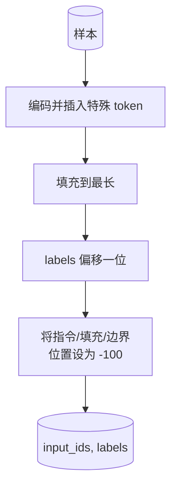

# 39 · 通过监督微调进行指令微调

> 预训练基础模型可以续写文本，但无法遵循指令。监督微调是解决这一问题的最小改动：将指令与期望回答的配对示例输入模型，训练模型主体预测回答中的 token。关键技巧在于，你只希望损失函数计算回答部分，而非指令部分。本课构建一个 Alpaca 风格的 SFT 循环，其中包含一个自定义整理函数，通过 `ignore_index=-100` 遮盖指令 token，在 200 个指令-回答对上进行训练，并在留出拆分集上使用精确匹配进行评估。

**类型：** 构建
**语言：** Python（torch, numpy）
**前置：** 第 19 阶段第 30-37 课（NLP LLM 路线：分词器、嵌入表、注意力块、Transformer 模型主体、预训练循环、检查点、生成、困惑度）
**时长：** 约 90 分钟

## 学习目标

- 将配对的指令-回答数据格式化为一条带有显式边界 token 的因果序列。
- 构建一个整理函数，遮盖指令 token，使交叉熵仅计算回答 token。
- 在 SFT 目标下训练一个小型 Transformer 模型主体，并观察评估指标的变化。
- 实现尊重回答起始边界的贪心解码和温度采样生成。
- 对生成的补全结果计算留出集的精确匹配。

## 问题

一个在下一 token 预测上训练的基础模型根本不知道指令是什么。向它展示字符串 `"What is the capital of France?"`，它会继续提问或编造一个新句子。模型拥有语言能力，但不具备格式约定。

SFT 的格式约定是一个字符串模板。每个训练样本变成一条包含三个区域的序列：

```text
<INST> What is the capital of France? <RESP> The capital of France is Paris.
```

边界 token 是在训练时预留的特殊 token。模型学到 `<RESP>` 之后的所有内容都是回答，而回答才是需要被评判的部分。基础模型的下一 token 目标依然适用；它只是在一个每个样本都具有这种形状的语料库上进行训练。

但这里有一个陷阱。如果你把整个序列输入到普通的交叉熵损失中，你就是在训练模型同时预测指令 token。指令是给定的。你希望这些位置上的梯度为零。解决方案就是遮罩。

## 概念


`ignore_index` 是 `torch.nn.functional.cross_entropy` 的一个特性。任何等于 `ignore_index` 的目标位置贡献零损失和零梯度。PyTorch 中的约定值是 `-100`。整理函数为每个样本构建两个张量：`input_ids`（完整序列）和 `labels`（`input_ids` 的副本，但指令位置被 `-100` 覆盖）。

在前向传播中，模型看到整个序列；注意力机制可以关注到指令部分。损失仅计算回答 token。这正是你想要的效果：以指令为条件，预测回答。

## 数据

`main.py` 中确定性生成了 200 个指令-回答对。它们涵盖六种任务类型：

- 事实性单次问答（X 国的首都是什么）
- 算术
- 列表提取
- 单句摘要
- 代码（打印、排序）
- 定义

每个任务都有一个模板化的指令和一个确定性回答。这是刻意简化的。精确匹配本身很脆弱，而本课使用的测试集确保正确答案是唯一确定的字符串。真实的 SFT 数据集需要模糊指标；但原理是完全相同的。

数据拆分为 160 条训练集、40 条测试集。测试集覆盖所有六种任务类型，因此可以按类别报告精确匹配。

## 分词与填充

分词器是字节级别的，包含三个预留的特殊 token：

- `INST_ID = 256`：标记指令区域的开始。
- `RESP_ID = 257`：标记指令与回答之间的边界。
- `PAD_ID = 258`：用于变长批次的填充。

序列格式为 `[INST] inst_bytes [RESP] resp_bytes [PAD]*`。整理函数的工作流程：

1. 对每个样本进行分词。
2. 将批次中的每个样本填充到批次中最长序列的长度。
3. 构建 `labels` = `input_ids` 向前偏移一位（因果语言模型目标），其中：
   - 指令区域替换为 `-100`。
   - 填充区域替换为 `-100`。
   - `RESP_ID` 边界位置本身也替换为 `-100`（你不训练模型预测边界 token；它预测的是边界之后的内容）。



偏移操作是因果语言模型的标准技巧：`input_ids` 的位置 `i` 预测位置 `i+1`，因此 `labels[i] = input_ids[i+1]`（输入的最后一个位置和目标的第一个位置分别被丢弃）。遮罩在偏移之后应用，以确保落在正确的位置上。

## 训练


循环是标准的 PyTorch SFT 循环。Adam，学习率约 3e-4 至 1e-3，在该测试数据上训练十到二十个 epoch，不使用调度器。模型足够小（隐藏维度 96，2 个 block，最大长度 64），可以在 CPU 上两分钟内训练到收敛。

每五个 epoch，循环在留出集上运行一次小型评估并打印精确匹配。观察精确匹配从第一个 epoch 的 0.0 上升到第十五个 epoch 的约 0.85，就是本课的回报：你可以同时看到模型在学习格式和答案。

## 生成

在评估阶段，模型获得指令前缀 `[INST] inst_bytes [RESP]`，并持续生成 token，直到以下任一条件满足：

- 序列达到 `max_len`，或
- 模型触发一个特殊的停止启发式规则：连续出现两个句子结束字节（`.`、`!`、`?`）。

本课提供贪心解码以及可选的温度采样。精确匹配使用贪心解码，因为温度会使指标变为随机变量。实际系统通常先采样，再进行模糊评判；该流程在第 41 课中介绍。

## 精确匹配评估

精确匹配是最严格的文本指标。预测的回答字符串经过规范化处理（小写、去除首尾空格、合并连续空格），并与同样规范化的参考答案进行比对。每个样本的指标为 0 或 1。汇总结果为均值。

真实的 SFT 流水线会用 token 级别的 F1（第 41 课）和评判模型来补充精确匹配。精确匹配仍然有用，因为它毫不模糊；如果它显示 0.7，就意味着恰好 70% 的测试指令产生了逐字逐符完全一致的金标准回答。

## 你将构建的内容

实现为一个 `main.py` 文件加上测试。

1. `InstructionTokenizer`：字节级编码器，包含预留的特殊 token。可编码指令前缀或完整配对。
2. `make_dataset`：使用固定种子生成 200 个涵盖六种任务类型的配对。
3. `SFTDataset`：返回每个样本的 `(input_ids, labels)`，已预先准备好遮罩。
4. `sft_collate`：动态填充，构建批次张量，在指令和填充位置设置 `-100`。
5. `TinyGPT`：Transformer 模型主体加上共享权重或独立权重的 LM 头。
6. `train_sft`：SFT 循环，包含每个 epoch 的评估钩子。
7. `generate`：从前缀出发的因果解码，支持贪心或采样模式，包含停止启发式规则。
8. `exact_match`：规范化字符串比对，返回 `[0, 1]` 范围内的浮点数。
9. `run_demo`：构建数据，训练二十个 epoch，评估，打印按类别细分的报告，成功时退出码为零。

## 为什么遮罩如此重要

没有遮罩时，损失函数会把指令 token 当作目标。模型学习预测指令。这是一个不同的目标，会从两个方面产生更差的模型。首先，模型容量被浪费在重建用户总是会提供的输入上。其次，在梯度和中，回答部分的损失更小，因为在大多数批次中指令 token 数量超过回答 token；优化器在你真正关心的部分上的有效学习率比你预期的要低。遮罩不是锦上添花；它就是目标本身。

## 拓展目标

- 添加学习率预热，然后接余弦衰减。SFT 对学习率比预训练更敏感。
- 添加逐 token 损失记录，并绘制训练过程中的损失曲线。注意，早期 epoch 主要由模板 token（`<RESP>`、公共前缀）主导，而后期 epoch 则由实际回答 token 主导。
- 将评估扩展到 BLEU-1 或 chrF。精确匹配会低估那些产生同义改写但答案正确的模型。
- 添加支持多轮格式的对话模板，并在包含追问的测试数据上进行训练。

本实现为你提供了格式约定、遮罩和循环。从基础模型到指令遵循者的目标变化，仅是一个整理函数。
