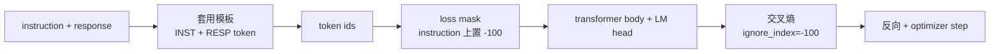
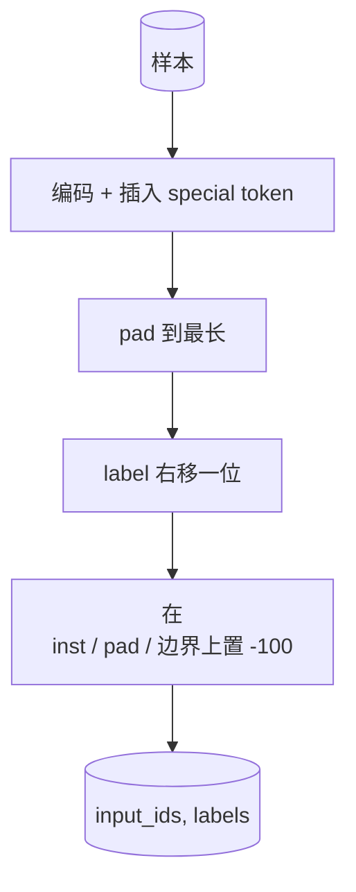

# Capstone 课程 39：用监督式微调做指令微调（Instruction Tuning by Supervised Fine-Tuning）

> 译注：本文译自同目录 [`en.md`](./en.md)。术语遵循仓根 [TRANSLATION_GUIDE.md](../../../../TRANSLATION_GUIDE.md)。

> 预训练（pretraining）后的 base model 能续写一段序列，但不会按指令办事。监督式微调（supervised fine-tuning，SFT）是修复这个问题的最小改动：把「指令 + 期望回复」成对样本喂给模型，训练模型 body 去预测回复部分的 token。诀窍在于：你只想让 loss 计入回复部分，而不计入指令部分。本课会搭一个 Alpaca 风格的 SFT 训练循环，配一个自定义 collate 函数，用 `ignore_index=-100` 屏蔽指令 token，在 200 条「指令-回复」对上训练，并在留出（held-out）集上用 exact-match 评估。

**Type:** Build
**Languages:** Python (torch, numpy)
**Prerequisites:** Phase 19 lessons 30-37（NLP LLM 主线：tokenizer、embedding 表、attention 块、transformer body、预训练循环、checkpointing、生成、perplexity）
**Time:** ~90 minutes

## 学习目标（Learning Objectives）

- 把成对的「指令-回复」数据，按显式边界 token 拼成一条因果（causal）序列。
- 写一个 collate 函数，屏蔽指令 token，让 cross-entropy 只统计回复 token。
- 在 SFT 目标下训练一个小 transformer body，看着评估指标动起来。
- 实现 greedy 和 temperature 采样两种生成方式，且都尊重「回复起始」边界。
- 在留出集上对生成的补全计算 exact-match。

## 问题（The Problem）

只用「下一个 token 预测」训练出来的 base model，根本不知道什么叫「指令」。给它一句 `"What is the capital of France?"`，它会把这个问题接着写下去，或者凭空造一句新句子。模型有语言能力，但没有「格式契约」。

SFT 的契约是一个字符串模板。每条训练样本都被拼成一条单一序列，由三段组成：

```text
<INST> What is the capital of France? <RESP> The capital of France is Paris.
```

边界 token 是训练时预留的特殊 token。模型学到的规律是：`<RESP>` 之后的内容才是回复，回复才是被打分的部分。Base model 那个「下一个 token」目标依然成立；只不过现在训练语料里每个样本都长这个样子。

但有个坑。如果你把整条序列直接丢给一个朴素的 cross-entropy loss，你其实也在训练模型去预测指令 token。指令本来是已经给定的，那些位置上你想要 0 梯度。修复办法就是 mask。

## 概念（The Concept）



`ignore_index` 是 `torch.nn.functional.cross_entropy` 的一个特性：任何取值等于 `ignore_index` 的目标位置，对 loss 和梯度的贡献都是 0。PyTorch 里约定俗成的取值是 `-100`。Collate 函数给每条样本生成两个 tensor：`input_ids`（完整序列），以及 `labels`（`input_ids` 的拷贝，但指令位置被 `-100` 覆盖掉）。

模型在前向传播（forward pass）时看得到整条序列；attention 可以注意到指令。Loss 只统计回复 token。这正是你要的效果：以指令为条件，预测回复。

## 数据（The Data）

`main.py` 用确定性方式生成 200 条「指令-回复」对，覆盖六类任务：

- 单跳事实题（X 的首都）
- 算术题
- 列表抽取
- 一句话摘要
- 代码（print、sort）
- 定义题

每类任务都有一个模板化指令和一个确定性回复。这是故意做得很简单。Exact-match 很脆，本课用的是「正确答案就是某一段特定字符串」的 fixture。真实 SFT 数据集需要模糊指标；原理是一样的。

划分是 160 条训练、40 条测试。测试集覆盖全部六类任务，这样可以按类别分别报告 exact-match。

## Tokenisation 与 Padding

tokenizer 是 byte 级别的，预留三个 special token：

- `INST_ID = 256`：标记指令段的起点。
- `RESP_ID = 257`：标记指令与回复之间的边界。
- `PAD_ID = 258`：变长 batch 的 padding。

序列形如 `[INST] inst_bytes [RESP] resp_bytes [PAD]*`。Collate 函数会：

1. 把每条样本 tokenise。
2. 把 batch 里每条样本 pad 到该 batch 中最长那条的长度。
3. 构造 `labels` = `input_ids` 向后位移一位（causal LM 目标），并：
   - 把指令段替换为 `-100`；
   - 把 padding 段替换为 `-100`；
   - 把 `RESP_ID` 这个边界位置本身也替换为 `-100`（你不希望模型学着去预测这个边界 token；它要预测的是边界后面的内容）。



那个「位移」是因果建模的标准技巧：`input_ids` 的第 `i` 位用来预测第 `i+1` 位，所以 `labels[i] = input_ids[i+1]`（输入端去掉最后一位，目标端去掉第一位）。Mask 在位移之后再施加，才能落在正确的位置上。

## 训练（Training）


循环就是标准的 PyTorch SFT 训练循环。Adam，learning rate 在 3e-4 到 1e-3 之间，在这个 fixture 上跑十到二十个 epoch，不带 scheduler。模型够小（hidden 96、2 个 block、max length 64），CPU 上两分钟内就能训到收敛。

每隔五个 epoch，循环会在留出集上跑一次小型 eval，并打印 exact-match。看着 exact-match 从第一个 epoch 的 0.0 慢慢爬到第十五个 epoch 的大约 0.85，就是这一课的回报：你能眼看着模型同时学会格式和答案。

## 生成（Generation）

Eval 时，模型拿到的是指令前缀 `[INST] inst_bytes [RESP]`，然后开始往下生成 token，直到下面任一条件触发：

- 序列长度达到 `max_len`；
- 模型吐出一个特殊的停止启发式信号：连续两个句末字节（`.`、`!`、`?`）。

本课提供 greedy 解码加一个可选的 temperature 采样器。Exact-match 用 greedy，因为加 temperature 会让指标变成随机的。真实系统常常先采样，再用模糊判分；那条流水线放在第 41 课。

## Exact-Match 评估（Exact-Match Evaluation）

Exact-match 是最严苛的文本指标。预测出的回复字符串先做归一化（小写、去首尾空白、把多空格压成单空格），再与同样归一化后的参考回复比较。每条样本的得分非 1 即 0，整体取平均。

真实的 SFT 流水线会把 exact-match 和 token 级 F1（第 41 课）以及 judge 模型搭配使用。Exact-match 的好处是没有歧义——如果它给出 0.7，那就是恰好 70% 的测试指令逐字符产出了标准答案。

## 你将构建什么（What you will build）

实现就是一个 `main.py`，外加测试。

1. `InstructionTokenizer`：byte 级 encoder，带预留 special token。可以只编码指令前缀，也可以编码完整一对。
2. `make_dataset`：用固定 seed 生成 200 条覆盖六类任务的样本对。
3. `SFTDataset`：每条样本返回 `(input_ids, labels)`，mask 已经准备好。
4. `sft_collate`：动态 padding，构造 batch tensor，把指令位置和 pad 位置设成 `-100`。
5. `TinyGPT`：transformer body 加上 LM head（tied 或 untied 都行）。
6. `train_sft`：SFT 训练循环，带按 epoch 触发的 eval 钩子。
7. `generate`：从一个前缀做 causal 解码，greedy 或采样均可，带停止启发式。
8. `exact_match`：归一化字符串比较，返回 `[0, 1]` 区间内的浮点数。
9. `run_demo`：构造数据、训练 20 个 epoch、评估、打印按类别拆分的成绩，成功则返回 0。

## Mask 为什么重要（Why the mask matters）

如果不加 mask，loss 会把指令 token 也当成目标，模型就会学着去预测指令。这是另一个目标函数，会从两个角度产出更差的模型。第一，模型容量被浪费在重建用户每次都已经提供的输入上。第二，回复部分的 loss 在梯度求和里反而占比更小，因为大多数 batch 里指令 token 数量比回复 token 多；optimizer 在你真正在乎的部分上的有效 learning rate 比你以为的要低。Mask 不是锦上添花，它就是目标函数本身。

## 进阶目标（Stretch goals）

- 加一个 learning-rate warmup，再接 cosine decay。SFT 比 pretraining 对 LR 更敏感。
- 加上每 token 的 loss 日志，画出训练过程中的 loss 曲线。你会发现：早期 epoch 由模板 token（`<RESP>`、常见前缀）主导，后期 epoch 才由真正的答案 token 主导。
- 把 eval 扩展到 BLEU-1 或 chrF。Exact-match 会低估那些用同义改写但答案正确的模型。
- 加一个支持多轮（multi-turn）格式的 chat 模板，并在含有 follow-up 的 fixture 上训练。

这套实现给了你格式契约、mask 和训练循环。从 base model 到指令跟随者，目标函数的改动只有一个 collate 函数。
