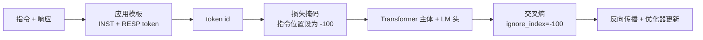
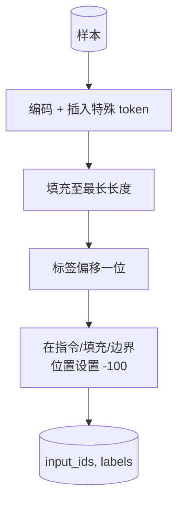
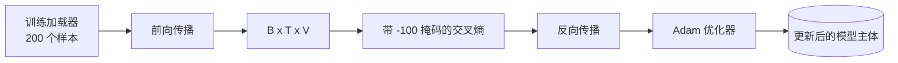

# 顶点课程 39：通过监督微调进行指令微调

> 预训练的基础模型可以续写序列，但无法遵循指令。监督微调是解决此问题的最小改动：向模型提供配对的指令和期望响应样本，训练模型主体预测响应 token。关键在于，你只希望损失函数计算响应部分，而非指令部分。本课程构建了一个 Alpaca 风格的 SFT 循环，使用自定义的 collate 函数通过 `ignore_index=-100` 屏蔽指令 token，在 200 个指令-响应对上训练，并使用精确匹配对保留集进行评估。

**类型：** 构建
**语言：** Python（torch, numpy）
**前置条件：** 第 19 阶段第 30-37 课（NLP LLM 方向：分词器、嵌入表、注意力模块、Transformer 主体、预训练循环、检查点保存、生成、困惑度）
**时间：** 约 90 分钟

## 学习目标

- 将配对的指令-响应数据格式化为带有明确边界 token 的单一因果序列。
- 构建一个 collate 函数，屏蔽指令 token，使交叉熵仅计算响应 token。
- 在 SFT 目标下训练一个小型 Transformer 主体，并观察评估指标的变化。
- 实现尊重响应起始边界的贪婪解码和温度采样生成。
- 对生成的补全结果计算保留集上的精确匹配。

## 问题

一个仅经过下一个 token 预测训练的基础模型完全不知道指令是什么。给它字符串 `"法国的首都是什么？"`，它可能会续写问题或编造一个新句子。模型拥有语言能力，但不了解格式约定。

SFT 的约定是一个字符串模板。每个训练样本变成一个包含三个区域的单一序列：

```text
<INST> 法国的首都是什么？ <RESP> 法国的首都是巴黎。
```

边界 token 是在训练时保留的特殊 token。模型学会 `<RESP>` 之后的所有内容都是响应，而响应才是被评估的部分。基础模型的下一个 token 预测目标仍然适用；只是它在一个每个样本都具有此形状的语料库上进行训练。

但有一个陷阱。如果你将整个序列送入普通的交叉熵损失，你就在训练模型同时预测指令 token。指令是给定的。你希望这些位置上的梯度为零。解决方案就是掩码。

## 概念


```mermaid
flowchart LR
  Pair[指令 + 响应] --> Tmpl[应用模板<br/>INST + RESP token]
  Tmpl --> Tokens[token id]
  Tokens --> Mask[损失掩码<br/>指令位置设为 -100]
  Mask --> Model[Transformer 主体 + LM 头]
  Model --> CE[交叉熵<br/>ignore_index=-100]
  CE --> Step[反向传播 + 优化器更新]
```

`ignore_index` 是 `torch.nn.functional.cross_entropy` 的一个特性。任何等于 `ignore_index` 的目标位置贡献的损失和梯度都为零。PyTorch 中的约定值是 `-100`。Collate 函数为每个样本构建两个张量：`input_ids`（完整序列）和 `labels`（`input_ids` 的副本，其中指令位置被覆盖为 `-100`）。

模型在前向传播期间看到整个序列；注意力可以关注指令部分。但损失只计算响应 token。这正是你想要的：以指令为条件，预测响应。

## 数据

200 个指令-响应对由 `main.py` 确定性地生成。它们涵盖六种任务类型：

- 事实性单轮问答（X 的首都）
- 算术
- 列表提取
- 一句话摘要
- 代码（打印、排序）
- 定义

每个任务都有一个模板化的指令和确定性的响应。这有意设计得相对简单。精确匹配是一种脆弱的指标，本课程使用的测试数据中正确答案是某个特定的字符串。真实的 SFT 数据集需要模糊指标；但原理是相同的。

数据划分为 160 个训练样本，40 个测试样本。测试集涵盖全部六种任务类型，以便报告每个类别的精确匹配结果。

## 分词与填充

分词器是字节级别的，带有三个保留的特殊 token：

- `INST_ID = 256`：标记指令区域的开始。
- `RESP_ID = 257`：标记指令与响应之间的边界。
- `PAD_ID = 258`：用于变长批次的填充。

序列格式为 `[INST] inst_bytes [RESP] resp_bytes [PAD]*`。Collate 函数的处理流程：

1. 对每个样本进行分词。
2. 将批次中的每个样本填充到该批次中最长序列的长度。
3. 构建 `labels` = 偏移一位后的 `input_ids`（因果 LM 目标），并执行以下操作：
   - 将指令区域替换为 `-100`。
   - 将填充区域替换为 `-100`。
   - 将 `RESP_ID` 边界位置本身替换为 `-100`（你不训练模型预测边界 token；模型预测的是边界之后的内容）。


```mermaid
flowchart TD
  Batch[(样本)] --> Tok[编码 + 插入特殊 token]
  Tok --> Pad[填充至最长长度]
  Pad --> Shift[标签偏移一位]
  Shift --> Mask[在指令/填充/边界<br/>位置设置 -100]
  Mask --> Out[(input_ids, labels)]
```

偏移是标准的因果技巧：`input_ids` 的位置 `i` 预测位置 `i+1`，因此 `labels[i] = input_ids[i+1]`（输入中丢弃最后一个位置，目标中丢弃第一个位置）。掩码在偏移之后应用，以落在正确的位置上。

## 训练


```mermaid
flowchart LR
  DL[训练加载器<br/>200 个样本] --> Fwd[前向传播]
  Fwd --> Logits[B x T x V]
  Logits --> Loss[带 -100 掩码的交叉熵]
  Loss --> Bwd[反向传播]
  Bwd --> Opt[Adam 优化器]
  Opt --> Body[(更新后的模型主体)]
```

训练循环是标准的 PyTorch SFT 循环。使用 Adam 优化器，学习率约在 3e-4 到 1e-3 之间，在此测试数据上训练十到二十个 epoch，不设学习率调度器。模型足够小（隐藏层维度 96，2 个模块，最大长度 64），可以在 CPU 上两分钟内收敛。

每五个 epoch，循环会在保留集上运行一次小型评估，并打印精确匹配分数。观察精确匹配从第一个 epoch 的 0.0 上升到第十五个 epoch 左右的 0.85 是本课程的关键收获：你可以看到模型同时学习格式和答案。

## 生成

在评估时，模型获得指令前缀 `[INST] inst_bytes [RESP]`，并生成 token，直到以下任一条件满足：

- 序列达到 `max_len`，或
- 模型产生一个特殊的停止启发式条件：连续两个句子结束字节（`.`、`!`、`?`）。

本课程提供了贪婪解码和可选的温度采样器。精确匹配使用贪婪解码，因为温度采样会使指标随机化。真实系统通常先采样，再进行模糊判断；该流水线在第 41 课中介绍。

## 精确匹配评估

精确匹配是最严格的文本指标。预测的响应字符串经过标准化处理（小写、去除空白、合并连续空格）后，与同样标准化后的参考响应进行比较。每个样本的指标结果为 1 或 0。总体结果为平均值。

真实的 SFT 流水线会以 token 级别的 F1 分数（第 41 课）和评判模型来补充精确匹配。精确匹配仍然有用，因为它不含糊：如果结果为 0.7，就意味着恰好 70% 的测试指令生成的响应与标准答案逐字符完全匹配。

## 你将构建的内容

实现包含一个 `main.py` 文件及其测试。

1. `InstructionTokenizer`：带有保留特殊 token 的字节级别编码器。可以编码指令前缀或完整的指令-响应对。
2. `make_dataset`：使用固定种子生成 200 个涵盖六种任务类型的样本对。
3. `SFTDataset`：每个样本返回 `(input_ids, labels)`，已准备好掩码。
4. `sft_collate`：动态填充，构建批次张量，在指令和填充位置设置 `-100`。
5. `TinyGPT`：Transformer 主体加上绑定的（或非绑定的）LM 头。
6. `train_sft`：SFT 循环，带有每个 epoch 的评估钩子。
7. `generate`：从前缀开始进行因果解码，支持贪婪或采样模式，带有停止启发式条件。
8. `exact_match`：标准化字符串比较，返回 `[0, 1]` 范围内的浮点数。
9. `run_demo`：构建数据，训练二十个 epoch，评估，打印每个类别的细分结果，成功时以零退出。

## 为什么掩码很重要

没有掩码时，损失会将指令 token 也作为目标。模型会学习预测指令。这是一个不同的目标，会导致模型在两个方面的表现变差。首先，模型容量被浪费在重构用户始终会提供的输入上。其次，响应部分的损失在梯度总和中所占比例更小，因为大多数批次中指令 token 的数量多于响应 token；优化器在你真正关心的部分上的有效学习率低于你的预期。掩码不是锦上添花，它就是目标本身。

## 拓展目标

- 添加学习率预热后接余弦衰减。SFT 对学习率比预训练更敏感。
- 添加每个 token 的损失记录，并绘制训练过程中的损失曲线。注意早期 epoch 的损失主要由模板 token（`<RESP>`、常见前缀）主导，后期 epoch 则由实际的答案 token 主导。
- 将评估扩展到 BLEU-1 或 chrF。精确匹配会低估那些产生同义表述但答案相同的模型。
- 添加包含多轮格式的对话模板，并在包含后续问题的测试数据上进行训练。

该实现为你提供了格式约定、掩码和训练循环。从基础模型到指令遵循者的目标变化，本质上就是一个 collate 函数的差别。
