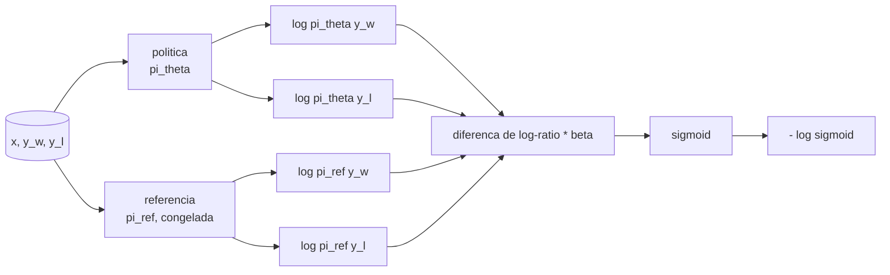
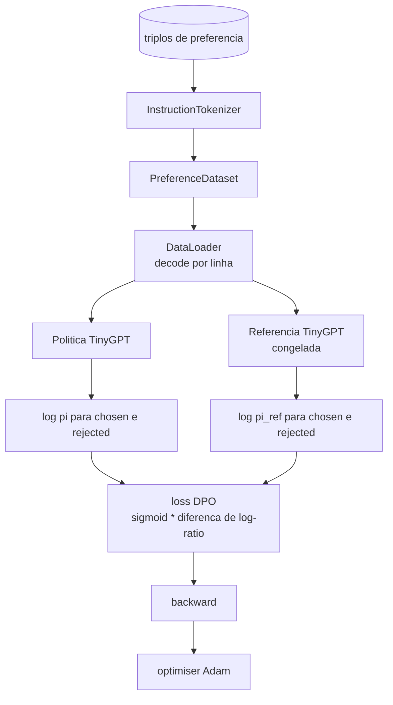

# Aula Capstone 40: Direct Preference Optimization do Zero

> Modelos de recompensa e PPO sao a stack classica de RLHF. DPO colapsa essa stack em uma loss supervisionada unica que ajusta uma politica diretamente contra pares de preferencia. Esta aula deriva a loss DPO a partir da identidade de diferenca de recompensa, entrega um modelo de referencia funcionando mais um modelo de politica, computa log-probabilidades por token, e treina um transformer pequeno em um fixture de preferencia com completions rejeitadas e aceitas. Os testes travam a matematica da loss e a direcao do gradiente para voce saber que a implementacao bate com o paper.

**Tipo:** Build
**Linguagens:** Python (torch, numpy)
**Prerequisitos:** Aulas 30-37 da Fase 19 (track NLP LLM: tokenizer, tabela de embedding, bloco de attention, corpo do transformer, loop de pre-treinamento, checkpoint, geracao, perplexidade)
**Tempo:** ~90 minutos

## Objetivos de Aprendizado

- Derivar a loss DPO como uma sigmoid sobre uma diferenca de log-ratio escalada e conectar com a recompensa implicita.
- Construir um par modelo de referencia + modelo de politica com referencia congelada e politica treinavel.
- Computar log-probabilidades a nivel de sequencia sob ambos os modelos, mascarando tokens do prompt.
- Treinar a politica em triplos `(prompt, chosen, rejected)` e ver a log-prob de chosen subir em relacao a rejected.
- Travamento de comportamento com testes na matematica da loss, sinal do gradiente, e invariancia da referencia.

## O Problema

Voce tem um modelo SFT. Ele segue instrucoes, mas suas saidas sao inconsistentes; algumas completions sao claras, outras sao verbosas ou erradas. Voce tambem tem um dataset pequeno de pares de preferencia: para o mesmo prompt, um humano marcou uma completion como chosen e outra como rejected.

A resposta classica de RLHF e um pipeline de dois estagios. Treinar um modelo de recompensa nas preferencias. Otimizar a politica contra a recompensa com PPO. Funciona mas e caro: dois modelos na memoria durante PPO, controle KL para manter a politica proxima da referencia, reward hacking quando o modelo de recompensa e fragil.

DPO substitui ambos os estagios com uma loss supervisionada unica. O modelo de recompensa nunca existe explicitamente. A politica e treinada diretamente nos pares de preferencia, com uma penalidade KL explicita em direcao a referencia SFT. Mesma solucao otima sob o modelo de preferencia Bradley-Terry, muito menos codigo.

## O Conceito

Comece pelo modelo Bradley-Terry. Dado um prompt `x` e duas completions `y_w` (chosen) e `y_l` (rejected), a probabilidade do humano preferir `y_w` e

```text
P(y_w > y_l | x) = sigmoid( r(x, y_w) - r(x, y_l) )
```

onde `r` e alguma funcao de recompensa latente. RLHF primeiro ajusta `r` a partir das preferencias, depois treina uma politica `pi` para maximizar `r` com uma ancora KL:

```text
max_pi   E_{x, y~pi} [ r(x, y) ] - beta * KL(pi || pi_ref)
```

A derivacao do DPO observa que a politica otima `pi*` sob este objetivo tem forma fechada em termos de `r`:

```text
pi*(y | x) = (1/Z(x)) * pi_ref(y | x) * exp( r(x, y) / beta )
```

Reorganizando para `r`:

```text
r(x, y) = beta * ( log pi*(y | x) - log pi_ref(y | x) ) + beta * log Z(x)
```

O termo `log Z(x)` e o mesmo para `y_w` e `y_l` (depende de `x`, nao de `y`), entao se cancela quando voce calcula a diferenca de preferencia:

```text
r(x, y_w) - r(x, y_l) = beta * ( log pi_theta(y_w|x) - log pi_ref(y_w|x)
                                - log pi_theta(y_l|x) + log pi_ref(y_l|x) )
```

Substitua na sigmoid de Bradley-Terry e pegue a negativa do log likelihood sobre os pares de preferencia:

```text
L_DPO(theta) = - E_{(x, y_w, y_l)} [
  log sigmoid( beta * ( log pi_theta(y_w|x) - log pi_ref(y_w|x)
                       - log pi_theta(y_l|x) + log pi_ref(y_l|x) ) )
]
```

Essa e a loss. E uma sigmoid sobre um escalar por exemplo, computada a partir de quatro log-probabilidades. Sem modelo de recompensa separado. Sem PPO. Sem termo KL na loss; a restricao KL esta entranhada na derivacao de forma fechada.



## O Sinal do Gradiente

Uma verificacao de sanidade util antes de qualquer execucao de treino. Pegue o gradiente em relacao a `log pi_theta(y_w | x)`:

```text
d L_DPO / d log pi_theta(y_w | x) = - beta * (1 - sigmoid(z))
```

onde `z` e o argumento da sigmoid. Isso e negativo para todo `z`, o que significa: aumentar a log-probabilidade da politica para a completion chosen diminui a loss. Simetricamente, o gradiente em relacao a `log pi_theta(y_l | x)` e positivo: aumentar a log-probabilidade da rejected aumenta a loss. O treinamento empurra a chosen para cima e a rejected para baixo. A referencia esta congelada; ela nao se move.

## Os Dados

Doze triplos de preferencia vem com a aula. Cada um e `(prompt, chosen, rejected)`. A completion chosen e curta e precisa. A rejected e verbosa, fora do topico, ou errada. Os pares cobrem as mesmas familias de tarefas da aula 39 (capital, aritmetica, lista) para que uma politica que comecou de uma base SFT tenha um ponto de partida razoavel.

O fixture e intencionalmente pequeno. DPO funciona com dezenas de milhares de pares em producao; aqui, o ponto e que a matematica da loss e o loop rodam de ponta a ponta em um dataset minusculo e o gap de log-prob chosen vs rejected cresce visivelmente.

## Invariancia da Referencia

Uma implementacao de DPO precisa lidar com o modelo de referencia cuidadosamente. A referencia e o modelo SFT congelado. Tres propriedades devem valer:

- Os parametros da referencia nunca recebem gradientes.
- As log-probabilidades da referencia nunca mudam entre epocas.
- A politica comeca com os mesmos pesos da referencia. (O `theta` otimo e a referencia mais um update aprendido; inicializar a politica como uma copia da referencia e o inicio bem-definido.)

A implementacao garante isso:

- Envolve a referencia em `torch.no_grad()` durante forward passes.
- Seta `requires_grad=False` em cada parametro da referencia.
- Constroi a politica via `policy.load_state_dict(reference.state_dict())` depois que a referencia esta pronta.

## Arquitetura



O modelo e o mesmo TinyGPT da aula 39 (decoder-only, causal, tokenizador de byte). A referencia e a politica compartilham a arquitetura; os pesos da politica derivam da referencia durante o treinamento enquanto a referencia fica fixa.

## O que voce vai construir

A implementacao e um `main.py` mais testes.

1. `InstructionTokenizer`: tokenizador de byte com eespecificaçãoiais `INST` e `RESP`. Mesma forma da aula 39.
2. `TinyGPT`: transformer decoder-only. Mesma forma da aula 39 para a aula ser autocontida mesmo se voce pulou a 39.
3. `make_preferences`: retorna doze triplos `(prompt, chosen, rejected)`.
4. `sequence_log_prob`: dado o modelo, um prefixo de prompt, e uma completion, retorna a soma das log-probabilidades de next-token sobre a completion (sem contribuicao de posicao do prompt).
5. `dpo_loss`: pega as quatro log-probabilidades e `beta`, retorna o tensor de loss por exemplo e o delta de recompensa implicita para log.
6. `train_dpo`: loop por epoca que computa log-probs de chosen e rejected sob politica e referencia, aplica a loss, e da o passo do Adam.
7. `evaluate_margins`: retorna a margem media chosen-rejected de log-probabilidade sob a politica em qualquer ponto.
8. `run_demo`: constroi referencia e politica de um pequeno pre-treino de aquecimento, copia pesos, treina por trinta passos, imprime a loss e margem por passo, e sai zero no sucesso.

## Por que DPO funciona

DPO e matematicamente equivalente a RLHF sob o modelo de preferencia Bradley-Terry, ate a parametrizacao da recompensa. A recompensa implicita `r(x, y) = beta * (log pi(y|x) - log pi_ref(y|x))` e identificavel a partir de preferencias ate uma funcao de `x`, que cancela na diferenca. A politica de forma fechada permite pular o modelo de recompensa explicito. A restricao KL e imposta estruturalmente: qualquer desvio de `pi` em relacao a `pi_ref` torna o log-ratio maior, e a sigmoid satura, o que amortigua o gradiente quando a politica se move longe demais. A referencia e sua rede de seguranca.

## Metas extras

- Adicionar uma normalizacao de comprimento na soma de log-probabilidade: dividir pelo comprimento da completion. Bias de comprimento e uma falha conhecida do DPO onde o modelo prefere preferencialmente completions mais curtas porque suas log-probabilidades sao maiores em termos absolutos.
- Adicionar a variante IPO da loss: substituir sigmoid + log por `(z - 1)^2`. Comparar convergencia no fixture.
- Adicionar um parametro de label-smoothing que interpola entre o label hard chosen-rejected e um uniforme 0.5.
- Substituir a referencia por um modelo menor e mais barato (estilo de knowledge distillation).

A implementacao te da a loss, a invariancia da referencia, e o loop de treinamento. A matematica e a aula. O codigo torna a matematica concreta.
