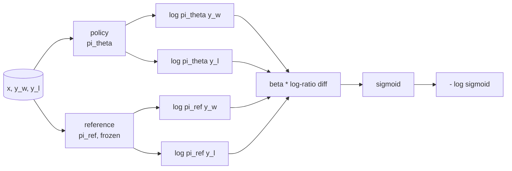
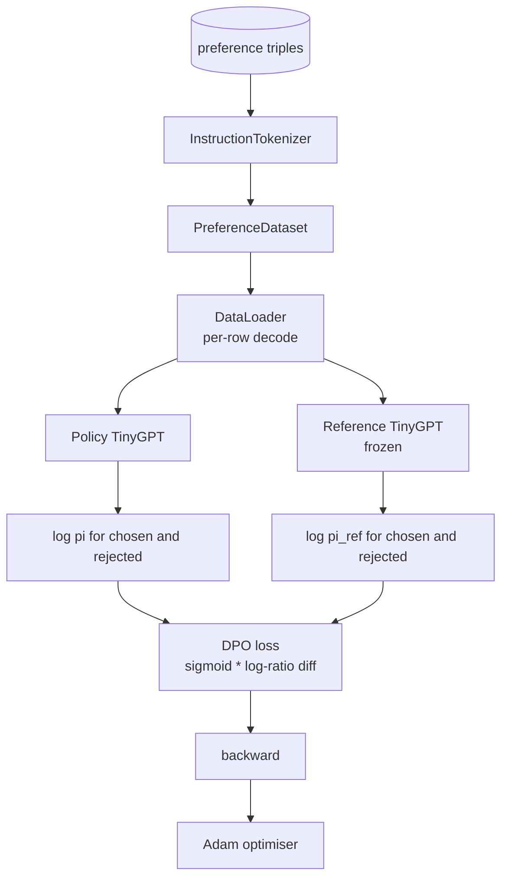

# Bitirme Dersi 40: Sıfırdan Doğrudan Tercih Optimizasyonu

> Ödül modelleri ve PPO klasik RLHF yığınıdır. DPO, bu yığını doğrudan tercih çiftlerine karşı bir politikaya uyan tek bir denetlenen kayıp halinde daraltır. Bu ders, DPO kaybını ödül farkı kimliğinden türetir, çalışan bir referans modeli artı politika modeli sunar, token günlük olasılıklarını hesaplar ve seçilen ve reddedilen tamamlamaların tercih fikstürü üzerinde küçük bir transformer eğitir. Testler kayıp matematiğini ve gradient yönünü sabitler, böylece uygulamanın kağıtla eşleştiğini bilirsiniz.

**Tür:** Yapım
**Diller:** Python (meşale, numpy)
**Önkoşullar:** Aşama 19 dersleri 30-37 (NLP LLM yolu: tokenizer, embedding tablo, dikkat bloğu, transformer gövde, eğitim öncesi döngü, kontrol noktası oluşturma, oluşturma, şaşkınlık)
**Süre:** ~90 dakika

## Öğrenme Hedefleri

- Ölçeklendirilmiş bir log-oran farkı üzerinden DPO kaybını bir sigmoid olarak türetin ve bunu örtülü ödüle bağlayın.
- Dondurulmuş bir referans ve eğitilebilir bir politika ile bir referans modeli + politika modeli çifti oluşturun.
- prompt token'lari maskeleyerek her iki model altında sıra düzeyindeki log olasılıklarını hesaplayın.
- Politikayı `(prompt, chosen, rejected)` üçlüsü üzerinde eğitin ve seçilen günlük olasılığının reddedilmeye göre artışını izleyin.
- Kayıp matematiği, gradient işareti ve referans değişmezliği testleriyle davranışı sabitleyin.

## Sorun

Bir SFT modeliniz var. Talimatları takip ediyor ancak çıktıları eşit değil; bazı tamamlamalar açık, bazıları ise uzun ve yanlış. Ayrıca küçük bir dataset tercih çiftiniz var: aynı prompt için, bir insan bir tamamlamayı seçilmiş, diğerini reddedilmiş olarak işaretledi.

Klasik RLHF cevabı iki aşamalı bir boru hattıdır. Tercihlere ilişkin bir ödül modeli eğitin. PPO ile politikayı ödüle göre optimize edin. Bu işe yarar ancak pahalıdır: PPO sırasında bellekte iki model, politikayı referansa yakın tutmak için KL kontrolü, ödül modeli kırılgan olduğunda ödül hackleme.

DPO, her iki aşamayı da tek bir denetimli kayıpla değiştirir. Ödül modeli hiçbir zaman açıkça mevcut değildir. Politika, SFT referansına yönelik açık bir KL cezasıyla doğrudan tercih çiftleri üzerinde eğitilir. Bradley-Terry tercih modelinde aynı optimal çözüm, çok daha az kod.

## Konsept

Bradley-Terry modelinden başlayın. Bir prompt `x` ve iki tamamlama `y_w` (seçilen) ve `y_l` (reddedildi) verildiğinde, insanın `y_w` 'yi tercih etme olasılığı şöyledir:

```text
P(y_w > y_l | x) = sigmoid( r(x, y_w) - r(x, y_l) )
```

burada `r` bazı gizli ödül fonksiyonlarıdır. RLHF önce tercihlerden `r` 'ye uyar, ardından bir KL bağlantısıyla `r` 'yi maksimuma çıkarmak için bir `pi` politikasını eğitir:

```text
max_pi   E_{x, y~pi} [ r(x, y) ] - beta * KL(pi || pi_ref)
```

DPO türetmesi, bu hedef kapsamındaki optimal politika `pi*` 'nın `r` açısından kapalı bir forma sahip olduğunu gözlemler:

```text
pi*(y | x) = (1/Z(x)) * pi_ref(y | x) * exp( r(x, y) / beta )
```

`r` için yeniden düzenleyin:

```text
r(x, y) = beta * ( log pi*(y | x) - log pi_ref(y | x) ) + beta * log Z(x)
```

`log Z(x)` terimi hem `y_w` hem de `y_l` için aynıdır ( `y`'ye değil, `x`'ye bağlıdır), dolayısıyla tercih farkını hesapladığınızda iptal olur:

```text
r(x, y_w) - r(x, y_l) = beta * ( log pi_theta(y_w|x) - log pi_ref(y_w|x)
                                - log pi_theta(y_l|x) + log pi_ref(y_l|x) )
```

Bradley-Terry sigmoidini yerine koyun ve tercih çiftleri üzerinden negatif log olasılığını alın:

```text
L_DPO(theta) = - E_{(x, y_w, y_l)} [
  log sigmoid( beta * ( log pi_theta(y_w|x) - log pi_ref(y_w|x)
                       - log pi_theta(y_l|x) + log pi_ref(y_l|x) ) )
]
```

Bu kayıptır. Dört log olasılığından hesaplanan, örnek başına tek bir skaler üzerinde bir sigmoiddir. Ayrı bir ödül modeli yok. PPO yok. Zararda KL terimi yok; KL kısıtlaması kapalı form türetmesine eklenir.



## Gradient İşareti

Herhangi bir antrenmandan önce faydalı bir akıl sağlığı kontrolü. `log pi_theta(y_w | x)`'ya göre gradient'yi alın:

```text
d L_DPO / d log pi_theta(y_w | x) = - beta * (1 - sigmoid(z))
```

burada `z` sigmoidin argümanıdır. Bu, tüm `z` için negatiftir; bu şu anlama gelir: politikanın seçilen tamamlamaya ilişkin günlük olasılığını artırmak, kaybı azaltır. Simetrik olarak, `log pi_theta(y_l | x)` 'ye göre gradient pozitiftir: reddedilen log olasılığının artması kaybı artırır. Eğitim seçilenleri yukarıya, reddedilenleri ise aşağıya iter. Referans donduruldu; hareket etmiyor.

## Veri

On iki tercih üçlüsü dersle birlikte gönderilir. Her biri `(prompt, chosen, rejected)`. Seçilen tamamlama kısa ve kesindir. Reddedilen uzun uzun, konu dışı veya yanlıştır. Çiftler ders 39'dakiyle aynı görev ailelerini (sermaye, aritmetik, liste) kapsar, dolayısıyla SFT tabanından başlayan bir politikanın makul bir başlangıç ​​noktası vardır.

Fikstür kasıtlı olarak küçüktür. DPO, üretimde onbinlerce çift üzerinde çalışıyor; Burada önemli olan, kayıp matematiği ve döngünün küçük bir dataset üzerinde uçtan uca çalışması ve seçilen-reddedilen log-prob boşluğunun gözle görülür şekilde büyümesidir.

## Referans Değişmezliği

Bir DPO uygulamasının referans modelini dikkatli bir şekilde ele alması gerekir. Referans, yerinde dondurulmuş SFT modelidir. Üç özelliğin geçerli olması gerekir:

- Referans parametreleri hiçbir zaman gradient'ları almaz.
- Referans log olasılıkları çağlar arasında asla değişmez.
- Politika referansla aynı ağırlıklardan başlar. (Optimal `theta` referans artı öğrenilmiş güncellemedir; politikanın referansın bir kopyası olarak başlatılması iyi tanımlanmış başlangıçtır.)

Uygulama bunları şu şekilde zorlar:

- İleri geçişler sırasında referansın `torch.no_grad()` içine sarılması.
- Her referans parametresinde `requires_grad=False` ayarı.
- Referans oluşturulduktan sonra politikanın `policy.load_state_dict(reference.state_dict())` aracılığıyla oluşturulması.

## Mimarlık



Model, 39. derste kullanılan TinyGPT'nin aynısıdır (yalnızca kod çözücü, nedensel, bayt tokeniser). Referans ve politika mimariyi paylaşır; Referans sabit kalırken politikanın ağırlıkları eğitim altındaki referanstan sapar.

## Ne inşa edeceksiniz

Uygulama bir `main.py` artı testtir.

1. `InstructionTokenizer`: `INST` ve `RESP` özel ürünleriyle bayt tokeniser. 39. dersle aynı şekil.
2. `TinyGPT`: yalnızca kod çözücü transformer. 39. dersle aynı şekilde olduğundan 39. dersi atlasanız bile ders kendi kendine yetecektir.
3. `make_preferences`: on iki `(prompt, chosen, rejected)` üçlüsünü döndürür.
4. `sequence_log_prob`: model, bir prompt öneki ve bir tamamlama verildiğinde, tamamlama boyunca sonraki-token log olasılıklarının toplamını döndürür (prompt-konum katkısı yok).
5. `dpo_loss`: dört günlük olasılığını alır ve `beta`, örnek başına kayıp tensörünü ve günlük kaydı için örtülü ödül deltasını döndürür.
6. `train_dpo`: politika ve referans kapsamında seçilen ve reddedilen günlük olasılıklarını hesaplayan, kaybı uygulayan ve Adam'a adım atan dönem başına döngü.
7. `evaluate_margins`: herhangi bir noktada politika kapsamında ortalama seçilen-reddedilen günlük olasılık marjını döndürür.
8. `run_demo`: küçük bir ısınma ön antrenmanından referans ve politika oluşturur, ağırlıkları kopyalar, otuz adımlık antrenman yapar, adım başına kayıp ve marjı yazdırır ve başarı durumunda sıfırdan çıkar.

## DPO neden çalışıyor?

DPO, ödülün parametrelendirilmesine kadar Bradley-Terry tercih modeli kapsamında matematiksel olarak RLHF'ye eşdeğerdir. Örtülü ödül `r(x, y) = beta * (log pi(y|x) - log pi_ref(y|x))` , tercihlerden farkı iptal eden `x` fonksiyonuna kadar tanımlanabilir. Kapalı form politikası, açık ödül modelini atlamanıza olanak tanır. KL kısıtlaması yapısal olarak uygulanır: `pi` 'nin `pi_ref` 'tan herhangi bir sapması log-oranını büyütür ve sigmoid doyuma ulaşır, bu da politika çok ileri gittiğinde gradient'yi sönümler. Referans güvenlik ağınızdır.

## Hedefleri genişletme

- Log-olasılık toplamına bir uzunluk normalizasyonu ekleyin: tamamlama uzunluğuna bölün. Uzunluk yanlılığı, log olasılıkları mutlak anlamda daha büyük olduğundan modelin tercihen daha kısa tamamlamaları seçtiği bilinen bir DPO başarısızlık modudur.
- Kaybın halka arz versiyonunu ekleyin: sigmoid + log'u `(z - 1)^2` ile değiştirin. Fikstürdeki yakınsamayı karşılaştırın.
- Zor seçilen reddedilen etiket ile tek tip 0,5 arasında enterpolasyon yapan bir etiket yumuşatma parametresi ekleyin.
- Referansı daha küçük ve daha ucuz bir modelle değiştirin (bilgi damıtma aroması).

Uygulama size kaybı, referans değişmezliğini ve eğitim döngüsünü verir. Matematik derstir. Kod, matematiği somut hale getirir.
