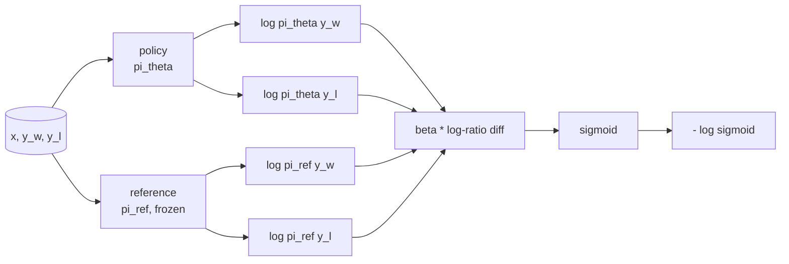
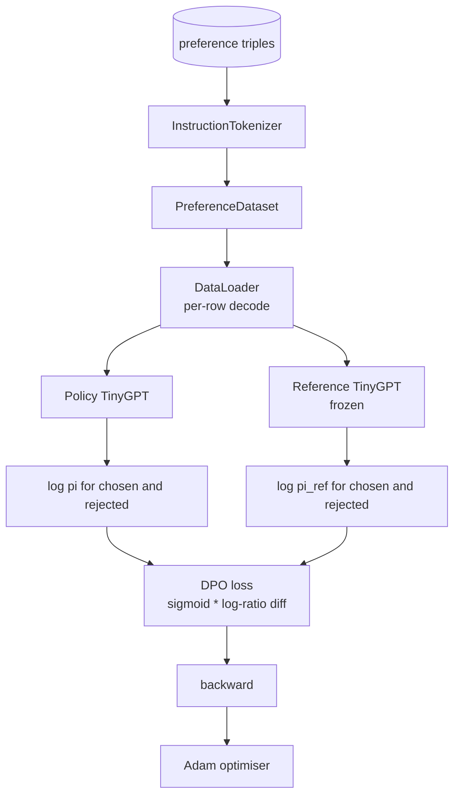

# 40 · 从零实现直接偏好优化（DPO）

> 奖励模型加 PPO 是经典的 RLHF 技术栈。DPO 将其压缩为单个监督损失函数，直接用偏好对来拟合策略。本课从奖励差值恒等式推导 DPO 损失，构建可用的参考模型与策略模型，计算逐 Token 的对数概率，并在偏好固定数据集上训练一个微型 Transformer。测试会锁定损失数学与梯度方向，确保实现与论文一致。

**类型：**构建
**语言：**Python（torch、numpy）
**前置：**第 19 阶段第 30-37 课（NLP LLM 路线：tokenizer、嵌入表、注意力块、Transformer 主体、预训练循环、检查点、生成、困惑度）
**时长：**约 90 分钟

## 学习目标

- 推导 DPO 损失——将其作为缩放后对数比值差上的 Sigmoid，并将其与隐式奖励联系起来。
- 构建一个参考模型（reference model）加策略模型（policy model）的组合：参考模型冻结，策略模型可训练。
- 在两个模型下计算序列级对数概率，并掩码掉提示（prompt）Token。
- 在 `(prompt, chosen, rejected)` 三元组上训练策略，观察"chosen"对数概率相对于"rejected"如何上升。
- 通过损失数学、梯度符号和参考不变性的测试来锁定行为。

## 问题所在

假设你有一个 SFT 模型。它能遵循指令，但其输出质量参差不齐——有些补全清晰准确，有些则啰嗦或错误。同时你手头有一套小规模的偏好对数据集：对于同一个提示，人类标注将某个补全标记为"chosen"（优选），另一个标记为"rejected"（劣选）。

经典 RLHF 的解决方案是一个两阶段流水线。先在偏好数据上训练一个奖励模型，再用 PPO 让策略针对奖励进行优化。这确实可行，但成本高昂：PPO 过程中需要同时驻留两个模型，需要通过 KL 控制来保持策略接近参考模型，奖励模型脆弱时还会出现奖励破解（reward hacking）。

DPO 用单个监督损失函数取代了这两个阶段。奖励模型从未被显式构建。策略直接针对偏好对进行训练，并带有对 SFT 参考模型的显式 KL 惩罚。在 Bradley-Terry 偏好模型下最优解相同，而代码量少得多。

## 核心概念

从 Bradley-Terry 偏好模型出发。给定提示 `x` 和两个补全 `y_w`（chosen）与 `y_l`（rejected），人类偏好 `y_w` 的概率为：

```text
P(y_w > y_l | x) = sigmoid( r(x, y_w) - r(x, y_l) )
```

其中 `r` 是某个隐式的奖励函数。RLHF 首先从偏好中拟合 `r`，再训练策略 `pi` 以最大化 `r`，同时带有一个 KL 锚点：

```text
max_pi   E_{x, y~pi} [ r(x, y) ] - beta * KL(pi || pi_ref)
```

DPO 推导的关键观察是：在该目标下，最优策略 `pi*` 可以用 `r` 写成闭式解：

```text
pi*(y | x) = (1/Z(x)) * pi_ref(y | x) * exp( r(x, y) / beta )
```

将其重新整理，解出 `r`：

```text
r(x, y) = beta * ( log pi*(y | x) - log pi_ref(y | x) ) + beta * log Z(x)
```

`log Z(x)` 项对 `y_w` 和 `y_l` 都相同（它依赖于 `x` 而非 `y`），因此在计算偏好差值时互相抵消：

```text
r(x, y_w) - r(x, y_l) = beta * ( log pi_theta(y_w|x) - log pi_ref(y_w|x)
                                - log pi_theta(y_l|x) + log pi_ref(y_l|x) )
```

将其代入 Bradley-Terry 的 Sigmoid，并针对偏好对取负对数似然：

```text
L_DPO(theta) = - E_{(x, y_w, y_l)} [
  log sigmoid( beta * ( log pi_theta(y_w|x) - log pi_ref(y_w|x)
                       - log pi_theta(y_l|x) + log pi_ref(y_l|x) ) )
]
```

这就是损失函数。它是每样本单个标量上的 Sigmoid，由四个对数概率计算得出。无需单独的奖励模型，无需 PPO，损失函数中也无需显式的 KL 项——KL 约束已内化在闭式推导之中。



## 梯度的符号

这是每次训练之前都非常有用的健全性检查。对 `log pi_theta(y_w | x)` 求梯度：

```text
d L_DPO / d log pi_theta(y_w | x) = - beta * (1 - sigmoid(z))
```

其中 `z` 是传入 Sigmoid 的参数。对于任意 `z` 该值均为负数，这意味着：增大策略对 chosen 补全的对数概率会降低损失。对称地，对 `log pi_theta(y_l | x)` 的梯度为正：增大 rejected 的对数概率会升高损失。训练将 chosen 往上推、将 rejected 往下推。参考模型被冻结，不会移动。

## 数据

本课附带 12 个偏好三元组。每个为 `(prompt, chosen, rejected)`。chosen 补全简短而精确。rejected 则是啰嗦、偏题或错误的。这些偏好对覆盖与第 39 课相同的问题类型（大写转换、算术、列表），因此从 SFT 基础出发的策略有一个合理的起点。

该固定数据集故意设计得很小。生产环境中 DPO 需要数万对偏好数据才能发挥作用；本课的重点在于损失数学和训练循环能够在微型数据集上端到端跑通，并且 chosen 与 rejected 之间的对数概率差距能肉眼可见地拉大。

## 参考不变性

DPO 实现需要小心处理参考模型。参考模型是被冻结在原地的 SFT 模型。必须满足以下三条性质：

- 参考模型的参数永远不会接收到梯度。
- 参考模型的对数概率在跨 Epoch 间永不改变。
- 策略从与参考模型相同的权重初始化。（最优 `theta` 是参考模型加上一个学习到的更新；将策略初始化为参考模型的副本是一个定义良好的起点。）

本实现通过以下方式强制满足上述性质：

- 在前向传播期间将参考模型包裹在 `torch.no_grad()` 中。
- 对参考模型的每个参数设置 `requires_grad=False`。
- 在构建参考模型后，通过 `policy.load_state_dict(reference.state_dict())` 来构造策略。

## 架构



模型与第 39 课中使用的 TinyGPT 相同（纯解码器、因果注意力、字节级分词器）。参考模型与策略模型共享架构；策略的权重在训练中逐渐偏离参考模型，而参考模型保持不变。

## 你将构建的内容

本实现为一个 `main.py` 文件加上若干测试。

1. `InstructionTokenizer`：字节级分词器，带有 `INST` 和 `RESP` 特殊 Token。形态与第 39 课相同。
2. `TinyGPT`：纯解码器 Transformer。形态与第 39 课相同，因此即使你跳过了第 39 课，本课也是自包含的。
3. `make_preferences`：返回 12 个 `(prompt, chosen, rejected)` 三元组。
4. `sequence_log_prob`：给定模型、提示前缀和补全文本，返回补全部分上逐 Token 对数概率之和（不包含提示位置的贡献）。
5. `dpo_loss`：接收四个对数概率和 `beta`，返回每样本的损失张量以及用于日志记录的隐式奖励差值（reward delta）。
6. `train_dpo`：逐 Epoch 循环——在策略和参考模型下计算 chosen 和 rejected 的对数概率，应用损失函数，并执行 Adam 优化步。
7. `evaluate_margins`：返回任意时刻策略下 chosen 减 rejected 对数概率差距的均值。
8. `run_demo`：通过一次小型预热预训练构建参考模型和策略模型，复制权重，训练 30 步，打印每步的损失和差距，成功时返回退出码 0。

## DPO 为何有效

在 Bradley-Terry 偏好模型下，DPO 在数学上等价于 RLHF，等价范围涵盖奖励的参数化。隐式奖励 `r(x, y) = beta * (log pi(y|x) - log pi_ref(y|x))` 可以从偏好中识别出来，误差仅在依赖于 `x` 的某个函数以内，而该函数在差值中抵消。闭式策略让你可以跳过显式奖励模型。KL 约束被结构性地执行：`pi` 相对于 `pi_ref` 的任何偏差都会使对数比值变大，Sigmoid 趋于饱和，从而当策略偏离过远时抑制梯度。参考模型就是你的安全网。

## 延伸目标

- 在对数概率求和中引入长度归一化：除以补全文本的长度。长度偏差是 DPO 的一个已知失效模式——模型会倾向于选择更短的补全，因为短补全的对数概率在绝对值上更大。
- 添加 IPO（Identity Preference Optimization）变体损失函数：将 Sigmoid + log 替换为 `(z - 1)^2`。在固定数据集上比较收敛行为。
- 添加标签平滑（label-smoothing）参数，在硬 chosen-rejected 标签与均匀分布 0.5 之间进行插值。
- 用一个更小、更廉价的模型替换参考模型（知识蒸馏风格）。

本实现为你提供了损失函数、参考不变性和训练循环。数学是这节课的核心。代码让数学变得具体。
