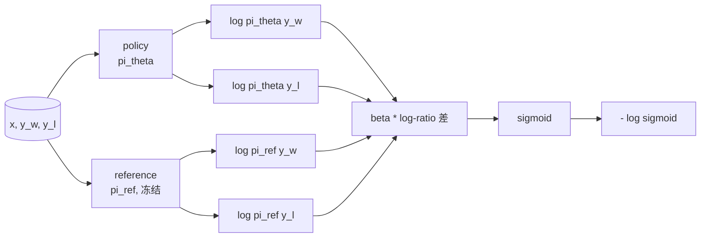
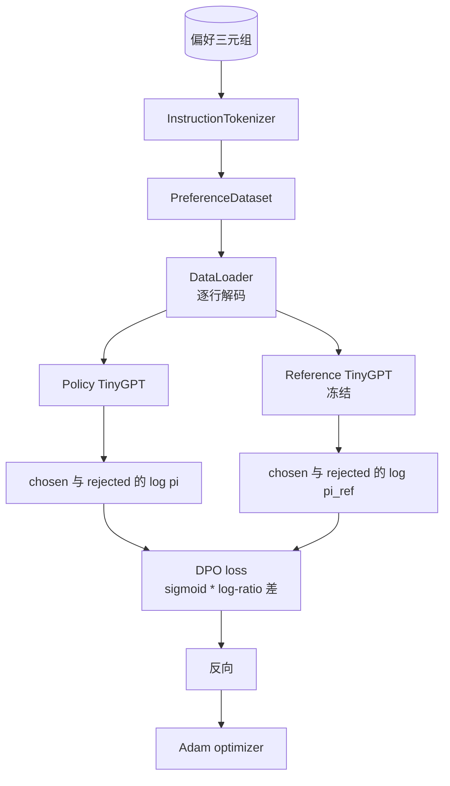

# 毕业课 40：从零实现 Direct Preference Optimization（DPO）

> 译注：本文译自同目录 [`en.md`](./en.md)。术语遵循仓根 [TRANSLATION_GUIDE.md](../../../../TRANSLATION_GUIDE.md)。

> Reward model（奖励模型）加 PPO 是经典的 RLHF 技术栈。DPO 把这套栈坍缩成一个监督式损失，直接用 preference pair（偏好对）拟合 policy（策略）。本课从 reward 差值恒等式推导 DPO loss，搭一份能跑的 reference model（参考模型）加 policy model（策略模型），按 token 计算 log-probability（对数概率），并在一份 chosen / rejected（被选 / 被拒）补全的偏好 fixture 上训练一个迷你 transformer。测试钉死 loss 数学和梯度方向，让你确认实现和论文一致。

**Type:** Build
**Languages:** Python (torch, numpy)
**Prerequisites:**（前置）Phase 19 第 30-37 课（NLP LLM 主线：tokenizer、embedding 表、attention 模块、transformer 主体、预训练循环、checkpoint、生成、困惑度）
**Time:** ~90 分钟

## 学习目标（Learning Objectives）

- 把 DPO loss 推导为「带尺度的对数比差」的 sigmoid，并把它和隐式 reward 联系起来。
- 搭一对 reference model + policy model：reference 冻结，policy 可训练。
- 在两个模型下计算序列级 log-probability，并对 prompt token 做 mask。
- 在 `(prompt, chosen, rejected)` 三元组上训练 policy，观察 chosen 的 log-prob 相对 rejected 抬升。
- 用测试钉死 loss 数学、梯度符号和 reference 的不变性。

## 问题（The Problem）

你已经有一个 SFT 模型。它能跟随指令，但输出参差不齐：有些补全干净利落，有些啰嗦或者干脆错误。你还有一份小的 preference pair 数据集：对同一个 prompt，人类标注了一个 chosen 补全和一个 rejected 补全。

经典的 RLHF 答案是两阶段流水线：先在偏好数据上训一个 reward model；再用 PPO 让 policy 去最大化这个 reward。能用，但贵：PPO 时内存里要放两个模型，要做 KL 控制把 policy 拉回 reference 附近，reward model 一脆就会被 reward hacking。

DPO 把这两阶段塞进一个监督 loss。Reward model 不再以显式形式存在。Policy 直接在偏好对上训，并通过对 SFT reference 的显式 KL 惩罚做约束。在 Bradley-Terry 偏好模型下两者最优解一致，但代码量少得多。

## 概念（The Concept）

从 Bradley-Terry 模型出发。给一个 prompt `x` 和两个补全 `y_w`（chosen）和 `y_l`（rejected），人类偏好 `y_w` 的概率是

```text
P(y_w > y_l | x) = sigmoid( r(x, y_w) - r(x, y_l) )
```

其中 `r` 是某个潜在的 reward 函数。RLHF 先从偏好里拟合 `r`，再训 policy `pi` 去最大化 `r`，加上 KL 锚：

```text
max_pi   E_{x, y~pi} [ r(x, y) ] - beta * KL(pi || pi_ref)
```

DPO 的推导观察到：在这个目标下，最优 policy `pi*` 用 `r` 写出来有闭式解：

```text
pi*(y | x) = (1/Z(x)) * pi_ref(y | x) * exp( r(x, y) / beta )
```

反解出 `r`：

```text
r(x, y) = beta * ( log pi*(y | x) - log pi_ref(y | x) ) + beta * log Z(x)
```

`log Z(x)` 项对 `y_w` 和 `y_l` 是一样的（它依赖 `x`，不依赖 `y`），算偏好差时会抵消：

```text
r(x, y_w) - r(x, y_l) = beta * ( log pi_theta(y_w|x) - log pi_ref(y_w|x)
                                - log pi_theta(y_l|x) + log pi_ref(y_l|x) )
```

代回 Bradley-Terry sigmoid，对偏好对取负对数似然：

```text
L_DPO(theta) = - E_{(x, y_w, y_l)} [
  log sigmoid( beta * ( log pi_theta(y_w|x) - log pi_ref(y_w|x)
                       - log pi_theta(y_l|x) + log pi_ref(y_l|x) ) )
]
```

这就是 loss。每个样本一个标量，sigmoid 套在四个 log-probability 上算出来的差。没有独立的 reward model，没有 PPO，loss 里也没有 KL 项；KL 约束已经被闭式推导烤进去了。



## 梯度的符号（The Sign of the Gradient）

任何训练前都该做的健全性检查。对 `log pi_theta(y_w | x)` 求梯度：

```text
d L_DPO / d log pi_theta(y_w | x) = - beta * (1 - sigmoid(z))
```

其中 `z` 是 sigmoid 的参数。这对所有 `z` 都是负的，意思是：抬高 policy 在 chosen 上的 log-probability 会让 loss 下降。对称地，对 `log pi_theta(y_l | x)` 的梯度是正的：抬高 rejected 的 log-probability 会让 loss 上升。训练把 chosen 推上去、rejected 压下来。Reference 是冻结的，不动。

## 数据（The Data）

本课自带十二个偏好三元组。每个都是 `(prompt, chosen, rejected)`。Chosen 短而准。Rejected 啰嗦、跑题或者错。这些对覆盖第 39 课同样的任务族（首都、算术、列表），从而让一个从 SFT base 起步的 policy 有合理的起点。

Fixture 故意做得很小。生产环境下 DPO 跑在数万对上；这里的重点是 loss 数学和循环能在小数据上端到端跑通，并且 chosen 对 rejected 的 log-prob 差能肉眼看到地拉开。

## Reference 不变性（Reference Invariance）

DPO 实现必须小心处理 reference model。Reference 就是冻结在原地的 SFT 模型。三条性质要满足：

- Reference 参数永远不接收梯度。
- Reference 的 log-probability 在 epoch 之间不变。
- Policy 从和 reference 一样的权重起步。（最优 `theta` 是 reference 加上一个学到的更新；把 policy 初始化为 reference 的副本是定义良好的起点。）

实现里这样保证：

- Reference 的前向传播套在 `torch.no_grad()` 里。
- Reference 的每个参数都设 `requires_grad=False`。
- 构造完 reference 之后用 `policy.load_state_dict(reference.state_dict())` 来初始化 policy。

## 架构（Architecture）



模型沿用第 39 课的 TinyGPT（decoder-only、causal、byte tokenizer）。Reference 和 policy 共用架构；训练中 policy 的权重从 reference 漂走，而 reference 保持不动。

## 你将构建什么（What you will build）

实现就是一个 `main.py` 加上测试。

1. `InstructionTokenizer`：带 `INST` 和 `RESP` 特殊 token 的 byte tokenizer。形状和第 39 课一致。
2. `TinyGPT`：decoder-only transformer。形状和第 39 课一致，所以即便你跳过了第 39 课，本课也能自洽。
3. `make_preferences`：返回十二个 `(prompt, chosen, rejected)` 三元组。
4. `sequence_log_prob`：给定模型、prompt 前缀和补全，返回补全位置上 next-token log-probability 的和（不算 prompt 位置上的贡献）。
5. `dpo_loss`：吃四个 log-probability 和 `beta`，返回每样本 loss 张量和用于日志的 implicit reward delta。
6. `train_dpo`：每轮 epoch 在 policy 和 reference 下算 chosen 和 rejected 的 log-prob，套 loss，跑 Adam 一步。
7. `evaluate_margins`：返回任意时点 policy 下 chosen-rejected log-probability 的平均 margin。
8. `run_demo`：从一个小热身预训练里搭出 reference 和 policy，复制权重，训三十步，打印每步的 loss 和 margin，成功则以零状态退出。

## DPO 为什么有效（Why DPO works）

在 Bradley-Terry 偏好模型下，DPO 在数学上和 RLHF 等价（差异只在 reward 的参数化）。隐式 reward `r(x, y) = beta * (log pi(y|x) - log pi_ref(y|x))` 从偏好里只能识别到「与一个仅依赖 `x` 的函数差一项」的程度，而这一项在差值里抵消。闭式 policy 解让你能跳过显式 reward model。KL 约束以结构方式被强制：`pi` 一旦偏离 `pi_ref`，对数比就变大、sigmoid 饱和，policy 走太远时梯度就被衰减。Reference 是你的安全网。

## 进阶目标（Stretch goals）

- 给 log-probability 的求和加一个长度归一化：除以补全长度。长度偏置（length bias）是 DPO 一个已知的失败模式：模型会偏好更短的补全，因为它们的 log-probability 在绝对值上更大。
- 加入 loss 的 IPO 变体：把 sigmoid + log 换成 `(z - 1)^2`。在 fixture 上对比收敛性。
- 加一个 label-smoothing 参数，在硬的 chosen-rejected 标签和均匀的 0.5 之间插值。
- 把 reference 换成一个更小更便宜的模型（蒸馏风味）。

实现给你 loss、reference 不变性和训练循环。数学才是这一课。代码让数学落地。
