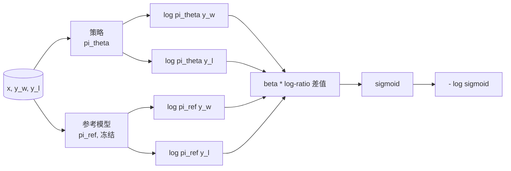
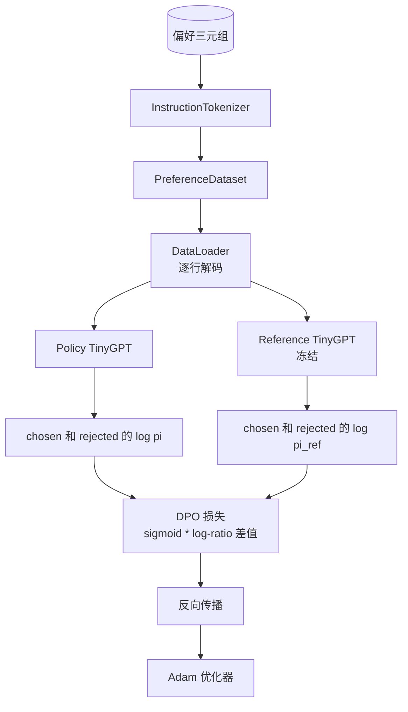

# 毕业设计第 40 课：从零实现直接偏好优化（DPO）

> 奖励模型和 PPO 是经典的 RLHF 技术栈。DPO 将这一技术栈压缩为单一的监督损失函数，直接根据偏好对来拟合策略。本课从奖励差值恒等式推导 DPO 损失，构建一个冻结的参考模型加一个可训练的策略模型，计算逐 token 的对数概率，并在一个包含 chosen 和 rejected 完成结果的偏好固定数据集上训练一个小型 transformer。测试验证了损失数学和梯度方向，确保实现与论文一致。

**类型：** 构建  
**语言：** Python（torch、numpy）  
**前置条件：** 第 19 阶段第 30–37 课（NLP LLM 路线：分词器、嵌入表、注意力模块、transformer 主体、预训练循环、检查点保存、文本生成、困惑度）  
**时间：** 约 90 分钟

## 学习目标

- 将 DPO 损失推导为经过缩放的 log-ratio 差值的 sigmoid，并将其与隐式奖励联系起来。
- 构建参考模型 + 策略模型对，其中参考模型冻结，策略模型可训练。
- 计算两个模型下的序列级对数概率，并掩码掉 prompt 部分的 token。
- 在 `(prompt, chosen, rejected)` 三元组上训练策略模型，观察 chosen 相对于 rejected 的对数概率上升。
- 通过测试验证损失数学、梯度符号和参考模型不变性。

## 问题

你有一个 SFT 模型。它能遵循指令，但输出参差不齐：有些完成结果清晰准确，有些则冗长或错误。你还有一个小型的偏好对数据集：对于同一个 prompt，人工标注者将其中一个完成结果标记为 chosen（偏好），另一个标记为 rejected（拒绝）。

经典的 RLHF 方案是一个两阶段流水线：先在偏好数据上训练一个奖励模型，再通过 PPO 优化策略以最大化奖励。这种方法有效但代价高昂：PPO 期间需要在内存中保留两个模型，需要 KL 控制来使策略贴近参考模型，并且当奖励模型脆弱时可能出现奖励欺骗（reward hacking）。

DPO 用一个单一的监督损失替代了这两个阶段。奖励模型从未显式存在。策略直接在偏好对上训练，同时通过显式的 KL 惩罚项向 SFT 参考模型靠拢。在 Bradley-Terry 偏好模型下，两者能达到相同的最优解，但代码量少得多。

## 概念

从 Bradley-Terry 模型出发。给定一个 prompt `x` 和两个完成结果 `y_w`（chosen）和 `y_l`（rejected），人工标注者偏好 `y_w` 的概率为：

```text
P(y_w > y_l | x) = sigmoid( r(x, y_w) - r(x, y_l) )
```

其中 `r` 是某个潜在的奖励函数。RLHF 首先从偏好数据中拟合 `r`，然后训练一个策略 `pi` 以最大化 `r`，同时加上 KL 锚定项：

```text
max_pi   E_{x, y~pi} [ r(x, y) ] - beta * KL(pi || pi_ref)
```

DPO 的推导指出，在此目标下的最优策略 `pi*` 可以用 `r` 的闭式解表示：

```text
pi*(y | x) = (1/Z(x)) * pi_ref(y | x) * exp( r(x, y) / beta )
```

将等式重排为 `r` 的表达式：

```text
r(x, y) = beta * ( log pi*(y | x) - log pi_ref(y | x) ) + beta * log Z(x)
```

`log Z(x)` 项对于 `y_w` 和 `y_l` 是相同的（它只依赖于 `x`，不依赖 `y`），因此在计算偏好差值时会相互抵消：

```text
r(x, y_w) - r(x, y_l) = beta * ( log pi_theta(y_w|x) - log pi_ref(y_w|x)
                                - log pi_theta(y_l|x) + log pi_ref(y_l|x) )
```

将其代入 Bradley-Terry sigmoid，并对偏好对取负对数似然：

```text
L_DPO(theta) = - E_{(x, y_w, y_l)} [
  log sigmoid( beta * ( log pi_theta(y_w|x) - log pi_ref(y_w|x)
                       - log pi_theta(y_l|x) + log pi_ref(y_l|x) ) )
]
```

这就是损失函数。它是每个样本的单个标量经过 sigmoid 的结果，由四个对数概率计算得出。不需要单独的奖励模型，不需要 PPO，损失中也没有 KL 项——KL 约束已经内嵌在闭式推导中。


```mermaid
flowchart LR
  Triple[(x, y_w, y_l)] --> Pol[策略<br/>pi_theta]
  Triple --> Ref[参考模型<br/>pi_ref, 冻结]
  Pol --> LWP[log pi_theta y_w]
  Pol --> LLP[log pi_theta y_l]
  Ref --> LWR[log pi_ref y_w]
  Ref --> LLR[log pi_ref y_l]
  LWP --> Diff[beta * log-ratio 差值]
  LLP --> Diff
  LWR --> Diff
  LLR --> Diff
  Diff --> Sig[sigmoid]
  Sig --> NLL[- log sigmoid]
```

## 梯度的符号

在任何训练运行之前，这是一个有用的 sanity check。考虑对 `log pi_theta(y_w | x)` 的梯度：

```text
d L_DPO / d log pi_theta(y_w | x) = - beta * (1 - sigmoid(z))
```

其中 `z` 是 sigmoid 的输入参数。该梯度对所有 `z` 均为负值，这意味着：增加策略对 chosen 完成结果的对数概率会降低损失。对称地，对 `log pi_theta(y_l | x)` 的梯度为正：增加 rejected 的对数概率会增大损失。训练过程将 chosen 的对数概率推高，将 rejected 的推低。参考模型保持冻结，不会发生变化。

## 数据

本课提供了 12 个偏好三元组。每个三元组的格式为 `(prompt, chosen, rejected)`。chosen 完成结果简短而精确，rejected 则冗长、偏离主题或错误。这些偏好对涵盖与第 39 课相同的任务类型（大写转换、算术运算、列表操作），因此从 SFT 基础模型出发的策略有一个合理的起点。

这个固定数据集设计得特别小。在生产环境中，DPO 需要数万对数据才能发挥作用；在这里，重点是让损失数学和训练循环在一个微型数据集上端到端地跑通，并使 chosen 与 rejected 之间的对数概率差距肉眼可见地增长。

## 参考模型不变性

DPO 实现必须谨慎处理参考模型。参考模型是冻结在原始状态的 SFT 模型。需要满足三个属性：

- 参考模型的参数永不接收梯度。
- 参考模型的对数概率在不同 epoch 之间永不改变。
- 策略模型从与参考模型相同的权重开始初始化。（最优 `theta` 是参考模型加上学习到的更新量；将策略初始化为参考模型的副本是一个定义良好的起点。）

实现通过以下方式确保这些属性：

- 在前向传播中将参考模型包裹在 `torch.no_grad()` 中。
- 对参考模型的每个参数设置 `requires_grad=False`。
- 在参考模型构建完成后，通过 `policy.load_state_dict(reference.state_dict())` 构造策略模型。

## 架构


```mermaid
flowchart TD
  P[(偏好三元组)] --> Tok[InstructionTokenizer]
  Tok --> DS[PreferenceDataset]
  DS --> DL[DataLoader<br/>逐行解码]
  DL --> Pol[Policy TinyGPT]
  DL --> Ref[Reference TinyGPT<br/>冻结]
  Pol --> LP[chosen 和 rejected 的 log pi]
  Ref --> LR[chosen 和 rejected 的 log pi_ref]
  LP --> Loss[DPO 损失<br/>sigmoid * log-ratio 差值]
  LR --> Loss
  Loss --> Bwd[反向传播]
  Bwd --> Opt[Adam 优化器]
```

模型架构与第 39 课使用的 TinyGPT 相同（仅解码器、因果注意力、字节级分词器）。参考模型和策略模型共享相同的架构；策略模型的权重在训练过程中逐渐偏离参考模型，而参考模型始终保持不变。

## 你将构建的内容

实现包含一个 `main.py` 文件及配套测试。

1. `InstructionTokenizer`：字节级分词器，带有 `INST` 和 `RESP` 特殊标记。与第 39 课结构相同。
2. `TinyGPT`：仅解码器的 transformer。与第 39 课结构相同，即使跳过了第 39 课，本课也能独立运行。
3. `make_preferences`：返回 12 个 `(prompt, chosen, rejected)` 三元组。
4. `sequence_log_prob`：给定模型、prompt 前缀和完成结果，返回完成部分（不含 prompt 位置）的下一个 token 对数概率之和。
5. `dpo_loss`：接收四个对数概率和 `beta`，返回每个样本的损失张量和用于日志记录的隐式奖励差值。
6. `train_dpo`：逐 epoch 循环，计算策略模型和参考模型下 chosen 和 rejected 的对数概率，应用损失函数，并执行 Adam 优化器步进。
7. `evaluate_margins`：返回策略模型在当前状态下 chosen 与 rejected 的平均对数概率差值。
8. `run_demo`：通过一个小的热身预训练构建参考模型和策略模型，复制权重，训练三十步，打印每步的损失和差值，成功时以退出码 0 结束。

## DPO 为何有效

在 Bradley-Terry 偏好模型下，DPO 在数学上等价于 RLHF，差别仅在于奖励的参数化方式。隐式奖励 `r(x, y) = beta * (log pi(y|x) - log pi_ref(y|x))` 可以从偏好数据中识别出来，最多相差一个关于 `x` 的函数，该函数在做差时会自动抵消。闭式策略让你跳过了显式的奖励模型。KL 约束通过结构性方式得到强化：`pi` 偏离 `pi_ref` 越远，log-ratio 越大，sigmoid 进入饱和区，从而在策略移动过远时抑制梯度。参考模型就是你的安全网。

## 拓展目标

- 为对数概率之和添加长度归一化：除以完成部分的长度。长度偏差是 DPO 的一个已知失效模式——模型会倾向于选择更短的完成结果，因为它们的对数概率绝对值更大。
- 添加 IPO 变体损失：将 sigmoid + log 替换为 `(z - 1)^2`。在固定数据集上比较收敛情况。
- 添加标签平滑参数，在硬性的 chosen-rejected 标签和均匀的 0.5 之间进行插值。
- 用更小、更便宜的模型替代参考模型（知识蒸馏风格）。

实现为你提供了损失函数、参考模型不变性和训练循环。数学是本课的核心，代码让数学变得具体。
