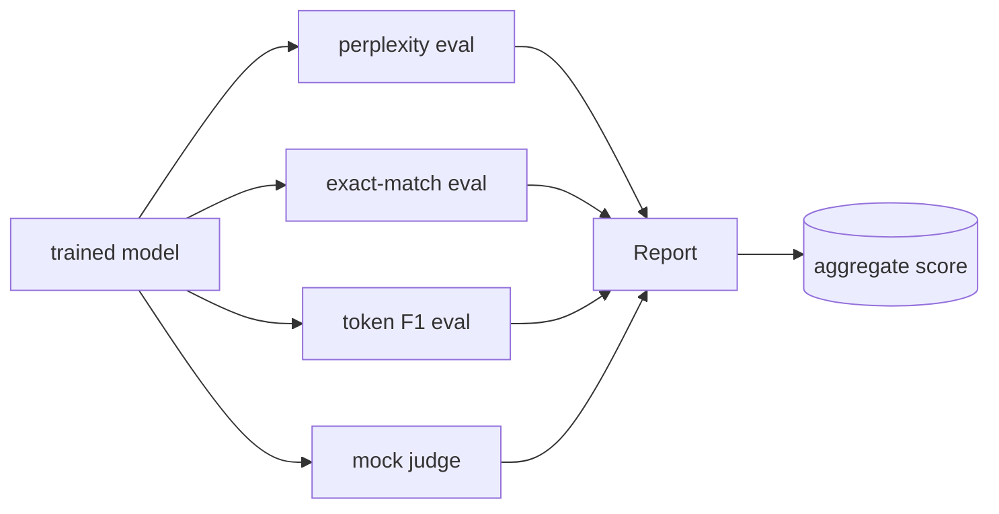

# キャップストーン 41: 完全な評価パイプライン

> Training は loss curve で見えるが、evaluation は設計しなければ見えない。このレッスンでは、学習済み言語モデルに対して 4 種類の異なる評価を実行し、タスク別の結果と集約スコアを出す eval pipeline を 1 ファイルで作る。ネットワークなしで動く mock LLM-as-judge も同梱する。

**種類:** Build
**言語:** Python (torch, numpy)
**前提:** Phase 19 lessons 30-37
**時間:** 約 90 分

## 学習目標

- padding を除外して held-out perplexity を計算する。
- 短い事実回答に exact-match eval を実行する。
- 予測文字列と参照文字列の token F1 を正規化付きで計算する。
- 1-5 点で採点するローカル mock LLM-as-judge を作る。
- 4 つの評価を重み付きで集約し、タスク別内訳を持つ report を出す。

## 問題

言語モデルを単一指標で説明することはできない。Perplexity は分布への当てはまりを測るが、質問に正しく答えるかは測らない。Exact-match は gold string との一致を測るが、正しい言い換えを落とす。Token F1 は重なりを見られる一方、意味の誤りを見逃すことがある。LLM-as-judge は質的判断を扱えるが、通常は高価で確率的である。

必要なのは、これらを横に並べる pipeline である。各 eval は別々の held-out subset を使い、`EvalResult` を返す。最後に `Aggregator` が `[0, 1]` に正規化して重み付き平均を作る。

## 概念

各 eval は `(model, dataset) -> EvalResult` という形にそろえる。結果には metric 値、検査用の per-example record、集約時に使う name が入る。

## Perplexity の数え方

Perplexity は token あたりの negative log-likelihood の平均を `exp` したもの。実装で重要なのは、padding を分母から除外することと、位置 `i` の logits が位置 `i+1` の token を予測すること。このズレは loss を壊さずに metric だけを無意味にするため、特に危険である。

## Exact-match と Token F1

Exact-match は小文字化、前後空白の除去、連続空白の畳み込み、末尾句読点の除去を行ってから比較する。Token F1 は同じ正規化をした後、空白 token の multiset intersection から precision と recall を出し、その調和平均を返す。両方空なら 1、片方だけ空なら 0 とする。

## Mock LLM-as-Judge

実運用の judge は API の向こうにある frontier model かもしれない。この教材では offline で動く deterministic scorer にする。正規化後に完全一致なら 5、token F1 が 0.8 以上なら 4、0.5 以上なら 3、0.2 以上なら 2、それ以外は 1 を返す。interface は本物の judge に差し替えられるように保つ。

## 実装するもの

1. `TinyGPT` と `InstructionTokenizer`。
2. LM、EM、F1、judge 用 fixture。
3. `perplexity_eval`、`exact_match_eval`、`token_f1_eval`、`judge_eval`。
4. `Aggregator.normalise` と `Aggregator.aggregate`。
5. `run_demo`: 短い学習、4 eval、table 表示、`report.json` 書き出し。

## report の読み方

最上位に aggregate score、その下に 4 つの eval 値、さらに下に診断用 per-example record がある。CI は aggregate を見ればよいが、regression を追う reviewer は per-example を見て、どの入力で失敗したかを確認する。

## 演習

1. 主要なハイパーパラメータを 1 つ変え、出力がどう変わるかを記録する。
2. 失敗ケースを 1 つ追加し、現在の実装がそれを検出できるか確認する。
3. 生成される JSON に、後段の CI が使える追加メタデータを 1 つ入れる。
4. 実運用で必要になる監視指標を 1 つ足す。
5. このレッスンの成果物を次のフェーズの入力として使う手順を書き出す。

## 重要語

| 用語 | 意味 |
|------|------|
| fixture | 教材内で固定して使う小さな検証データ |
| manifest | 後段が信頼する成果物一覧とメタデータ |
| schema | JSON や checkpoint 形式のバージョンを示す文字列 |
| aggregate | 個別指標を重み付き、または平均でまとめた値 |

## 参考

- PyTorch と Python 標準ライブラリの公式ドキュメント。
- このフェーズの直前レッスンで扱った tokenizer、checkpoint、training loop。
- 実運用では、ここで作った小さな実装をそのまま信頼せず、失敗時の再実行と監査ログを追加する。
