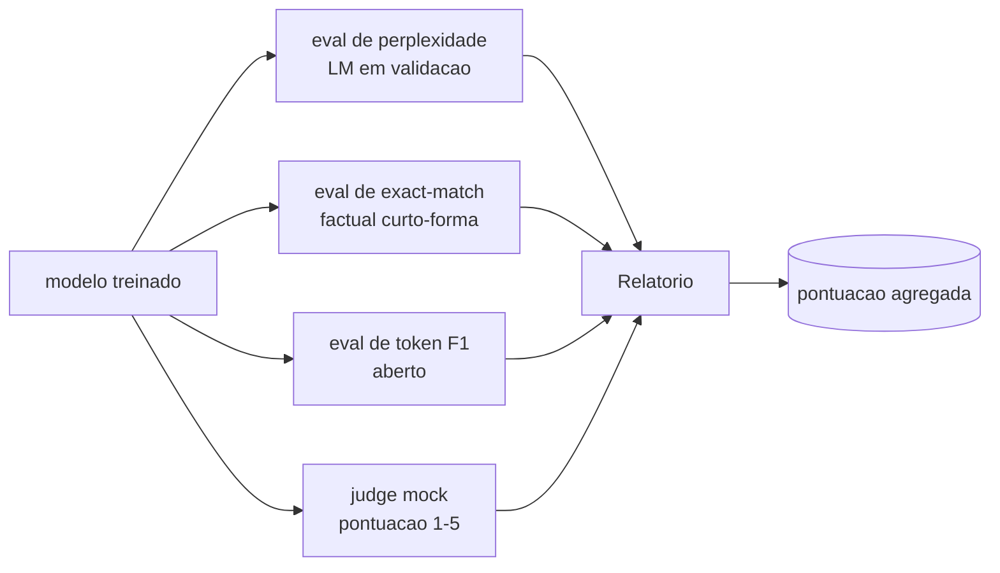
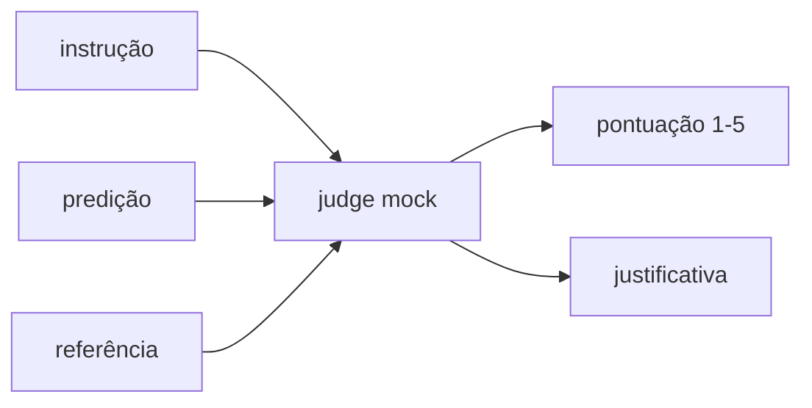
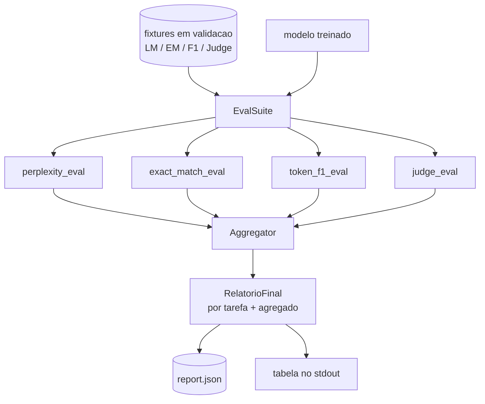

# Aula Capstone 41: Pipeline Completo de Avaliacao

> Treinamento e a parte que voce pode monitorar com curvas de loss. Avaliacao e a parte que voce precisa projetar. Esta aula constrói um pipeline de eval unificado que pega qualquer modelo de linguagem treinado, roda quatro evals heterogeneos nele, agrega os resultados em um relatorio por tarefa, e entrega um LLM-as-judge mock local para o loop rodar sem rede. Os quatro evals cobrem as dimensoes que todo modelo em producao precisa: modelagem de linguagem (perplexidade), corretores de curto-forma (exact-match), similaridade de forma aberta (F1 de token), e avaliacao qualitativa (judge).

**Tipo:** Build
**Linguagens:** Python (torch, numpy)
**Prerequisitos:** Aulas 30-37 da Fase 19 (track NLP LLM: tokenizer, tabela de embedding, bloco de attention, corpo do transformer, loop de pre-treinamento, checkpoint, geracao, perplexidade)
**Tempo:** ~90 minutos

## Objetivos de Aprendizado

- Calcular perplexidade com mascara de token em um transformer pequeno.
- Rodar um eval de exact-match em prompts factuais de curto-forma.
- Calcular F1 a nivel de token entre strings preditas e de referencia com normalizacao.
- Construir um LLM-as-judge mock local que pontua saidas do modelo em escala 1-5.
- Agregar os quatro evals em um relatorio ponderado unico com breakdown por tarefa.

## O Problema

Uma metrica unica nunca descreve um modelo de linguagem. Perplexidade diz quao bem o modelo se ajusta a distribuicao da lingua mas nao diz nada sobre se ele responde questoes. Exact-match diz se o modelo produz a string dourada mas pune parafrases corretas. F1 de token perdoa parafrase mas e enganado por overlap lexical com conteudo errado. LLM-as-judge captura dimensoes qualitativas mas e caro e estocastico.

O pipeline que voce realmente quer tem todos os quatro. Cada eval cobre uma dimensao que os outros perdem. Cada um roda em um subset diferente dos dados de validacao moldados para aquela metrica. O relatorio final mostra os numeros por tarefa lado a lado e um agregado, para que um reviewer veja de relance quais trade-offs o modelo esta fazendo.

Esta aula constrói esse pipeline, de ponta a ponta, em um arquivo.

## O Conceito

Cada eval e uma funcao `(model, dataset) -> EvalResult`. O resultado carrega o valor da metrica, detalhes por exemplo para inespecificaçãoao, e um nome para o agregado. O pipeline compoe eles com uma config que diz quais evals rodar e como pondera-los.

## Perplexidade, contada direito

Perplexidade e `exp(media de negativo log-likelihood por token)`. A implementacao tem duas armadilhas:

- A media deve ser sobre posicoes reais de token, nao sobre batch * sequencia. Tokens de padding precisam ser excluidos do denominador ou perplexidade vai parecer melhor do que e.
- O modelo prediz o proximo token, entao logits na posicao `i` predizem o token na posicao `i+1`. Erros de off-by-one aqui sao silenciosos: a loss ainda treina, mas a metrica vira nonsense.

O eval computa somas por batch de `-log p(token)` sobre posicoes nao-padding e uma contagem de tokens por batch, e depois divide no final. Isso e numericamente mais seguro do que fazer media de perplexidades por batch (que sub-pesa sequencias curtas) e bate com a definicao de livrario.

## Exact-match, com normalizacao

O harness normaliza tanto a predicao quanto a referencia antes de comparar:

- Lowercase.
- Remover whitespace ao redor.
- Colapsar sequencias internas de whitespace para um unico espaco.
- Remover pontuacao final (`.`, `!`, `?`) se ambos os lados diferem apenas por pontuacao.

Normalizacao torna exact-match util na pratica. Um modelo que diz `"Paris"` esta certo; um que diz `"Paris."` tambem esta certo; um que diz `"  paris  "` tambem esta certo. A metrica ainda exige que a resposta seja a mesma string apos a normalizacao.

## F1 de Token, do jeito certo

F1 de token e a media harmonica de precisao e recall computadas sobre o sacola-de-tokens. Passos:

1. Normalizar predicao e referencia (mesmas regras do exact-match).
2. Dividir cada um em uma lista de tokens (tokenizacao por whitespace).
3. Contar a intersecao multiconjunto.
4. Precisao = `contagem_intersecao / len(pred_tokens)`. Recall = `contagem_intersecao / len(ref_tokens)`. F1 = media harmonica.

Se tanto predicao quanto referencia estao vazios, F1 e 1 (match vazio). Se apenas um esta vazio, F1 e 0. Esse padrao bate com a referencia de avaliacao do SQuAD e produz numeros estaveis entre parafrases.

## LLM-as-Judge Mock Local

Um juiz real e um modelo de fronteira por tras de uma API. Para esta aula o juiz precisa rodar offline. O juiz mock e um pontuador deterministico que pega uma instrucao, a predicao do modelo, e a referencia, e retorna uma pontuacao em `{1, 2, 3, 4, 5}` mais uma justificativa de uma linha. As regras de pontuacao sao explicitas:

- 5 se a predicao normalizada e igual a referencia normalizada.
- 4 se o F1 de token entre predicao e referencia for pelo menos 0.8.
- 3 se o F1 de token estiver em `[0.5, 0.8)`.
- 2 se o F1 de token estiver em `[0.2, 0.5)`.
- 1 caso contrario.

Isso nao e um juiz real, mas tem a interface certa. Troque por um modelo real depois mudando uma funcao. O nao se importa.

## Agregacao

O agregado e uma media ponderada de scores normalizados de eval. Cada eval reporta seu proprio numero em `[0, 1]`:

- Perplexidade: normalizar como `1 / (1 + log(perplexidade))`. Uma perplexidade de 1 mapeia para 1, infinito mapeia para 0.
- Exact-match: ja em `[0, 1]`.
- F1 de token: ja em `[0, 1]`.
- Judge: dividir por 5.

Pesos sao configuraveis. O mix padrao e 0.2 perplexidade, 0.3 exact-match, 0.3 F1 de token, 0.2 judge. A escolha dos pesos e uma decisao de produto; a aula expoe o botao para voce experimentar.

## Arquitetura

O `EvalSuite` e um orchestrator leve. Cada eval individual e uma funcao livre que pega `(model, tokenizer, dataset, config)` e retorna um `EvalResult`. O `Aggregator` coleta resultados e produz o relatorio final. O demo imprime a tabela e escreve uma copia JSON que o CI downstream pode ingerir.

## O que voce vai construir

A implementacao e um `main.py` mais testes.

1. `TinyGPT`: a mesma arquitetura decoder-only usada nas aulas 38-40, incluida para a aula ficar autocontida.
2. `InstructionTokenizer`: tokenizador de byte com eespecificaçãoiais INST / RESP / PAD.
3. Quatro fixtures: um corpus LM, um conjunto EM, um conjunto F1, e um conjunto de judge. Vinte exemplos cada, deterministicos.
4. `perplexity_eval`: retorna `EvalResult` com o valor da perplexidade e histograma de loss por token.
5. `exact_match_eval`: retorna media EM e registros por exemplo.
6. `token_f1_eval`: retorna media F1 de token e registros por exemplo.
7. `mock_judge` e `judge_eval`: pontuacao por exemplo e justificativa, media de pontuacao no conjunto.
8. `Aggregator.normalise`: regra de normalizacao por eval.
9. `Aggregator.aggregate`: media ponderada e relatorio montado.
10. `run_demo`: treina um modelo pequeno brevemente, roda todos os quatro evals, imprime a tabela do relatorio e escreve o JSON, sai zero no sucesso.

## Lendo o relatorio

O relatorio tem tres camadas. O topo e a pontuacao agregada. Abaixo sao os quatro numeros por eval. Abaixo deles sao os breakdowns por exemplo para diagnosticas. Um CI que falha normalmente quer o agregado, mas um reviewer perseguindo uma regressao quer o breakdown por exemplo para ver quais inputs o modelo errou.

O dump do JSON usa chaves estaveis para que um dashboard de CI possa plotar linhas de tendencia entre versoes. A tabela bonita e para humanos encarando o terminal apos um treinamento.

## Metas extras

- Adicionar um eval de calibracao: as probabilidades softmax do modelo combinam com sua acuracia? Agrupar predicoes por confianca e reportar a acuracia empirica por grupo.
- Adicionar um eval de robustez: rotular cada exemplo com uma perturbacao (typo, parafrase, distrator) e reportar a queda de metrica por perturbacao.
- Substituir o judge mock por um modelo real por tras de uma chamada HTTP. A assinatura da funcao nao muda.
- Adicionar aprendizado de pesos por tarefa: em vez de pesos fixos, ajustar pesos a uma ordem de preferencia alvo sobre modelos.

A implementacao te da os quatro evals, o agregador, e o relatorio. Pipelines de avaliacao reais adicionam muitas mais dimensoes por cima; o padrao continua o mesmo: uma funcao por eval, um agregador, um relatorio.
