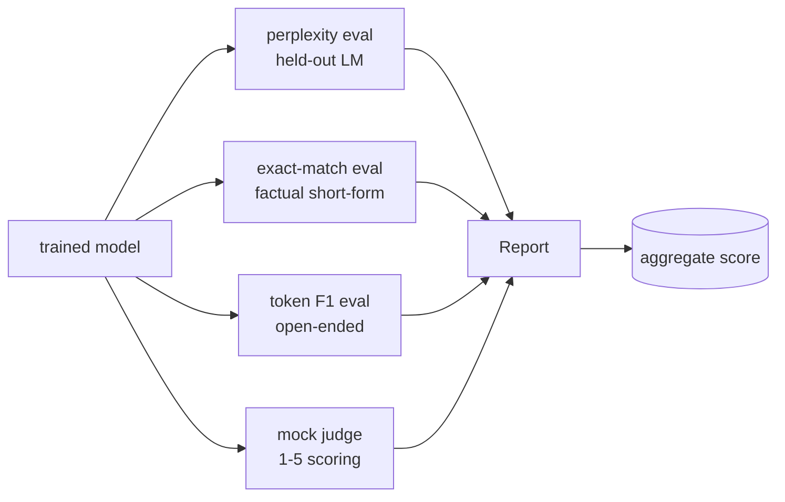
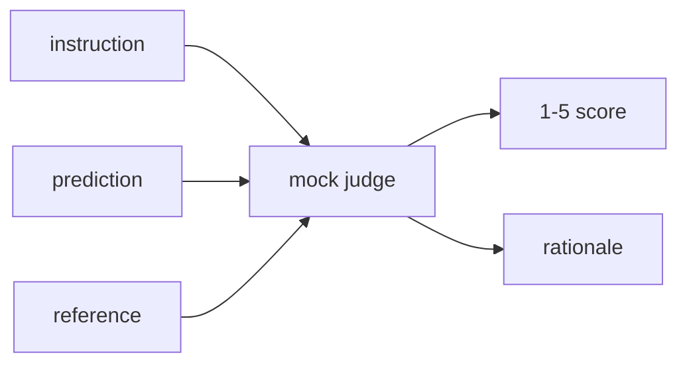
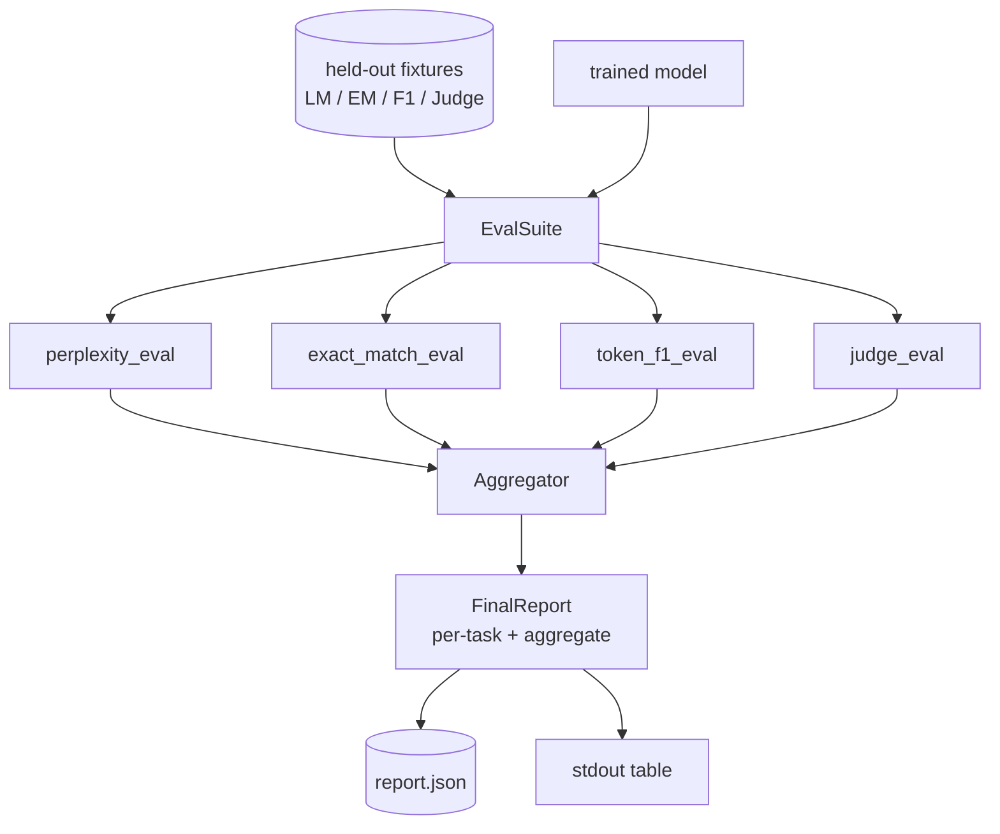

# Bitirme Dersi 41: Tam Değerlendirme Süreci

> Eğitim, kayıp eğrileri ile izleyebileceğiniz kısımdır. Değerlendirme tasarlamanız gereken kısımdır. Bu ders, herhangi bir eğitilmiş dil modelini alan, üzerinde dört heterojen değerlendirme çalıştıran, sonuçları görev başına bir raporda toplayan ve döngünün ağ olmadan çalışması için yerel bir sahte Yüksek Lisans-uzmanı (yargıç olarak) gönderen birleşik bir değerlendirme hattı oluşturur. Dört değerlendirme, her gönderim modelinin ihtiyaç duyduğu boyutları kapsar: dil modelleme (karışıklık), kısa biçim doğruluğu (tam eşleşme), açık biçim benzerliği (token F1) ve niteliksel puanlama (yargıç).

**Tür:** Yapım
**Diller:** Python (meşale, numpy)
**Önkoşullar:** Aşama 19 dersleri 30-37 (NLP LLM yolu: tokenizer, embedding tablo, dikkat bloğu, transformer gövde, eğitim öncesi döngü, kontrol noktası oluşturma, oluşturma, şaşkınlık)
**Süre:** ~90 dakika

## Öğrenme Hedefleri

- Küçük bir transformer üzerinde maskelenmiş-token muhasebesi ile uzun süren karmaşıklığı hesaplayın.
- Kısa biçimli olgusal prompt'lar üzerinde tam eşleşme değerlendirmesi yapın.
- Tahmin edilen ve referans dizeleri arasındaki token düzeyindeki F1'i normalleştirmeyle hesaplayın.
- Model çıktılarını 1'den 5'e kadar puanlayan yerel bir sahte yüksek lisans jürisi oluşturun.
- Dört değerlendirmeyi, göreve göre dökümle birlikte tek ağırlıklı bir raporda birleştirin.

## Sorun

Tek bir metrik asla bir dil modelini tanımlamaz. Şaşkınlık, modelin dil dağılımına ne kadar iyi uyduğunu söylüyor ancak soruları yanıtlayıp yanıtlamadığına dair hiçbir şey söylemiyor. Tam eşleşme, modelin altın diziyi üretip üretmediğini belirtir ancak doğru ifadeleri cezalandırır. Token F1, açıklamaları affeder ancak yanlış içerikle sözcüksel örtüşme nedeniyle kandırılır. Hakim olarak Yüksek Lisans niteliksel boyutları yakalar ancak pahalı ve stokastiktir.

Aslında istediğiniz boru hattının dördü de var. Her değerlendirme diğerlerinin gözden kaçırdığı bir boyutu kapsar. Her biri, o metrik için şekillendirilmiş farklı bir veri alt kümesi üzerinde çalışır. Nihai rapor, görev başına sayıları yan yana ve toplu olarak gösterir; böylece inceleme yapan kişi, modelin hangi tavizleri verdiğini bir bakışta görebilir.

Bu ders, bu boru hattını uçtan uca tek bir dosyada oluşturur.

## Konsept

Her değerlendirme `(model, dataset) -> EvalResult`'dan bir fonksiyondur. Sonuç, metrik değeri, inceleme için örnek başına ayrıntıları ve toplam için bir adı taşır. İşlem hattı bunları, hangi değerlendirmelerin çalıştırılacağını ve bunların nasıl ağırlıklandırılacağını söyleyen bir yapılandırmayla oluşturur.

## Şaşkınlık, doğru şekilde sayıldı

Şaşkınlık `exp(mean negative log-likelihood per token)`. Uygulamanın iki tuzağı var:

- Ortalama, toplu * dizisinin üzerinde değil, gerçek token konumun üzerinde olmalıdır. Dolgu token'ların paydadan çıkarılması gerekir, aksi takdirde karışıklık olduğundan daha iyi görünecektir.
- Model bir sonraki token'ı tahmin eder, dolayısıyla `i` konumundaki logitler, `i+1` konumundaki token'ı tahmin eder. Burada tek tek yapılan hatalar sessiz kalıyor: kayıp hala devam ediyor, ancak ölçüm anlamsız hale geliyor.

Değerlendirme, ped olmayan konumlar üzerinden parti başına `-log p(token)` toplamını ve parti başına token sayısını hesaplar ve ardından sonunda böler. Bu, grup başına karışıklıkların ortalamasını almaktan (kısa dizilerin ağırlığının altında kalan) sayısal olarak daha güvenlidir ve ders kitabı tanımıyla eşleşir.

## Tam eşleşme, normalleştirmeyle

Kablo demeti, karşılaştırmadan önce hem tahmini hem de referansı normalleştirir:

- Küçük harf.
- Çevredeki boşlukları soyun.
- Dahili boşlukları tek bir alana daraltın.
- Her iki taraf da yalnızca noktalama işaretleri açısından farklılık gösteriyorsa sondaki terminal noktalama işaretini (`.`, `!`, `?`) bırakın.

Normalleştirme, tam eşleşmeyi pratikte faydalı hale getirir. `"Paris"` diyen bir model doğrudur; `"Paris."` diyen de doğru; `"  paris  "` diyen de doğru. Metrik, normalizasyondan sonra da cevabın aynı dize olmasını gerektiriyor.

## Token F1, doğru yol

Token F1, token'lar paketi üzerinden hesaplanan hassaslık ve geri çağırmanın harmonik ortalamasıdır. Adımlar:

1. Tahmini ve referansı normalleştirin (tam eşleşmeyle aynı kurallar).
2. Her birini token'larden (boşluk token'leştirme) oluşan bir listeye bölün.
3. Çoklu küme kesişimini sayın.
4. Hassasiyet = `intersection_count / len(pred_tokens)`. Geri çağırma = `intersection_count / len(ref_tokens)`. F1 = harmonik ortalama.

Hem tahmin hem de referans boşsa, F1 1'dir (boş eşleşme). Yalnızca biri boşsa, F1 0'dır. Bu model, SQuAD değerlendirme referansıyla eşleşir ve farklı ifadelerde kararlı sayılar üretir.

## Yargıç Olarak Yerel Sahte Yüksek Lisans

Gerçek bir yargıç, bir API'nin arkasındaki sınır modelidir. Bu ders için hakemin çevrimdışı çalışması gerekiyor. Sahte hakem, bir talimatı, modelin tahminini ve referansı alan ve `{1, 2, 3, 4, 5}` cinsinden bir puan artı tek satırlık bir mantık döndüren deterministik bir puanlayıcıdır. Puanlama kuralları açıktır:

- 5 normalleştirilmiş tahmin normalleştirilmiş referansa eşitse.
- 4 eğer token F1 tahmin ve referans arasında en az 0,8 ise.
- 3 eğer token F1 `[0.5, 0.8)`'daysa.
- 2 eğer token F1 `[0.2, 0.5)`'daysa.
- 1 aksi takdirde.

Bu gerçek bir yargıç değil, ancak doğru arayüze sahip. Daha sonra bir işlevi değiştirerek gerçek bir modelle değiştirin. Boru hattı umursamıyor.

## Toplama

Toplam, normalleştirilmiş değerlendirme puanlarının ağırlıklı ortalamasıdır. Her değerlendirme kendi numarasını `[0, 1]` içinde bildirir:

- Şaşkınlık: `1 / (1 + log(perplexity))` olarak normalleştir. 1'in 1'e, sonsuzluğun da 0'a eşlendiği bir şaşkınlık.
- Tam eşleşme: zaten `[0, 1]` içinde.
- Token F1: zaten `[0, 1]`'da.
- Yargıç: 5'e bölün.

Ağırlıklar yapılandırılabilir. Varsayılan karışım 0,2 şaşkınlık, 0,3 tam eşleşme, 0,3 token F1, 0,2 yargıçtır. Ağırlık seçimi bir ürün kararıdır; ders, deney yapabilmeniz için düğmeyi ortaya çıkarır.

## Mimarlık

`EvalSuite` zayıf bir orkestratördür. Her bir değerlendirme, `(model, tokenizer, dataset, config)` 'yi alan ve bir `EvalResult` döndüren ücretsiz bir fonksiyondur. `Aggregator` sonuçları toplar ve nihai raporu üretir. Demo, tabloyu yazdırır ve aşağı akış CI'nın alabileceği bir JSON kopyası yazar.

## Ne inşa edeceksiniz

Uygulama bir `main.py` artı testtir.

1. `TinyGPT`: 38-40. derslerde kullanılan aynı yalnızca kod çözücü mimarisi, dersin tek başına kalması için dahil edilmiştir.
2. `InstructionTokenizer`: INST / RESP / PAD özellerine sahip bayt tokeniser.
3. Dört fikstür: bir LM külliyatı, bir EM seti, bir F1 seti ve bir değerlendirme seti. Her biri yirmi örnek, deterministik.
4. `perplexity_eval`: şaşkınlık değeri ve her-token kayıp histogramı ile `EvalResult` değerini döndürür.
5. `exact_match_eval`: ortalama EM ve örnek başına kayıtları döndürür.
6. `token_f1_eval`: ortalama token F1 ve örnek başına kayıtları döndürür.
7. `mock_judge` ve `judge_eval`: örnek başına puan ve gerekçe, küme genelinde ortalama puan.
8. `Aggregator.normalise`: değerlendirme başına normalleştirme kuralı.
9. `Aggregator.aggregate`: ağırlıklı ortalama ve birleştirilmiş rapor.
10. `run_demo`: küçük bir modeli kısaca eğitir, dört değerlendirmeyi de çalıştırır, rapor tablosunu yazdırır ve JSON'u yazar, başarı durumunda sıfırdan çıkar.

## Raporu okuma

Raporun üç katmanı var. En üstteki toplam puandır. Aşağıda her değerlendirme için dört sayı bulunmaktadır. Bunların altında teşhis için örnek bazında dökümler bulunmaktadır. Başarısız bir CI çalıştırması genellikle toplamayı ister, ancak regresyonun peşinde koşan bir incelemeci, modelin hangi girdilerin yanlış olduğunu görmek için örnek başına dökümü ister.

JSON dökümü, CI panosunun sürümler arasındaki trend çizgilerini çizebilmesi için kararlı anahtarlar kullanır. Güzel baskılı masa, bir eğitim koşusunun ardından terminale bakan insanlar içindir.

## Hedefleri genişletme

- Bir kalibrasyon değerlendirmesi ekleyin: modelin softmax olasılıkları doğruluğuyla eşleşiyor mu? Güvenle kova tahminleri yapın ve paket başına ampirik doğruluğu raporlayın.
- Bir sağlamlık değerlendirmesi ekleyin: her örneği bir tedirginlikle etiketleyin (yazım hatası, açıklama, dikkat dağıtıcı) ve tedirginlik başına metrik düşüşünü bildirin.
- Sahte yargıcı, bir HTTP çağrısının arkasındaki gerçek bir modelle değiştirin. İşlev imzası değişmez.
- Görev başına ağırlık öğrenimi ekleyin: Sabit ağırlıklar yerine, ağırlıkları modeller üzerinden hedef tercih sırasına göre ayarlayın.

Uygulama size dört değerlendirmeyi, toplayıcıyı ve raporu verir. Gerçek değerlendirme hatları en üstte çok daha fazla boyutu katmanlandırır; kalıp aynı kalır: değerlendirme başına bir işlev, bir toplayıcı, bir rapor.
