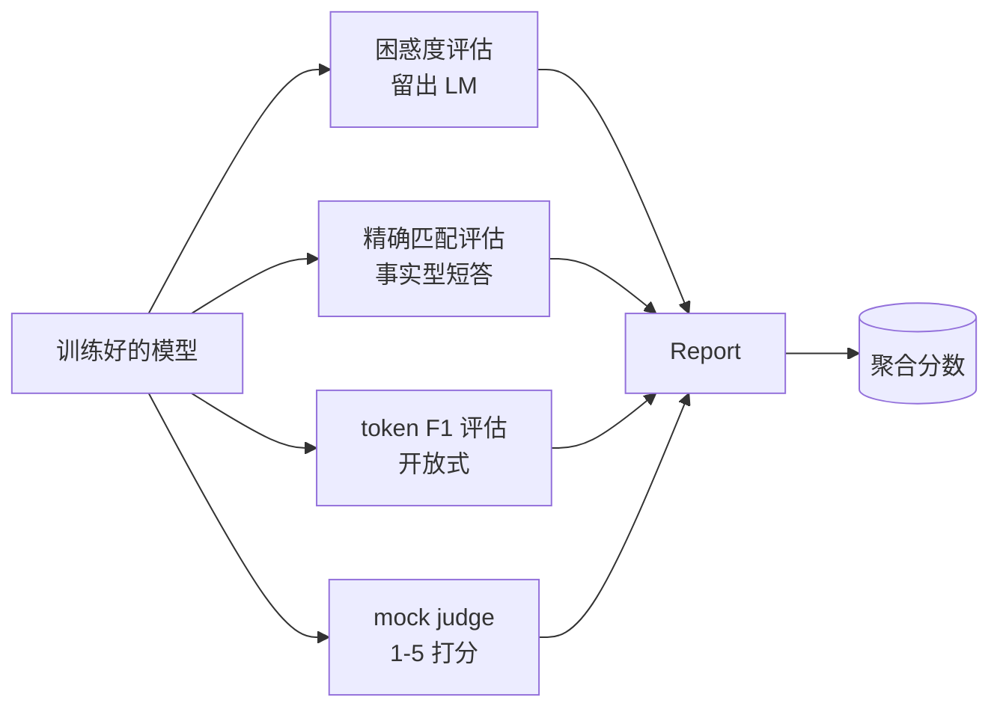
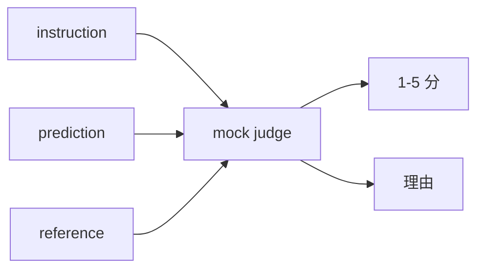
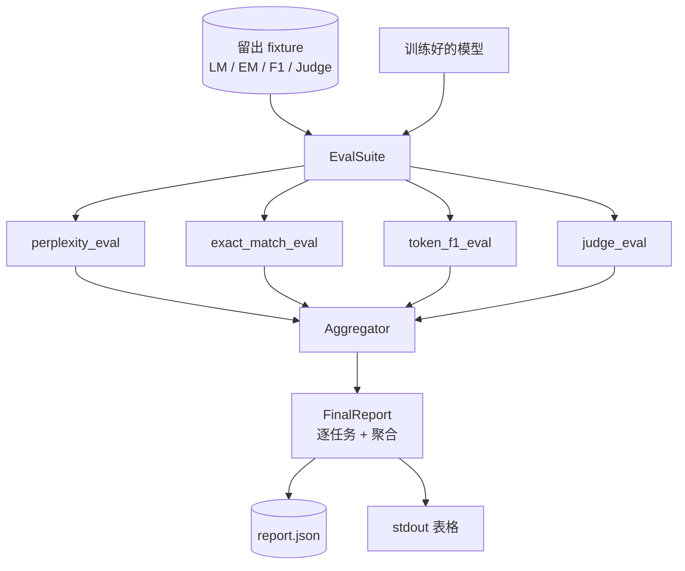

# Capstone 第 41 课：完整评估流水线（Full Evaluation Pipeline）

> 译注：本文译自同目录 [`en.md`](./en.md)。术语遵循仓根 [TRANSLATION_GUIDE.md](../../../../TRANSLATION_GUIDE.md)。

> 训练那部分你能用 loss 曲线盯着；评估（evaluation）那部分必须靠你自己设计。这一课会搭出一条统一的评估流水线（pipeline）：拿任意一个训练好的语言模型，跑四种异质的 eval，把结果聚合成按任务分类的报告，并附带一个本地 mock LLM-as-judge，让整条 loop 离线也能跑。这四种 eval 覆盖了任何要上线的模型都需要关注的维度：语言建模（perplexity，困惑度）、短答案正确性（exact-match，精确匹配）、开放式相似度（token F1）、以及定性打分（judge）。

**Type:** Build
**Languages:** Python (torch, numpy)
**Prerequisites:** Phase 19 lessons 30-37 (NLP LLM track: tokenizer, embedding table, attention block, transformer body, pre-training loop, checkpointing, generation, perplexity)
**Time:** ~90 minutes

## 学习目标（Learning Objectives）

- 在一个小型 transformer 上计算留出（held-out）困惑度，并正确处理掩码 token 的统计。
- 在短答案事实类 prompt 上跑一次 exact-match eval。
- 计算预测字符串与参考字符串之间的 token 级 F1，并做归一化处理。
- 搭一个本地 mock LLM-as-judge，按 1-5 分给模型输出打分。
- 把四个 eval 聚合成一份带加权和按任务拆分的报告。

## 问题（The Problem）

单一指标永远说不清一个语言模型。Perplexity 衡量模型对语言分布拟合得多好，但完全不告诉你它能不能答题。Exact-match 衡量模型有没有产出标准答案，却会冤枉正确的同义改写。Token F1 对改写宽容，却会被「内容错但词面重叠」骗到。LLM-as-judge 能抓定性维度，但贵且随机。

你真正想要的流水线得四样都有。每个 eval 覆盖别的 eval 漏掉的一个维度，每个 eval 跑在一份按其指标量身定制的留出数据子集上。最终报告把每个任务的数字并排展示再加一个聚合分，这样 reviewer（评审者）扫一眼就能看出模型在做什么权衡取舍。

这一课就把这条流水线端到端地搭起来，写在一个文件里。

## 概念（The Concept）

每个 eval 都是一个 `(model, dataset) -> EvalResult` 的函数。结果里带着指标值、便于检查的逐样本细节，以及用于聚合的名字。流水线靠一份配置把它们组合起来——配置说明跑哪些 eval，以及怎么加权。

## 正确统计 Perplexity（Perplexity, properly counted）

困惑度是 `exp(每 token 的平均负 log 似然)`。实现上有两个坑：

- 平均要按真实 token 位置算，而不是 batch * sequence。padding token 必须排除在分母外，否则困惑度看起来会比实际更好。
- 模型预测的是下一个 token，所以位置 `i` 处的 logits 预测的是位置 `i+1` 的 token。这里的 off-by-one（差一）错误是无声的：loss 仍能让模型继续训练，但指标会变得毫无意义。

这个 eval 在每个 batch 上对非 pad 位置累加 `-log p(token)`，同时累加每个 batch 的 token 数，最后再做除法。这比对每个 batch 的困惑度求平均（会让短序列权重偏低）数值上更稳，也和教科书定义对得上。

## 带归一化的 Exact-Match（Exact-match, with normalisation）

harness（评估框架）在比较前会同时归一化预测和参考：

- 转小写。
- 去掉首尾空白。
- 把内部连续空白压成单个空格。
- 如果两边只差结尾标点，丢掉末尾的终结标点（`.`、`!`、`?`）。

归一化让 exact-match 在实战中真正有用。模型说 `"Paris"` 算对；说 `"Paris."` 也算对；说 `"  paris  "` 同样算对。归一化后，指标依然要求答案字符串完全一致。

## Token F1 的正确做法（Token F1, the right way）

Token F1 是把预测和参考各自看成 token 的多重集，再算精确率（precision）和召回率（recall）的调和平均。步骤：

1. 归一化预测和参考（规则同 exact-match）。
2. 各自切成 token 列表（按空白切分）。
3. 数多重集交集的元素个数。
4. Precision = `intersection_count / len(pred_tokens)`。Recall = `intersection_count / len(ref_tokens)`。F1 = 调和平均。

如果预测和参考都为空，F1 = 1（空匹配视为命中）。如果只有一边为空，F1 = 0。这套约定和 SQuAD 评估参考一致，跨改写时数字也稳定。

## 本地 Mock LLM-as-Judge（Local Mock LLM-as-Judge）

真实的 judge 是一个挂在 API 后面的前沿模型。这一课的 judge 必须能离线跑，所以 mock judge 是一个确定性的打分器：吃 instruction、模型预测和参考，返回一个 `{1, 2, 3, 4, 5}` 中的分数加一行 rationale（理由）。打分规则写得明明白白：

- 归一化后的预测等于归一化后的参考 → 5。
- 预测和参考的 token F1 ≥ 0.8 → 4。
- token F1 落在 `[0.5, 0.8)` → 3。
- token F1 落在 `[0.2, 0.5)` → 2。
- 其他情况 → 1。

这不是一个真正的 judge，但它的接口是对的。以后想换成真模型，只要换掉一个函数就行，流水线不用动。

## 聚合（Aggregation）

聚合分是各个 eval 归一化后分数的加权平均。每个 eval 都把自己折算到 `[0, 1]`：

- Perplexity：归一化为 `1 / (1 + log(perplexity))`。困惑度 1 映到 1，无穷大映到 0。
- Exact-match：本来就在 `[0, 1]`。
- Token F1：本来就在 `[0, 1]`。
- Judge：除以 5。

权重可配置。默认配比是 perplexity 0.2、exact-match 0.3、token F1 0.3、judge 0.2。权重的选择本质上是产品决策；这一课把这个旋钮暴露出来供你试。

## 架构（Architecture）

`EvalSuite` 是一个薄薄的编排器（orchestrator）。每个 eval 都是一个独立函数，签名 `(model, tokenizer, dataset, config)`，返回一个 `EvalResult`。`Aggregator` 收集结果产出最终报告。Demo 既会把表格打到 stdout，也会写一份 JSON 副本给下游 CI 消费。

## 你将构建什么（What you will build）

实现就是一个 `main.py` 加上测试。

1. `TinyGPT`：和第 38-40 课用的同一个 decoder-only 架构，放进来让本课能独立运行。
2. `InstructionTokenizer`：带 INST / RESP / PAD 特殊符号的字节级 tokenizer。
3. 四份 fixture：一份 LM 语料、一份 EM 集、一份 F1 集、一份 judge 集。每份 20 个例子，确定性生成。
4. `perplexity_eval`：返回 `EvalResult`，含困惑度数值和每 token 损失直方图。
5. `exact_match_eval`：返回 EM 均值和逐样本记录。
6. `token_f1_eval`：返回 token F1 均值和逐样本记录。
7. `mock_judge` 和 `judge_eval`：逐样本分数和 rationale，整集均分。
8. `Aggregator.normalise`：每个 eval 的归一化规则。
9. `Aggregator.aggregate`：加权平均，组装成报告。
10. `run_demo`：训练一个迷你模型几步，跑完四个 eval，打印报告表，写 JSON，成功则以 0 退出。

## 读懂报告（Reading the report）

报告分三层。最上面是聚合分。下面是四个 eval 的逐项数字。再下面是逐样本拆解，用来诊断。CI 失败时通常关心聚合分，但 reviewer 在追一个回归（regression）时想看的是逐样本拆解，去定位模型在哪些输入上答错了。

JSON dump 用稳定的 key，方便 CI 仪表盘画跨版本的趋势线。漂亮打印的表格则是给训练完盯着终端看的人类用的。

## 进阶目标（Stretch goals）

- 加一个校准（calibration）eval：模型的 softmax 概率是否匹配它的准确率？把预测按置信度分桶，报告每个桶的经验准确率。
- 加一个鲁棒性（robustness）eval：给每个样本打上扰动标签（typo / 改写 / 干扰项），报告每种扰动下指标的下降。
- 把 mock judge 换成真实模型，挂到 HTTP 调用后面。函数签名不变。
- 加上逐任务权重学习：不再用固定权重，而是去拟合一组权重，使其匹配你对若干模型的目标偏好排序。

实现给你了四个 eval、聚合器和报告。真实的评估流水线在这之上还会叠很多维度；模式始终一样：一个 eval 一个函数，一个聚合器，一份报告。
