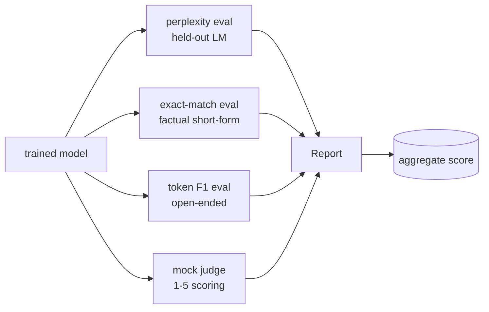
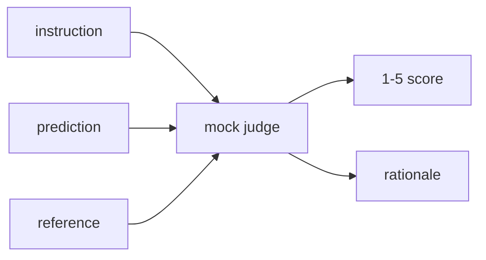
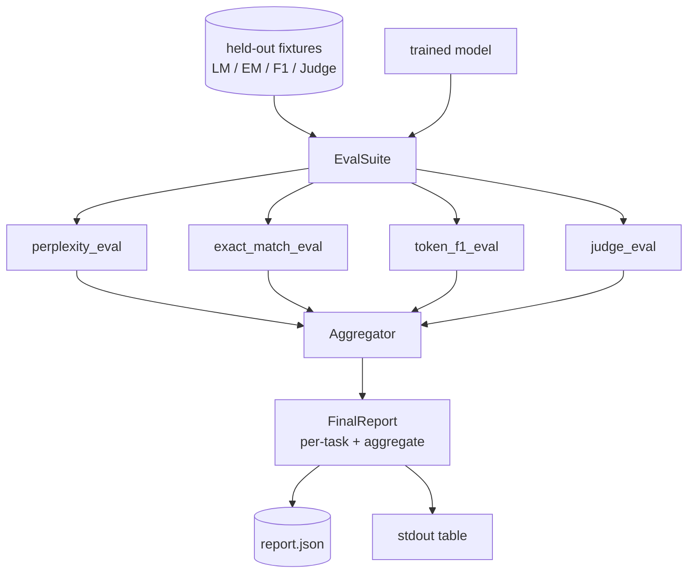

# 41 · 完整评估流水线

> 训练是你用损失曲线就能监控的部分。评估是你必须亲自设计的部分。本课将构建一个统一的评估流水线，对任意训练好的语言模型运行四种异构评估，将结果汇总为按任务分项的报告，并交付一个本地模拟的大模型评判（LLM-as-judge），使整个循环无需网络即可运行。这四种评估覆盖了每个可交付模型所需的维度：语言建模（困惑度，perplexity）、短文本正确性（精确匹配，exact-match）、开放式相似度（分词 F1，token F1）以及定性评分（评判，judge）。

**类型：** 构建
**语言：** Python（torch、numpy）
**前置：** 第 19 阶段第 30–37 课（NLP LLM 路线：分词器、嵌入表、注意力模块、Transformer 主体、预训练循环、检查点、生成、困惑度）
**时长：** 约 90 分钟

## 学习目标

- 在一个微型 Transformer 上使用掩码分词（masked-token）统计方式计算留出集困惑度。
- 对短文本事实类提示运行精确匹配评估。
- 在预测字符串与参考答案字符串之间，通过归一化计算分词级 F1。
- 构建一个本地模拟大模型评判，对模型输出按 1–5 分制打分。
- 将四种评估汇总为一份带权重、按任务分项的单一报告。

## 问题

单一指标永远无法完整描述一个语言模型。困惑度说明模型对语言分布的拟合程度，但无法说明它是否能回答问题。精确匹配说明模型是否产出了黄金标准字符串，但会惩罚正确的同义改写。分词 F1 能容忍改写，但会被词面重叠但内容错误的情况蒙蔽。大模型评判能捕捉定性维度，但成本高且具有随机性。

你真正需要的流水线包含全部四种。每种评估覆盖其他评估所遗漏的某个维度。每种评估运行在不同的留出数据子集上，这些子集针对各自指标进行了专门设计。最终报告并排展示各任务指标和一个综合评分，让评审者一眼就能看出模型在做哪些权衡。

本课将端到端地构建这条流水线，全部放在一个文件中。

## 概念

每个评估都是一个从 `(model, dataset)` 到 `EvalResult` 的函数。结果包含指标值、可供检查的逐样本详情，以及用于聚合的名称标识。流水线通过一份配置将它们组合起来，配置中指定了要运行哪些评估以及各自的权重。

## 困惑度的正确计算

困惑度定义为 `exp(每个分词的负对数似然均值)`。实现中有两个陷阱：

- 均值必须基于实际分词位置计算，而非基于 batch * sequence。填充（padding）分词必须从分母中排除，否则困惑度会看起来比实际值更好。
- 模型预测的是下一个分词，因此位置 `i` 的 logits 预测的是位置 `i+1` 的分词。这里的差一（off-by-one）错误是静默的：损失仍然会训练下去，但指标变得毫无意义。

评估时按批次计算每个非填充位置上 `-log p(token)` 的累加和，以及每个批次的分词计数，最后再做除法。这比对每个批次的困惑度取均值（会低权重处理短序列）在数值上更安全，且符合教科书定义。

## 精确匹配与归一化

测试框架在比较之前会对预测和参考答案进行归一化：

- 转为小写。
- 去除首尾空白。
- 将内部连续空白折叠为单个空格。
- 如果两侧仅在末尾标点上有差异，则去掉末尾标点（`.`、`!`、`?`）。

归一化使精确匹配在实践中真正可用。模型输出 `"Paris"` 是正确的；输出 `"Paris."` 也是正确的；输出 `"  paris  "` 也是正确的。该指标仍然要求答案在归一化后是相同的字符串。

## 分词 F1 的正确计算

分词 F1 是在词包（bag-of-tokens）上计算的精确率（precision）与召回率（recall）的调和平均。步骤：

1. 对预测和参考答案进行归一化（规则同精确匹配）。
2. 将每个字符串拆分为分词列表（按空白分词）。
3. 计算多重集交集数量。
4. 精确率 = `intersection_count / len(pred_tokens)`，召回率 = `intersection_count / len(ref_tokens)`，F1 = 调和平均。

如果预测和参考答案都为空，则 F1 = 1（空洞匹配）。如果仅一方为空，则 F1 = 0。该模式与 SQuAD 评估参考实现一致，在改写场景下能产出稳定的数值。

## 本地模拟大模型评判

真正的评判是一个位于 API 背后的前沿模型。在本课中，评判必须离线运行。模拟评判是一个确定性打分器，接收指令、模型预测和参考答案，返回 `{1, 2, 3, 4, 5}` 中的一个分数以及一行评分理由。打分规则是显式的：

- 5 分：归一化后的预测与归一化后的参考答案完全相等。
- 4 分：预测与参考答案之间的分词 F1 不低于 0.8。
- 3 分：分词 F1 在 `[0.5, 0.8)` 区间内。
- 2 分：分词 F1 在 `[0.2, 0.5)` 区间内。
- 1 分：其他情况。

这并非真正的评判模型，但它具有正确的接口。之后只需替换一个函数即可换入真正的模型。流水线不关心背后的实现。

## 聚合

综合评分是各归一化评估分数的加权平均。每个评估报告自身的数值，范围在 `[0, 1]`：

- 困惑度：归一化为 `1 / (1 + log(perplexity))`。困惑度为 1 时映射到 1，趋于无穷时映射到 0。
- 精确匹配：本身已在 `[0, 1]` 范围内。
- 分词 F1：本身已在 `[0, 1]` 范围内。
- 评判分数：除以 5。

权重是可配置的。默认配比为困惑度 0.2、精确匹配 0.3、分词 F1 0.3、评判 0.2。权重的选择是一个产品决策；本课暴露这个旋钮，让你可以自行实验。

## 架构

`EvalSuite` 是一个轻量级编排器。每个独立评估都是一个自由函数，接收 `(model, tokenizer, dataset, config)` 并返回一个 `EvalResult`。`Aggregator` 收集结果并生成最终报告。演示代码会打印表格并写出 JSON 副本，供下游 CI 系统读取。

## 你将构建的内容

实现为一个 `main.py` 加上测试。

1. `TinyGPT`：与第 38–40 课相同的纯解码器架构，内置以使本课自包含。
2. `InstructionTokenizer`：字节级分词器，含有 INST / RESP / PAD 特殊标记。
3. 四组固定测试数据：一个语言模型语料集、一个精确匹配集、一个 F1 集和一个评判集。各含 20 个样本，确定性生成。
4. `perplexity_eval`：返回 `EvalResult`，含困惑度值和每分词损失直方图。
5. `exact_match_eval`：返回平均 EM 及逐样本记录。
6. `token_f1_eval`：返回平均分词 F1 及逐样本记录。
7. `mock_judge` 和 `judge_eval`：逐样本分数与评分理由，整个集合的平均分数。
8. `Aggregator.normalise`：按评估类别的归一化规则。
9. `Aggregator.aggregate`：加权平均及组装后的报告。
10. `run_demo`：短暂训练一个微型模型，运行全部四种评估，打印报告表格、写出 JSON，成功则返回零退出码。

## 如何阅读报告

报告包含三个层次。最顶层是综合评分。其下是按评估分项的四个指标数值。再下一层是供诊断使用的逐样本细分。失败的 CI 运行通常只看综合评分，但追踪回归的评审者需要逐样本细分来查看模型在哪些输入上出了错。

JSON 输出使用稳定的键名，以便 CI 仪表板绘制跨版本的指标趋势线。美化打印的表格则是为训练结束后盯着终端的人类准备的。

## 延伸目标

- 添加校准（calibration）评估：模型的 softmax 概率是否与其准确率匹配？按置信度分桶，报告每个桶的经验准确率。
- 添加鲁棒性（robustness）评估：为每个样本标注一种扰动类型（拼写错误、同义改写、干扰项），报告每种扰动下的指标下降幅度。
- 将模拟评判替换为通过 HTTP 调用调用的真实模型。函数签名无需更改。
- 添加按任务学习权重：不再使用固定权重，而是将权重拟合到模型间的目标偏好排序上。

实现给出了四种评估、聚合器和报告。真实的评估流水线会在此基础上叠加更多维度，但其模式始终不变：每个评估一个函数，一个聚合器，一份报告。
