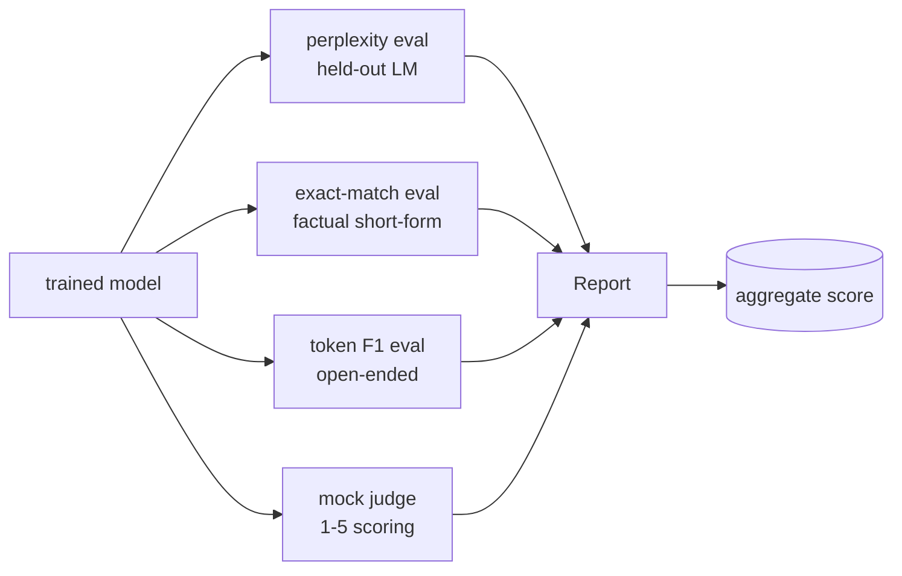
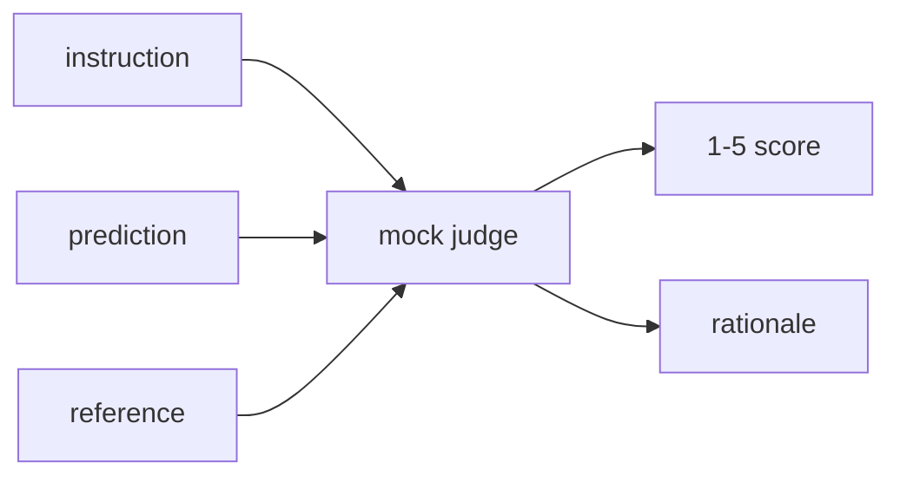
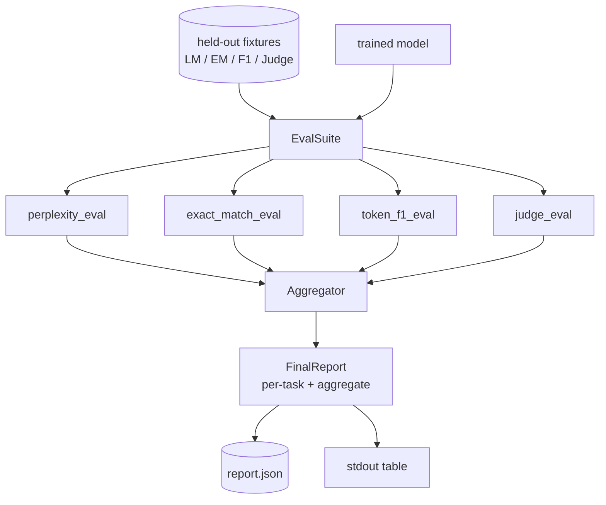

# 毕业设计课第41课：完整评估流水线

> 训练是你可以通过损失曲线监控的部分。评估是你必须设计的部分。本课构建一个统一的评估流水线，它接收任何训练好的语言模型，运行四种异构评估，将结果汇总为按任务划分的报告，并内置一个本地模拟的 LLM-as-Judge，使循环无需网络即可运行。这四种评估涵盖了每个发布模型所需的维度：语言建模（困惑度）、短答案正确性（精确匹配）、开放式相似度（Token F1）和定性评分（Judge）。

**类型：** 构建
**语言：** Python（torch，numpy）
**前置要求：** 阶段19 第30–37课（NLP LLM 方向：分词器、嵌入表、注意力模块、Transformer 主体、预训练循环、检查点、生成、困惑度）
**时间：** 约90分钟

## 学习目标

- 使用掩码 Token 计数在一个小型 Transformer 上计算留出集的困惑度。
- 在短答案事实性提示上运行精确匹配评估。
- 计算预测字符串与参考字符串之间经过归一化的 Token 级 F1。
- 构建一个本地模拟的 LLM-as-Judge，对模型输出进行1-5分评分。
- 将四种评估结果汇总为一份带权重的报告，包含每个任务的细分。

## 问题

单一指标从来无法描述一个语言模型。困惑度说明了模型对语言分布的拟合程度，但对它是否能回答问题只字不提。精确匹配说明了模型是否生成标准答案字符串，但会惩罚正确的同义改写。Token F1 容忍同义改写，但会被与错误内容词汇重叠的情况所迷惑。LLM-as-Judge 捕捉定性维度，但成本高且具有随机性。

你真正需要的流水线包含全部四种评估。每种评估覆盖了其他评估遗漏的一个维度。每种评估运行在根据该指标特点定制的不同留出数据子集上。最终报告并列显示每个任务的数值以及一个综合评分，使评审者可以一眼看出模型正在做哪些权衡。

本课将从头到尾在一个文件中构建这个流水线。

## 概念

```mermaid
flowchart LR
  Model[trained model] --> PPL[perplexity eval<br/>held-out LM]
  Model --> EM[exact-match eval<br/>factual short-form]
  Model --> F1[token F1 eval<br/>open-ended]
  Model --> J[mock judge<br/>1-5 scoring]
  PPL --> R[Report]
  EM --> R
  F1 --> R
  J --> R
  R --> A[(aggregate score)]
```

每种评估都是一个 `(model, dataset) -> EvalResult` 的函数。结果包含指标值、用于检查的每条示例详情以及用于汇总的名称。流水线通过一个配置将它们组合起来，该配置指定运行哪些评估以及如何分配权重。

## 正确计算的困惑度

困惑度是 `exp(mean negative log-likelihood per token)`。实现中有两个陷阱：

- 均值必须基于实际的 Token 位置，而不是基于批次 × 序列长度。填充 Token 必须从分母中排除，否则困惑度会显得比实际更好。
- 模型预测的是下一个 Token，因此位置 `i` 的 logits 预测的是位置 `i+1` 的 Token。这里的差一错误是无声的：损失仍然会训练，但指标变得毫无意义。

该评估计算每个批次中非填充位置上的 `-log p(token)` 之和以及每个批次的 Token 计数，最后再进行除法。这比平均每个批次的困惑度（会低估短序列的权重）在数值上更安全，并且与教科书定义一致。

## 精确匹配，带归一化

测试工具在比较前同时对预测和参考进行归一化：

- 转换为小写。
- 去除首尾空白。
- 将内部连续空白折叠为单个空格。
- 如果双方仅在标点上存在差异，则去掉末尾的句号（`.`、`!、`?`）。

归一化使精确匹配在实践中变得有用。说 `"Paris"` 的模型是正确的；说 `"Paris."` 也是正确的；说 `"  paris  "` 也是正确的。该指标仍然要求答案在归一化后是相同的字符串。

## Token F1，正确的方式

Token F1 是在词袋（bag-of-tokens）上计算的精确率（Precision）和召回率（Recall）的调和平均数。步骤：

1. 对预测和参考进行归一化（规则与精确匹配相同）。
2. 将每个字符串拆分为 Token 列表（按空白分词）。
3. 计算多重集合的交集。
4. 精确率 = `intersection_count / len(pred_tokens)`。召回率 = `intersection_count / len(ref_tokens)`。F1 = 调和平均数。

如果预测和参考都为空，F1 为1（空匹配）。如果只有一方为空，F1 为0。这种模式与 SQuAD 评估参考一致，并在同义改写中产生稳定的数值。

## 本地模拟 LLM-as-Judge

真正的 Judge 是位于 API 背后的前沿模型。在本课中，Judge 必须离线运行。模拟 Judge 是一个确定性评分器，它接收指令、模型的预测和参考，返回 `{1, 2, 3, 4, 5}` 范围内的分数以及一行文字的理由。评分规则是明确的：

- 5：归一化后的预测等于归一化后的参考。
- 4：预测与参考之间的 Token F1 至少为 0.8。
- 3：Token F1 在 `[0.5, 0.8)` 范围内。
- 2：Token F1 在 `[0.2, 0.5)` 范围内。
- 1：其他情况。

这不是一个真正的 Judge，但它有正确的接口。之后只需更改一个函数即可替换为真正的模型。流水线并不关心。

```mermaid
flowchart LR
  Inst[instruction] --> Judge[mock judge]
  Pred[prediction] --> Judge
  Ref[reference] --> Judge
  Judge --> Score[1-5 score]
  Judge --> Why[rationale]
```

## 汇总

综合评分是归一化后评估分数的加权平均值。每种评估报告其在 `[0, 1]` 范围内的数值：

- 困惑度：归一化为 `1 / (1 + log(perplexity))`。困惑度为1映射为1，无穷大映射为0。
- 精确匹配：已经在 `[0, 1]` 范围内。
- Token F1：已经在 `[0, 1]` 范围内。
- Judge：除以5。

权重是可配置的。默认组合为 0.2 困惑度、0.3 精确匹配、0.3 Token F1、0.2 Judge。权重的选择是一个产品决策；本课提供了可调节的参数以便你进行实验。

## 架构

```mermaid
flowchart TD
  Data[(held-out fixtures<br/>LM / EM / F1 / Judge)] --> Suite[EvalSuite]
  Model[trained model] --> Suite
  Suite --> PE[perplexity_eval]
  Suite --> EE[exact_match_eval]
  Suite --> FE[token_f1_eval]
  Suite --> JE[judge_eval]
  PE --> Agg[Aggregator]
  EE --> Agg
  FE --> Agg
  JE --> Agg
  Agg --> R[FinalReport<br/>per-task + aggregate]
  R --> JSON[(report.json)]
  R --> Pretty[stdout table]
```

`EvalSuite` 是一个精简的编排器。每个单独的评估是一个自由函数，接收 `(model, tokenizer, dataset, config)` 并返回一个 `EvalResult`。`Aggregator` 收集结果并生成最终报告。演示程序打印表格并写入一份 JSON 副本，供下游 CI 使用。

## 你将构建的内容

实现为一个 `main.py` 加测试。

1. `TinyGPT`：与第38-40课使用的相同的仅解码器架构，包含在本课中以便独立运行。
2. `InstructionTokenizer`：带有 INST / RESP / PAD 特殊标记的字节级分词器。
3. 四个固定数据集：一个 LM 语料库、一个 EM 集合、一个 F1 集合和一个 Judge 集合。每个包含二十个示例，确定性生成。
4. `perplexity_eval`：返回包含困惑度值和每个 Token 的损失直方图的 `EvalResult`。
5. `exact_match_eval`：返回平均 EM 值和每条示例的记录。
6. `token_f1_eval`：返回平均 Token F1 值和每条示例的记录。
7. `mock_judge` 和 `judge_eval`：每条示例的分数和理由，以及集合的平均分数。
8. `Aggregator.normalise`：每个评估的归一化规则。
9. `Aggregator.aggregate`：加权平均值和组装好的报告。
10. `run_demo`：短暂训练一个小型模型，运行全部四种评估，打印报告表格并写入 JSON，成功时以零退出。

## 阅读报告

报告有三层。顶层是综合评分。其下是四个各自评估的数值。再往下是每条示例的诊断细分。一个失败的 CI 运行通常需要综合评分，但追踪回归问题的评审者需要每条示例的细分，以了解模型在哪些输入上出错了。

JSON 输出使用稳定的键，以便 CI 仪表板可以跨版本绘制趋势线。格式化的表格供人类在训练运行后盯着终端查看。

## 拓展目标

- 添加校准评估：模型的 softmax 概率是否与其准确率匹配？按置信度对预测进行分桶，并报告每个桶的经验准确率。
- 添加鲁棒性评估：为每个示例添加扰动标签（拼写错误、同义改写、干扰项），并报告每个扰动下的指标下降情况。
- 将模拟 Judge 替换为通过 HTTP 调用的真实模型。函数签名不变。
- 添加每个任务的权重学习：不再使用固定权重，而是根据模型的目标偏好顺序拟合权重。

该实现提供了四种评估、汇总器和报告。真实的评估流水线会在其上层叠更多维度；模式保持不变：每个评估一个函数，一个汇总器，一份报告。
