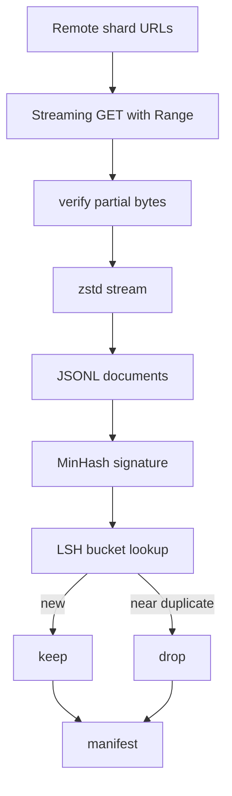

# 大規模 Corpus Downloader

> 言語モデル学習は最初の forward pass より前に始まる。corpus は disk に置かれ、展開され、重複排除され、途中失敗から resume できなければならない。このレッスンでは compressed shard を streaming download し、Zstandard で逐次展開し、MinHash + LSH で near-duplicate を検出し、後段が信頼できる shard manifest を書く。

**種類:** Build
**言語:** Python
**前提:** Phase 19 lessons 30-37
**時間:** 約 90 分

## 学習目標

- `urllib` で remote shard を streaming し、全体を memory に載せず `zstandard` で展開する。
- HTTP `Range` request と verified offset で partial download を resume する。
- 文書ごとに MinHash signature を作り、LSH bucket で near-duplicate を検出する。
- content hash、byte size、document count、dedup verdict を含む manifest を出力する。

## 問題

200 GB の corpus を落としている途中でネットワークが切れると、単純な `requests.get` では最初からやり直しになる。さらに exact hash だけでは、footer や header が少し違う同一文書を落とせない。最初から設計すべき失敗は、partial download resume と duplicate removal である。

Resume は HTTP の問題で、server は `Range` を受け、client は disk 上の verified bytes と checkpoint を照合する必要がある。Deduplication は signature の問題で、MinHash + locality-sensitive hashing により近い文書を sub-linear に探す。

## 概念



## 実装の要点

`StreamingDownloader` は shard 本体と `.partial.json` を持つ。checkpoint には `verified_bytes`、`expected_size`、`sha256_prefix`、source URL を保存する。起動時に disk 上の prefix hash を再計算し、一致した場合だけ resume する。不一致なら破損として最初から落とす。

`MinHasher` は text を shingle に分け、固定 seed 群から `k` 要素の signature を作る。`LSHIndex` は signature を band に分け、同じ band key に入る document を候補として返す。`Dedup` は `keep` または `near_duplicate` の verdict を manifest に残す。

## 実装

`code/main.py` は `ShardPlanner`、`StreamingDownloader`、`ZstdDocIterator`、`MinHasher`、`LSHIndex`、`Dedup`、`ManifestWriter` を実装する。demo は synthetic corpus を `.zst` に圧縮し、`file://` URL 経由で download して dedup し、manifest summary を表示する。

```bash
python3 code/main.py
```

## Production Patterns

- checkpoint は write-ahead log と同じ考え方で、append より前に durable にする。
- 全 corpus の LSH index を RAM に置かず、band hash で partition する。
- duplicate は削除ではなく tombstone として記録し、keeper との関係を残す。
- shard ごとの sha256 に加え、manifest 自体の sha256 も pin する。

## 演習

1. 主要なハイパーパラメータを 1 つ変え、出力がどう変わるかを記録する。
2. 失敗ケースを 1 つ追加し、現在の実装がそれを検出できるか確認する。
3. 生成される JSON に、後段の CI が使える追加メタデータを 1 つ入れる。
4. 実運用で必要になる監視指標を 1 つ足す。
5. このレッスンの成果物を次のフェーズの入力として使う手順を書き出す。

## 重要語

| 用語 | 意味 |
|------|------|
| fixture | 教材内で固定して使う小さな検証データ |
| manifest | 後段が信頼する成果物一覧とメタデータ |
| schema | JSON や checkpoint 形式のバージョンを示す文字列 |
| aggregate | 個別指標を重み付き、または平均でまとめた値 |

## 参考

- PyTorch と Python 標準ライブラリの公式ドキュメント。
- このフェーズの直前レッスンで扱った tokenizer、checkpoint、training loop。
- 実運用では、ここで作った小さな実装をそのまま信頼せず、失敗時の再実行と監査ログを追加する。
