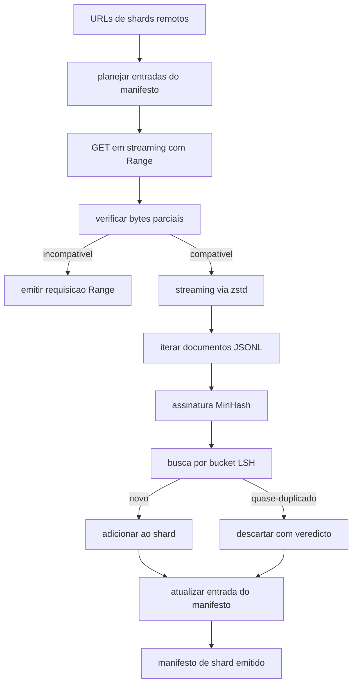

# Aula 42: Download de Corpus Grande

> Treinar um modelo de linguagem comeca muito antes do primeiro forward pass. O corpus precisa chegar no disco, descomprimido, deduplicado, e acessivel, com o historico de resume ja resolvido antes da rede cair aos 4 por cento. Esta aula constrói um downloader em streaming que puxa shards comprimidos, descomprime em tempo real com Zstandard, identifica quase-duplicados via MinHash mais locality-sensitive hashing, e escreve um manifesto de shard que o resto do pipeline pode confiar.

**Tipo:** Build
**Linguagens:** Python
**Prerequisitos:** Aulas 30-37 da Fase 19
**Tempo:** ~90 minutos

## Objetivos de Aprendizado

- Fazer streaming de shards remotos com `urllib` e descomprimir com `zstandard` sem armazenar o arquivo inteiro na memoria.
- Retomar downloads parciais emitindo requisicoes HTTP `Range` contra um offset de bytes verificado.
- Construir uma assinatura MinHash por documento e agrupa-lo com LSH para que quase-duplicados colidam.
- Emitir um manifesto de shard com hash de conteudo, tamanho em bytes, contagem de documento, e veredicto de dedup.

## O Problemo

A primeira vez que voce treina em um corpus de 200 GB a rede cai aos 41 por cento e o script sai com uma excecao `urllib`. A segunda vez cai aos 78 por cento. Aos 99 por cento voce ja reescreveu o loop tres vezes. As duas falhas que voce precisa projetar desde o primeiro minuto sao retomar download parcial e remocao de documentos duplicados. Ambas tem solucoes conhecidas; ambas sao rotineiramente ignoradas porque o pipeline comeca como uma chamada `requests.get` de uma linha que cresceu dentes.

Resume e um problema de HTTP. O servidor precisa aceitar `Range`, o cliente precisa rastrear o offset verificado contra um registro em disco, e o offset verificado precisa sobreviver a morte do processo. Se o offset e o arquivo divergirem por um unico byte o download retomado escreve lixo e o corpus e corrompido de um jeito que so aparece durante tokenizacao.

Deduplicacao e um problema de assinatura. Dedup por hash exato perde quase-duplicados: o mesmo artigo da Wikipedia aparece com tres rodapes diferentes de boilerplate, o mesmo arquivo de codigo com um cabecalho de licenca diferente, o mesmo post de blog com um parametro de rastreamento em cada link. MinHash mais LSH pega isso a custo sub-linear. O custo e uma assinatura por documento e uma busca por bucket por assinatura.

## O Conceito



### Streaming com `urllib`

`urllib.request.urlopen` da biblioteca padrao retorna um objeto semelhante a arquivo. Envola em um `zstandard.ZstdDecompressor().stream_reader` e os bytes fluem da rede pelo descompressor ate o iterador de documento sem nunca materializar o shard comprimido ou descomprimido na memoria. O unico custo de memoria e o buffer de linha, a assinatura MinHash do documento atual, e o indice LSH.

### Resume com `Range`

O downloader escreve dois arquivos por shard: o proprio shard e um checkpoint `.partial.json`. O checkpoint registra `verified_bytes`, `expected_size`, `sha256_prefix` (computado sobre os primeiros `verified_bytes` bytes), e a URL de origem. Ao iniciar o downloader le o checkpoint, recalcula `sha256_prefix` sobre os bytes em disco, e so retoma se o hash recalculado combinar. Se o hash estiver errado o parcial e descartado e o download reinicia do byte zero. Corrupcao silenciosa e impossivel porque os bytes verificados sao checados, nao presumidos.

### MinHash mais LSH

MinHash estima a similaridade de Jaccard de dois conjuntos em espaco fixo. Para um documento o conjunto sao os shingles (n-gramas sobrepostos) do texto. A assinatura e `k` valores minimos de hash, um por funcao de hash independente. Dois documentos com similaridade de Jaccard `s` tem probabilidade `s` de concordar em qualquer componente unico da assinatura.

LSH entao agrupa os `k` componentes em `b` bandas de `r` linhas cada, onde `k = b * r`. Dois documentos colidem em pelo menos uma banda com probabilidade `1 - (1 - s^r)^b`, que e um limiar agudo em torno do valor de `s` que voce sintoniza `(b, r)` para. O limiar tipico para dedup de corpus e `s = 0.8`, que a literatura de pesquisa LSH alcanca com `k = 128`, `b = 32`, `r = 4`.

### Manifesto de shard como contrato

O unico output duravel do downloader e o manifesto. O manifesto guarda, por shard, a URL, a contagem de bytes descomprimidos, a contagem de documentos, a contagem unica de documentos apos dedup, e o sha256 do shard final. A tokenizacao downstream le o manifesto, nao a listagem do diretorio. Se um shard estiver faltando ou seu sha256 estiver errado, o manifesto diz ao proximo estagio para recusar comecar. O manifesto e a aresta decisoria entre "o dados esta baixado" e "os dados estao baixados e verificaveis".

## Construa

`code/main.py` implementa:

- `ShardPlanner` - le uma lista de URLs de shards e produz entradas planejadas de manifesto.
- `StreamingDownloader` - abre um stream `urllib` com `Range` opcional, escreve em um arquivo temporario, atualiza o checkpoint `.partial.json` a cada chunk, e verifica o prefixo sha256 no resume.
- `ZstdDocIterator` - envolve o stream semelhante a arquivo em `zstandard.ZstdDecompressor` e rende um documento por linha.
- `MinHasher` - produz uma assinatura com `k` componentes para uma string usando uma familia fixa de seeds de hash.
- `LSHIndex` - agrupa assinaturas por banda e reporta colisoes.
- `Dedup` - combina hasher e indice para rotular cada documento `keep` ou `near_duplicate` junto com o id do shard correspondente.
- `ManifestWriter` - coleta estatisticas por shard e escreve `manifest.json`.

Um demo no final do arquivo constroi um corpus sintetico pequeno em disco, comprime com `zstandard`, faz download por uma URL `file://`, deduplica, e imprime o manifesto.

Execute:

```bash
python3 code/main.py
```

O script sai zero e imprime um resumo do manifesto.

## Padroes de Producao

Quatro padroes escalam esta aula para corpus reais.

**Checkpoint antes de escrever.** O `.partial.json` deve ser `fsync`-ed antes dos bytes serem adicionados ao shard. Caso contrario uma queda de energia inverte a ordem: bytes do shard no disco, checkpoint sem eles, o proximo resume acredita ter menos bytes verificados do que tem, os bytes duplicados de sufixo corrompem o arquivo. Checkpoint primeiro, depois escrever. E a mesma disciplina de um write-ahead log.

**Indice LSH compartilhado.** Um indice LSH unico sobre o corpus inteiro nao cabe na RAM na escala de 200 GB. Particione o indice LSH pela primeira hash de banda, armazene particoes em disco, e consulte apenas a particao onde uma nova assinatura cairia. O custo e uma leitura extra de disco por documento; o beneficio e que o indice LSH nao e mais um limite duro de memoria.

**Tombstone, nao deletar.** Duplicados descartados sao registrados no manifesto com veredicto `near_duplicate` e o id do shard do documento com o qual colidiram. Deleta-los perde a ligacao entre o duplicado e seu mantido. Tombstoning preserva a trilha de auditoria e permite que um passo downstream mude de ideia sobre o limiar.

**sha256 por shard no manifesto, mais um sha256 do manifesto.** O proprio manifesto recebe um hash de conteudo. Estagios downstream verificam o hash do manifesto antes de confiar nas entradas por shard. Sem isso o manifesto e a superficie de ataque silenciosa: um atacante que pode editar um unico arquivo pode corromper todo o pipeline.

## Use

Padroes de producao:

- **Resume em cada execucao de CI.** Executors de CI sao efemeros. O downloader precisa assumir um disco fresco a cada execucao e recuperar de cache ou remoto. `--cache-dir` e um flag de primeira classe.
- **Dedup antes da tokenizacao.** Tokenizacao e custosa. Roda-la duas vezes no mesmo documento e duas vezes o custo pela mesma curva de loss. Dedup e upstream da tokenizacao, nao downstream.
- **Manifesto como gate de merge.** A execucao de treino le o sha256 do manifesto de um commit fixado. Uma nova versao do dataset requer um novo commit de manifesto. A ligacao entre codigo e dados e git, nao folclore.

## Entregue

`outputs/skill-corpus-downloader.md` descreveria, em um projeto real, quais URLs alimentam o downloader, como o diretorio de checkpoint esta disposto, qual a largura de shingle e a triplet `(k, b, r)` que o dedup usa, e onde o manifesto vive no versionamento. Esta aula entrega o motor.

## Exercicios

1. Adicionar um flag `--shingle-width` e medir como o veredicto de dedup muda nas larguras 3, 5, 9. Defenda o padrao escolhido.
2. Adicionar suporte a gzip ao lado do zstd sniffando os magic bytes. O downloader nao deve exigir que o chamador eespecificaçãoifique o codec.
3. Adicionar um modo `--resume-only` que se recusa a comecar um download novo se nenhum checkpoint for encontrado. Util em CI para evitar que uma execucao re-puxe acidentalmente 200 GB.
4. Mover o indice LSH para um shelf ou arquivo sqlite e medir throughput versus a variante em memoria.
5. Adicionar uma checagem de sha256 do manifesto ao iniciar. O downloader deve falhar fechado se o manifesto no disco discordar do hash do manifesto em `manifest.lock`.

## Termos Chave

| Termo | O que as pessoas dizem | O que realmente significa |
|-------|------------------------|---------------------------|
| Shard | "Um arquivo" | Uma fatia autocontida do corpus com seu proprio sha256, usada como unidade de resume e dedup |
| Assinatura MinHash | "Fingerprint" | Um esboco de `k` componentes de um conjunto, onde cada componente e o minimo de uma hash independente sobre o conjunto |
| Banda LSH | "Bucket" | Um grupo de `r` componentes de assinatura usado como uma unica chave de bucket para deteccao de colisao |
| Bytes verificados | "Offset de resume" | Bytes em disco cujo prefixo sha256 bate com o checkpoint; o unico offset seguro para retomar |
| Manifesto | "O indice" | O registro duravel unico do que o downloader produziu, incluindo hashes de conteudo |

## Leitura Adicional

- [RFC 7233](https://datatracker.ietf.org/doc/html/rfc7233) - requisicoes HTTP Range, o protocolo de resume
- [Eespecificaçãoificacao do formato Zstandard](https://datatracker.ietf.org/doc/html/rfc8478) - formato de frame que torna streaming de descompressao seguro
- [MinHash](https://en.wikipedia.org/wiki/MinHash) - a familia de assinaturas que esta aula usa
- [Locality-sensitive hashing](https://en.wikipedia.org/wiki/Locality-sensitive_hashing) - o esquema de bandas por tras do limiar de dedup
- Fase 19 · 43 - o corpus tokenizado HDF5 que o alimenta
- Fase 19 · 44 - o agendamento coseno que treina no corpus
- Fase 19 · 45 - o loop AMP que consome o agendamento
