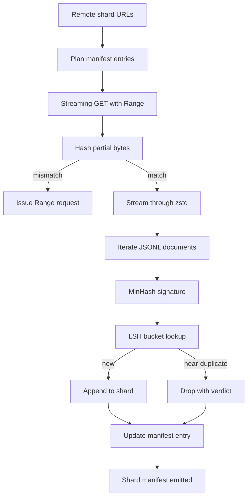

# Büyük Corpus İndirici

> Bir dil modelinin eğitimi, ilk ileri geçişten çok önce başlar. Ağ yüzde 4'e düşmeden önce özgeçmiş hikayesi zaten hazırlanmış olarak derlemin diske, sıkıştırılmamış, tekilleştirilmiş ve adreslenebilir bir şekilde ulaşması gerekiyor. Bu ders, sıkıştırılmış parçaları çeken, Zstandard ile anında sıkıştırmayı açan, MinHash ve yerelliğe duyarlı karma yoluyla neredeyse kopyaların parmak izlerini alan ve işlem hattının geri kalanının güvenebileceği bir parça bildirimi yazan bir akış indiricisi oluşturur.

**Tür:** Yapım
**Diller:** Python
**Önkoşullar:** Aşama 19 dersleri 30-37
**Süre:** ~90 dakika

## Öğrenme Hedefleri

- Uzak parçaları `urllib` ile aktarın ve tüm dosyayı bellekte arabelleğe almadan `zstandard` ile sıkıştırmayı açın.
- Doğrulanmış bir bayt uzaklığına karşı HTTP `Range` istekleri yayınlayarak kısmi indirmeleri sürdürün.
- Belge başına bir MinHash imzası oluşturun ve neredeyse kopyaların çarpışması için onu LSH ile paketleyin.
- İçerik karması, bayt boyutu, belge sayısı ve yinelenenleri kaldırma kararıyla birlikte bir parça bildirimi yayınlayın.

## Sorun

200 GB'lık bir derlem üzerinde ilk kez eğitim aldığınızda ağ yüzde 41'e düşer ve komut dosyası bir `urllib` istisnasıyla çıkar. İkinci seferde yüzde 78'e düşüyor. Yüzde 99 oranında döngüyü üç kez yeniden yazdınız. İlk dakikadan itibaren tasarlamanız gereken iki hata, kısmi indirme özgeçmişi ve yinelenen belgenin kaldırılmasıdır. Her ikisinin de iyi bilinen çözümleri var; her ikisi de rutin olarak atlanır çünkü boru hattı diş çıkaran tek satırlık bir `requests.get` çağrısı olarak başlar.

Devam etme bir HTTP sorunudur. Sunucunun `Range`'ı dikkate alması gerekir, istemcinin doğrulanmış ofseti diskteki bir kayıtla karşılaştırması gerekir ve doğrulanmış ofsetin süreç ölümünden sonra da hayatta kalması gerekir. Ofset ve dosya bir bayt bile farklılaşırsa, devam ettirilen indirme işlemi çöp yazar ve derlem yalnızca tokenizasyon sırasında ortaya çıkacak şekilde bozulur.

Tekilleştirme bir imza sorunudur. Tam karma tekilleştirme neredeyse kopyaları kaçırıyor: aynı Vikipedi makalesi üç farklı ortak metin altbilgisiyle, farklı bir lisans başlığıyla aynı kod dosyasıyla, her bağlantıda bir izleme parametresiyle aynı blog gönderisiyle görünüyor. MinHash artı LSH bunları doğrusal altı maliyetle yakalar. Maliyet, belge başına bir imza ve imza başına bir paket aramasıdır.

## Konsept



### `urllib` ile akış

Standart kitaplık `urllib.request.urlopen` dosya benzeri bir nesne döndürür. Bunu bir `zstandard.ZstdDecompressor().stream_reader` içine sarın ve baytlar, sıkıştırılmış parçayı veya sıkıştırılmış parçayı bellekte hiçbir zaman gerçekleştirmeden ağdan sıkıştırıcı aracılığıyla belge yineleyiciye akar. Tek bellek maliyeti satır arabelleği, geçerli belgenin MinHash imzası ve LSH indeksidir.

### `Range` ile devam et

İndirici, parça başına iki dosya yazar: parçanın kendisi ve bir `.partial.json` kontrol noktası. Kontrol noktası, `verified_bytes`, `expected_size`, `sha256_prefix` (ilk `verified_bytes` bayt üzerinden hesaplanır) ve kaynak URL'yi kaydeder. Başlangıçta indirici kontrol noktasını okur, diskteki baytlar üzerinden `sha256_prefix` 'yi yeniden hesaplar ve yalnızca yeniden hesaplanan karma eşleşirse devam eder. Karma yanlışsa kısmi atılır ve indirme bayt sıfırdan yeniden başlar. Doğrulanan baytlar varsayılmak yerine kontrol edildiğinden sessiz bozulma imkansızdır.

### MinHash artı LSH

MinHash, sabit uzaydaki iki kümenin Jaccard benzerliğini tahmin ediyor. Bir belge için küme, metnin zonalarından (örtüşen n-gram) oluşur. İmza, bağımsız karma işlevi başına bir tane olacak şekilde minimum `k` karma değeridir. Jaccard benzerliğine `s` sahip iki belgenin, imzanın herhangi bir bileşeni üzerinde anlaşmaya varma olasılığı `s` vardır.

LSH daha sonra `k` bileşenlerini her biri `r` satırdan oluşan `b` bantlara gruplandırır; burada `k = b * r`. İki belge en az bir bantta `1 - (1 - s^r)^b` olasılığıyla çarpışıyor; bu, `(b, r)` 'yı ayarladığınız `s` değeri civarında keskin bir eşiktir. Tipik derlem veri tekilleştirme eşiği, LSH araştırma literatürünün `k = 128`, `b = 32`, `r = 4` ile ulaştığı `s = 0.8`'tır.

### Shard'ın sözleşme olarak tezahür etmesi

İndiricinin tek kalıcı çıktısı manifesttir. Bildiri, parça başına URL'yi, sıkıştırılmış bayt sayısını, belge sayısını, tekilleştirmeden sonraki benzersiz belge sayısını ve son parça dosyasının sha256'sını içerir. Aşağı akış tokenizasyon dizin listesini değil manifest dosyasını okur. Bir parça eksikse veya sha256'sı yanlışsa manifest, bir sonraki aşamaya başlamayı reddetmesini söyler. Manifest, "verilerin indirilmesi" ile "verilerin indirilmesi ve doğrulanması" arasındaki belirleyici noktadır.

## Build It — Kendin Geliştir

`code/main.py` şunu uygular:

- `ShardPlanner` - parça URL'lerinin listesini okur ve planlı bildirim girişleri üretir.
- `StreamingDownloader` - isteğe bağlı `Range` ile bir `urllib` akışını açar, geçici bir dosyaya yazar, her parçadaki `.partial.json` kontrol noktasını günceller ve özgeçmişte sha256 önekini doğrular.
- `ZstdDocIterator` - dosya benzeri akışı `zstandard.ZstdDecompressor` içinde sarar ve satır başına bir belge verir.
- `MinHasher` - sabit bir karma tohum ailesini kullanarak bir dize için `k` bileşenli bir imza üretir.
- `LSHIndex` - imzaları banda göre gruplandırır ve çarpışmaları bildirir.
- `Dedup` - her belgeyi eşleşen parça kimliğiyle birlikte `keep` veya `near_duplicate` etiketlemek için karma ve dizini birleştirir.
- `ManifestWriter` - parça başına istatistikleri toplar ve `manifest.json` yazar.

Dosyanın altındaki demo, diskte küçük bir sentetik derlem oluşturur, bunu `zstandard` ile sıkıştırır, bir `file://` URL'si aracılığıyla indirir, tekilleştirir ve manifest dosyasını yazdırır.

Çalıştır:

```bash
python3 code/main.py
```

Betik sıfırdan çıkar ve bir bildirim özeti yazdırır.

## Üretim Modelleri

Dört model bu dersi gerçek derlemin ölçeğine göre ölçeklendirir.

**Yazmadan önce kontrol noktası.** Baytların parçaya eklenmesinden önce `.partial.json` 'nin `fsync`-ed edilmesi gerekir. Aksi halde güç kaybı sırayı tersine çevirir: diskteki parça baytları, bunlar olmadan kontrol noktası, sonraki özgeçmişte olduğundan daha az doğrulanmış bayt olduğuna inanır, kopyalanan sonek baytları dosyayı bozar. Önce kontrol noktası, sonra yazın. Bu, yazma öncesi günlüğüyle aynı disiplindir.

**Parçalanmış LSH dizini.** Tüm derlemeyi kapsayan tek bir LSH dizini, 200 GB ölçeğinde RAM'e sığmaz. LSH indeksini ilk bant karmasına göre bölümleyin, bölümleri diskte saklayın ve yalnızca yeni bir imzanın yerleşeceği bölüme başvurun. Maliyet, belge başına bir ekstra disk okumasıdır; Bunun faydası, LSH endeksinin artık bir sabit bellek tavanı olmamasıdır.

**Mezar taşı, silinmez.** Bırakılan kopyalar manifestte `near_duplicate` kararıyla ve çarpıştıkları belgenin parça kimliğiyle kaydedilir. Bunları silmek, kopya ile onun koruyucusu arasındaki bağlantıyı kaybeder. Mezar taşlama, denetim izini korur ve akış aşağı geçişin eşik hakkındaki fikrini değiştirmesine olanak tanır.

**Bildirimdeki parça başına sha256 artı bir manifest sha256.** Manifest'in kendisi bir içerik karması alır. Aşağı akış aşamaları, parça başına girişlere güvenmeden önce manifest karmasını doğrular. Bu olmadan manifest, sessiz saldırı yüzeyidir: Tek bir dosyayı düzenleyebilen bir saldırgan tüm boru hattını bozabilir.

## Use It — Hazır Araçla Uygula

Üretim modelleri:

- **Her CI çalıştırmasında devam edin.** CI koşucuları geçicidir. İndiricinin her çalıştırmada yeni bir disk varsayması ve önbellekten veya uzaktan kurtarma yapması gerekir. `--cache-dir` birinci sınıf bir bayraktır.
- **tokenleştirmeden önce tekilleştirme.** Tokenleştirme pahalıdır. Aynı belge üzerinde iki kez çalıştırmak, aynı kayıp eğrisinin maliyetinin iki katıdır. Tekilleştirme, tokenleştirmenin aşağısında değil, yukarısındadır.
- **Birleştirme kapısı olarak tezahür ettirin.** Eğitim çalıştırması, sabitlenmiş bir taahhütten sha256 manifestosunu okur. Yeni bir dataset sürümü, yeni bir bildirim taahhüdü gerektirir. Kod ve veri arasındaki bağlantı folklor değil git'tir.

## Ship It — Kullanıma Sun

`outputs/skill-corpus-downloader.md` , gerçek bir projede, indiriciyi hangi URL'lerin beslediğini, kontrol noktası dizininin nasıl düzenlendiğini, tekilleştirmenin hangi shingle genişliğini ve `(k, b, r)` üç katını kullandığını ve manifest'in sürüm kontrolünde nerede bulunduğunu açıklar. Bu ders motoru nakleder.

## Egzersizler

1. Bir `--shingle-width` bayrağı ekleyin ve tekilleştirme kararının 3, 5, 9 genişliklerinde nasıl değiştiğini ölçün. Seçilen varsayılanı savunun.
2. Sihirli baytları koklayarak zstd'nin yanına gzip desteğini ekleyin. İndirici, arayanın codec bileşenini belirtmesini gerektirmemelidir.
3. Hiçbir kontrol noktası bulunamazsa yeni bir indirme başlatmayı reddeden bir `--resume-only` modu ekleyin. Bir çalıştırmanın yanlışlıkla 200 GB'yi yeniden çekmesini önlemek için CI'da kullanışlıdır.
4. LSH dizinini bir rafa veya sqlite dosyasına taşıyın ve aktarım hızını ve bellek içi değişkeni ölçün.
5. Başlangıçta bir manifest sha256 kontrolü ekleyin. Diskteki manifest, `manifest.lock`'daki manifest karmasıyla uyuşmuyorsa indirici başarısız olarak kapatılmalıdır.

## Anahtar Terimler

| Dönem | İnsanlar ne diyor | Aslında ne anlama geliyor |
|------|-----------------|------------------------|
| Parça | "Bir dosya" | Özgeçmiş ve tekilleştirme birimi olarak kullanılan, kendi sha256'sına sahip, kendi kendine yeten bir derlem dilimi |
| MinHash imzası | "Parmak İzi" | Bir kümenin `k`-bileşenli taslağı; burada her bileşen, küme üzerindeki bir bağımsız karmanın minimumudur |
| LSH bandı | "Kova" | Çarpışma tespiti için tek bir paket anahtarı olarak kullanılan bir grup `r` imza bileşeni |
| Doğrulanmış bayt | "Ofsetmeye devam et" | Sha256 öneki kontrol noktasıyla eşleşen diskteki baytlar; devam ettirilebilecek tek güvenli konum |
| Manifesto | "Dizin" | İçerik karmaları da dahil olmak üzere, indiricinin ürettiği şeyin tek ve dayanıklı kaydı |

## Daha Fazla Okuma

- [RFC 7233](https://datatracker.ietf.org/doc/html/rfc7233) - HTTP Aralığı istekleri, devam ettirme protokolü
- [Zstandart format spesifikasyonu](https://datatracker.ietf.org/doc/html/rfc8478) - akışın sıkıştırmasını açmayı güvenli hale getiren çerçeve formatı
- [MinHash](https://en.wikipedia.org/wiki/MinHash) - bu dersin kullandığı imza ailesi
- [Yerelliğe duyarlı karma oluşturma](https://en.wikipedia.org/wiki/Locality-sensitive_hashing) - tekilleştirme eşiğinin arkasındaki bantlama şeması
- Aşama 19 · 43 - indiricinin beslediği HDF5 tokenleştirilmiş derleme
- Aşama 19 · 44 - derlem üzerinde eğitim veren kosinüs çizelgesi
- Aşama 19 · 45 - programı tüketen AMP döngüsü
