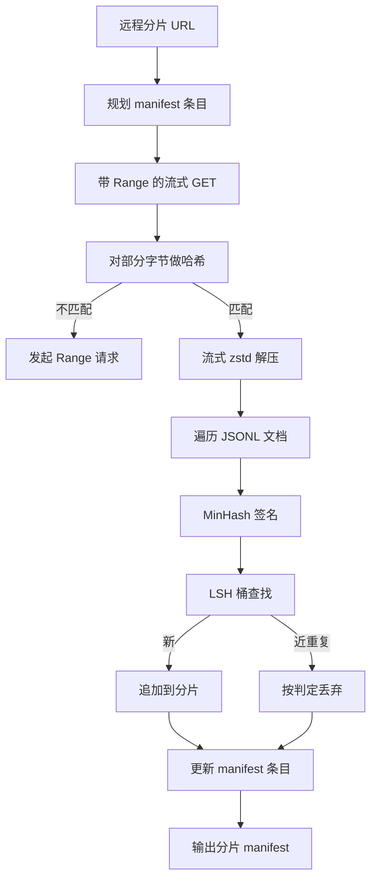

# 大规模语料下载器（Large Corpus Downloader）

> 译注：本文译自同目录 [`en.md`](./en.md)。术语遵循仓根 [TRANSLATION_GUIDE.md](../../../../TRANSLATION_GUIDE.md)。

> 训练一个语言模型，远在第一次前向传播之前就已经开始。语料必须先落到磁盘上，解压、去重、可寻址，而且 resume 故事得在网络在 4% 时掉线之前就想清楚。本课构建一个流式下载器：拉取压缩分片（shard），用 Zstandard 边下边解压，借助 MinHash 加 LSH（locality-sensitive hashing，局部敏感哈希）对近重复文档做指纹，并写出一个让管道下游可以信任的分片清单（manifest）。

**Type:** Build
**Languages:** Python
**Prerequisites:** Phase 19 lessons 30-37
**Time:** ~90 minutes

## 学习目标（Learning Objectives）

- 用 `urllib` 流式拉取远程分片，并用 `zstandard` 解压，过程中不把整个文件缓存到内存里。
- 通过对已校验过的字节偏移量发起 HTTP `Range` 请求，恢复（resume）部分下载。
- 为每个文档构建 MinHash 签名，并用 LSH 分桶，让近重复文档在桶里相撞。
- 输出一份分片 manifest，含内容哈希、字节大小、文档数量与去重 verdict（裁决）。

## 问题（The Problem）

第一次在 200 GB 语料上训练时，网络在 41% 掉线，脚本抛了一个 `urllib` 异常退出。第二次它在 78% 掉线。到 99% 时你已经把循环重写了三遍。从第一分钟起就要为之设计的两类失败是：部分下载的 resume，以及重复文档的剔除。两者都有成熟的解法；但两者也常被跳过，因为整条管道往往是从一行 `requests.get` 起步、然后慢慢长出獠牙的。

Resume 是个 HTTP 问题。服务器必须支持 `Range`，客户端必须把已校验过的偏移量与磁盘上的记录对齐，而这个已校验的偏移量必须在进程死亡后还活着。一旦偏移量和文件之间偏差哪怕一个字节，恢复后的下载就会写入垃圾，语料会被以一种只在 tokenization 阶段才暴露出来的方式悄悄污染。

去重是个签名问题。精确哈希去重抓不到近重复：同一篇维基百科文章带着三种不同的样板页脚出现，同一份代码文件带着不同的 license header 出现，同一篇博客文章每个链接上都挂着不同的跟踪参数。MinHash 加 LSH 能在亚线性代价下抓到这些。代价是每个文档一次签名、每个签名一次桶查找。

## 概念（The Concept）



### 用 `urllib` 做流式下载（Streaming with `urllib`）

标准库的 `urllib.request.urlopen` 返回一个类文件对象。把它包进 `zstandard.ZstdDecompressor().stream_reader`，字节就会从网络穿过解压器、流入文档迭代器，全程既不把压缩分片也不把解压分片实例化到内存里。唯一的内存代价是行缓冲、当前文档的 MinHash 签名，以及 LSH 索引本身。

### 用 `Range` 做断点续传（Resume with `Range`）

下载器为每个分片写两个文件：分片本身，以及一个 `.partial.json` checkpoint。checkpoint 记录 `verified_bytes`、`expected_size`、`sha256_prefix`（在前 `verified_bytes` 字节上计算）以及来源 URL。启动时下载器读取 checkpoint，在磁盘上的字节上重算 `sha256_prefix`，只有当重算的哈希匹配时才恢复下载。如果哈希不对，就丢弃这份 partial，从字节零重新开始。静默污染不可能发生，因为已校验字节是被检查过的，而非默认假设的。

### MinHash 加 LSH（MinHash plus LSH）

MinHash 在固定空间内估计两个集合的 Jaccard 相似度。对于一个文档，集合就是其文本的 shingles（重叠的 n-gram）。签名是 `k` 个最小哈希值，每个独立哈希函数贡献一个。两个 Jaccard 相似度为 `s` 的文档，在签名的任意一个分量上相同的概率即为 `s`。

之后 LSH 把这 `k` 个分量分成 `b` 个 band、每个 band `r` 行，其中 `k = b * r`。两个文档在至少一个 band 上相撞的概率为 `1 - (1 - s^r)^b`，这是一条围绕你针对 `(b, r)` 调出的 `s` 值的陡峭阈值曲线。语料去重的典型阈值是 `s = 0.8`，LSH 文献里达到此阈值的取值是 `k = 128`、`b = 32`、`r = 4`。

### 分片 manifest 即契约（Shard manifest as a contract）

下载器唯一持久的产出是 manifest。manifest 中每个分片记录：URL、解压后的字节数、文档数、去重后的唯一文档数，以及最终分片文件的 sha256。下游 tokenization 读 manifest，而不是读目录。如果某个分片缺失或它的 sha256 不对，manifest 会告诉下一阶段拒绝启动。manifest 是「数据下载完了」与「数据下载完了且可验证」之间的判决边界。

## 动手实现（Build It）

`code/main.py` 实现了：

- `ShardPlanner` —— 读取分片 URL 列表，产出计划好的 manifest 条目。
- `StreamingDownloader` —— 打开一个 `urllib` 流（可选 `Range`），写入临时文件，每个 chunk 都更新 `.partial.json` checkpoint，并在恢复时校验 sha256 前缀。
- `ZstdDocIterator` —— 把类文件流包进 `zstandard.ZstdDecompressor`，按行 yield 每个文档。
- `MinHasher` —— 用一组固定的哈希种子，为字符串生成 `k` 分量签名。
- `LSHIndex` —— 按 band 对签名分桶并报告碰撞。
- `Dedup` —— 把 hasher 和 index 组合起来，给每个文档打上 `keep` 或 `near_duplicate` 的标签，并附带匹配上的分片 id。
- `ManifestWriter` —— 收集每个分片的统计数据并写 `manifest.json`。

文件底部的 demo 在磁盘上构造一份小型合成语料，用 `zstandard` 压缩，通过一个 `file://` URL 下载、去重、并打印 manifest。

运行：

```bash
python3 code/main.py
```

脚本以 0 退出，并打印 manifest 摘要。

## 生产模式（Production Patterns）

四种模式可以把本课规模化到真实语料。

**先 checkpoint 再写。** `.partial.json` 必须在字节追加到分片之前 `fsync` 落盘。否则一次断电会反转顺序：分片字节落盘了、checkpoint 还没跟上，下次 resume 就以为自己已校验的字节比实际更少，重复写入的尾部字节会污染文件。先 checkpoint，再写入。这与 write-ahead log 的纪律是一致的。

**分片化的 LSH 索引（Sharded LSH index）。** 在 200 GB 规模下，一个覆盖整个语料的 LSH 索引装不进 RAM。按第一个 band 的 hash 把 LSH 索引分区，分区存到磁盘，新签名只查会落入的那一个分区。代价是每个文档多一次磁盘读；收益是 LSH 索引不再是硬性的内存上限。

**用墓碑标记，而非删除（Tombstone, not delete）。** 被丢弃的重复文档会以 verdict `near_duplicate` 记入 manifest，并附上撞上的那个文档所属的分片 id。直接删掉它们就丢失了重复者与保留者之间的链接。墓碑式记录保留了审计轨迹，也允许下游某一遍处理改变对阈值的判断。

**manifest 里每个分片有 sha256，再加上 manifest 自己的 sha256。** manifest 自身也得有内容哈希。下游阶段在信任各分片条目之前，先校验 manifest 哈希。没这层防护的话，manifest 就是最沉默的攻击面：能改一个文件的攻击者就能污染整条管道。

## 用起来（Use It）

生产模式：

- **每次 CI 运行都会触发 resume。** CI runner 是临时的。下载器必须假设每次都是一块崭新的磁盘，从缓存或远端恢复。`--cache-dir` 是一等公民标志位。
- **Tokenization 之前先去重。** Tokenization 很贵。在同一个文档上跑两遍是双倍代价换同一条 loss 曲线。去重在 tokenization 的上游，而不是下游。
- **manifest 作为合并门禁。** 训练任务从一个固定 commit 读取 manifest 的 sha256。新数据集版本需要一次新的 manifest commit。代码与数据之间的关联靠 git，而不是口耳相传。

## 上线部署（Ship It）

在真实项目里，`outputs/skill-corpus-downloader.md` 会描述：哪些 URL 喂给下载器、checkpoint 目录如何组织、去重用的 shingle 宽度与 `(k, b, r)` 三元组是多少、manifest 在版本控制里放在哪。本课交付的是引擎本身。

## 练习（Exercises）

1. 加一个 `--shingle-width` 标志位，测量在宽度 3、5、9 下去重 verdict 如何变化。为你选定的默认值辩护。
2. 在 zstd 旁边加上 gzip 支持，靠嗅探 magic bytes 来判别。下载器不应要求调用方指定 codec。
3. 加一个 `--resume-only` 模式：如果找不到 checkpoint，就拒绝启动一份全新的下载。在 CI 中很有用，能避免某一次运行不小心把 200 GB 重新拉一遍。
4. 把 LSH 索引迁移到 shelf 或 sqlite 文件里，对比一下吞吐与内存版的差距。
5. 启动时加一道 manifest sha256 校验。如果磁盘上的 manifest 与 `manifest.lock` 中的 manifest 哈希不一致，下载器应当 fail closed（默认拒绝）。

## 关键术语（Key Terms）

| 术语 | 大家口头怎么说 | 它实际意味着什么 |
|------|-----------------|------------------------|
| Shard（分片） | 「一个文件」 | 语料的一片自包含切片，带自己的 sha256，作为 resume 与去重的单位 |
| MinHash signature（MinHash 签名） | 「指纹」 | 集合的一个 `k` 分量草图，每个分量是该集合上一个独立哈希的最小值 |
| LSH band（LSH 段） | 「桶」 | 由 `r` 个签名分量组成、被作为单一桶键用于碰撞检测的一组 |
| Verified bytes（已校验字节） | 「resume 偏移量」 | 磁盘上那部分 sha256 前缀与 checkpoint 一致的字节；唯一安全的 resume 起点 |
| Manifest | 「索引」 | 下载器产出的唯一持久记录，含所有内容哈希 |

## 延伸阅读（Further Reading）

- [RFC 7233](https://datatracker.ietf.org/doc/html/rfc7233) —— HTTP Range 请求，resume 协议
- [Zstandard format specification](https://datatracker.ietf.org/doc/html/rfc8478) —— 让流式解压安全可行的 frame 格式
- [MinHash](https://en.wikipedia.org/wiki/MinHash) —— 本课所用的签名族
- [Locality-sensitive hashing](https://en.wikipedia.org/wiki/Locality-sensitive_hashing) —— 去重阈值背后的 banding 方案
- Phase 19 · 43 —— 下载器要喂的 HDF5 tokenized 语料
- Phase 19 · 44 —— 在该语料上训练用的 cosine schedule
- Phase 19 · 45 —— 消费该 schedule 的 AMP 训练循环
