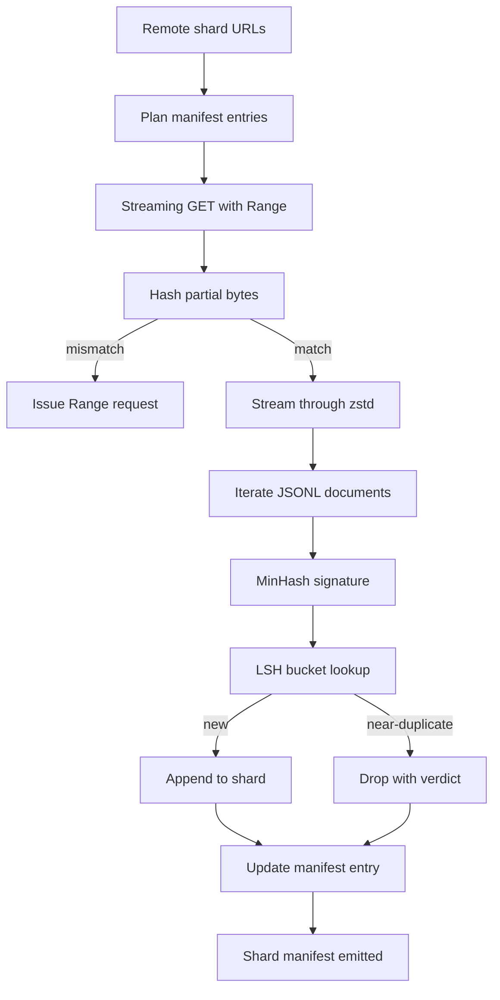

# 42 · 大规模语料下载器

> 训练语言模型的起点远早于第一次前向传播。语料必须先落盘、解压、去重、可寻址，在网络在 4% 处断开之前，断点续传逻辑就必须准备就绪。本课将构建一个流式下载器，它拉取压缩分片，通过 Zstandard 实时解压，借助 MinHash 与局部敏感哈希（LSH）对近似重复文档做指纹识别，并写出一个流水线后续环节可信赖的分片清单。

**类型：** 构建
**语言：** Python
**前置：** 第十九阶段第 30—37 课
**时长：** 约 90 分钟

## 学习目标

- 用 `urllib` 流式拉取远端分片，并用 `zstandard` 解压，而无需将整个文件缓冲到内存中。
- 通过向已验证的字节偏移量发出 HTTP `Range` 请求来恢复部分下载。
- 为每个文档构建 MinHash 签名并用 LSH 分桶，使近似重复文档发生碰撞。
- 输出分片清单，包含内容哈希、字节数、文档数量和去重判定。

## 问题

第一次训练 200 GB 语料时，网络在 41% 处断开，脚本抛出一个 `urllib` 异常退出。第二次在 78% 处断开。到 99% 的时候，你已经把循环重写了三遍。从第一分钟起就必须为之设计的两种失败模式是：部分下载恢复和重复文档去除。两者都有熟知的解法；两者通常都被跳过，因为流水线最初只是一行 `requests.get`，后来才逐渐长出獠牙。

断点续传是一个 HTTP 问题。服务器必须支持 `Range`，客户端必须根据磁盘记录跟踪已验证的偏移量，且已验证偏移量必须能在进程死亡后存活。如果偏移量与文件相差哪怕一个字节，恢复后的下载就会写入垃圾数据，语料会以一种直到分词阶段才暴露出来的方式损坏。

去重是一个签名问题。精确哈希去重会漏掉近似重复：同一篇维基百科文章带着三种不同的页脚模板出现、同一个代码文件带着不同的许可证头出现、同一篇博客每一条链接都带不同的追踪参数出现。MinHash 加 LSH 能以次线性成本捕捉到这些情况。代价是每个文档一个签名，每个签名一次桶查找。

## 概念



### 用 `urllib` 流式处理

标准库 `urllib.request.urlopen` 返回一个类文件对象。将其包裹在 `zstandard.ZstdDecompressor().stream_reader` 中，字节就从网络经过解压器流入文档迭代器，压缩分片或解压后的分片永远不会在内存中整体物化。唯一的内存开销是行缓冲区、当前文档的 MinHash 签名以及 LSH 索引。

### 用 `Range` 实现断点续传

下载器为每个分片写入两个文件：分片本身和一个 `.partial.json` 检查点文件。检查点记录了 `verified_bytes`、`expected_size`、`sha256_prefix`（基于前 `verified_bytes` 字节计算）以及源 URL。启动时，下载器读取检查点，对磁盘上的字节重新计算 `sha256_prefix`，只有重新计算的哈希值匹配时才进行续传。如果哈希值错误，则丢弃不完整数据，从第零字节重新开始下载。静默损坏是不可能的，因为已验证的字节是校验出来的，不是假定出来的。

### MinHash 加 LSH

MinHash 以固定空间估算两个集合的 Jaccard 相似度。对于文档而言，集合是其文本的词片（shingle，即重叠的 n-gram）。签名为 `k` 个最小哈希值，每个值对应一个独立的哈希函数。Jaccard 相似度为 `s` 的两个文档，在签名任意单个分量上一致的概率为 `s`。

LSH 随后将 `k` 个分量分为 `b` 个区间（band），每个区间含 `r` 行，其中 `k = b * r`。两个文档在至少一个区间中碰撞的概率为 `1 - (1 - s^r)^b`，该概率在你通过 `(b, r)` 调校的 `s` 阈值附近形成一个陡峭的阶跃。典型语料去重的阈值为 `s = 0.8`，根据 LSH 研究文献，使用 `k = 128`、`b = 32`、`r = 4` 即可达到此阈值。

### 分片清单即是合约

下载器唯一持久的输出是清单。清单中每个分片记录 URL、解压后字节数、文档数量、去重后唯一文档数量以及最终分片文件的 sha256 哈希。下游的分词环节读取清单，而非目录列表。如果某个分片缺失或其 sha256 不符，清单会告诉下一阶段拒绝启动。清单是"数据已下载"和"数据已下载且可验证"之间的判定边界。

## 动手构建

`code/main.py` 实现了：

- `ShardPlanner` — 读取分片 URL 列表并生成计划好的清单条目。
- `StreamingDownloader` — 打开带可选 `Range` 头的 `urllib` 流，写入临时文件，每写入一个块就更新 `.partial.json` 检查点，并在续传时验证 sha256 前缀。
- `ZstdDocIterator` — 将类文件流包裹在 `zstandard.ZstdDecompressor` 中，逐行产出文档。
- `MinHasher` — 使用固定的哈希种子家族，为字符串生成 `k` 分量签名。
- `LSHIndex` — 按区间对签名分桶，并报告碰撞。
- `Dedup` — 组合哈希器和索引，将每个文档标记为 `keep` 或 `near_duplicate`，并附带匹配到的分片 ID。
- `ManifestWriter` — 收集每个分片的统计信息，并写出 `manifest.json`。

文件底部提供了一个演示：在磁盘上构建一个小型合成语料，用 `zstandard` 压缩，通过 `file://` URL 下载，去重，并打印清单。

运行方式：

```bash
python3 code/main.py
```

脚本以零状态退出并打印清单摘要。

## 生产实践模式

以下四个模式能将本课扩展到真实语料。

**先写检查点再写数据。** `.partial.json` 必须在字节追加到分片之前完成 `fsync`。否则，断电会逆转顺序：分片字节已在磁盘上，但检查点没有记录它们，下一次恢复时认为已验证字节比实际少，重复的后缀字节会损坏文件。先写检查点，再写数据。这与预写日志（write-ahead log）是同一纪律。

**分区 LSH 索引。** 在 200 GB 规模下，覆盖整个语料的单个 LSH 索引放不进内存。按第一个区间的哈希值对 LSH 索引进行分区，将分区存储在磁盘上，仅查询新签名将落入的分区。代价是每个文档多一次磁盘读取；收益是 LSH 索引不再是硬性内存天花板。

**墓碑而非删除。** 被丢弃的重复文档在清单中以 `near_duplicate` 判定记录，并附带与之碰撞的文档分片 ID。直接删除会丢失重复文档与其保留文档之间的关联。墓碑化保留了审计追踪，并允许下游环节在后期更改阈值判定。

**清单中的每个分片 sha256，外加清单自身的 sha256。** 清单本身也需要一个内容哈希。下游环节在信任各个分片条目之前必须先验证清单哈希值。否则，清单就成了静默攻击面：能够编辑单个文件的攻击者就能破坏整个流水线。

## 使用场景

生产环境模式：

- **每次 CI 运行都续传。** CI 运行器是临时的。下载器必须假定每次运行都是全新的磁盘，并从缓存或远端恢复。`--cache-dir` 是一等命令行标志。
- **分词之前先去重。** 分词代价高昂。对同一文档跑两次分词意味着同样的 loss 曲线乘以两倍的代价。去重是分词的上游，不是下游。
- **清单作为合入关卡。** 训练任务从钉住的 commit 读取清单 sha256。新的数据集版本需要新的清单 commit。代码与数据之间的纽带是 git，而不是口头约定。

## 交付

在真实项目中，`outputs/skill-corpus-downloader.md` 会描述哪些 URL 供给下载器、检查点目录的布局、去重使用的词片宽度及 `(k, b, r)` 三元组，以及清单在版本控制中的位置。本课交付的是引擎本身。

## 练习

1. 添加 `--shingle-width` 标志，测量词片宽度为 3、5、9 时去重判定的变化。为你选择的默认值给出理由。
2. 通过嗅探魔数字节，在 zstd 旁边添加 gzip 支持。下载器不应要求调用方指定编解码器。
3. 添加 `--resume-only` 模式，在未找到检查点的情况下拒绝开始全新下载。在 CI 中用于防止某次运行意外重新拉取 200 GB。
4. 将 LSH 索引迁移到 shelf 或 sqlite 文件，并测量吞吐量相对于内存版本的变化。
5. 在启动时添加清单 sha256 校验。如果磁盘上的清单与 `manifest.lock` 中的清单哈希不一致，下载器应安全关闭。

## 关键术语

| 术语 | 人们怎么说 | 实际含义 |
|------|-----------|----------|
| 分片（Shard） | "一个文件" | 语料中自包含的一片，拥有自己的 sha256，用作断点续传和去重的单位 |
| MinHash 签名 | "指纹" | 一个集合的 `k` 分量草图，每个分量是该集合上某个独立哈希的最小值 |
| LSH 区间（LSH band） | "桶" | 作为单个桶键用于碰撞检测的一组 `r` 个签名分量 |
| 已验证字节（Verified bytes） | "续传偏移量" | 磁盘上 sha256 前缀与检查点匹配的字节；唯一安全的续传起点 |
| 清单（Manifest） | "索引" | 下载器产出的唯一持久化记录，包含内容哈希 |

## 扩展阅读

- [RFC 7233](https://datatracker.ietf.org/doc/html/rfc7233) — HTTP Range 请求，断点续传协议
- [Zstandard 格式规范](https://datatracker.ietf.org/doc/html/rfc8478) — 使流式解压安全的帧格式
- [MinHash](https://en.wikipedia.org/wiki/MinHash) — 本课使用的签名家族
- [局部敏感哈希](https://en.wikipedia.org/wiki/Locality-sensitive_hashing) — 去重阈值背后的分区方案
- 第十九阶段 · 第 43 课 — 下载器所供给的 HDF5 分词语料
- 第十九阶段 · 第 44 课 — 在该语料上训练的余弦调度
- 第十九阶段 · 第 45 课 — 消费该调度的 AMP 循环
