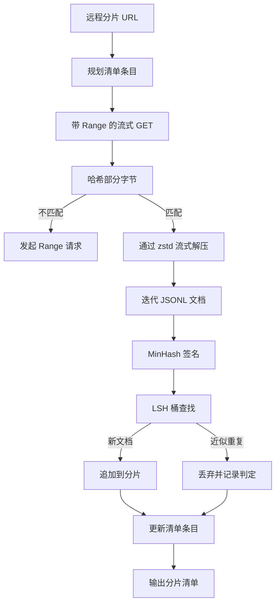

# 大型语料库下载器

> 训练语言模型的工作早在第一次前向传播之前就已开始。语料库必须落地到磁盘，完成解压缩、去重，并且可寻址，在训练网络在 4% 处中断之前，恢复方案已经准备就绪。本课程构建一个流式下载器，它能够拉取压缩分片、使用 Zstandard 即时解压缩、通过 MinHash 加局部敏感哈希识别近似重复文档，并写入一个供流水线其余部分信任的分片清单。

**类型：** 构建
**语言：** Python
**前置条件：** 第 19 阶段第 30-37 课
**时长：** ~90 分钟

## 学习目标

- 使用 `urllib` 流式拉取远程分片，并通过 `zstandard` 解压缩，无需将整个文件缓冲到内存中。
- 通过针对已验证的字节偏移量发起 HTTP `Range` 请求，恢复部分下载。
- 为每个文档生成 MinHash 签名，并通过 LSH 将其分桶，使近似重复文档发生碰撞。
- 输出包含内容哈希、字节大小、文档数量和去重判定结果的分片清单。

## 问题

当你第一次在一个 200 GB 的语料库上训练时，网络在 41% 处中断，脚本抛出 `urllib` 异常退出。第二次在 78% 处中断。到了 99% 时，你已经重写了三次循环。从第一分钟就必须设计的两个失败场景是：部分下载恢复和重复文档删除。两者都有成熟的解决方案；但两者通常都被跳过，因为流水线最初只是一行不断膨胀的 `requests.get` 调用。

恢复是一个 HTTP 问题。服务器必须支持 `Range`，客户端必须根据磁盘记录跟踪已验证的偏移量，并且已验证的偏移量必须在进程死亡后仍然存活。如果偏移量和文件相差哪怕一个字节，恢复后的下载就会写入垃圾数据，导致语料库损坏——这种损坏只有在分词时才会显现。

去重是一个签名问题。精确哈希去重会漏掉近似重复文档：同一篇维基百科文章带有三种不同的页脚模板，同一份代码文件带有不同的许可证头部，同一篇博客文章的每个链接都带有一个跟踪参数。MinHash 加 LSH 以亚线性成本捕获这些情况。代价是每个文档一个签名，每个签名一次桶查找。

## 概念


```mermaid
flowchart TD
  Source[远程分片 URL] --> Plan[规划清单条目]
  Plan --> Download[带 Range 的流式 GET]
  Download --> Verify[哈希部分字节]
  Verify -->|不匹配| Resume[发起 Range 请求]
  Verify -->|匹配| Decompress[通过 zstd 流式解压]
  Decompress --> Iterate[迭代 JSONL 文档]
  Iterate --> Sig[MinHash 签名]
  Sig --> Bucket[LSH 桶查找]
  Bucket -->|新文档| Keep[追加到分片]
  Bucket -->|近似重复| Drop[丢弃并记录判定]
  Keep --> Manifest[更新清单条目]
  Drop --> Manifest
  Manifest --> Done[输出分片清单]
```

### 使用 `urllib` 流式传输

标准库 `urllib.request.urlopen` 返回一个类文件对象。将其包装在 `zstandard.ZstdDecompressor().stream_reader` 中，字节流便从网络经由解压器流向文档迭代器，而压缩分片和解压后的分片都从未在内存中实体化。唯一的内存开销是行缓冲区、当前文档的 MinHash 签名以及 LSH 索引。

### 使用 `Range` 恢复

下载器为每个分片写入两个文件：分片本身和一个 `.partial.json` 检查点。检查点记录 `verified_bytes`（已验证字节数）、`expected_size`（期望大小）、`sha256_prefix`（在前 `verified_bytes` 字节上计算的 SHA256 前缀）以及源 URL。启动时，下载器读取检查点，在磁盘字节上重新计算 `sha256_prefix`，并且仅当重新计算出的哈希匹配时才恢复。如果哈希不匹配，则丢弃部分文件，从字节零重新开始下载。由于已验证的字节是经过检查而非假设的，静默损坏是不可能的。

### MinHash 加 LSH

MinHash 在固定空间中估算两个集合的 Jaccard 相似度。对于文档，集合是其文本的 shingle（重叠的 n-gram）。签名由 `k` 个最小哈希值组成，每个值对应一个独立的哈希函数。Jaccard 相似度为 `s` 的两个文档，在签名的任意单个分量上一致的概率为 `s`。

LSH 随后将 `k` 个分量分成 `b` 个波段，每个波段 `r` 行，其中 `k = b * r`。两个文档在至少一个波段中碰撞的概率为 `1 - (1 - s^r)^b`，这是在 `s` 值附近的一个尖锐阈值，你可以调整 `(b, r)` 来设定。典型语料库去重的阈值为 `s = 0.8`，LSH 研究文献中通过 `k = 128`、`b = 32`、`r = 4` 达到此阈值。

### 分片清单作为契约

下载器唯一的持久化输出是清单。清单中每个分片包含 URL、解压后的字节数、文档数量、去重后的唯一文档数量以及最终分片文件的 SHA256。下游的分词阶段读取清单，而不是目录列表。如果某个分片缺失或其 SHA256 不正确，清单会告知下一阶段拒绝启动。清单是"数据已下载"和"数据已下载且可验证"之间的决定性分界线。

## 构建

`code/main.py` 实现了：

- `ShardPlanner` - 读取分片 URL 列表并生成规划好的清单条目。
- `StreamingDownloader` - 打开带有可选 `Range` 的 `urllib` 流，写入临时文件，在每个数据块后更新 `.partial.json` 检查点，并在恢复时验证 SHA256 前缀。
- `ZstdDocIterator` - 将类文件流包装在 `zstandard.ZstdDecompressor` 中，逐行生成文档。
- `MinHasher` - 使用一组固定的哈希种子为字符串生成 `k` 分量签名。
- `LSHIndex` - 按波段对签名进行分桶并报告碰撞。
- `Dedup` - 结合哈希器和索引，将每个文档标记为 `keep`（保留）或 `near_duplicate`（近似重复），并附上匹配的分片 ID。
- `ManifestWriter` - 收集每个分片的统计信息并写入 `manifest.json`。

文件底部的演示在磁盘上构建一个小型合成语料库，使用 `zstandard` 压缩，通过 `file://` URL 下载，去重，并打印清单。

运行：

```bash
python3 code/main.py
```

脚本以零退出并打印清单摘要。

## 生产模式

以下四种模式可将本课程扩展到真实语料库。

**先写检查点再写数据。** `.partial.json` 必须在字节追加到分片之前 `fsync`。否则断电会导致顺序颠倒：分片字节已在磁盘上，检查点却没有包含它们，下一次恢复时会认为已验证字节数少于实际值，重复的后缀字节会损坏文件。先写检查点，再写数据。这与预写式日志（WAL）是同一原则。

**分片化的 LSH 索引。** 单个 LSH 索引在 200 GB 规模下无法容纳在 RAM 中。按第一个波段哈希对 LSH 索引进行分区，将分区存储在磁盘上，并且只查询新签名将落入的那个分区。代价是每个文档多一次磁盘读取；收益是 LSH 索引不再是一个硬性的内存上限。

**墓碑标记，而非删除。** 被丢弃的重复文档在清单中记录为 `near_duplicate`，并附上与之碰撞的文档的分片 ID。删除它们会丢失重复文档与其保留副本之间的链接。墓碑标记保留了审计追踪，并使下游阶段能够改变关于阈值的决定。

**清单中每个分片有 SHA256，外加一个清单 SHA256。** 清单本身也获得一个内容哈希。下游阶段在信任每个分片条目之前先验证清单哈希。没有这个机制，清单就是静默的攻击面：能够编辑单个文件的攻击者可以破坏整个流水线。

## 使用

生产模式：

- **每次 CI 运行都恢复。** CI 运行器是临时的。下载器必须假设每次运行都是一块全新的磁盘，并从缓存或远程恢复。`--cache-dir` 是一等标志。
- **在分词之前去重。** 分词代价高昂。对同一文档运行两次分词，成本翻倍却得到相同的损失曲线。去重在分词上游，而非下游。
- **清单作为合并门禁。** 训练运行从固定的提交中读取清单 SHA256。新的数据集版本需要新的清单提交。代码与数据之间的联系是 git，而非口头约定。

## 交付

在真实项目中，`outputs/skill-corpus-downloader.md` 将描述哪些 URL 供入下载器、检查点目录如何布局、去重使用什么 shingle 宽度和 `(k, b, r)` 参数，以及清单在版本控制中的存放位置。本课程交付的是引擎本身。

## 练习

1. 添加 `--shingle-width` 标志，测量在宽度为 3、5、9 时去重判定的变化，并论证所选默认值。
2. 通过嗅探魔数在 zstd 旁边添加 gzip 支持。下载器不应要求调用者指定编解码器。
3. 添加 `--resume-only` 模式，在未找到检查点时拒绝启动全新下载。在 CI 中很有用，可防止一次运行意外地重新拉取 200 GB 数据。
4. 将 LSH 索引迁移到 shelf 或 sqlite 文件，并测量与内存版本的吞吐量对比。
5. 在启动时添加清单 SHA256 检查。如果磁盘上的清单与 `manifest.lock` 中的清单哈希不一致，下载器应安全地拒绝运行。

## 关键术语

| 术语 | 通常说法 | 实际含义 |
|------|----------|----------|
| 分片（Shard） | "一个文件" | 语料库的一个自包含切片，带有自己的 SHA256，用作恢复和去重的基本单位 |
| MinHash 签名 | "指纹" | 一个集合的 `k` 分量概要，每个分量是集合上某个独立哈希函数的最小值 |
| LSH 波段 | "桶" | `r` 个签名分量组成的一组，用作碰撞检测的单个桶键 |
| 已验证字节 | "恢复偏移量" | 磁盘上其 SHA256 前缀与检查点匹配的字节；唯一安全的恢复起始偏移量 |
| 清单 | "索引" | 下载器产生的唯一持久化记录，包含内容哈希 |

## 延伸阅读

- [RFC 7233](https://datatracker.ietf.org/doc/html/rfc7233) - HTTP Range 请求，恢复协议
- [Zstandard 格式规范](https://datatracker.ietf.org/doc/html/rfc8478) - 使流式解压缩安全的帧格式
- [MinHash](https://en.wikipedia.org/wiki/MinHash) - 本课程使用的签名系列
- [局部敏感哈希](https://en.wikipedia.org/wiki/Locality-sensitive_hashing) - 去重阈值背后的分带方案
- 第 19 阶段 · 43 - 下载器所供给的 HDF5 分词语料库
- 第 19 阶段 · 44 - 在语料库上训练的余弦调度
- 第 19 阶段 · 45 - 消耗该调度的 AMP 循环
