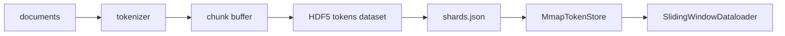

# HDF5 Tokenized Corpus

> Download した corpus は、trainer が線形速度で読める layout に変換する必要がある。このレッスンでは JSONL 文書を token 化し、resizable かつ chunked な HDF5 shard に書き込み、memory-mapped read と sliding-window dataloader を作る。

**種類:** Build
**言語:** Python (h5py, numpy)
**前提:** Phase 19 lesson 42
**時間:** 約 90 分

## 学習目標

- byte-level tokenizer で文書を整数列に変換する。
- token を chunk_size 単位で buffer し、HDF5 dataset を連続的に伸ばす。
- `token_count`、`document_count`、`sha256` を attribute と index に記録する。
- SWMR read で複数 worker が同じ shard を安全に読む形にする。
- flat token stream から `(input, target)` の sliding window batch を作る。

## 問題

JSONL は保存には便利だが、training hot path では毎回 parser が走る。trainer が欲しいのは O(1) random access できる整数 token stream である。HDF5 は chunked dataset、attribute、部分 slice read を提供するので、この用途に合う。

## 概念



chunk size は `window_size` の倍数にするのが基本である。sample が 1 つか 2 つの chunk に収まれば page cache に乗りやすい。末尾 chunk は部分的にしか埋まらないため、実 token 数は dataset shape から推測せず `token_count` attribute に保存する。

## 実装するもの

- `Tokenizer`: UTF-8 byte を 1..256 に写像し、0 を document boundary として予約する。
- `HDF5ShardWriter`: token を chunk 単位で flush し、最後に `token_count` と `sha256` を書く。
- `ShardedTokenizationPipeline`: source shard ごとに `.h5` を作り、`shards.json` を書く。
- `MmapTokenStore`: shard を開き、global offset から slice を読む。
- `SlidingWindowDataloader`: fixed length の input と 1-token shift target を返す。

```bash
python3 code/main.py
```

## 運用メモ

writer は 1 shard 1 process にし、reader 側は `swmr=True` で開く。boundary token を明示的に入れることで、trainer が文書境界を無音の連結ノイズとして学習するのを避ける。index の sha256 を検証してから training を開始する。

## 演習

1. 主要なハイパーパラメータを 1 つ変え、出力がどう変わるかを記録する。
2. 失敗ケースを 1 つ追加し、現在の実装がそれを検出できるか確認する。
3. 生成される JSON に、後段の CI が使える追加メタデータを 1 つ入れる。
4. 実運用で必要になる監視指標を 1 つ足す。
5. このレッスンの成果物を次のフェーズの入力として使う手順を書き出す。

## 重要語

| 用語 | 意味 |
|------|------|
| fixture | 教材内で固定して使う小さな検証データ |
| manifest | 後段が信頼する成果物一覧とメタデータ |
| schema | JSON や checkpoint 形式のバージョンを示す文字列 |
| aggregate | 個別指標を重み付き、または平均でまとめた値 |

## 参考

- PyTorch と Python 標準ライブラリの公式ドキュメント。
- このフェーズの直前レッスンで扱った tokenizer、checkpoint、training loop。
- 実運用では、ここで作った小さな実装をそのまま信頼せず、失敗時の再実行と監査ログを追加する。
