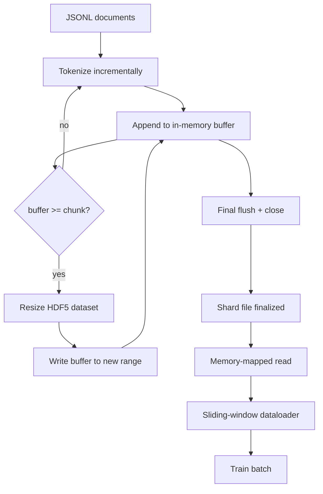

# HDF5 Tokenized Corpus

> İndirilen derlem, eğiticinin hat hızında yayın yapabileceği bir düzende yer almalıdır. Diskteki JSONL, 16 veri yükleyici çalışanından sağ çıkamaz. Yeniden boyutlandırılabilir, parçalanmış bir tam sayı olan dataset HDF5 bunu yapar. Bu ders, yeniden boyutlandırılabilir bir HDF5 dataset'e akış tokenleştirme, birden fazla dosyaya parçalı yazma, eğitim zamanında bellek eşlemeli okuma ve doğru paketlemeyle sabit uzunlukta diziler üreten kayan pencereli veri yükleyiciyi oluşturur.

**Tür:** Yapım
**Diller:** Python
**Önkoşullar:** Aşama 19 dersleri 30-37
**Süre:** ~90 dakika

## Öğrenme Hedefleri

- Belgeleri, deterministik parçalamayla yeniden boyutlandırılabilir bir HDF5 tamsayısına dataset aktarın.
- Yazmayı birden fazla HDF5 dosyasına bölün, böylece hata sınırlanır ve paralellik mümkün olur.
- token'lari HDF5'in sayfa önbelleğiyle desteklenen parçalanmış düzeni aracılığıyla geri okuyun, böylece veri yükleyici toplu arabelleklere yalnızca toplu iş zamanında kopyalar.
- Açık paketleme kurallarına sahip sabit uzunluklu eğitim dizileri yayan kayan pencereli bir veri yükleyici uygulayın.

## Sorun

Modern bir dil modeli eğitim çalıştırması, düzinelerce çalışan arasında saniyede yüz binlerce örnekte token'lari okur. Diskteki JSONL, ilk soğuk önbellek sayfa hatasında ölür: JSON ayrıştırıcısı yavaştır, belge sınırları adreslenebilir değildir ve "4,217,884 örneğini" aramak, dosyanın taranmasını gerektirir. İyi sıkıştırılan Parke bile uygun değildir çünkü eğitmen sütun istemez; O(1) rastgele erişimi olan düz bir token akışı istiyor.

HDF5 uygundur çünkü parçaları okuma zamanında sayfa önbelleği dostu olan, parçalanmış, yeniden boyutlandırılabilir, yalnızca tamsayılardan oluşan bir dataset sunar. Eğitmen bir dilim `tokens[3,200,000 : 3,200,8192]` ister ve HDF5, istenen hiperslab'ı sayfa önbelleğinden yeni tahsis edilmiş bir NumPy dizisine kopyalar. Maliyet, bir açık dosya tanıtıcısı ve çalışan başına parça boyutunda sayfa önbellek ayak izidir; bu, JSONL kod çözme maliyetiyle karşılaştırıldığında ihmal edilebilir düzeydedir.

Derleme sorunu yazma tarafını dürüst kılmaktır. Yeniden boyutlandırılabilir dataset'lerin kötüye kullanılması kolaydır: bir kerede bir belge yazarsanız HDF5 dosyası kullanılamaz noktaya kadar parçalanır. Tüm belgeleri tek bir yeniden boyutlandırmaya yazarsanız, işlem ölümü tüm parçayı kaybeder. Doğru disiplin, yığın boyutuyla eşleşen bir arabellek boyutu ve iş yükünü dosyalar arasında bölen parçalanmış bir yazma ile ara belleğe alma ve sonra genişletmedir, böylece bir çökme en fazla bir parçayı kaybeder.

## Konsept



### Yeniden boyutlandırılabilir HDF5 doğru yapıldı

token dataset, `maxshape=(None,)` ve sabit bir `chunks=(chunk_size,)` ile oluşturulur. Yazma, `chunk_size` uzunluğundaki bir NumPy dizisinde token'ları ara belleğe alarak ilerler. Arabellek dolduğunda, dataset tam olarak `chunk_size` kadar yeniden boyutlandırılır ve arabellek yeni aralığa yazılır. Parçanın sonunda kalan arabellek son kısmi aralığa yazılır. Okuyucuya parçanın HDF5 niteliklerinde kayıtlı `token_count` noktasında kesmesi söylenen sonuncusu dışında her yazma bitişik ve yığın hizalıdır.

### Parçalı yazma

Tek bir HDF5 dosyası tek bir hata noktasıdır. İşlem hattı parçaları paralel olarak yazar: Aşama 19 ders 42'deki her giriş parçası bir HDF5 çıkış parçası üretir. Bir `shards.json` dizini, parça başına dosya yolunu, token sayısını, belge sayısını ve token'lar üzerindeki sha256'yı kaydeder. Eğitmen global uzaklıkları hesaplamak ve derlemi doğrulamak için `shards.json` okur.

### Bellek eşlemeli okuma

Eğitim zamanında her çalışan kendi HDF5 dosyası paylaşımını `swmr=True` modunda açar ve `tokens[start:stop]`'yi ister. HDF5'in yığın düzeni, yığın ısındığında bunu sayfa önbelleği destekli bir okuma haline getirir. Çalışan hiçbir zaman dosyanın tamamını gerçekleştirmez: dilim, veri yükleyicinin toplu arabelleğine kopyalanır; veri yükleyici daha sonra bunu toplu iş zamanında sabitlenmiş bellek eğitim tensörüne kopyalar. Sıcak yolun parça geçişi başına bir sistem çağrısı vardır; geri kalan her şey RAM erişimidir.

### Kayar pencereli veri yükleyici

Veri yükleyici, eğitim dizisi uzunluğunu bilen tek aşamadır. Küresel token akışında rastgele bir başlangıç ​​dizini seçer, `window_size + 1` token'lari okur ve `(input, target) = (tokens[:-1], tokens[1:])` değerini döndürür. Belge sınırları zorunlu tutulmaz: Bir pencere, modelin ayırıcıyı kullanmayı öğrenmesi için aralarında açık bir `boundary_token_id` işareti olacak şekilde iki belgenin arasında yer alabilir. Bu standart paketleme kuralıdır; bu aynı zamanda yeni başlayan birinin de unuttuğu bir kuraldır; sonuçta yüzde 8'i eğitim sınırı token'lardan ve yüzde 92'si doğal metinden oluşan bir derlem elde edilir.

## Build It — Kendin Geliştir

`code/main.py` şunu uygular:

- `Tokenizer` - demo için yeterince iyi bayt düzeyinde deterministik bir tokenizer. Arayüz `encode(text) -> list[int]` ve `vocab_size`'dir.
- `HDF5ShardWriter` - yeniden boyutlandırılabilir bir dataset tamsayısını açar, token'lari yığın boyutuna tamponlar, yeniden boyutlandırır ve sabit boyutlu adımlarla yazar, kapanışta `token_count` ve `sha256` 'yi HDF5 nitelikleri olarak kaydeder.
- `ShardedTokenizationPipeline` - giriş belgelerini yineler, bunları bir yazıcıya yönlendirir ve bir `shards.json` dizini yayar.
- `MmapTokenStore` - bellek eşlemeli okumalar için parça dosyalarını açar, genel uzaklıkları hesaplar, tek bir `get_slice(start, stop)` API'yi kullanıma sunar.
- `SlidingWindowDataloader` - küresel akıştan rastgele pencereler seçer ve `(input_ids, target_ids)` NumPy dizisini verir.

Dosyanın alt kısmındaki bir demo, küçük bir bellek içi külliyat oluşturur, tokeniki parçaya bölünür, bunları bellek haritası aracılığıyla açar, veri yükleyiciyi 10 grup boyunca çalıştırır ve grup başına şekli ve bir sağlama toplamını yazdırır.

Çalıştır:

```bash
python3 code/main.py
```

Komut dosyası sıfırdan çıkar ve toplu sağlama toplamlarını yazdırır.

## Üretim Modelleri

Dört model bu dersi gerçek bir eğitim koşusuna ölçeklendirir.

**Parça boyutu tipik okumaya eşittir.** Eğitmen örnek başına `window_size + 1` tokens okur. HDF5 yığınını `window_size` 'nin katına ayarlayın; okumalar sayfa önbelleğiyle hizalanır. Eşleşmeyen parçalar verimi yarıya indirir çünkü her örnek iki parçaya dokunur.

**Token sayısı özniteliklerdedir, dataset'da değil.** dataset'in sondaki dilimi kısmen dolu olabilir çünkü yığın boyutu belge sınırını bölmez. Gerçek `token_count` 'yi dataset üzerinde bir HDF5 özelliği olarak saklayın ve okuyucunun bu değerde kesilmesini sağlayın. Bu olmadan okuyucu uçtan sıfır dolgulu token'lare doğru yürür ve model sıfırı tahmin etmeyi öğrenir.

**Paralel doğrulamayla parçalanmış sha256.** Her parçanın token bayt üzerinde kendi sha256'sı vardır. Eğitmen, eğitim başlamadan önce tüm parçaları paralel olarak doğrulayabilir. Yanlış bir sha256 koşuyu on altı saatten sonraki üçüncü aşamada değil, erken başarısızlığa uğratır.

**`swmr=True` her iki tarafta, yazıcıda `libver="latest"` ile.** Tek Yazarlı-Çoklu Okuyucu modu, yazarın `libver="latest"` ile açılmasını, her dataset'i önde oluşturmasını ve ardından `file.swmr_mode = True`'yi ayarlamasını gerektirir. Bundan sonra, okuyucu çalışanlarının ( `swmr=True` ile açılan) tutarlı verileri görmesi için yazarın her yeniden boyutlandırmadan sonra `dataset.flush()` 'yi çağırması gerekir. `libver="latest"` 'nın atlanması veya yapısal değişikliklerden sonra SWMR'nin etkinleştirilmesi, "dosya kilitli" hatalarının yaygın bir kaynağıdır.

## Use It — Hazır Araçla Uygula

Üretim modelleri:

- **Kaynak parça başına bir HDF5.** İndirici (ders 42) URL başına bir parça yayar; tokenleştirme (bu ders), kaynak parça başına bir HDF5 yayar. 1:1 eşleme, devam etmeyi ve kısmi arıza kurtarmayı önemsiz hale getirir.
- **Sınır token kimliği.** token sınırı, tokenizer kelime dağarcığının bir parçasıdır ve veri yükleyicinin enjekte ettiği tek token'tır. Modelin onu göz ardı etmesi gerekiyorsa, eğitim kaybı token sınırını maskeler; aksi halde onu sıra ayırıcı olarak kullanmayı öğrenir.
- **`shards.json` gerçeğin kaynağı olarak.** Yeni bir parça eklemek, HDF5'i yazmak, sha256'sını hesaplamak ve bir giriş eklemek anlamına gelir. Eğitmen başlangıçta dosyayı bir kez okur ve dizin listesine asla dokunmaz.

## Ship It — Kullanıma Sun

`outputs/skill-hdf5-tokenized-corpus.md` , gerçek bir projede, hangi tokenizer'nin ardışık düzeni beslediğini, eğiticinin penceresiyle hangi parça boyutunun eşleştiğini, `shards.json` 'nin sürüm kontrolünde nerede yaşadığını ve veri yükleyici çalışanlarının dosyalar arasında nasıl paylaştırıldığını açıklar. Bu ders motoru nakleder.

## Egzersizler

1. HDF5 yazıcısına bir `--compression gzip` bayrağı ekleyin ve demo külliyatındaki üretim maliyetini ölçün. Seçilen varsayılanı savun.
2. Kayan pencereli veri yükleyiciye deterministik bir tohum ekleyin ve aynı tohumla yapılan iki çalışmanın aynı partileri ürettiğini doğrulayın.
3. Her parçayı okuyan, sha256'yı token'ları üzerinden yeniden hesaplayan ve `shards.json` ile karşılaştıran bir `--validate` modu ekleyin. CI bunu eğitim başlamadan önce çalıştırmalıdır.
4. Veri yükleyicinin verimini pencere boyutunun yarısına eşit, yarısı ve iki katı boyutlarında karşılaştırın. Sayfa önbelleği etkisini bildirin.
5. Çok uzun belgeleri yazma sırasında kesen bir `--max-document-tokens` bayrağı ekleyin. Okuma zamanında karar verme konusunda tavizi savunun.

## Anahtar Terimler

| Dönem | İnsanlar ne diyor | Aslında ne anlama geliyor |
|------|-----------------|------------------------|
| Yeniden Boyutlandırılabilir dataset | "Yalnızca ekleme" | Parça boyutunda adımlarla `resize` çağrıları yoluyla büyüyen, `maxshape=(None,)` içeren bir HDF5 dataset |
| Parçalanmış düzen | "HDF5 bunu nasıl saklıyor" | Çekirdeğin hafıza eşlemesi yapabileceği ve veri yükleyicinin bitişik olarak okuyabileceği sabit boyutlu disk üzerindeki sayfalar |
| `swmr` modu | "Yazarken oku" | Veri yükleyici çalışanlarının dosyayı güvenli bir şekilde paylaşmasına olanak tanıyan Tek Yazarlı-Çoklu Okuyucu modu |
| Parça dizini | "shards.json" | Dengeler ve içerik karmaları ile tüm token parçanın dayanıklı dizini |
| Sürgülü pencere | "Eğitim örneği" | Eğitmenin birer birer kaydırma hedefiyle eşleştirdiği küresel token akışının sabit uzunlukta bir dilimi |

## Daha Fazla Okuma

- [HDF5 parçalama belgeleri](https://support.hdfgroup.org/documentation/hdf5/latest/hdf5_chunking.html) - bu dersin kullandığı parçalanmış, yeniden boyutlandırılabilir dataset düzeni
- [h5py kullanım kılavuzu](https://docs.h5py.org/en/stable/) - HDF5 için Python bağlamaları
- [NumPy bellek eşlemesi](https://numpy.org/doc/stable/reference/generated/numpy.memmap.html) - okuma tarafı ilkel HDF5, h5py aracılığıyla kullanıma sunulur
- Aşama 19 · 42 - çıktısını bu derste tokenoluşturan indirici
- Aşama 19 · 44 - bu veri yükleyiciyi tüketen kosinüs planı
- Aşama 19 · 45 - eğitim adımını tamamlayan AMP döngüsü
