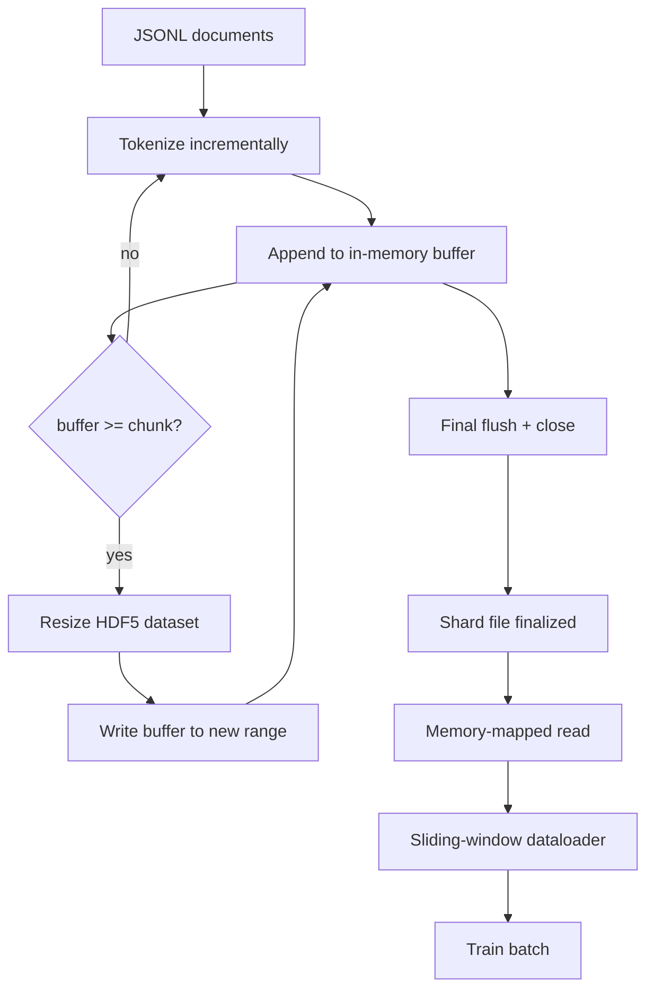

# 43 · HDF5 分词语料库

> 下载好的语料库必须以训练器能够线性速度流式读取的布局落盘。磁盘上的 JSONL 经不住 16 个数据加载器工作进程同时读取。而带有可伸缩、分块整型数据集的 HDF5 则可以。本课将构建流式分词并将其写入可伸缩 HDF5 数据集，实现跨多个文件的分片写入、训练时的内存映射读取，以及一个生成固定长度序列并正确打包的滑动窗口数据加载器。

**类型：** 构建
**语言：** Python
**前置：** 第 19 阶段第 30-37 课
**时长：** 约 90 分钟

## 学习目标

- 将文档流式写入带有确定性分块（deterministic chunking）的可伸缩 HDF5 整型数据集。
- 将写入分片（shard）到多个 HDF5 文件中，使故障范围可控且可并行化。
- 通过 HDF5 基于页缓存（page-cache）的分块布局读取 token，使数据加载器仅在取批次（batch）时将数据拷贝到批次缓冲区。
- 实现一个滑动窗口数据加载器，以明确的打包规则输出固定长度的训练序列。

## 问题所在

现代语言模型训练以每秒数十万样本的速率、跨数十个工作进程读取 token。磁盘上的 JSONL 在第一次冷缓存缺页（cold-cache page fault）时就撑不住了：JSON 解析器很慢，文档边界不可寻址，且要定位到"第 4,217,884 号样本"必须扫描整个文件。即使是压缩效果不错的 Parquet 也不合适，因为训练器不想要列；它想要一个支持 O(1) 随机访问的平坦 token 流。

HDF5 之所以适合，是因为它提供了分块、可伸缩、仅整型的数据集，其分块在读取时对页缓存友好。训练器请求一段 `tokens[3,200,000 : 3,200,8192]`，HDF5 便将请求的超切片（hyperslab）从页缓存拷贝到一个新分配的 NumPy 数组中。每个工作进程的代价只是一个打开的文件句柄和一个分块大小的页缓存占用量，与解码 JSONL 的成本相比微不足道。

构建层面的问题在于让写入侧保持诚实。可伸缩数据集很容易用错：逐文档写入会导致 HDF5 文件碎片化到不可用的程度；一次性扩容写入所有文档，则进程崩溃会丢掉整个分片。正确的规范是"先缓冲再扩展"（buffer-then-extend），缓冲区大小与分块大小匹配，并通过分片写入将工作负载拆分到多个文件中，这样一次崩溃最多损失一个分片。

## 核心概念



### 正确使用可伸缩 HDF5

token 数据集在创建时指定 `maxshape=(None,)` 和固定的 `chunks=(chunk_size,)`。写入过程将 token 缓冲在一个长度为 `chunk_size` 的 NumPy 数组中。当缓冲区填满时，数据集恰好扩展 `chunk_size`，缓冲区中的数据被写入新扩展的范围。在分片结束时，残余缓冲区被写入最后一个部分范围。每次写入都是连续且分块对齐的，仅最后一次例外——读取器被告知按照该分片 HDF5 属性中记录的 `token_count` 截断。

### 分片写入

单个 HDF5 文件是单点故障。流水线并行写入分片：第 19 阶段第 42 课产出的每个输入分片对应生成一个 HDF5 输出分片。一个 `shards.json` 索引文件按分片记录文件路径、token 数量、文档数量和 token 的 sha256 哈希值。训练器读取 `shards.json` 来计算全局偏移并校验语料库。

### 内存映射读取

在训练时，每个工作进程以 `swmr=True` 模式打开其负责的 HDF5 文件，并请求 `tokens[start:stop]`。HDF5 的分块布局使得一旦分块变热（hot），读取就是由页缓存支撑的。工作进程从不将整个文件物化到内存：切片被拷贝到数据加载器的批次缓冲区中，然后数据加载器在取批次时将其拷贝到锁页内存（pinned-memory）训练张量中。热路径上每次跨分块边界有一次系统调用；其余全部是内存访问。

### 滑动窗口数据加载器

数据加载器是唯一知道训练序列长度的阶段。它在全局 token 流中随机选取一个起始索引，读取 `window_size + 1` 个 token，然后返回 `(input, target) = (tokens[:-1], tokens[1:])`。不强制遵守文档边界：一个窗口可能跨两个文档，二者之间有一个显式的 `boundary_token_id`，使模型学会使用分隔符。这是标准的打包规则；也是初学者容易忘记的规则，否则最终语料库会变成 8% 的训练边界 token 和 92% 的自然文本。

## 动手构建

`code/main.py` 实现了：

- `Tokenizer` —— 一个字节级确定性分词器，足以用于演示。接口为 `encode(text) -> list[int]` 和 `vocab_size`。
- `HDF5ShardWriter` —— 打开一个可伸缩整型数据集，将 token 缓冲至分块大小，以固定步长扩容并写入，关闭时将 `token_count` 和 `sha256` 记录为 HDF5 属性。
- `ShardedTokenizationPipeline` —— 遍历输入文档，将其路由到 writer，并产出 `shards.json` 索引。
- `MmapTokenStore` —— 打开分片文件进行内存映射读取，计算全局偏移，对外暴露单一的 `get_slice(start, stop)` API。
- `SlidingWindowDataloader` —— 从全局流中随机选取窗口，产出 `(input_ids, target_ids)` NumPy 数组。

文件底部的演示构建了一个小型内存语料库，分词写入两个分片，通过内存映射打开，运行数据加载器产生 10 个批次，并打印每个批次的形状和校验和。

运行：

```bash
python3 code/main.py
```

脚本以零退出码结束并打印批次校验和。

## 生产级模式

以下四个模式可将本课扩展到真实训练运行中。

**分块大小等于典型读取大小。** 训练器每个样本读取 `window_size + 1` 个 token。将 HDF5 分块设为 `window_size` 的整数倍，读取就是页缓存对齐的。分块大小不匹配会使吞吐量减半，因为每个样本会跨越两个分块。

**token 数量存在属性中而非数据集中。** 数据集的尾部切片可能部分填满，因为分块大小不能整除文档边界。将真实的 `token_count` 存储为数据集的 HDF5 属性，让读取器按该值截断。否则读取器会越界读到零填充的 token，模型就会学会预测零。

**分片 sha256 并行校验。** 每个分片都有自己基于 token 字节的 sha256 哈希。训练器可以在训练开始前并行校验所有分片。sha256 不匹配会在早期使运行失败，而不是在第十六小时后第三个 epoch 时才暴露。

**读写两侧均开启 `swmr=True`，写入侧使用 `libver="latest"`。** 单写多读（Single-Writer-Multiple-Reader）模式要求写入侧以 `libver="latest"` 打开，预先创建所有数据集，然后设置 `file.swmr_mode = True`。此后写入侧必须在每次 `resize` 后调用 `dataset.flush()`，以便读取侧工作进程（以 `swmr=True` 打开）看到一致的数据。跳过 `libver="latest"` 或在结构变更后才启用 SWMR 是"文件被锁定"故障的常见根源。

## 投入使用

生产模式要点：

- **每个源分片对应一个 HDF5 文件。** 下载器（第 42 课）每个 URL 产出一个分片；分词（本课）每个源分片产出一个 HDF5。1:1 映射使得断点续传和局部故障恢复变得简单。
- **边界 token ID。** 边界 token 是分词器词表的一部分，也是数据加载器唯一注入的 token。如果模型应该忽略边界 token，训练损失需要对其做掩码处理；否则模型会学会将其用作序列分隔符。
- **`shards.json` 作为唯一真相源。** 添加新分片意味着写入 HDF5、计算其 sha256 并追加一条记录。训练器在启动时读取一次该文件，之后不再触碰目录列表。

## 交付

在真实项目中，`outputs/skill-hdf5-tokenized-corpus.md` 将描述：哪个分词器为流水线提供输入、什么分块大小匹配训练器的窗口、`shards.json` 在版本控制中的存放位置，以及数据加载器工作进程如何跨文件分片。本课交付的是引擎本身。

## 练习

1. 给 HDF5 writer 添加一个 `--compression gzip` 标志，并在演示语料库上测量吞吐量代价。为你选择的默认值做出辩护。
2. 给滑动窗口数据加载器添加确定性种子，验证两次使用相同种子的运行产生完全相同的批次。
3. 添加一个 `--validate` 模式：读取每个分片，重新计算其 token 的 sha256，并与 `shards.json` 比对。CI 应在训练开始前运行此项检查。
4. 比较分块大小等于窗口大小、为窗口大小的一半、为窗口大小的两倍时的数据加载器吞吐量。报告页缓存效应。
5. 添加一个 `--max-document-tokens` 标志，在写入时截断超长文档。为优先在写入时截断而非在读取时决定的取舍做出辩护。

## 关键术语

| 术语 | 人们怎么说 | 实际含义 |
|------|-----------|---------|
| 可伸缩数据集（Resizable dataset） | "仅追加" | 一个带有 `maxshape=(None,)` 的 HDF5 数据集，通过按分块大小步长调用 `resize` 来增长 |
| 分块布局（Chunked layout） | "HDF5 的存储方式" | 固定大小的磁盘页面，内核可以内存映射，数据加载器可以连续读取 |
| `swmr` 模式 | "边写边读" | 单写多读模式，使数据加载器工作进程可以安全地共享文件 |
| 分片索引（Shard index） | "shards.json" | 所有 token 分片的持久化索引，包含偏移量和内容哈希 |
| 滑动窗口（Sliding window） | "训练样本" | 全局 token 流的一个固定长度切片，训练器将其位移一位作为目标配对 |

## 延伸阅读

- [HDF5 分块文档](https://docs.hdfgroup.org/hdf5/v1_14/) —— 本课使用的分块、可伸缩数据集布局
- [h5py 用户指南](https://docs.h5py.org/en/stable/) —— HDF5 的 Python 绑定
- [NumPy 内存映射](https://numpy.org/doc/stable/reference/generated/numpy.memmap.html) —— HDF5 通过 h5py 暴露的读取侧原语
- 第 19 阶段 · 第 42 课 —— 本课所分词内容的下载器
- 第 19 阶段 · 第 44 课 —— 消费本数据加载器的余弦调度
- 第 19 阶段 · 第 45 课 —— 包装训练步骤的 AMP 循环
