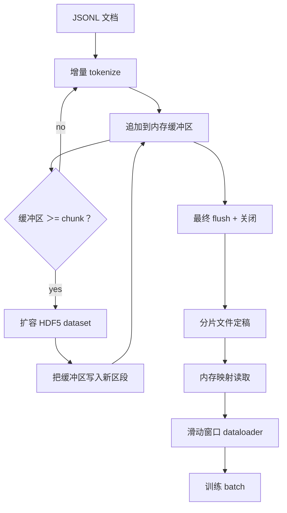

# HDF5 Tokenized Corpus（HDF5 化的 token 语料）

> 译注：本文译自同目录 [`en.md`](./en.md)。术语遵循仓根 [TRANSLATION_GUIDE.md](../../../../TRANSLATION_GUIDE.md)。

> 下载来的语料必须落到一种 trainer 能以线速流式读取的布局里。磁盘上的 JSONL 撑不过 16 个 dataloader worker。HDF5 加上一个可扩展的 chunked 整数 dataset（数据集）就能撑住。本课要构建的是：把流式 tokenization（分词）写入一个可扩展的 HDF5 dataset、跨多文件做分片写入（sharded write）、训练时做内存映射读取，再加一个滑动窗口 dataloader，按正确的 packing 规则吐出固定长度的序列。

**Type:** Build
**Languages:** Python
**Prerequisites:** Phase 19 lessons 30-37
**Time:** ~90 minutes

## 学习目标（Learning Objectives）

- 把文档以流式方式写入一个可扩展的 HDF5 整数 dataset，并保证确定性的 chunking。
- 把写入分片到多个 HDF5 文件，让失败影响有界、并能并行处理。
- 借助 HDF5 由 page cache 支撑的 chunked 布局把 token 读回来，让 dataloader 只在 batch 时刻才把数据拷进 batch buffer。
- 实现一个滑动窗口 dataloader，按显式的 packing 规则吐出固定长度的训练序列。

## 问题（The Problem）

现代语言模型训练每秒要在数十个 worker 上读上几十万样本的 token。磁盘上的 JSONL 在第一次冷 cache 缺页时就死给你看：JSON 解析慢、文档边界不可寻址、想跳到「第 4,217,884 个样本」就得扫一遍文件。即便是压缩友好的 Parquet 也不合适，因为 trainer 并不想要列；它要的是一条扁平的 token 流，并且能 O(1) 随机访问。

HDF5 合适，是因为它提供了一种 chunked、可扩展、纯整数的 dataset，它的 chunk 在读取时对 page cache 友好。trainer 来要 `tokens[3,200,000 : 3,200,8192]` 这一片，HDF5 就把请求的 hyperslab 从 page cache 拷进一块新分配的 NumPy 数组里。代价是每个 worker 一个文件句柄、一个 chunk 大小级别的 page cache 占用——比解 JSONL 的代价小到可以忽略。

构建侧的难点在于把写入做老实。可扩展 dataset 太容易被滥用：每写一个文档就 resize 一次，HDF5 文件会被切碎到没法用；把所有文档攒到一次 resize 里写，进程一挂整个 shard 就没了。正确的纪律是「先 buffer 再 extend」，buffer 大小对齐 chunk 大小，并把任务做成跨文件的分片写入，这样一次崩溃最多损失一个 shard。

## 概念（The Concept）



### 把可扩展 HDF5 用对（Resizable HDF5 done right）

token dataset 创建时用 `maxshape=(None,)` 加固定的 `chunks=(chunk_size,)`。写入时把 token buffer 在一块长度为 `chunk_size` 的 NumPy 数组里。buffer 满了，就把 dataset 精确 resize 一个 `chunk_size`，再把 buffer 写到新出来的那段 range。shard 收尾时把残余 buffer 写到最后一段不完整的 range。除了最后一段以外，每次写入都是连续且 chunk 对齐的；最后一段则由 reader 根据 shard HDF5 attribute 里记录的 `token_count` 截断。

### 分片写入（Sharded write）

单一 HDF5 文件就是单点故障。流水线把 shard 并行地写：Phase 19 lesson 42 给出的每一个输入 shard 对应产出一个 HDF5 输出 shard。一个 `shards.json` 索引按 shard 记下文件路径、token 数、文档数，以及对 token 算的 sha256。trainer 读 `shards.json` 来计算全局 offset 并校验语料。

### 内存映射读取（Memory-mapped read）

训练时每个 worker 用 `swmr=True` 模式打开自己分到的 HDF5 文件，向它要 `tokens[start:stop]`。一旦 chunk 热起来，HDF5 的 chunk 布局就让这次读取走 page cache。worker 永远不会把整个文件物化进内存：切片被拷进 dataloader 的 batch buffer，再由 dataloader 在 batch 时刻拷进一块 pinned-memory 的训练张量。热路径上每跨一次 chunk 才有一次 syscall，其它都是 RAM 访问。

### 滑动窗口 dataloader（Sliding-window dataloader）

dataloader 是唯一关心训练序列长度的环节。它在全局 token 流里挑一个随机起点，读 `window_size + 1` 个 token，返回 `(input, target) = (tokens[:-1], tokens[1:])`。文档边界并不强制：一个 window 可以横跨两个文档，中间塞一个显式的 `boundary_token_id`，让模型学会用这个分隔符。这是标准的 packing 规则；也是新手最常忘的那条——结果搞出来的语料 8% 是训练边界 token、92% 才是自然文本。

## 动手实现（Build It）

`code/main.py` 实现：

- `Tokenizer` —— 一个 byte 级别的确定性 tokenizer，对 demo 来说够用了。接口是 `encode(text) -> list[int]` 和 `vocab_size`。
- `HDF5ShardWriter` —— 打开一个可扩展的整数 dataset、把 token 攒到 chunk 大小、按固定步幅 resize 并写入，关闭时把 `token_count` 和 `sha256` 记进 HDF5 attribute。
- `ShardedTokenizationPipeline` —— 遍历输入文档、把它们路由到对应的 writer、并产出一个 `shards.json` 索引。
- `MmapTokenStore` —— 打开 shard 文件做内存映射读取、计算全局 offset、对外只暴露一个 `get_slice(start, stop)` API。
- `SlidingWindowDataloader` —— 从全局流里挑随机 window，吐出 `(input_ids, target_ids)` 这两个 NumPy 数组。

文件底部的 demo 会构造一份内存里的小语料、分两个 shard 做 tokenization、用内存映射打开它们、跑 dataloader 10 个 batch，并打印每个 batch 的 shape 和一个 checksum。

跑一下：

```bash
python3 code/main.py
```

脚本以 0 退出，并打印每个 batch 的 checksum。

## 生产模式（Production Patterns）

四种模式能把这一课扩成真正的训练流程。

**chunk 大小等于典型一次读取。** trainer 每个样本读 `window_size + 1` 个 token。把 HDF5 chunk 设成 `window_size` 的整数倍，读取就和 page cache 对齐。chunk 不对齐会让吞吐直接腰斩，因为每个样本都要碰两个 chunk。

**token 数写在 attribute 里，而不是 dataset 里。** dataset 的最后一段切片可能没填满，因为 chunk 大小通常不会刚好整除文档边界。把真实的 `token_count` 作为 HDF5 attribute 写在 dataset 上，让 reader 在这个值处截断。不这样做的话，reader 会越界读到 0 填充的 token，模型就学着去预测 0。

**分片 sha256 配并行校验。** 每个 shard 都对自己的 token 字节算一份 sha256。trainer 可以在训练开始前并行校验所有 shard。sha256 不对就让训练早早失败，而不是跑到第三个 epoch、烧了 16 小时之后才暴雷。

**两侧都开 `swmr=True`，writer 端再加 `libver="latest"`。** Single-Writer-Multiple-Reader 模式要求 writer 用 `libver="latest"` 打开、把所有 dataset 一次性建好，然后再把 `file.swmr_mode = True`。之后 writer 必须在每次 resize 后调 `dataset.flush()`，这样 reader worker（用 `swmr=True` 打开的）才能看到一致的数据。漏了 `libver="latest"`，或在结构性改动之后才开 SWMR，是「file is locked」类报错的常见来源。

## 用起来（Use It）

生产模式：

- **每个源 shard 一个 HDF5 文件。** 下载器（lesson 42）每个 URL 出一个 shard；tokenization（本课）每个源 shard 出一个 HDF5。这种 1:1 映射让断点续跑和部分失败恢复变得很简单。
- **边界 token id。** boundary token 是 tokenizer vocab 的一部分，也是 dataloader 唯一会注入的 token。如果模型应该忽略它，训练 loss 就把它 mask 掉；否则模型就把它学成一个序列分隔符。
- **`shards.json` 是事实唯一来源。** 加一个新 shard 就是：写出 HDF5、算 sha256、在索引里追加一条。trainer 启动时读一次这个文件，之后不再去碰目录列表。

## 上线部署（Ship It）

`outputs/skill-hdf5-tokenized-corpus.md` 在真实项目里会写清楚：哪一个 tokenizer 喂这条流水线、什么 chunk 大小匹配 trainer 的 window、`shards.json` 在版本控制里放在哪儿、dataloader worker 怎么按文件分片。这一课交付的是引擎本身。

## 练习（Exercises）

1. 给 HDF5 writer 加一个 `--compression gzip` 开关，在 demo 语料上测吞吐代价。给你选定的默认值找理由。
2. 给滑动窗口 dataloader 加一个确定性 seed，验证用同一个 seed 跑两次能拿到完全一样的 batch。
3. 加一个 `--validate` 模式：读取每个 shard、对它的 token 重算 sha256、跟 `shards.json` 对账。CI 应该在训练开始前跑这个。
4. 在 chunk 大小分别等于 window 大小、window 的一半、window 的两倍时比较 dataloader 吞吐。报告 page cache 的影响。
5. 加一个 `--max-document-tokens` 开关，在写入时把超长文档截断。论证一下相比在读取时再决定，这个权衡好在哪。

## 关键术语（Key Terms）

| 术语 | 大家嘴上怎么说 | 它真正的意思 |
|------|-----------------|------------------------|
| Resizable dataset（可扩展 dataset） | 「append-only」 | 一个 `maxshape=(None,)` 的 HDF5 dataset，通过 chunk 大小步幅的 `resize` 调用增长 |
| Chunked layout（chunked 布局） | 「HDF5 怎么存的」 | 固定大小的磁盘页，内核可以做内存映射，dataloader 可以连续读取 |
| `swmr` mode | 「读写并发」 | Single-Writer-Multiple-Reader 模式，让 dataloader worker 安全共享文件 |
| Shard index（shard 索引） | 「shards.json」 | 所有 token shard 的持久化索引，包含 offset 和内容 hash |
| Sliding window（滑动窗口） | 「训练样本」 | 全局 token 流上一段固定长度的切片，trainer 把它和右移一位的 target 配成一对 |

## 延伸阅读（Further Reading）

- [HDF5 chunking documentation](https://docs.hdfgroup.org/hdf5/v1_14/) —— 本课用到的 chunked、可扩展 dataset 布局
- [h5py user guide](https://docs.h5py.org/en/stable/) —— HDF5 的 Python 绑定
- [NumPy memory mapping](https://numpy.org/doc/stable/reference/generated/numpy.memmap.html) —— h5py 在读取侧暴露的内存映射原语
- Phase 19 · 42 —— 下载器，本课对其输出做 tokenization
- Phase 19 · 44 —— 消费这个 dataloader 的 cosine schedule
- Phase 19 · 45 —— 包住训练步的 AMP 循环
