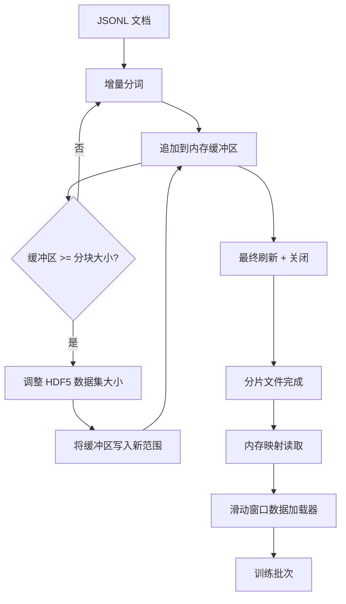

# HDF5 分词语料库

> 下载的语料库必须按照训练器能够以行速流式读取的布局存放。磁盘上的 JSONL 扛不住 16 个数据加载器工作线程。而 HDF5 配合一个可调整大小、分块的整数数据集可以胜任。本课程将流式分词构建到一个可调整大小的 HDF5 数据集中，包括跨多个文件的切片写入、训练时的内存映射读取，以及一个滑动窗口数据加载器，该加载器能生成具有正确打包规则的固定长度序列。

**类型：** 构建
**语言：** Python
**前置条件：** 第 19 阶段第 30-37 课
**时长：** ~90 分钟

## 学习目标

- 将文档流式写入一个可调整大小的 HDF5 整数数据集，并使用确定性的分块策略。
- 将写入工作分片到多个 HDF5 文件中，使故障范围受限且支持并行操作。
- 通过 HDF5 的页缓存支持的分块布局回读 token，使数据加载器仅在批处理时才将数据复制到批处理缓冲区。
- 实现一个滑动窗口数据加载器，生成固定长度的训练序列，并附带明确的打包规则。

## 问题

现代语言模型训练在数十个工作线程上以每秒数十万样本的速率读取 token。磁盘上的 JSONL 在第一次冷缓存缺页时就崩溃了：JSON 解析器速度慢，文档边界不可寻址，查找"样本 4,217,884"需要扫描整个文件。即使是压缩良好的 Parquet 也不合适，因为训练器不需要列式存储；它需要的是支持 O(1) 随机访问的扁平 token 流。

HDF5 之所以适合，是因为它提供了一个分块、可调整大小、仅含整数的数据集，其分块在读取时对页缓存友好。训练器请求 `tokens[3,200,000 : 3,200,8192]` 这样的切片，HDF5 从页缓存中将所需的超切片复制到新分配的 NumPy 数组中。代价是每个工作线程一个打开的文件句柄和一个分块大小的页缓存占用，与解码 JSONL 的开销相比微不足道。

构建的难点在于让写入端规范可靠。可调整大小的数据集很容易被误用：一次只写入一个文档会导致 HDF5 文件碎片化到无法使用的程度。一次调整大小写入所有文档，进程崩溃则会丢失整个分片。正确的做法是"缓冲-扩展"策略：缓冲区大小与分块大小匹配，并且采用分片写入，将工作负载分散到多个文件上，这样崩溃最多丢失一个分片。

## 概念


```mermaid
flowchart TD
  JSONL[JSONL 文档] --> Tokenize[增量分词]
  Tokenize --> Buffer[追加到内存缓冲区]
  Buffer --> Flush{缓冲区 >= 分块大小?}
  Flush -- 否 --> Tokenize
  Flush -- 是 --> Resize[调整 HDF5 数据集大小]
  Resize --> Write[将缓冲区写入新范围]
  Write --> Buffer
  Buffer --> Close[最终刷新 + 关闭]
  Close --> ShardDone[分片文件完成]
  ShardDone --> MMapRead[内存映射读取]
  MMapRead --> Window[滑动窗口数据加载器]
  Window --> Train[训练批次]
```

### 正确使用可调整大小的 HDF5

token 数据集以 `maxshape=(None,)` 和固定的 `chunks=(chunk_size,)` 创建。写入过程通过将 token 缓冲到一个长度为 `chunk_size` 的 NumPy 数组中进行。当缓冲区填满时，数据集恰好增加 `chunk_size` 大小，并将缓冲区写入新的范围。在分片结束时，将剩余的缓冲写入最后的局部范围。除最后一次写入外，每次写入都是连续且分块对齐的；读取方被告知根据分片 HDF5 属性中记录的 `token_count` 截断最后一次的部分数据。

### 分片写入

单个 HDF5 文件是单点故障。流水线并行写入分片：每个来自第 19 阶段第 42 课的输入分片生成一个 HDF5 输出分片。`shards.json` 索引为每个分片记录文件路径、token 数量、文档数量以及 token 的 sha256 哈希值。训练器读取 `shards.json` 来计算全局偏移量并验证语料库。

### 内存映射读取

在训练时，每个工作线程以 `swmr=True` 模式打开其负责的 HDF5 文件，并请求 `tokens[start:stop]`。HDF5 的分块布局使其在分块被缓存后成为页缓存支持的读取。工作线程从不实例化整个文件：切片被复制到数据加载器的批处理缓冲区中，然后数据加载器在批处理时将其复制到固定内存的训练张量中。热路径上每次分块切换有一次系统调用；其余都是内存访问。

### 滑动窗口数据加载器

数据加载器是唯一知道训练序列长度的阶段。它在全局 token 流中随机选择一个起始索引，读取 `window_size + 1` 个 token，返回 `(input, target) = (tokens[:-1], tokens[1:])`。文档边界不强制对齐：一个窗口可能跨越两个文档，它们之间通过一个显式的 `boundary_token_id` 分隔，使模型学会使用分隔符。这是标准的打包规则；这也是初学者容易忘记的规则，最终导致语料库中 8% 是训练边界 token，92% 是自然文本。

## 构建

`code/main.py` 实现了：

- `Tokenizer` - 一个字节级确定性分词器，足以用于演示。接口是 `encode(text) -> list[int]` 和 `vocab_size`。
- `HDF5ShardWriter` - 打开一个可调整大小的整数数据集，将 token 缓存到分块大小，以固定大小步长调整大小并写入，在关闭时将 `token_count` 和 `sha256` 记录为 HDF5 属性。
- `ShardedTokenizationPipeline` - 遍历输入文档，将其路由到写入器，并生成 `shards.json` 索引。
- `MmapTokenStore` - 打开分片文件进行内存映射读取，计算全局偏移量，暴露一个 `get_slice(start, stop)` API。
- `SlidingWindowDataloader` - 从全局流中随机选取窗口，生成 `(input_ids, target_ids)` NumPy 数组。

文件底部的演示程序构建一个小型内存语料库，分词到两个分片中，通过内存映射打开，运行数据加载器 10 个批次，并打印每个批次的形状和校验和。

运行：

```bash
python3 code/main.py
```

脚本以退出码 0 结束并打印批次校验和。

## 生产模式

以下四种模式可将本课程扩展到真实的训练运行。

**分块大小等于典型读取量。** 训练器每个样本读取 `window_size + 1` 个 token。将 HDF5 分块设置为 `window_size` 的倍数，读取操作将与页缓存对齐。分块不匹配会使吞吐量减半，因为每个样本会触及两个分块。

**token 数量放在属性中，而非数据集中。** 数据集的尾部切片可能只有部分填充，因为分块大小不整除文档边界。将真实的 `token_count` 存储为 HDF5 数据集属性，让读取方在该值处截断。没有这个，读取方会越界读到零填充的 token，模型就会学习预测零。

**分片 sha256 与并行验证。** 每个分片有其 token 字节的 sha256 哈希。训练器可以在训练开始前并行验证所有分片。错误的 sha256 能在运行早期就失败，而不是十六小时后的第三个 epoch。

**写入方和读取方均使用 `swmr=True`，写入方使用 `libver="latest"`。** 单写入方-多读取方模式要求写入方以 `libver="latest"` 打开，预先创建所有数据集，然后设置 `file.swmr_mode = True`。之后，写入方必须在每次调整大小后调用 `dataset.flush()`，以便以 `swmr=True` 打开的读取工作线程看到一致的数据。跳过 `libver="latest"` 或在结构更改后启用 SWMR 是常见的"文件被锁定"错误的根源。

## 使用

生产模式：

- **每个源分片一个 HDF5 文件。** 下载器（第 42 课）每个 URL 生成一个分片；分词（本课程）每个源分片生成一个 HDF5 文件。1:1 映射使恢复和部分故障恢复变得非常简单。
- **边界 token ID。** 边界 token 是分词器词汇表的一部分，也是数据加载器唯一注入的 token。如果模型应该忽略边界 token，训练损失会将其屏蔽；否则模型会学习将其用作序列分隔符。
- **`shards.json` 作为真相源。** 添加新分片只需写入 HDF5 文件、计算其 sha256 哈希并追加一条记录。训练器在启动时读取一次该文件，之后不再触碰目录列表。

## 交付

`outputs/skill-hdf5-tokenized-corpus.md` 在真实项目中会描述：哪个分词器为流水线提供输入、分块大小与训练器窗口匹配的值、`shards.json` 在版本控制中的位置，以及数据加载器工作线程如何在文件间分片。本课程交付的是引擎本身。

## 练习

1. 为 HDF5 写入器添加 `--compression gzip` 标志，并在演示语料库上测量吞吐量成本。论证所选的默认值。
2. 为滑动窗口数据加载器添加确定性种子，并验证相同种子的两次运行产生相同的批次。
3. 添加 `--validate` 模式，读取每个分片，重新计算其 token 的 sha256 哈希，并与 `shards.json` 比较。CI 应在训练开始前运行此项。
4. 比较分块大小等于窗口大小、一半和两倍时的数据加载器吞吐量。报告页缓存的影响。
5. 添加 `--max-document-tokens` 标志，在写入时截断过长的文档。论证在写入时做此取舍与在读取时决定的优劣。

## 关键术语

| 术语 | 人们说的意思 | 实际含义 |
|------|-------------|---------|
| 可调整大小的数据集 | "仅追加" | 一个 `maxshape=(None,)` 的 HDF5 数据集，通过 `resize` 调用以分块大小的步长增长 |
| 分块布局 | "HDF5 如何存储" | 固定大小的磁盘页面，内核可以对其进行内存映射，数据加载器可以连续读取 |
| `swmr` 模式 | "边写边读" | 单写入方-多读取方模式，让数据加载器工作线程安全地共享文件 |
| 分片索引 | "shards.json" | 所有 token 分片的持久化索引，包含偏移量和内容哈希 |
| 滑动窗口 | "训练样本" | 全局 token 流中的一个固定长度切片，训练器将其与位移一位的目标配对 |

## 延伸阅读

- [HDF5 分块文档](https://docs.hdfgroup.org/hdf5/v1_14/) - 本课程使用的分块、可调整大小数据集布局
- [h5py 用户指南](https://docs.h5py.org/en/stable/) - HDF5 的 Python 绑定
- [NumPy 内存映射](https://numpy.org/doc/stable/reference/generated/numpy.memmap.html) - HDF5 通过 h5py 暴露的读取端原语
- 第 19 阶段 · 第 42 课 - 下载器，本课程对其输出进行分词
- 第 19 阶段 · 第 44 课 - 使用此数据加载器的余弦调度
- 第 19 阶段 · 第 45 课 - 包装训练步骤的 AMP 循环
