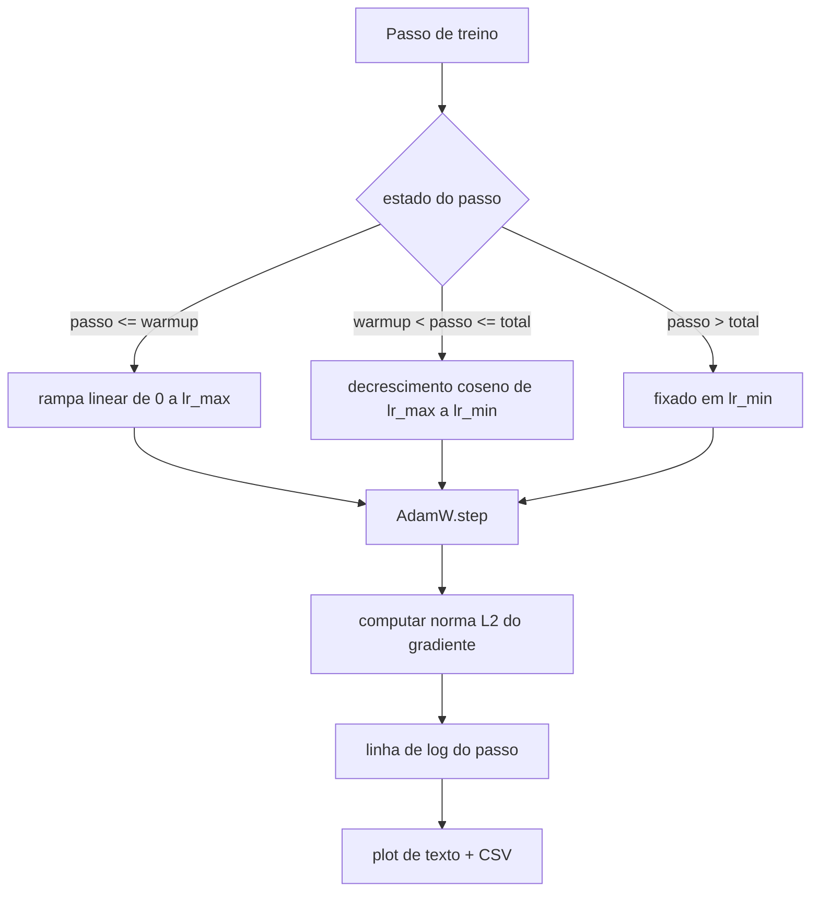

# Aula 44: Taxa de Aprendizado Coseno com Warmup Linear

> O agendamento de taxa de aprendizado e a segunda decisao mais importante apos a funcao de perda. AdamW com decrescimento coseno e warmup linear e o padrao moderno para treino de modelos de linguagem porque permite que o modelo veja um passo efetivo pequeno durante as primeiras mil atualizacoes fragois, sobe para um pico configurado, e decresce suavemente de volta ate zero. Esta aula constrói esse agendamento, plota a curva sobre passos de treino, loga normas de gradiente ao lado do agendamento, e prova que o agendamento respeita os limites de warmup, pico e decrescimento.

**Tipo:** Build
**Linguagens:** Python
**Prerequisitos:** Aulas 30-37 da Fase 19
**Tempo:** ~90 minutos

## Objetivos de Aprendizado

- Implementar um optimiser AdamW conectado a um agendamento de taxa de aprendizado coseno com warmup linear.
- Computar o valor exato do agendamento em qualquer passo sem deriva de ponto flutuante entre execucoes.
- Logar a norma L2 do gradiente lado a lado com a taxa de aprendizado para que a saude do treinamento seja observavel.
- Renderizar o agendamento em um plot de texto legivel e um CSV que qualquer ferramenta pode consumir.

## O Problema

As primeiras mil atualizacoes de treinamento sao as mais barulhentas. Os pesos do modelo ainda estao proximos da inicializacao. A estimativa de segundo momento do optimiser ainda nao estabilizou. A norma do gradiente e grande e ruidosa. Se a taxa de aprendizado estiver em seu pico durante essas atualizacoes o modelo ou diverge direto ou se estabelece em um plateau de loss do qual nunca sai. As duas solucoes conhecidas sao gradient clipping, que e o tema da aula 45 da Fase 19, e um agendamento de taxa de aprendizado que comeca pequeno e sobe.

O agendamento coseno-com-warmup tem tres regioes. Do passo zero ao passo `warmup_steps` a taxa de aprendizado escala linearmente de zero ao pico configurado `lr_max`. Do passo `warmup_steps` ao passo `total_steps` a taxa de aprendizado segue a metade superior de uma curva coseno, decrescendo de `lr_max` para `lr_min`. Apos `total_steps` a taxa de aprendizado e fixada em `lr_min` para que um trainer mal configurado que ultrapasse nao saia silenciosamente do agendamento.

O problema de construcao e que agendamentos sao faceis de errar por um. O off-by-one aparece seis horas em uma execucao de treino como uma taxa de aprendizado que e 1 por cento alta ou baixa no momento em que o modelo comeca a se sobreajustar, o que e invisivel a menos que o agendamento seja exaustivamente testado nos limites.

## O Conceito



### Formula de warmup

Para `step` em `[0, warmup_steps]` com `warmup_steps > 0`, a taxa de aprendizado e `lr_max * step / warmup_steps`. O caso degenerado `warmup_steps = 0` e tratado como "sem warmup": o agendamento comeca diretamente em `lr_max` no passo zero e imediatamente entra no decrescimento coseno. Alguns harnesses de teste passam `warmup_steps = 0` para verificar que o agendamento ainda produz uma curva utilizavel.

### Formula coseno

Para `step` em `(warmup_steps, total_steps]` a taxa de aprendizado e `lr_min + 0.5 * (lr_max - lr_min) * (1 + cos(pi * progresso))` onde `progresso = (step - warmup_steps) / max(1, total_steps - warmup_steps)`. No `step = warmup_steps` a coseno avalia para `cos(0) = 1`, que da `lr_max`, batendo exatamente com o ponto final do warmup. No `step = total_steps` a coseno avalia para `cos(pi) = -1`, que da `lr_min`, batendo exatamente com o ponto final do decrescimento.

A continuidade em ambos os pontos finais nao e por acaso. E a razao pela qual o agendamento e implementado como uma unica funcao sobre `step`, nao como tres funcoes diferentes coladas. Um agendamento colado perde um limite na primeira vez que `lr_max` e alterado.

### Piso apos total_steps

Para `step > total_steps` a taxa de aprendizado permanece em `lr_min`. O contrato e explicito: o agendamento nao da erro e nao extrapola; ele fixa no piso e deixa o trainer logar um aviso. Trainers que precisam estender o treinamento mudam o `total_steps` do agendamento, nao o loop.

### Log de norma de gradiente ao lado da taxa

O agendamento e metade da saude do treinamento. A norma do gradiente e a outra metade. O loop de treinamento loga ambos por passo. Uma execucao de treinamento divergente mostra a norma do gradiente disparar antes da loss; um warmup bem sintonizado mantem a norma subindo linearmente com a taxa; um pico agressivo demais aparece como uma norma que permanece alta apos o warmup. O dataset em disco e `step, lr, grad_l2_norm, loss`. O CSV e o unico registro duravel.

## Construa

`code/main.py` implementa:

- `CosineWithWarmup` - uma funcao sem estado `lr(step) -> float` sobre o agendamento configurado.
- `TrainState` - envolve um modelo, um optimiser `AdamW`, e o agendamento em uma unica funcao de passo.
- `TrainState.step` - roda um forward pass, um backward pass, loga a norma L2 do gradiente, e aplica `lr(step)` no optimiser.
- `plot_schedule_ascii` - renderiza o agendamento como um plot de texto legivel.
- `write_schedule_csv` - emite uma linha por passo com a taxa de aprendizado.

Um demo no final do arquivo constroi um modelo `nn.Linear` pequeno, treina por 20 passos sobre um batch de entrada fixo, e imprime a taxa de aprendizado por passo, norma do gradiente, e loss. O agendamento tambem e renderizado como plot de texto para a verificacao visual de sanidade.

Execute:

```bash
python3 code/main.py
```

O script sai zero e imprime um log de treino por passo mais o plot do agendamento.

## Padroes de Producao

Quatro padroes elevam o agendamento a um artefato de producao.

**Agendamento vive em uma config, nao no codigo.** O trainer le `warmup_steps`, `total_steps`, `lr_max`, `lr_min` de uma config YAML ou JSON que e commitada no git. O agendamento e reproduzivel porque a config e content-addressed; o agendamento e auditavel porque a config e parte do diff do PR.

**Contador de passo e monotonic e desacoplado de epocas.** Alguns frameworks confundem passo e epoca quando o dataset e compartilhado ou o dataloader reinicia. O agendamento le `global_step` do checkpoint do trainer, nao de um contador local. Uma execucao retomada continua na posicao certa do agendamento porque o contador de passo e o eixo duravel.

**Plot do agendamento no diretorio da execucao.** Cada execucao de treino escreve `outputs/lr_schedule.png` (ou nesta aula um plot de texto) em seu diretorio. Um reviewer que abre o diretorio pode verificar o agendamento sem reexecutar nada. Isso pega a classe de bugs de agendamento mal configurado no momento do PR.

**Esquema da linha de log e fixo.** `step, lr, grad_l2_norm, loss` nessa ordem. Um notebook ou dashboard downstream le o esquema; renomear uma coluna sem bumpar uma versao invalida todo dashboard existente.

## Use

Padroes de producao:

- **Varrer o pico antes de qualquer outra coisa.** `lr_max` e o botao mais sensivel. Varra-o primeiro em um modelo pequeno; o `lr_max` otimo escala fracamente com o tamanho do modelo, entao a varredura de modelo pequeno e um forte prior.
- **Warmup e uma fracao do total de passos, nao uma contagem absoluta.** Uma execucao de 200 milhoes de passos com 2.000 passos de warmup comeca no pico quase imediatamente; uma execucao de 20.000 passos com o mesmo numero aquece por 10 por cento. Configure warmup como uma fracao (tipico: 1-3 por cento) para que o agendamento escale com a duracao do treinamento.
- **`lr_min` nao e zero de proposito.** Um piso que e 10 por cento de `lr_max` mantem o optimiser aprendendo durante a cauda longa. Um agendamento com `lr_min = 0` produz uma curva de treinamento que parece ótima em um plot e um modelo que na verdade nao terminou de treinar.

## Entregue

`outputs/skill-cosine-warmup.md` descreveria, em um projeto real, qual config carrega o agendamento, de qual passo do trainer o contador global e lido, e qual varredura de `lr_max` produziu o valor implantado. Esta aula entrega o motor.

## Exercicios

1. Adicionar uma variante de raiz quadrada inversa do agendamento e comparar em uma execucao de treino de 200 passos. Qual curva produz a menor loss final?
2. Adicionar um flag `--restart` que adiciona um segundo warmup em `total_steps / 2`. Defenda se warm restarts melhoram ou prejudicam na execucao de treino.
3. Adicionar um teste unitario que o agendamento seja continuo: para cada passo em `[0, total_steps]` a diferenca `|lr(step+1) - lr(step)|` e limitada por `lr_max / warmup_steps`.
4. Conectar o agendamento em um `torch.optim.lr_scheduler.LambdaLR` para que ele componha com codigo de framework. A aula usa uma funcao de passo simples; o que o wrapper muda?
5. Adicionar um flag `--plot-png` que escreve um plot real via `matplotlib`. Defenda se o plot de texto da aula ou o PNG e o melhor padrao para execucoes de CI.

## Termos Chave

| Termo | O que as pessoas dizem | O que realmente significa |
|-------|------------------------|---------------------------|
| Warmup | "Inicio lento" | Rampa linear de zero a `lr_max` nas primeiras `warmup_steps` atualizacoes |
| Decrescimento coseno | "Queda suave" | Curva coseno na metade superior de `lr_max` para `lr_min` nos passos restantes |
| Piso | "Apos treinamento" | O valor fixo `lr_min` que o agendamento fixa apos `total_steps` |
| Norma de gradiente | "L2 dos grad" | A norma euclidiana do vetor de gradiente concatenado, logada a cada passo |
| Passo global | "Eixo do agendamento" | Um contador de passo monotonic que sobrevive a reinicios e direciona o agendamento |

## Leitura Adicional

- [Loshchilov e Hutter, SGDR: Stochastic Gradient Descent with Warm Restarts (arXiv 1608.03983)](https://arxiv.org/abs/1608.03983) - o paper de referencia do agendamento coseno
- [Loshchilov e Hutter, Decoupled Weight Decay Regularization (arXiv 1711.05101)](https://arxiv.org/abs/1711.05101) - o paper de referencia do AdamW
- [torch.optim.lr_scheduler do PyTorch](https://docs.pytorch.org/docs/stable/optim.html#how-to-adjust-learning-rate) - como funcoes de passo compoem com agendadores de framework
- Fase 19 · 42 - o downloader cujo corpus este agendamento consome
- Fase 19 · 43 - o dataloader com o qual este agendamento co-evolui
- Fase 19 · 45 - gradient clipping e AMP, a proxima camada no loop
