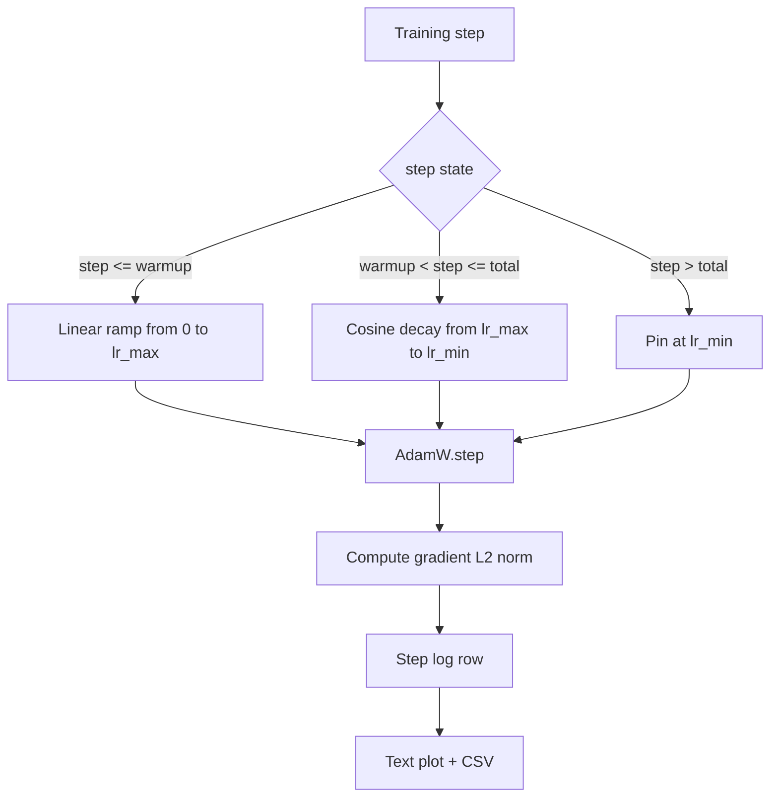

# Doğrusal Isınma özellikli Kosinüs LR

> Öğrenme oranı planı loss function'dan sonra ikinci en önemli karardır. Kosinüs bozunması ve doğrusal ısınmaya sahip AdamW, dil modeli eğitimi için modern varsayılandır çünkü modelin kırılgan ilk bin güncelleme sırasında küçük bir etkili adım boyutu görmesine, yapılandırılmış bir zirveye yükselmesine ve sıfıra doğru sorunsuz bir şekilde geri azalmasına olanak tanır. Bu ders bu programı oluşturur, eğitim adımları üzerindeki eğriyi çizer, programın yanına gradient normlarını kaydeder ve programın ısınma, zirve ve azalma sınırlarına uyduğunu kanıtlar.

**Tür:** Yapım
**Diller:** Python
**Önkoşullar:** Aşama 19 dersleri 30-37
**Süre:** ~90 dakika

## Öğrenme Hedefleri

- Doğrusal ısınma ile kosinüs öğrenme oranı planına bağlı bir AdamW optimize edici uygulayın.
- Çalışmalar arasında kayan nokta kayması olmadan herhangi bir adımda programın kesin değerini hesaplayın.
- Eğitim durumunun gözlemlenebilir olması için gradient L2 normunu öğrenme oranıyla yan yana kaydedin.
- Programı, gözün okuyabileceği bir metin grafiğine ve herhangi bir aracın tüketebileceği bir CSV'ye dönüştürün.

## Sorun

İlk bin eğitim güncellemesi en gürültülü olanlardır. Modelin ağırlıkları hala başlatmaya yakın. Optimize edicinin çalışan ikinci an tahmini istikrar kazanmadı. gradient normu büyük ve gürültülüdür. Bu güncellemeler sırasında öğrenme oranı zirvedeyse, model ya tamamen farklılaşır ya da asla kaçamayacağı bir kayıp platosuna yerleşir. İyi bilinen iki düzeltme, Aşama 19 ders 45'in konusu olan gradient kırpma ve küçükten başlayıp artan bir öğrenme oranı çizelgesidir.

Isınma ile kosinüs çizelgesinin üç bölgesi vardır. Sıfır adımdan `warmup_steps` adımına kadar öğrenme oranı, sıfırdan yapılandırılmış zirveye `lr_max` doğrusal olarak ölçeklenir. `warmup_steps` adımından `total_steps` adımına kadar öğrenme oranı, kosinüs eğrisinin üst yarısını takip eder ve `lr_max` ile `lr_min` arasında azalarak devam eder. `total_steps` sonrasında öğrenme oranı `lr_min` 'ye sabitlenir, böylece hedefi aşan yanlış yapılandırılmış bir eğitmen programdan sessizce çıkmaz.

Yapım sorunu, programların tek tek yanlış anlaşılmasının kolay olmasıdır. Birer birer, model aşırı uyum sağlamaya başladığı anda yüzde 1 oranında fazla yüksek veya çok düşük bir öğrenme oranı olarak bir eğitim çalıştırmasının altı saatini gösterir; bu, program sınırlarda kapsamlı bir şekilde test edilmediği sürece görünmez.

## Konsept



### Isınma formülü

`warmup_steps > 0` ile `[0, warmup_steps]` içindeki `step` için öğrenme oranı `lr_max * step / warmup_steps`'tır. Dejenere `warmup_steps = 0` durumu "ısınma yok" olarak ele alınır: program doğrudan sıfır adımında `lr_max` ile başlar ve hemen kosinüs azalmasına girer. Programın hâlâ kullanılabilir bir eğri ürettiğini kontrol etmek için bazı test donanımları `warmup_steps = 0` 'yı geçer.

### Kosinüs formülü

`(warmup_steps, total_steps]` içindeki `step` için öğrenme oranı `lr_min + 0.5 * (lr_max - lr_min) * (1 + cos(pi * progress))` olup, burada `progress = (step - warmup_steps) / max(1, total_steps - warmup_steps)`. `step = warmup_steps` noktasında kosinüs `cos(0) = 1` olarak değerlendirilir ve bu da ısınma bitiş noktasıyla tam olarak eşleşen `lr_max` değerini verir. `step = total_steps` noktasında kosinüs `cos(pi) = -1` olarak değerlendirilir ve bu da `lr_min` değerini verir, bozunum uç noktasıyla tam olarak eşleşir.

Her iki uç noktadaki süreklilik bir tesadüf değildir. Zamanlamanın `step` üzerinde tek bir işlev olarak uygulanmasının nedeni budur, birbirine yapıştırılmış üç farklı işlev olarak değil. Yapıştırılmış bir program, `lr_max` ilk kez değiştirildiğinde bir sınırı kaybeder.

### Toplam adımlardan sonraki kat

`step > total_steps` için öğrenme oranı `lr_min` seviyesinde kalır. Sözleşme açıktır: Program hata yapmaz ve tahminde bulunmaz; yere sabitlenir ve eğitmenin bir uyarı kaydetmesine olanak tanır. Eğitimi uzatması gereken eğitmenler döngüyü değil, programın `total_steps`'sini değiştirir.

### Gradient oranın yanında norm kaydı

Program antrenman sağlığının yarısı kadardır. gradient normu diğer yarısıdır. Eğitim döngüsü adım başına her ikisini de günlüğe kaydeder. Farklı bir eğitim çalışması, kayıptan önce gradient norm yükselişini gösterir; iyi ayarlanmış bir ısınma, normun hızla birlikte doğrusal olarak yükselmesini sağlar; aşırı agresif bir zirve, ısınma sonrasında yüksek kalan bir norm olarak ortaya çıkıyor. Diskteki dataset `step, lr, grad_l2_norm, loss`'dır. CSV tek dayanıklı kayıttır.

## Build It — Kendin Geliştir

`code/main.py` şunu uygular:

- `CosineWithWarmup` - yapılandırılmış programa göre durum bilgisi olmayan bir işlev `lr(step) -> float` .
- `TrainState` - bir modeli, bir `AdamW` optimize ediciyi ve zamanlamayı tek adımlı bir fonksiyona sarar.
- `TrainState.step` - bir ileri geçişi, bir geri geçişi çalıştırır, gradient L2 normunu günlüğe kaydeder ve optimize ediciye `lr(step)` uygular.
- `plot_schedule_ascii` - programı gözün okuyabileceği bir metin grafiği olarak işler.
- `write_schedule_csv` - öğrenme oranıyla adım başına bir satır yayar.

Dosyanın altındaki demo küçük bir `nn.Linear` modeli oluşturur, sabit bir girdi kümesi üzerinden 20 adımlık eğitim verir ve adım başına öğrenme oranını, gradient normunu ve kaybı yazdırır. Program aynı zamanda görsel sağlık kontrolü için bir metin grafiği olarak da işlenir.

Çalıştır:

```bash
python3 code/main.py
```

Komut dosyası sıfırdan çıkar ve adım başına bir eğitim günlüğü artı zamanlama grafiğini yazdırır.

## Üretim Modelleri

Dört model, programı bir üretime artifact yükseltir.

**Zamanlama kodda değil, bir yapılandırmada bulunur.** Eğitmen, git'e adanmış bir YAML veya JSON yapılandırmasından `warmup_steps`, `total_steps`, `lr_max`, `lr_min` okur. Yapılandırma içerik adresli olduğundan zamanlama tekrarlanabilir; yapılandırma PR farkının bir parçası olduğundan zamanlama denetlenebilir.

**Adım sayacı monotondur ve çağlardan ayrılmıştır.** Bazı framework'ler, dataset parçalandığında veya veri yükleyici yeniden başlatıldığında adım ve dönemi karıştırır. Programda `global_step` yerel bir sayaçtan değil eğitmenin kontrol noktasından okunur. Adım sayacı dayanıklı eksen olduğundan, devam ettirilen bir çalışma doğru program konumunda devam eder.

**Çalıştırma dizinindeki grafiği planlayın.** Her eğitim çalıştırması, çalışma dizinine `outputs/lr_schedule.png` (veya bu derste bir metin grafiği) yazar. Dizini gözden geçiren bir kişi, herhangi bir şeyi yeniden çalıştırmadan zamanlamayı sağlıklı bir şekilde kontrol edebilir. Bu, yanlış yapılandırılmış program hata sınıfını PR zamanında yakalar.

**Günlük satırı şeması sabittir.** `step, lr, grad_l2_norm, loss` bu sırayla. Aşağı akışlı bir not defteri veya kontrol paneli şemayı okur; bir sürümü değiştirmeden bir sütunu yeniden adlandırmak, mevcut tüm kontrol panellerini geçersiz kılar.

## Use It — Hazır Araçla Uygula

Üretim modelleri:

- **Başka herhangi bir şeyi süpürmeden önce süpürme zirvesi.** `lr_max` en hassas düğmedir. Önce küçük bir modelin üzerinde gezdirin; optimal `lr_max` model boyutuyla zayıf bir şekilde ölçeklenir, dolayısıyla küçük model taraması güçlü bir önceliktir.
- **Isınma toplam adımların bir kısmıdır, mutlak bir sayı değildir.** 2.000 ısınma adımından oluşan 200 milyon adımlık bir koşu neredeyse anında zirveye ulaşır; aynı sayıyla 20.000 adımlık bir koşu yüzde 10 oranında ısınır. Isınmayı kesirli (tipik: yüzde 1-3) olarak yapılandırın, böylece program antrenman süresine göre ölçeklenir.
- **`lr_min` bilerek sıfırdan farklıdır.** `lr_max` 'nin yüzde 10'u olan bir taban, optimize edicinin uzun kuyruk sırasında öğrenmesini sağlar. Bir `lr_min = 0` çizelgesi, bir grafikte harika görünen bir eğitim eğrisi ve aslında eğitimi tamamlamamış bir model üretir.

## Ship It — Kullanıma Sun

`outputs/skill-cosine-warmup.md` , gerçek bir projede, hangi yapılandırmanın programı taşıdığını, küresel sayacın hangi eğitmen adımından okunduğunu ve hangi `lr_max` taramasının dağıtılan değeri ürettiğini açıklar. Bu ders motoru nakleder.

## Egzersizler

1. Programın ters kareköklü bir varyantını ekleyin ve bunu 200 adımlık bir oyuncak eğitimi çalışmasıyla karşılaştırın. Hangi eğri daha düşük nihai kayıp üretir?
2. `total_steps / 2`'da ikinci bir ısınma ekleyen bir `--restart` bayrağı ekleyin. Oyuncak koşusunda sıcak yeniden başlatmaların iyileşip iyileşmediğini veya zarar verip vermediğini savunun.
3. Programın sürekli olduğunu gösteren bir birim testi ekleyin: `[0, total_steps]` 'daki her adım için `|lr(step+1) - lr(step)|` farkı `lr_max / warmup_steps` ile sınırlanır.
4. Programı bir `torch.optim.lr_scheduler.LambdaLR` 'ye bağlayın, böylece framework koduyla birleşsin. Derste düz adım işlevi kullanılıyor; ambalaj neyi değiştirir?
5. `matplotlib` aracılığıyla gerçek bir çizim yazan bir `--plot-png` bayrağı ekleyin. CI çalıştırmaları için dersin metin grafiğinin mi yoksa PNG'nin mi daha iyi varsayılan olduğunu savunun.

## Anahtar Terimler

| Dönem | İnsanlar ne diyor | Aslında ne anlama geliyor |
|------|-----------------|------------------------|
| Isınma | "Yavaş başlangıç" | İlk `warmup_steps` güncellemesi boyunca sıfırdan `lr_max` 'ya doğrusal rampa |
| Kosinüs bozunması | "Pürüzsüz düşüş" | Kalan adımlarda `lr_max` 'dan `lr_min` 'ya üst yarı kosinüs eğrisi |
| Kat | "Eğitimden sonra" | Zamanlamanın `total_steps` geçmişine sabitlediği sabit `lr_min` değeri |
| Gradient normu | "Mezunların L2'si" | Birleştirilmiş gradient vektörünün Öklid normu, her adımda günlüğe kaydedilir |
| Küresel adım | "Zamanlama ekseni" | Yeniden başlatmalardan sağ kurtulan ve programı yönlendiren monoton bir adım sayacı |

## Daha Fazla Okuma

- [Loshchilov ve Hutter, SGDR: Sıcak Yeniden Başlatmalarla Stokastik Gradient İniş (arXiv 1608.03983)](https://arxiv.org/abs/1608.03983) - kosinüs çizelgesinin referans makalesi
- [Loshchilov ve Hutter, Ayrıştırılmış Ağırlık Azalması Düzenlileştirmesi (arXiv 1711.05101)](https://arxiv.org/abs/1711.05101) - AdamW'un referans makalesi
- [PyTorch torch.optim.lr_scheduler](https://docs.pytorch.org/docs/stable/optim.html#how-to-adjust-learning-rate) - adım fonksiyonlarının framework zamanlayıcılarla nasıl oluşturulduğu
- Aşama 19 · 42 - bu programın külliyatını tüketen indirici
- Aşama 19 · 43 - programın birlikte geliştiği veri yükleyici
- Aşama 19 · 45 - gradient kırpma ve AMP, döngüdeki sonraki katman
