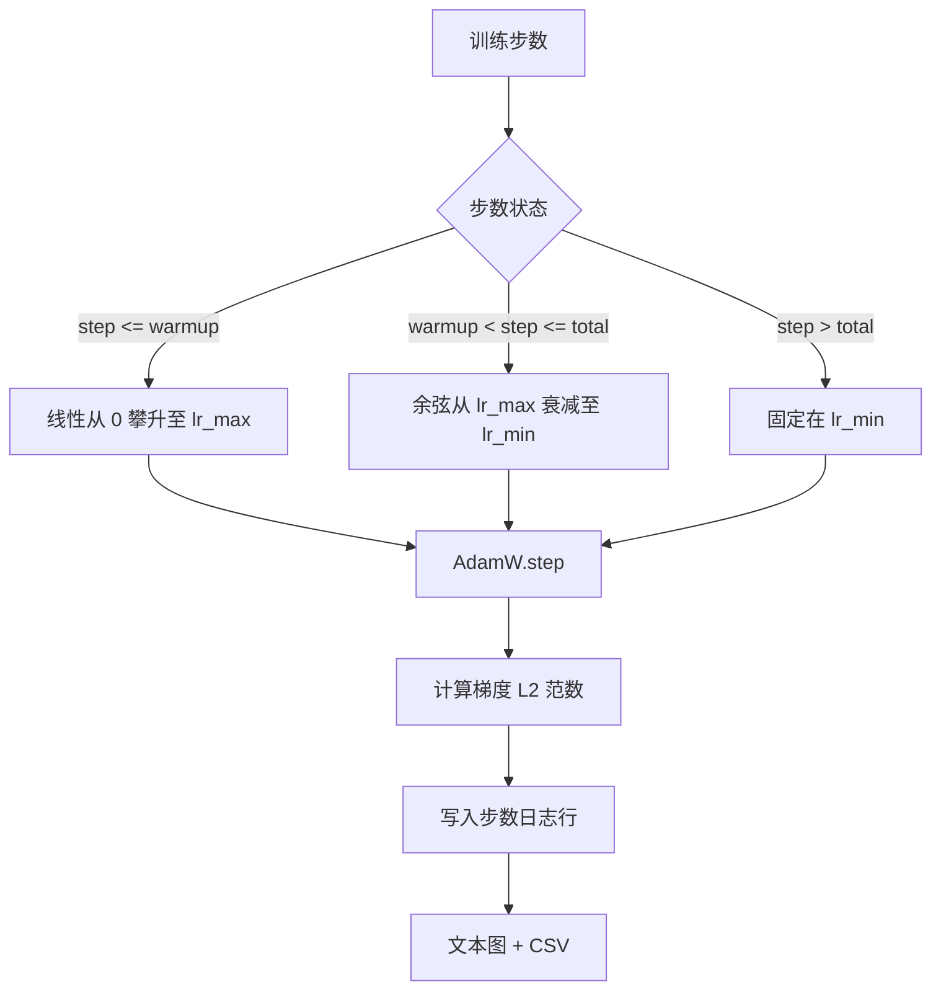

# 44 · 带线性预热的余弦学习率调度

> 学习率调度（learning-rate schedule）是仅次于损失函数的第二重要决策。采用余弦衰减（cosine decay）与线性预热（linear warmup）的 AdamW 是语言模型训练的现代默认配置：它让模型在最初上千次脆弱的更新中经历较小的有效步长，随后攀升至预设峰值，再平滑衰减回零。本课将构建该调度，绘制训练步数对应的曲线，记录梯度范数与调度并排的日志，并验证调度严格遵守预热、峰值和衰减边界。

**类型：** 构建
**语言：** Python
**前置：** 第 19 阶段第 30–37 课
**时长：** 约 90 分钟

## 学习目标

- 实现与带线性预热的余弦学习率调度相连接的 AdamW 优化器。
- 计算调度在任意步数上的精确值，且跨运行无浮点漂移。
- 将梯度 L2 范数与学习率并排记录，使训练健康度可观测。
- 将调度渲染为肉眼可读的文本图，以及任意工具均可消费的 CSV。

## 问题背景

训练最初的几千次更新是最嘈杂的。模型权重仍接近初始化状态。优化器的二阶矩运行估计尚未稳定。梯度范数大且噪声严重。如果学习率在此阶段处于峰值，模型要么直接发散，要么陷入永远无法逃脱的损失平台（loss plateau）。两个广为人知的解决方案是梯度裁剪（gradient clipping，第 19 阶段第 45 课的主题）以及从较小值开始逐步攀升的学习率调度。

带预热的余弦调度包含三个区间。从第 0 步到 `warmup_steps` 步，学习率从零线性缩放到预设峰值 `lr_max`。从 `warmup_steps` 步到 `total_steps` 步，学习率沿余弦曲线的上半部从 `lr_max` 衰减至 `lr_min`。超过 `total_steps` 之后，学习率固定在 `lr_min`，这样配置不当导致训练超出步数时不会在无提示的情况下退出调度。

构建层面的难点在于，调度极易出现差一错误（off-by-one）。这种差一错误会在训练启动六小时后才暴露——在模型开始过拟合的那一刻，学习率偏高或偏低 1 个百分点。除非在边界处对调度进行详尽测试，否则此类偏差几乎无法察觉。

## 核心概念



### 预热公式

对于 `[0, warmup_steps]` 范围内的 `step`（其中 `warmup_steps > 0`），学习率为 `lr_max * step / warmup_steps`。`warmup_steps = 0` 的退化情况视为"无预热"：调度从第 0 步直接以 `lr_max` 启动，立即进入余弦衰减。某些测试脚手架会传入 `warmup_steps = 0` 以验证调度仍能产出可用曲线。

### 余弦公式

对于 `(warmup_steps, total_steps]` 范围内的 `step`，学习率为 `lr_min + 0.5 * (lr_max - lr_min) * (1 + cos(pi * progress))`，其中 `progress = (step - warmup_steps) / max(1, total_steps - warmup_steps)`。在 `step = warmup_steps` 处，余弦项求值为 `cos(0) = 1`，得到 `lr_max`，与预热终点精确衔接。在 `step = total_steps` 处，余弦项求值为 `cos(pi) = -1`，得到 `lr_min`，与衰减终点精确衔接。

两个端点的连续性并非巧合。这正是调度被实现为关于 `step` 的单一函数而非三段拼凑函数的原因。拼凑而成的调度一旦修改 `lr_max`，就会丢失一个边界。

### 超过总步数后的固定值

当 `step > total_steps` 时，学习率保持在 `lr_min`。契约是明确的：调度不会报错，也不会外推；它固定在底线值上，由训练器记录警告。需要延长训练的训练器应修改调度的 `total_steps`，而非修改循环本身。

### 梯度范数与学习率同步记录

调度是训练健康度的一半。梯度范数是另一半。训练循环每步记录两者。一个发散的训练运行，其梯度范数会在损失之前先出现尖峰；良好的预热使范数随学习率线性上升；过于激进的峰值表现为预热结束后范数持续居高不下。磁盘上的数据集为 `step, lr, grad_l2_norm, loss`。CSV 是唯一持久的记录。

## 动手构建

`code/main.py` 实现了：

- `CosineWithWarmup`——一个无状态函数 `lr(step) -> float`，对应当前配置的调度。
- `TrainState`——将模型、`AdamW` 优化器和调度封装为单步函数。
- `TrainState.step`——执行一次前向传播、一次反向传播，记录梯度 L2 范数，并将 `lr(step)` 应用到优化器。
- `plot_schedule_ascii`——将调度渲染为肉眼可读的文本图。
- `write_schedule_csv`——为每一步输出一行包含学习率的数据。

文件底部的演示构建一个小型 `nn.Linear` 模型，在固定输入批次上训练 20 步，并打印每一步的学习率、梯度范数和损失。调度还会被渲染为文本图，用于可视化复核。

运行方式：

```bash
python3 code/main.py
```

脚本以零退出码结束，并打印逐步训练日志以及调度图。

## 生产级实践模式

以下四个模式可将调度提升为生产级产物。

**调度存在于配置中，而非代码中。** 训练器从提交到 git 的 YAML 或 JSON 配置中读取 `warmup_steps`、`total_steps`、`lr_max`、`lr_min`。调度具备可复现性，因为配置是内容寻址的；调度具备可审计性，因为配置是 PR diff 的一部分。

**步数计数器单调递增且与轮次解耦。** 某些框架在数据集分片或数据加载器重启时会混淆步数与轮次（epoch）。调度从训练器的检查点（checkpoint）读取 `global_step`，而非从局部计数器读取。恢复的运行会从正确的调度位置继续，因为步数计数器才是持久化的坐标轴。

**调度图存放在运行目录中。** 每次训练运行将 `outputs/lr_schedule.png`（本课中使用文本图）写入其运行目录。审阅者浏览目录即可复核调度，无需重新运行任何内容。这能在 PR 阶段捕获因调度配置错误而引入的一系列 bug。

**日志行模式是固定的。** 按 `step, lr, grad_l2_norm, loss` 的顺序排列。下游的 notebook 或仪表盘读取此模式；重命名某一列而不提升版本号将使所有现有仪表盘失效。

## 使用指南

生产级实践要点：

- **调整峰值优先于调整其他参数。** `lr_max` 是最敏感的旋钮。先在小型模型上做 sweep；最优 `lr_max` 随模型规模变化较弱，因此小型模型上的 sweep 是一个强先验。
- **预热按总步数的比例而非绝对数值设定。** 一个 2 亿步的运行搭配 2000 步预热，几乎立即就达到峰值；而一个 20000 步的运行搭配相同预热步数，则要预热 10% 的时长。将预热配置为比例（通常为 1%–3%），使调度随训练时长缩放。
- **`lr_min` 有意设为非零值。** 底线值设为 `lr_max` 的 10% 可使优化器在漫长尾部持续学习。`lr_min = 0` 的调度会产出一张看起来漂亮的训练曲线图，以及一个实际上尚未完成训练的模型。

## 交付

在一线项目中，`outputs/skill-cosine-warmup.md` 应描述哪个配置承载调度、全局计数器从哪个训练器步数读取，以及哪个 `lr_max` sweep 产出了部署值。本课输出的是引擎本身。

## 练习

1. 添加该调度的逆平方根变体，并在 200 步的玩具训练运行上对比。哪条曲线产生的最终损失更低？
2. 添加一个 `--restart` 标志，在 `total_steps / 2` 处插入第二次预热。论证热重启在玩具运行上是改善还是损害了效果。
3. 添加一个单元测试验证调度的连续性：对 `[0, total_steps]` 中的每一步，差值 `|lr(step+1) - lr(step)|` 受限于 `lr_max / warmup_steps`。
4. 将调度接入 `torch.optim.lr_scheduler.LambdaLR`，使其与框架代码组合使用。本课使用的是朴素的步进函数；这个包装器改变了什么？
5. 添加一个 `--plot-png` 标志，通过 `matplotlib` 输出真实图像。论证本课的文本图与 PNG 图哪个更适合作为 CI 运行的默认选择。

## 关键术语

| 术语 | 常见说法 | 实际含义 |
|------|---------|---------|
| 预热（Warmup） | "慢启动" | 在前 `warmup_steps` 次更新中从零到 `lr_max` 的线性攀升 |
| 余弦衰减（Cosine decay） | "平滑下降" | 在剩余步数中从 `lr_max` 到 `lr_min` 的上半部余弦曲线 |
| 底线/固定值（Floor） | "训练结束后" | 调度在超过 `total_steps` 后保持的固定 `lr_min` 值 |
| 梯度范数（Gradient norm） | "梯度的 L2" | 拼接后的梯度向量的欧几里得范数，每一步记录 |
| 全局步数（Global step） | "调度坐标轴" | 单调递增的步数计数器，在重启后仍然存活并驱动调度 |

## 扩展阅读

- [Loshchilov 和 Hutter，SGDR：带热重启的随机梯度下降（arXiv 1608.03983）](https://arxiv.org/abs/1608.03983)——余弦调度的参考文献
- [Loshchilov 和 Hutter，解耦权重衰减正则化（arXiv 1711.05101）](https://arxiv.org/abs/1711.05101)——AdamW 的参考文献
- [PyTorch torch.optim.lr_scheduler](https://docs.pytorch.org/docs/stable/optim.html#how-to-adjust-learning-rate)——步进函数如何与框架调度器组合
- 第 19 阶段 · 42——下载器，本调度所消费的语料来源
- 第 19 阶段 · 43——与本调度协同演化的数据加载器
- 第 19 阶段 · 45——梯度裁剪与 AMP，训练循环中的下一层
