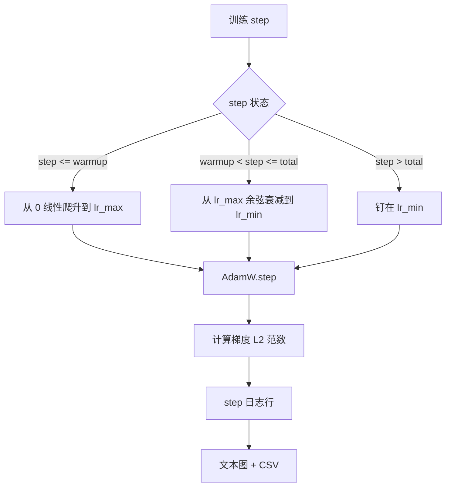

# 带线性 warmup 的 cosine 学习率（Cosine LR with Linear Warmup）

> 译注：本文译自同目录 [`en.md`](./en.md)。术语遵循仓根 [TRANSLATION_GUIDE.md](../../../../TRANSLATION_GUIDE.md)。

> 学习率（learning rate）调度是仅次于损失函数的第二重要决策。AdamW 搭配 cosine 衰减加线性 warmup，是当下语言模型训练的现代默认方案：它让模型在脆弱的前几千步只看到较小的有效步长，再爬升到设定的峰值，最后平滑地衰减回零附近。本节会构建这套调度，按训练步数绘制曲线，把 gradient norm 和调度并排记录，并证明调度在 warmup、峰值、衰减三段边界上都是精确对齐的。

**Type:** Build
**Languages:** Python
**Prerequisites:** Phase 19 lessons 30-37
**Time:** ~90 minutes

## 学习目标（Learning Objectives）

- 实现一个 AdamW optimizer，并接到带线性 warmup 的 cosine 学习率调度上。
- 在任意 step 计算调度的精确数值，跨多次运行不出现浮点漂移。
- 把 gradient L2 norm 和学习率并排打日志，让训练健康度可观测。
- 把调度渲染成肉眼可读的文本图，再导出成任何工具都能消费的 CSV。

## 问题（The Problem）

训练的前一千步是噪声最大的一段。模型权重还很接近初始化值；optimizer 的二阶矩估计还没稳定下来；gradient norm 又大又抖。如果学习率在这段时间就拉到峰值，模型要么直接发散，要么落进一个怎么也跳不出的损失平台。两种公认的修法是 gradient clipping（Phase 19 lesson 45 的主题）和一种从小开始、逐步爬升的学习率调度。

cosine + warmup 调度有三段。从 step 0 到 `warmup_steps`，学习率从 0 线性爬升到设定的峰值 `lr_max`。从 `warmup_steps` 到 `total_steps`，学习率沿着 cosine 曲线的上半段，从 `lr_max` 衰减到 `lr_min`。`total_steps` 之后，学习率被钉在 `lr_min`，这样即使 trainer 配置错了多跑了几步，也不会悄悄滑出调度。

构建上的麻烦在于：调度极容易写出 off-by-one。这种 off-by-one 会在训练跑了六小时之后冒出来，表现为某一刻的学习率比预期高 1% 或低 1%——而那一刻恰好是模型开始过拟合的瞬间。除非你在边界上把调度详尽地测一遍，否则这种偏差完全不可见。

## 概念（The Concept）



### Warmup 公式（Warmup formula）

当 `step` 在 `[0, warmup_steps]` 且 `warmup_steps > 0` 时，学习率为 `lr_max * step / warmup_steps`。退化情形 `warmup_steps = 0` 当作「不做 warmup」处理：调度在 step 0 直接从 `lr_max` 开始，立刻进入 cosine 衰减。一些测试 harness 会传 `warmup_steps = 0` 进来，验证调度是否仍然能产生一条可用的曲线。

### Cosine 公式（Cosine formula）

当 `step` 在 `(warmup_steps, total_steps]` 时，学习率为 `lr_min + 0.5 * (lr_max - lr_min) * (1 + cos(pi * progress))`，其中 `progress = (step - warmup_steps) / max(1, total_steps - warmup_steps)`。在 `step = warmup_steps` 处 cosine 取到 `cos(0) = 1`，结果是 `lr_max`，正好和 warmup 段终点对齐。在 `step = total_steps` 处 cosine 取到 `cos(pi) = -1`，结果是 `lr_min`，正好和衰减段终点对齐。

两端的连续性不是巧合。这正是为什么这套调度被实现成关于 `step` 的单一函数，而不是三个函数拼接出来的。一旦拼接，第一次改 `lr_max` 就会让其中一个边界对不上。

### total_steps 之后的 floor（Floor after total steps）

当 `step > total_steps` 时，学习率维持在 `lr_min`。契约是显式的：调度不报错也不外推，就钉在 floor 上，让 trainer 自己去打 warning。需要延长训练的 trainer 应该改调度的 `total_steps`，而不是改 loop。

### 与学习率并排的 gradient norm 日志（Gradient norm logging alongside the rate）

调度只是训练健康度的一半，gradient norm 才是另一半。训练循环每 step 都把两者写日志。一次发散的训练里，gradient norm 会先于 loss 飙升；一次调好的 warmup，norm 会随学习率线性上升；一个过于激进的峰值，会表现为 warmup 之后 norm 仍然居高不下。落盘的数据集形如 `step, lr, grad_l2_norm, loss`。这个 CSV 是唯一持久的记录。

## 动手实现（Build It）

`code/main.py` 实现了：

- `CosineWithWarmup` —— 一个无状态函数 `lr(step) -> float`，覆盖整个调度。
- `TrainState` —— 把模型、`AdamW` optimizer 和调度封装成一个单 step 函数。
- `TrainState.step` —— 跑一次前向传播、一次反向传播，记录 gradient L2 norm，并把 `lr(step)` 应用到 optimizer 上。
- `plot_schedule_ascii` —— 把调度渲染成肉眼可读的文本图。
- `write_schedule_csv` —— 每 step 输出一行学习率。

文件底部的 demo 构造一个微型 `nn.Linear` 模型，在固定输入 batch 上训练 20 步，打印每 step 的学习率、gradient norm 和 loss。同时把调度渲染成文本图，做一次视觉上的 sanity check。

跑起来：

```bash
python3 code/main.py
```

脚本退出码为 0，会打印每 step 的训练日志和调度曲线图。

## 生产实践（Production Patterns）

四条范式能把这套调度提升为一个生产级 artifact。

**调度写在 config 里，不写在代码里。** Trainer 从一份提交进 git 的 YAML 或 JSON config 里读 `warmup_steps`、`total_steps`、`lr_max`、`lr_min`。调度可复现，因为 config 是内容寻址的；调度可审计，因为 config 是 PR diff 的一部分。

**step 计数器单调递增，且与 epoch 解耦。** 一些框架在数据集分片或 dataloader 重启时会把 step 和 epoch 搞混。调度应该从 trainer 的 checkpoint 里读 `global_step`，而不是从某个本地计数器读。续跑（resume）的训练能落在调度的正确位置，正是因为 step 计数器是那个持久的轴。

**调度图放进 run 目录。** 每一次训练运行都把 `outputs/lr_schedule.png`（本节里是文本图）写进自己的 run 目录。reviewer 扫一眼目录就能给调度做 sanity check，不用重新跑。这样在 PR 阶段就能逮住「调度配错」这一类 bug。

**日志行 schema 固定。** 顺序是 `step, lr, grad_l2_norm, loss`。下游 notebook 或 dashboard 都按这个 schema 读；不升版本就重命名某一列，等于让所有现存 dashboard 失效。

## 用起来（Use It）

生产实践：

- **先扫峰值，再扫别的。** `lr_max` 是最敏感的旋钮。先在小模型上扫一遍；最优的 `lr_max` 与模型规模只有弱相关，所以小模型扫出来的结果已经是个很强的先验。
- **warmup 用比例配置，不要写绝对步数。** 一个 2 亿 step 的训练用 2,000 warmup 步等于一开始就到峰值；一个 2 万 step 的训练用同样的步数则相当于 10% 的 warmup。把 warmup 配成比例（典型 1–3%），让调度随训练时长一起伸缩。
- **`lr_min` 非零是有意为之。** 一个等于 `lr_max` 10% 的 floor 会让 optimizer 在长尾里继续学习。`lr_min = 0` 的调度会画出一条看起来很漂亮的训练曲线，对应一个其实没训完的模型。

## 上线部署（Ship It）

`outputs/skill-cosine-warmup.md` 在真实项目里会写明：调度由哪份 config 携带、global step 从 trainer 的哪一步读、deployed 的 `lr_max` 是哪一次 sweep 选出来的。本节交付的是引擎本身。

## 练习（Exercises）

1. 给调度加一个 inverse-square-root 变体，在一个 200 step 的玩具训练上对比。哪条曲线最终 loss 更低？
2. 加一个 `--restart` 标志，在 `total_steps / 2` 处再插入一段 warmup。论证 warm restart 在玩具运行上是改善还是损伤了表现。
3. 加一个单元测试，检查调度的连续性：对 `[0, total_steps]` 中每个 step，差值 `|lr(step+1) - lr(step)|` 都不超过 `lr_max / warmup_steps`。
4. 把这套调度接到 `torch.optim.lr_scheduler.LambdaLR` 里，让它能和框架代码组合。本节用的是一个普通的 step 函数；包一层 wrapper 之后会有什么变化？
5. 加一个 `--plot-png` 标志，通过 `matplotlib` 写出真正的图。论证在 CI 运行里，本节的文本图和 PNG 哪个更适合做默认。

## 关键术语（Key Terms）

| 术语 | 大家通常的说法 | 实际含义 |
|------|-----------------|------------------------|
| Warmup | "慢启动" | 在前 `warmup_steps` 步里，学习率从 0 线性爬升到 `lr_max` |
| Cosine decay | "平滑下降" | 在剩余步数上，沿 cosine 曲线上半段从 `lr_max` 衰减到 `lr_min` |
| Floor | "训练之后" | 调度在 `total_steps` 之后钉住的固定值 `lr_min` |
| Gradient norm | "梯度的 L2" | 拼接后的梯度向量的欧式范数，每 step 都记录 |
| Global step | "调度的轴" | 一个能跨重启存活、驱动调度的单调 step 计数器 |

## 延伸阅读（Further Reading）

- [Loshchilov and Hutter, SGDR: Stochastic Gradient Descent with Warm Restarts (arXiv 1608.03983)](https://arxiv.org/abs/1608.03983) —— cosine 调度的源头论文
- [Loshchilov and Hutter, Decoupled Weight Decay Regularization (arXiv 1711.05101)](https://arxiv.org/abs/1711.05101) —— AdamW 的源头论文
- [PyTorch torch.optim.lr_scheduler](https://docs.pytorch.org/docs/stable/optim.html#how-to-adjust-learning-rate) —— step 函数如何与框架自带的 scheduler 组合
- Phase 19 · 42 —— 下载器，本节调度消费的语料就是它产出的
- Phase 19 · 43 —— 与本节调度共同演化的 dataloader
- Phase 19 · 45 —— gradient clipping 和 AMP，训练循环的下一层
