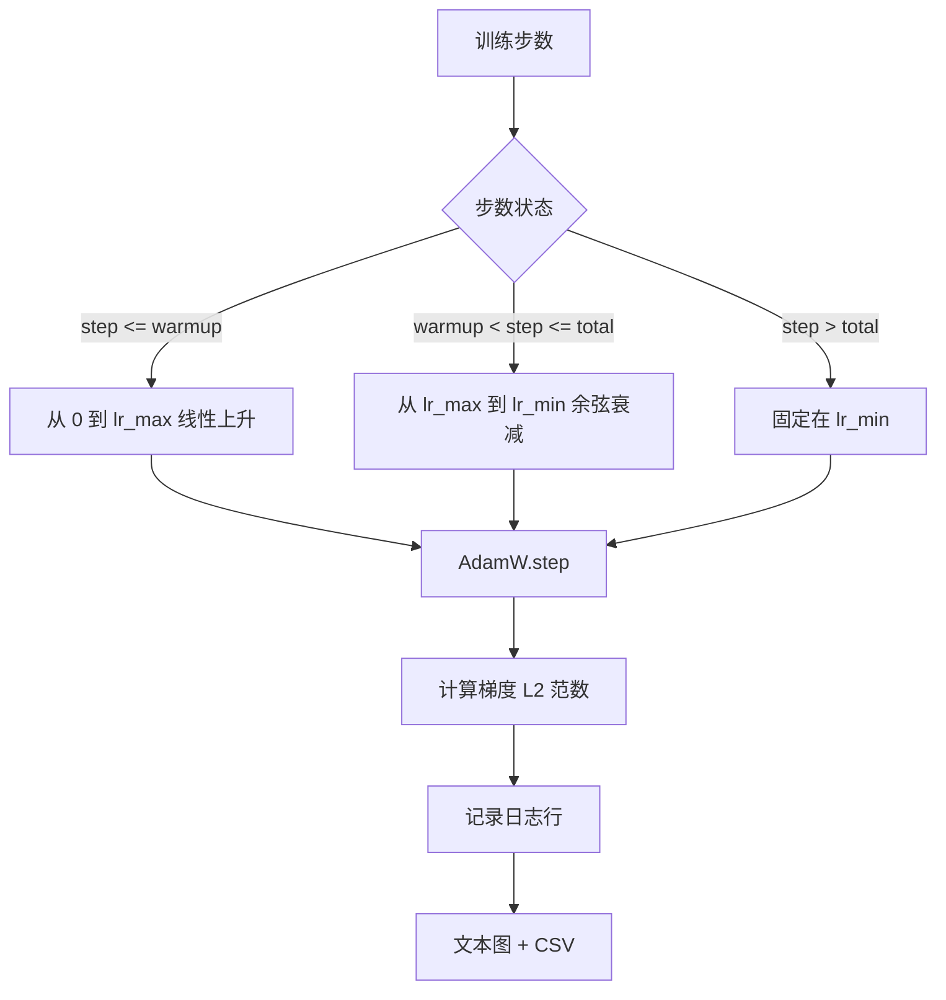

# 余弦学习率与线性预热

> 学习率调度是仅次于损失函数的第二重要的决策。带有余弦衰减和线性预热的 AdamW 是语言模型训练的现代默认方案，因为它能让模型在脆弱的头几千步更新中使用较小的有效步长，逐步攀升到配置的峰值，然后平滑地衰减回零。本课程构建该调度方案，在训练步骤上绘制曲线，将梯度范数与调度方案一起记录，并验证调度方案在预热、峰值和衰减边界处的正确性。

**类型：** 构建
**语言：** Python
**前置要求：** 阶段 19 课程 30-37
**时长：** 约 90 分钟

## 学习目标

- 实现一个 AdamW 优化器，并将其与带有线性预热的余弦学习率调度方案相连接。
- 计算调度方案在任何步骤上的精确值，且跨运行无浮点漂移。
- 将梯度的 L2 范数与学习率并列记录，使训练状态可观测。
- 将调度方案渲染为肉眼可读的文本图，以及任何工具都能消费的 CSV。

## 问题

训练的前几千步更新是最嘈杂的。模型的权重仍接近初始化状态。优化器的二阶矩估计尚未稳定。梯度范数大且噪声多。如果学习率在这些更新期间处于峰值，模型要么直接发散，要么陷入一个永远无法逃脱的损失平台。两种广为人知的修复方法是梯度裁剪（阶段 19 课程 45 的主题）以及一种从小开始并逐步上升的学习率调度方案。

余弦加预热调度包含三个区域。从第零步到 `warmup_steps` 步，学习率从零线性扩展到配置的峰值 `lr_max`。从 `warmup_steps` 步到 `total_steps` 步，学习率遵循余弦曲线的上半部分，从 `lr_max` 衰减到 `lr_min`。在 `total_steps` 之后，学习率固定在 `lr_min`，这样配置错误的训练器即使超时运行也不会悄无声息地脱离调度方案。

构建的难点在于调度方案极易出现差一错误。这种差一错误会在训练开始六小时后显现，表现为学习率在模型开始过拟合的那一刻偏高或偏低 1%，而除非调度方案在边界处经过详尽测试，否则根本无法察觉。

## 概念


```mermaid
flowchart TD
  Step[训练步数] --> Branch{步数状态}
  Branch -- step <= warmup --> Linear[从 0 到 lr_max 线性上升]
  Branch -- warmup < step <= total --> Cosine[从 lr_max 到 lr_min 余弦衰减]
  Branch -- step > total --> Floor[固定在 lr_min]
  Linear --> Apply[AdamW.step]
  Cosine --> Apply
  Floor --> Apply
  Apply --> GradNorm[计算梯度 L2 范数]
  GradNorm --> Log[记录日志行]
  Log --> Plot[文本图 + CSV]
```

### 预热公式

对于 `step` 属于 `[0, warmup_steps]` 且 `warmup_steps > 0`，学习率为 `lr_max * step / warmup_steps`。退化情况 `warmup_steps = 0` 被视为"无预热"：调度方案从第零步直接以 `lr_max` 开始，并立即进入余弦衰减。某些测试框架会传入 `warmup_steps = 0` 来检查调度方案仍能生成一条可用的曲线。

### 余弦公式

对于 `step` 属于 `(warmup_steps, total_steps]`，学习率为 `lr_min + 0.5 * (lr_max - lr_min) * (1 + cos(pi * progress))`，其中 `progress = (step - warmup_steps) / max(1, total_steps - warmup_steps)`。在 `step = warmup_steps` 处，余弦计算结果为 `cos(0) = 1`，得到 `lr_max`，与预热端点完全匹配。在 `step = total_steps` 处，余弦计算结果为 `cos(pi) = -1`，得到 `lr_min`，与衰减端点完全匹配。

两个端点处的连续性并非偶然。这正是调度方案实现为 `step` 的单一函数而非三个不同函数拼接在一起的原因。拼接方案在第一次改变 `lr_max` 时就会丢失一个边界。

### 总步数后的固定值

对于 `step > total_steps`，学习率保持在 `lr_min`。约定明确：调度方案不会报错也不会外推；它固定在底值，并让训练器记录一条警告。需要延长训练的训练器应更改调度方案的 `total_steps`，而非训练循环。

### 梯度范数与学习率并列记录

调度方案只是训练健康度的一半。梯度范数是另一半。训练循环每一步都记录两者。一次发散的训练运行会在损失值上升之前就显示梯度范数尖峰；一个调整得当的预热会让梯度范数随学习率线性上升；一个过于激进的峰值则表现为预热后梯度范数持续偏高。磁盘上的数据集格式为 `step, lr, grad_l2_norm, loss`。CSV 是唯一持久的记录。

## 构建

`code/main.py` 实现了：

- `CosineWithWarmup` —— 一个在配置的调度方案上无状态的函数 `lr(step) -> float`。
- `TrainState` —— 将模型、`AdamW` 优化器和调度方案包装为单一的 step 函数。
- `TrainState.step` —— 执行一次前向传播、一次反向传播，记录梯度 L2 范数，并将 `lr(step)` 应用到优化器。
- `plot_schedule_ascii` —— 将调度方案渲染为肉眼可读的文本图。
- `write_schedule_csv` —— 每步输出一行，包含学习率。

文件底部的演示构建了一个微小的 `nn.Linear` 模型，在固定的输入批次上训练 20 步，并打印每步的学习率、梯度范数和损失值。调度方案也以文本图的形式呈现，用于视觉上的正确性检查。

运行方式：

```bash
python3 code/main.py
```

脚本以退出码零结束，并打印每步的训练日志以及调度方案图。

## 生产模式

四种模式将调度方案提升为生产级工件。

**调度方案存在于配置中，而非代码中。** 训练器从提交到 git 的 YAML 或 JSON 配置中读取 `warmup_steps`、`total_steps`、`lr_max`、`lr_min`。调度方案可重现，因为配置是内容寻址的；调度方案可审计，因为配置是 PR 差异的一部分。

**步数计数器是单调的且与 epoch 解耦。** 某些框架在数据集被分片或数据加载器重启时会混淆 step 和 epoch。调度方案从训练器的检查点中读取 `global_step`，而非局部计数器。恢复运行的训练会在正确的调度位置继续，因为步数计数器是持久的轴。

**调度方案图在运行目录中。** 每次训练运行都会将 `outputs/lr_schedule.png`（或本课程中的文本图）写入其运行目录。快速浏览目录的评审者无需重新运行任何内容即可直观检查调度方案。这能在 PR 阶段捕获调度配置错误类的 bug。

**日志行模式是固定的。** 依次为 `step, lr, grad_l2_norm, loss`。下游的 notebook 或仪表盘读取该模式；重命名列而不更新版本号会使所有现有的仪表盘失效。

## 使用

生产模式：

- **在扫描任何其他参数之前先扫描峰值。** `lr_max` 是最敏感的参数。先在小模型上扫描它；最优 `lr_max` 随模型规模的变化很弱，因此小模型扫描是一个很强的先验。
- **预热是总步数的一个比例，而非绝对计数。** 一次 2 亿步的运行使用 2,000 步预热，几乎立即就到达峰值；而一次 2 万步的运行使用同样的预热步数则要用掉 10% 的时间。将预热配置为一个比例（典型值：1-3%），这样调度方案会随训练时长自动缩放。
- **`lr_min` 特意不为零。** 设为 `lr_max` 10% 的底值能让优化器在长尾阶段继续学习。`lr_min = 0` 的调度方案会产生一条在图上看起来很漂亮、但模型实际上并未完成训练的训练曲线。

## 交付

在真实项目中，`outputs/skill-cosine-warmup.md` 会描述哪个配置承载了调度方案、全局计数器从哪个训练器步骤读取、以及哪个 `lr_max` 扫描结果产生了部署值。本课程交付的是引擎本身。

## 练习

1. 添加一个逆平方根变体的调度方案，并在 200 步的玩具训练运行上进行比较。哪种曲线产生更低的最终损失？
2. 添加一个 `--restart` 标志，在 `total_steps / 2` 处增加第二次预热。论证在玩具运行上热重启是改善还是损害了结果。
3. 添加一个单元测试验证调度方案的连续性：对于 `[0, total_steps]` 中的每一步，差值 `|lr(step+1) - lr(step)|` 受 `lr_max / warmup_steps` 约束。
4. 将调度方案接入 `torch.optim.lr_scheduler.LambdaLR`，使其能与框架代码组合。本课程使用的是纯 step 函数；封装器改变了什么？
5. 添加一个 `--plot-png` 标志，通过 `matplotlib` 写入真实图像。论证本课程的文本图与 PNG 哪个更适合作为 CI 运行的默认输出。

## 关键术语

| 术语 | 人们的说法 | 实际含义 |
|------|-----------|---------|
| 预热 (Warmup) | "慢启动" | 在前 `warmup_steps` 次更新中从零到 `lr_max` 的线性上升 |
| 余弦衰减 (Cosine decay) | "平滑下降" | 在剩余步骤中从 `lr_max` 到 `lr_min` 的上半余弦曲线 |
| 固定值 (Floor) | "训练之后" | 调度方案在 `total_steps` 之后固定住的 `lr_min` 值 |
| 梯度范数 (Gradient norm) | "梯度的 L2" | 拼接后的梯度向量的欧几里得范数，每步记录 |
| 全局步数 (Global step) | "调度轴" | 一个单调的步数计数器，在重启后仍有效并驱动调度方案 |

## 延伸阅读

- [Loshchilov and Hutter, SGDR: Stochastic Gradient Descent with Warm Restarts (arXiv 1608.03983)](https://arxiv.org/abs/1608.03983) —— 余弦调度方案的参考论文
- [Loshchilov and Hutter, Decoupled Weight Decay Regularization (arXiv 1711.05101)](https://arxiv.org/abs/1711.05101) —— AdamW 的参考论文
- [PyTorch torch.optim.lr_scheduler](https://docs.pytorch.org/docs/stable/optim.html#how-to-adjust-learning-rate) —— step 函数如何与框架调度器组合
- 阶段 19 · 42 —— 本调度方案所消费的数据集的下载器
- 阶段 19 · 43 —— 与该调度方案协同演进的数据加载器
- 阶段 19 · 45 —— 梯度裁剪与 AMP，循环中的下一层
