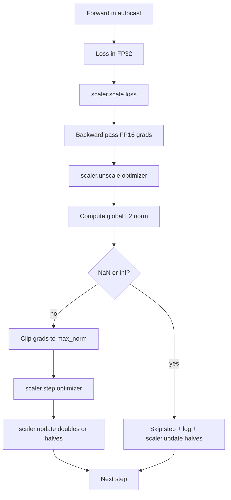

# Gradient Kırpma ve Karışık Hassasiyet

> Önceki dersteki optimize edici ve program, gradient'ların aklı başında olduğunu varsayar. Genellikle değildirler. Tek bir hatalı grup, gradient normunu üç kat artırabilir. Karma duyarlı eğitim, kayıp tarafında FP16 taşmasını sağlayarak bunu güçlendirir. Bu ders, üretim eğitiminin onsuz sağlayamayacağı iki emniyet kemerini oluşturur: yapılandırılmış bir genel L2 normuna göre gradient kırpma ve NaN ve Inf'yi algılayan, adımı temiz bir şekilde atlayan ve adli tıp için ölçeklendirme faktörünü günlüğe kaydeden otomatik yayın ve GradScaler ile karma duyarlıklı bir döngü.

**Tür:** Yapım
**Diller:** Python
**Önkoşullar:** Aşama 19 dersleri 30-37
**Süre:** ~90 dakika

## Öğrenme Hedefleri

- Tüm parametreler gradient'ler üzerinden genel L2 normunu hesaplayın ve yapılandırılmış bir eşiği aştığında yerine sabitleyin.
- Otomatik yayın artı bir GradScaler'a bir eğitim adımı ekleyin, böylece FP16 ileri ve geri pasları taşmalardan kurtulur.
- Kayıpta veya gradient'da NaN ve Inf'yi tespit edin, optimize edici adımını atlayın ve atlamayı günlüğe kaydedin.
- Uzun bir atlama sırasının hemen görülebilmesi için GradScaler'ın ölçeklendirme faktörünü her adımda raporlayın.

## Sorun

Dün temiz bir şekilde yürütülen bir antrenman çalışması, 8.217. adımda dikey giden bir kayıp eğrisi üretiyor. Suçlu, gradient normu 4.200 olan, önceki zirvenin yirmi katı olan tek bir gruptur. Optimize edici, kırpmadan, modelin önceki saatte yaptığı her öğrenmeyi sıfırlayan bir adım uygular. Norm 1.0'daki küresel L2 klibi ile aynı parti, birim norm güncellemesine katkıda bulunur; kayıp trend çizgisi üzerinde kalıyor; koşu hayatta kalır.

Karma duyarlı eğitim, FP16'da ileri geçişi ve geri geçişin çoğunu hesaplayarak verimi 2-3 kat artırır. Maliyeti ise FP16'nın dar bir üs aralığına sahip olmasıdır. FP16'da taşan tipik bir gradient, sonraki katmanlar boyunca NaN olarak yayılan ve bir sonraki optimize edici adımında her ağırlığı NaN'ye ayarlayan Inf olarak değerlendirilir. PyTorch'un GradScaler'ı bunu, geri geçişten önce kaybı büyük bir ölçeklendirme faktörüyle çarparak ve gradient'leri optimize edici adımdan önce aynı faktöre bölerek çözer. Ölçeklenmemiş zamanda herhangi bir gradient Inf veya NaN ise, ölçekleyici adımı atlar ve ölçeklendirme faktörünü yarıya indirir; önceki N adım temizse ölçekleyici faktörü iki katına çıkarır. Eğitim süresince faktör, FP16 aralığının izin verdiği en yüksek değeri bulur.

Yapım sorunu ikisini doğru bir şekilde kablolamaktır. Ölçeklendirmeden önceki klip ve eşik, ölçeklendirilmiş gradients üzerindedir; ölçeklendirmeden sonra klip ve GradScaler'daki işlemlerin sırası önemlidir. Doğru sıralama şu şekildedir: `scaler.scale(loss).backward()`, sonra `scaler.unscale_(optimizer)`, sonra `clip_grad_norm_`, sonra `scaler.step(optimizer)`, sonra `scaler.update()`. Başka herhangi bir düzen sessizce bozulan bir döngü üretir.

## Konsept



### Küresel L2 normu

Genel L2 normu, parametre başına norm değil, birleştirilmiş gradient vektörünün Öklid normudur. PyTorch bunu `torch.nn.utils.clip_grad_norm_(parameters, max_norm)` olarak uygular. İşlev, kırpma öncesi normu döndürür, böylece ders, "her adımda kırpıyoruz" tanısı için gerekli olan hem doğal hem de kırpılmış değeri günlüğe kaydedebilir.

### otomatik yayın ve GradScaler

`torch.amp.autocast(device_type)` , FP16'da uygun işlemleri (çoğu matmul sınıfı işlemleri) seçici olarak çalıştıran bağlam yöneticisidir. `torch.amp.GradScaler(device_type)` , optimizasyon adımından önce kaybı geriye doğru ölçeklendiren ve gradient'ları ters ölçeklendiren yardımcıdır. İkisi birlikte tasarlandı; birini diğeri olmadan kullanmak, testin yakalaması gereken bir yapılandırma hatasıdır.

Derste CPU otomatik yayını kullanılıyor çünkü CI'da çalışan şey bu; aynı kalıp, `device_type="cpu"` 'yi `device_type="cuda"` olarak değiştirerek CUDA'ya kelimesi kelimesine aktarır. CPU üzerindeki GradScaler bir saplamadır (CPU otomatik yayını zaten varsayılan olarak BF16'da çalışır ve kayıp ölçeklendirmeye ihtiyaç duymaz), ancak ders, kablolamanın GPU döngüsüyle aynı olması için çağrı sitelerini içerir.

### NaN ve Inf tespiti

Tespit iki yerde gerçekleşir. İlk olarak kaybın kendisi geriye doğru gitmeden önce `torch.isfinite` ile kontrol edilir; bir Inf veya NaN kaybı yararlı gradient'lar üretmez ve optimize ediciye girmeden atlanır. İkinci olarak, `scaler.unscale_(optimizer)` sonrasında ders, ölçeklenmemiş gradient'leri `has_non_finite_grad(...)` ile tarar ve herhangi bir Inf veya NaN'yi atlama olarak ele alır. İki kontrol birlikte hem ileri geçiş hem de geri geçiş başarısızlık modlarını kapsar.

### Ölçeklendirme faktörü teşhisi

Ölçekleme faktörü GradScaler'ın dahili durumudur. Ders her adımda `scaler.get_scale()` değerini okur ve bunu öğrenme hızının ve gradient normunun yanına kaydeder. Sağlıklı bir çalışma, ölçeklendirme faktörünün `2^17` veya `2^18` yakınına doyana kadar ikinin katları halinde arttığını gösterir. Yanlış çalışan bir çalışma, yüksek ve düşük değerler arasında salınan faktörü gösterir; bu, modelin gradient'lerinin bazen aralık içinde olduğunun, bazen de olmadığının sinyalidir. Tanılama, oturum açmadan görünmez.

## Build It — Kendin Geliştir

`code/main.py` şunu uygular:

- `clip_global_l2_norm` - hem klip öncesi hem de klip sonrası normu döndüren `torch.nn.utils.clip_grad_norm_` etrafındaki sarmalayıcı.
- `has_non_finite_grad` - gradient'ları NaN ve Inf için tarayan bir yardımcı.
- `AmpTrainState` - bir modeli, bir `AdamW` optimize ediciyi, bir GradScaler'ı ve bir otomatik yayın cihazını sarar. Tam kırpma, ölçeklendirme ve NaN ardışık düzenini çalıştıran bir `step(inputs, targets)` ortaya çıkarır.
- `StepLog` ve `SkipLog` - adım başına yapılandırılmış kayıtlar.
- Küçük bir `nn.Linear` modelini 20 adım boyunca eğiten, atlama yolunu uygulamak için 5. adımda gradient'ya bir Inf enjekte eden ve elde edilen günlüğü yazdıran bir demo.

Çalıştır:

```bash
python3 code/main.py
```

Komut dosyası sıfırdan çıkar ve her satırın `STEP` veya `SKIP` etiketli olduğu adım başına bir günlük yazdırır; en az bir satır `SKIP`'dır.

## Üretim Modelleri

Dört model döngüyü üretim eğitimi adımına yükseltir.

**Sayacı bir günlük satırı olarak değil, bir uyarı olarak atlayın.** Her egzersiz çalıştırmasında birkaç adımın atlanması sağlıklıdır. Dönem başına yüzlerce atlama ciddi bir uyarıdır: model, FP16'nın dayanamayacağı bir rejimdedir ve döngü sessizce başarısızlığa uğramaktadır. Ders, 1000 adımlık bir yuvarlanma atlama oranını izler ve üretimde yüzde 5'in üzerinde bir oranda sayfa açar.

**Klip eşiği yapılandırmada bulunur.** `max_norm = 1.0` , dil modeli eğitimi için modern varsayılandır. Önce küçük bir modelin üzerinde gezdirin; daha büyük eşikler modelin gerçekten zor partilerden kurtulmasına olanak tanır; daha küçük eşikler, daha gürültülü bir kayıp eğrisi pahasına en kötü durumu sınırladı. Eşik, ders 44'teki zamanlamayla aynı YAML veya JSON yapılandırmasına aittir.

**Norm günlüğü, programla birlikte bir CSV'ye gider.** CSV sütunları `step, lr, grad_l2_pre_clip, grad_l2_post_clip, loss, skipped, skip_reason, scaler_scale`'dır. Dosyayı açan bir incelemeci programı, gradient hikayesini, ölçeklendirme faktörünü ve atlama sonucunu (nedeniyle birlikte) tek satırda görür. Sütunları dosyalara bölmek, yanlış hizalanmış analizlerin reçetesidir.

**`scaler.update()` , atlamada bile her adımı çalıştırır.** Temiz bir adımda ölçekleyici, bilgi içermeyen sayacını okur, artırır ve muhtemelen çarpanı iki katına çıkarır. Atlanan bir adımda ölçekleyici faktörü yarıya indirir ve sayacı sıfırlar. Atlama yolunda `update()` 'nin unutulması "ölçeklendirme faktörünün hiç değişmemesine" neden olan hatadır.

## Use It — Hazır Araçla Uygula

Üretim modelleri:

- **Otomatik yayın cihazı optimize edici cihazla eşleşir.** GPU eğitimi için `torch.amp.autocast(device_type="cuda")` ; CPU için `torch.amp.autocast(device_type="cpu")` . Cihazların karıştırılması, iyi görünen ancak öğrenmeyen bir model olan bir kayıp eğrisi olarak ortaya çıkan sessiz tipte bir hata üretir.
- **Geriye doğru kayıp kontrolü.** `torch.isfinite(loss).all()` bir tensör azaltımıdır; maliyet ihmal edilebilir düzeydedir ve NaN kaybından elde edilen tasarruf tam bir eğitim adımıdır. Her zaman çalıştır.
- **`set_to_none=True` `zero_grad`'de.** gradients'yi sıfır yerine `None` olarak ayarlar; bu, optimize edicinin etkilenmeyen parametre grupları için hesaplamayı atlamasını sağlar. Bu ayar, ücretsiz bir verim iyileştirmesi ve hata yüzeyinde hafif bir azalmadır.

## Ship It — Kullanıma Sun

`outputs/skill-clip-amp.md` , gerçek bir projede, eğitim adımının hangi klip eşiğini ve otomatik yayın cihazını kullandığını, adım başına CSV'nin sürüm kontrolünde nerede bulunduğunu ve üretim atlama oranı uyarı eşiğinin ne olduğunu açıklar. Bu ders motoru nakleder.

## Egzersizler

1. Sentetik Inf enjeksiyonunu gerçek bir kayıp artışıyla değiştirin (bir grubun hedefini 1e8 ile çarpın) ve atlama yolu tetikleyicilerini doğrulayın.
2. Otomatik yayını FP16 yerine BF16'ya değiştiren bir `--bf16` modu ekleyin. BF16, FP16'dan daha geniş bir üs aralığına sahiptir ve nadiren kayıp ölçeklendirmesine ihtiyaç duyar; aynı demoda atlama oranının sıfıra düştüğünü doğrulayın.
3. Hiçbir kırpma meydana gelmediğinde gradient-klip sarıcısının klip öncesi ve klip sonrası normunu doğru şekilde döndürdüğünü gösteren bir birim testi ekleyin.
4. Bir kayan pencere atlama hızı hesaplaması ve hızın ardışık 100 adım için yapılandırılmış bir eşiği aşması durumunda çalıştırmayı başarısızlığa uğratan bir CLI bayrağı ekleyin.
5. Kanonik CSV'yi (`step, lr, grad_l2_pre_clip, grad_l2_post_clip, loss, skipped, skip_reason, scaler_scale`) yazmak için döngüyü bağlayın ve her satırdan sonra temizleyerek dosyanın Ctrl-C'ye dayandığını doğrulayın.

## Anahtar Terimler

| Dönem | İnsanlar ne diyor | Aslında ne anlama geliyor |
|------|-----------------|------------------------|
| Küresel L2 normu | "Klip hedefi" | Eğitilebilir tüm parametrelerde birleştirilmiş gradient vektörünün Öklid normu |
| otomatik yayın | "Karışık hassasiyet" | `with` bloğu içinde uygun işlemlerin seçici FP16 (veya BF16) yürütülmesi |
| GradScaler | "Kayıp ölçekleyici" | Optimize edici adımdan önce gradients geriye doğru ve ters ölçeklendirmeden önce kaybı çarpan yardımcı |
| Atla | "Kötü adım" | Bir optimize edici adımı, gradient veya kaybın sonlu olmaması nedeniyle reddedildi; ölçekleyici faktörü yarıya indirir |
| Ölçeklendirme faktörü | "Ölçekleyici durumu" | GradScaler'ın mevcut çarpanı; temiz uzatmalardan sonra iki katına çıkar ve her atlamada yarıya iner |

## Daha Fazla Okuma

- [Micikevicius ve diğerleri, Karma Hassas Eğitim (arXiv 1710.03740)](https://arxiv.org/abs/1710.03740) - orijinal kayıp ölçeklendirme önerisi
- [Pascanu, Mikolov, Bengio, Tekrarlayan neural network'lerin (arXiv 1211.5063)](https://arxiv.org/abs/1211.5063) eğitiminin zorluğu üzerine - gradient-kırpma referans makalesi
- [PyTorch torch.amp.GradScaler](https://docs.pytorch.org/docs/stable/amp.html) - bu dersin kapsadığı ölçekleyici API'si
- [PyTorch torch.nn.utils.clip_grad_norm_](https://docs.pytorch.org/docs/stable/generated/torch.nn.utils.clip_grad_norm_.html) - bu dersin kullandığı kırpma ilkel öğesi
- Aşama 19 · 42 - derlem döngüyü besleyen indirici
- Aşama 19 · 43 - döngünün tükettiği veri yükleyici
- Aşama 19 · 44 - bu döngünün oluşturduğu program
