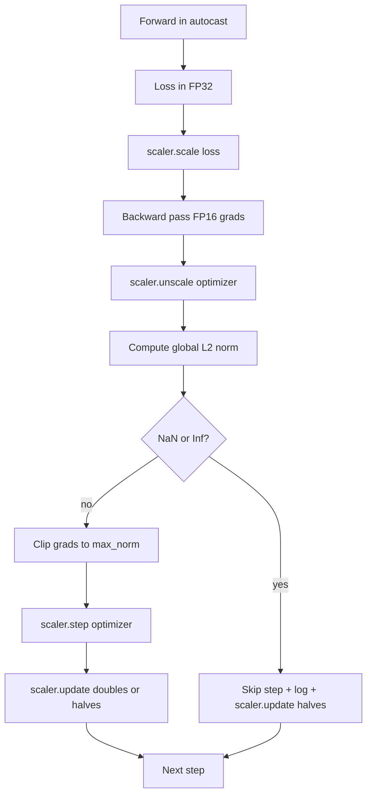

# 45 · 梯度裁剪与混合精度

> 前一课中的优化器与学习率调度器假设梯度是正常的。它们通常并不正常。一个糟糕的批次就能让梯度范数飙升三个数量级。混合精度训练会引入 FP16 在损失一侧的溢出，使这一问题雪上加霜。本课将构建生产环境训练中不可或缺的两条安全绳：按照设定的全局 L2 范数对梯度进行裁剪，以及一个包含 autocast 和 GradScaler 的混合精度循环，该循环能够检测 NaN 和 Inf，干净地跳过优化步，并记录缩放因子以供溯源。

**类型：** 构建
**语言：** Python
**前置：** 第 19 阶段第 30-37 课
**时长：** 约 90 分钟

## 学习目标

- 计算所有参数梯度的全局 L2 范数，并在超过设定阈值时执行原地裁剪。
- 在 autocast 与 GradScaler 中包裹一个训练步，使 FP16 的前向和反向传播能够容忍受溢出。
- 检测损失值或梯度中的 NaN 和 Inf，跳过优化步并记录跳过信息。
- 每个训练步都上报 GradScaler 的缩放因子，以便在连续多次跳过时能立刻被发现。

## 问题

一个昨天跑得好好的训练，在 8,217 步时损失曲线突然垂直飙升。罪魁祸首是某一个批次，其梯度范数达到了 4,200，是之前峰值的二十倍。没有裁剪的话，优化器会执行一步更新，把模型在前一小时内学到的所有内容全部打回原形。有了范数为 1.0 的全局 L2 裁剪后，同一个批次贡献的只是一次单位范数的更新；损失值保持在原有趋势线上；训练得以继续存活。

混合精度训练通过在前向传播和大部分反向传播中使用 FP16 计算，将吞吐量提升了 2 到 3 倍。代价是 FP16 的指数范围很窄。一个典型的 FP16 梯度溢出会变成 Inf，进而通过后续层传播为 NaN，最终在下一步优化器更新时把所有权重都变成 NaN。PyTorch 的 GradScaler 通过以下方式解决此问题：在反向传播前将损失乘以一个较大的缩放因子，并在优化器步之前用同一因子将梯度除回来。如果在缩放回原值（unscale）时检测到任何梯度为 Inf 或 NaN，scaler 会跳过该步并将缩放因子减半；如果前面连续 N 步都是干净的，scaler 则将缩放因子加倍。在训练过程中，缩放因子会逐渐收敛到 FP16 范围内能容纳的最大值。

本构建问题的关键在于正确串联这两者。在 unscale 之前裁剪，裁剪阈值作用在已缩放的梯度上；在 unscale 之后裁剪，则操作顺序与 GradScaler 的关系至关重要。正确的顺序是：`scaler.scale(loss).backward()`，然后 `scaler.unscale_(optimizer)`，然后 `clip_grad_norm_`，然后 `scaler.step(optimizer)`，然后 `scaler.update()`。任何其他顺序都会导致一个静默出错的循环。

## 概念



### 全局 L2 范数（Global L2 Norm）

全局 L2 范数是拼接后梯度向量的欧几里得范数，而非逐参数范数。PyTorch 通过 `torch.nn.utils.clip_grad_norm_(parameters, max_norm)` 实现了这一功能。该函数会返回裁剪前的范数，因此本课可以同时记录裁剪前和裁剪后的值，这对于诊断"走了这么多步为什么一直在裁剪"至关重要。

### autocast 与 GradScaler

`torch.amp.autocast(device_type)` 是一个上下文管理器，它在 `with` 块内对符合条件的操作（大多数矩阵乘法类操作）选择性地使用 FP16 执行。`torch.amp.GradScaler(device_type)` 是一个辅助工具，在反向传播前将损失放大，并在优化器步之前对梯度进行逆缩放。两者是配套设计的；只用其中一个是一个配置错误，测试应该能捕获到。

本课使用 CPU autocast，因为这是在 CI 中运行的方式；将 `device_type="cpu"` 改为 `device_type="cuda"`，同样的模式即可原封不动地迁移到 CUDA 上。CPU 上的 GradScaler 是一个桩实现（CPU autocast 默认已在 BF16 下运行，不需要损失缩放），但本课仍保留了调用位置，使得接线代码与 GPU 循环完全一致。

### NaN 和 Inf 检测

检测发生在两个地方。首先，在反向传播之前，损失值本身用 `torch.isfinite` 检查；一个 Inf 或 NaN 损失不会产生有效的梯度，应跳过优化器直接进入下一次迭代。其次，在 `scaler.unscale_(optimizer)` 之后，本课使用 `has_non_finite_grad(...)` 扫描缩放回原值后的梯度，将任何 Inf 或 NaN 也视为一次跳过。这两道检查共同覆盖了前向传播和反向传播两种失败模式。

### 缩放因子（Scaling Factor）诊断

缩放因子是 GradScaler 的内部状态。每个训练步，本课读取 `scaler.get_scale()` 并将其与学习率和梯度范数一同记录。一次健康的训练中，缩放因子会以 2 的幂次方攀升，最终在 `2^17` 或 `2^18` 附近饱和。一次异常的训练中，缩放因子会在高值和低值之间来回振荡，这表明模型的梯度有时在范围内，有时不在。不记录就无从发现这个诊断信号。

## 构建环节

`code/main.py` 实现了：

- `clip_global_l2_norm` — 对 `torch.nn.utils.clip_grad_norm_` 的封装，同时返回裁剪前和裁剪后的范数。
- `has_non_finite_grad` — 扫描梯度中 NaN 和 Inf 的辅助函数。
- `AmpTrainState` — 封装了一个模型、一个 `AdamW` 优化器、一个 GradScaler 以及 autocast 设备。对外暴露一个 `step(inputs, targets)` 方法，该方法运行完整的裁剪、缩放和遇 NaN 跳过的管线。
- `StepLog` 和 `SkipLog` — 结构化的逐步记录。
- 一个演示，对一个小型 `nn.Linear` 模型训练 20 步，在第 5 步向梯度注入一个 Inf 以触发跳过路径，并打印结果日志。

运行方式：

```bash
python3 code/main.py
```

脚本退出码为零，并打印逐步日志，每行标记为 `STEP` 或 `SKIP`；其中至少有一行是 `SKIP`。

## 生产环境模式

以下四个模式可以将此循环提升为产品级的训练步。

**将跳过计数器用作告警，而非日志行。** 每次训练中有寥寥几步被跳过是正常的。每 epoch 几百次跳过则是一个硬告警：模型正处于 FP16 无法容纳的状态，循环正在静默地失败。本课跟踪一个 1,000 步的滚动跳过率，在生产环境中，当跳过率超过 5% 时就会触发告警。

**裁剪阈值放在配置里。** `max_norm = 1.0` 是当前语言模型训练的默认值。先在小型模型上扫一遍参数；更大的阈值允许模型从真正困难的批次中恢复；更小的阈值以更嘈杂的损失曲线为代价，限制住最坏情况。该阈值应当与第 44 课的调度器放在同一个 YAML 或 JSON 配置中。

**范数日志随调度器写入同一个 CSV。** CSV 列为 `step, lr, grad_l2_pre_clip, grad_l2_post_clip, loss, skipped, skip_reason, scaler_scale`。打开文件的人可以在同一行中看到调度信息、梯度故事、缩放因子以及跳过结果（及其原因）。把列分散到不同文件中，会导致分析结果难以对齐。

**`scaler.update()` 每一步都运行，包括跳过步。** 在一个干净的步中，scaler 读取其无 inf 计数器，将其递增，并可能将缩放因子加倍。在一个被跳过的步中，scaler 将缩放因子减半并重置计数器。在跳过路径中忘记调用 `update()` 会产生一个典型的错误："缩放因子永远不变"。

## 使用指南

生产环境模式：

- **autocast 设备与优化器设备一致。** GPU 训练用 `torch.amp.autocast(device_type="cuda")`；CPU 训练用 `torch.amp.autocast(device_type="cpu")`。混合设备会产生静默的类型错误，表现为损失曲线看起来正常，但模型实际上没有在学习。
- **反向传播前检查损失值。** `torch.isfinite(loss).all()` 只是一个张量归约；代价微不足道，而在损失为 NaN 时节省的是一整个训练步。务必每次都运行。
- **`zero_grad` 中设置 `set_to_none=True`。** 将梯度设为 `None` 而不是零，这样优化器可以跳过不受影响参数组的计算。这个设置是一个免费的吞吐量提升，同时也略微减少了出错的可能面。

## 交付

在真实项目中，`outputs/skill-clip-amp.md` 会描述训练步使用哪个裁剪阈值和 autocast 设备、逐步 CSV 在版本控制中的位置，以及生产环境中的跳过率告警阈值。本课交付的是这套引擎。

## 练习

1. 将人工 Inf 注入替换为真实的损失尖峰（将某一个批次的 target 乘以 1e8），验证跳过路径是否被触发。
2. 添加一个 `--bf16` 模式，将 autocast 切换为 BF16 而非 FP16。BF16 的指数范围比 FP16 宽，极少需要损失缩放；验证同一演示下跳过率是否降为零。
3. 添加一个单元测试，验证当不发生裁剪时，梯度裁剪封装函数能正确返回裁剪前和裁剪后的范数。
4. 添加一个滚动窗口的跳过率计算和一个 CLI 标志，如果跳过率在连续 100 步中超过配置阈值，则使训练运行失败。
5. 将循环连接到标准 CSV（`step, lr, grad_l2_pre_clip, grad_l2_post_clip, loss, skipped, skip_reason, scaler_scale`），并确认文件能通过每行写入后立即刷新（flush），在 Ctrl-C 之后仍能完好存活。

## 关键术语

| 术语 | 人们怎么说 | 实际含义 |
|------|-----------------|------------------------|
| 全局 L2 范数（Global L2 Norm） | "裁剪目标" | 所有可训练参数拼接后梯度向量的欧几里得范数 |
| autocast | "混合精度" | 在 `with` 块内对符合条件的操作选择性地执行 FP16（或 BF16） |
| GradScaler | "损失缩放器" | 在反向传播前将损失乘以缩放因子，在优化器步之前将梯度逆缩放的辅助工具 |
| 跳过（Skip） | "坏步" | 由于梯度或损失为非有限值而拒绝执行的优化器步；scaler 将缩放因子减半 |
| 缩放因子（Scaling Factor） | "scaler 状态" | GradScaler 当前的乘数；在连续干净步后加倍，每次跳过时减半 |

## 延伸阅读

- [Micikevicius 等，Mixed Precision Training（arXiv 1710.03740）](https://arxiv.org/abs/1710.03740) — 损失缩放的原始提案
- [Pascanu, Mikolov, Bengio，On the difficulty of training recurrent neural networks（arXiv 1211.5063）](https://arxiv.org/abs/1211.5063) — 梯度裁剪的参考论文
- [PyTorch torch.amp.GradScaler](https://docs.pytorch.org/docs/stable/amp.html) — 本课封装使用的 scaler API
- [PyTorch torch.nn.utils.clip_grad_norm_](https://docs.pytorch.org/docs/stable/generated/torch.nn.utils.clip_grad_norm_.html) — 本课使用的裁剪原语
- 第 19 阶段 · 第 42 课 — 为循环提供语料库的下载器
- 第 19 阶段 · 第 43 课 — 循环消费的 dataloader
- 第 19 阶段 · 第 44 课 — 本循环组合使用的调度器
