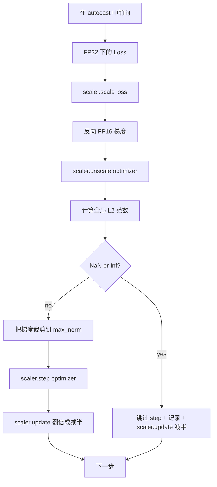

# 梯度裁剪与混合精度（Gradient Clipping and Mixed Precision）

> 译注：本文译自同目录 [`en.md`](./en.md)。术语遵循仓根 [TRANSLATION_GUIDE.md](../../../../TRANSLATION_GUIDE.md)。

> 上一课的 optimizer 与 schedule 假设 gradient 是健全的，但事实往往不是。仅仅一个糟糕的 batch 就能让 gradient norm 飙升三个数量级。混合精度训练（mixed-precision training）会从 loss 一侧引入 FP16 溢出，把这种风险进一步放大。本课构建生产训练不可或缺的两条安全带：把 gradient 裁剪到配置好的全局 L2 norm 阈值；以及一个带 autocast 与 GradScaler 的混合精度训练 loop，能检测 NaN 与 Inf、干净地跳过该步、并把 scaling factor 记录下来供事后分析。

**Type:** Build
**Languages:** Python
**Prerequisites:** Phase 19 lessons 30-37
**Time:** ~90 minutes

## 学习目标（Learning Objectives）

- 在所有参数 gradient 上计算全局 L2 norm，并在超过配置阈值时就地裁剪。
- 用 autocast 加 GradScaler 包裹训练步，让 FP16 的前向传播（forward pass）与反向传播（backpropagation）能够扛住溢出。
- 检测 loss 或 gradient 中的 NaN 与 Inf，跳过 optimizer step，并把跳过事件记录下来。
- 每一步都报告 GradScaler 的 scaling factor，让长时间连续跳过能立即可见。

## 问题（The Problem）

昨天还跑得干干净净的训练，今天在第 8,217 步时 loss 曲线垂直起飞。罪魁祸首是某个 batch 的 gradient norm 等于 4,200——是此前峰值的 20 倍。如果不做裁剪，optimizer 这一步就会把模型过去一小时学到的所有东西全部清零。如果在 norm 1.0 处做全局 L2 裁剪，同一个 batch 只会贡献一个单位 norm 的更新；loss 曲线维持原有趋势；这次训练得以存活。

混合精度训练把吞吐推高 2-3 倍，做法是用 FP16 执行前向传播和大部分反向传播。代价是 FP16 的指数范围很窄。一个在 FP16 下溢出的典型 gradient 会变成 Inf，并以 NaN 的形式向后续 layer 传播，最终在下一次 optimizer step 把每个权重都设成 NaN。PyTorch 的 GradScaler 解决这个问题的方式是：在反向传播前先把 loss 乘以一个大的 scaling factor，并在 optimizer step 之前再把 gradient 除以同一个因子。如果在 unscale 时刻有任何 gradient 是 Inf 或 NaN，scaler 就跳过这一步，并把 scaling factor 减半；如果前 N 步都是干净的，scaler 就把因子翻倍。在整个训练过程中，这个因子会自动找到 FP16 范围允许的最高值。

构建上的难点在于把这两件事正确接好线。如果在 unscale 之前裁剪，阈值就作用在缩放过的 gradient 上；如果在 unscale 之后裁剪，那么 GradScaler 上的操作顺序就至关重要。正确顺序是：`scaler.scale(loss).backward()`，然后 `scaler.unscale_(optimizer)`，然后 `clip_grad_norm_`，然后 `scaler.step(optimizer)`，最后 `scaler.update()`。任何其他顺序都会产生一个静默坏掉的 loop。

## 概念（The Concept）



### 全局 L2 norm（Global L2 norm）

全局 L2 norm 是把所有 gradient 拼成一个大向量后的欧氏 norm，而不是逐参数 norm。PyTorch 的实现是 `torch.nn.utils.clip_grad_norm_(parameters, max_norm)`。这个函数会返回裁剪前的 norm，本课正好用它把原始 norm 与裁剪后的 norm 都记录下来——这是诊断「我们每一步都在裁剪」这种情况所必需的。

### autocast 与 GradScaler（autocast and GradScaler）

`torch.amp.autocast(device_type)` 是一个 context manager，会有选择地把符合条件的 op（大部分 matmul 类 op）跑在 FP16 下。`torch.amp.GradScaler(device_type)` 则是个辅助器，负责在 backward 前给 loss 缩放、并在 optimizer step 前对 gradient 反向缩放。这两者是配套设计的；只用其中一个而不用另一个，是测试应该能逮住的配置错误。

本课使用 CPU autocast，因为 CI 上跑的就是这个；同样的模式只要把 `device_type="cpu"` 改成 `device_type="cuda"`，就能原封不动迁移到 CUDA。CPU 上的 GradScaler 是个 stub（CPU autocast 默认就在 BF16 下工作，不需要 loss scaling），但本课仍把调用点都写齐，让接线方式与 GPU loop 完全一致。

### NaN 与 Inf 检测（NaN and Inf detection）

检测发生在两处。第一处，在 backward 之前用 `torch.isfinite` 检查 loss 本身；Inf 或 NaN 的 loss 不会产生有用的 gradient，直接跳过、不进 optimizer。第二处，在 `scaler.unscale_(optimizer)` 之后，本课用 `has_non_finite_grad(...)` 扫描反向缩放后的 gradient，遇到任何 Inf 或 NaN 都视为一次跳过。两道检查合起来就覆盖了前向传播与反向传播两类失败模式。

### Scaling factor 诊断（Scaling factor diagnostics）

scaling factor 是 GradScaler 的内部状态。本课每一步都读取 `scaler.get_scale()`，把它和 learning rate、gradient norm 一起记录下来。一次健康的训练，scaling factor 会以 2 的幂次往上爬，直到饱和在 `2^17` 或 `2^18` 附近。一次跑歪的训练，因子会在高低值之间振荡，这就是「模型 gradient 时而落在范围内、时而落在范围外」的信号。没有这条日志，这个诊断指标就完全不可见。

## 动手实现（Build It）

`code/main.py` 实现了：

- `clip_global_l2_norm` —— 对 `torch.nn.utils.clip_grad_norm_` 的薄包装，返回裁剪前与裁剪后的 norm。
- `has_non_finite_grad` —— 扫描 gradient 是否含 NaN 或 Inf 的 helper。
- `AmpTrainState` —— 包装一个模型、一个 `AdamW` optimizer、一个 GradScaler 以及 autocast 设备。提供 `step(inputs, targets)`，跑完整的裁剪、缩放、NaN 跳过流水线。
- `StepLog` 与 `SkipLog` —— 结构化的逐步骤记录。
- 一个 demo：训练一个小的 `nn.Linear` 模型 20 步，在第 5 步往 gradient 里塞一个 Inf 来触发 skip 路径，并打印结果日志。

跑起来：

```bash
python3 code/main.py
```

脚本以 0 退出码退出，并打印每一步的日志，每行带有 `STEP` 或 `SKIP` 标记；至少有一行是 `SKIP`。

## 生产模式（Production Patterns）

四种模式能把这个 loop 提升到生产级训练步的水准。

**Skip 计数应该是告警，而不是日志行。** 一次训练里出现少量 skip 是健康的。每个 epoch 出现几百次 skip 就是硬性告警：模型已经进入 FP16 撑不住的区域，loop 在静默失败。本课跟踪一个 1,000 步的滚动窗口 skip 率，在生产环境下，超过 5% 就该 page on-call。

**裁剪阈值放进 config。** `max_norm = 1.0` 是当前 LLM 训练的默认值。先在小模型上 sweep 一下：阈值更大，模型能从真正困难的 batch 里恢复；阈值更小，能限制最坏情况，代价是 loss 曲线更吵。这个阈值应该和第 44 课的 schedule 写在同一份 YAML 或 JSON config 里。

**norm 日志和 schedule 一起写入 CSV。** CSV 列为 `step, lr, grad_l2_pre_clip, grad_l2_post_clip, loss, skipped, skip_reason, scaler_scale`。reviewer（评审者）打开文件，一行就能看完 schedule、gradient 故事、scaling factor、跳过结果（含原因）。把这些列拆到多个文件里，是分析互相对不上号的标准做法。

**`scaler.update()` 每一步都要跑，包括 skip 步。** 在干净的一步里，scaler 读取它的 no-inf 计数器、加一，并可能把因子翻倍。在跳过的一步里，scaler 把因子减半并重置计数器。在 skip 路径上忘了调 `update()`，就是「scaling factor 永远不变」这个 bug 的来源。

## 用起来（Use It）

生产模式：

- **autocast 设备要与 optimizer 设备一致。** GPU 训练用 `torch.amp.autocast(device_type="cuda")`；CPU 训练用 `torch.amp.autocast(device_type="cpu")`。设备搞混会产生一个静默的类型错误，表现为 loss 曲线看起来正常但模型其实没在学。
- **backward 前先检查 loss。** `torch.isfinite(loss).all()` 只是一次张量归约；成本可以忽略，而避免对一个 NaN loss 做 backward 能省掉一整个训练步。永远跑这一句。
- **`zero_grad` 里 `set_to_none=True`。** 把 gradient 设成 `None` 而不是零，让 optimizer 可以跳过未受影响参数组的计算。这个设置是免费的吞吐提升，外加略微缩小 bug 暴露面。

## 上线部署（Ship It）

`outputs/skill-clip-amp.md` 在真实项目里会说明：训练步使用哪个 clip 阈值、哪个 autocast 设备；逐步骤 CSV 在版本控制中存在哪里；生产 skip 率告警阈值是多少。本课交付的是引擎本身。

## 练习（Exercises）

1. 把人造 Inf 注入换成一次真实的 loss spike（把某个 batch 的 target 乘以 1e8），验证 skip 路径会被触发。
2. 增加一个 `--bf16` 模式，把 autocast 切到 BF16 而不是 FP16。BF16 的指数范围比 FP16 宽，一般不需要 loss scaling；验证 skip 率在同一个 demo 上掉到零。
3. 加一个单元测试：当不需要裁剪时，gradient 裁剪 wrapper 仍正确返回裁剪前与裁剪后的 norm。
4. 增加一个滚动窗口 skip 率计算，以及一个 CLI flag——当连续 100 步都超过配置阈值时让训练失败退出。
5. 把 loop 接好，写出规范 CSV（`step, lr, grad_l2_pre_clip, grad_l2_post_clip, loss, skipped, skip_reason, scaler_scale`），并通过每行写完即 flush，确认 Ctrl-C 后文件依然完好。

## 关键术语（Key Terms）

| Term | What people say | What it actually means |
|------|-----------------|------------------------|
| Global L2 norm | "Clip target" | 把所有可训练参数 gradient 拼成一个大向量后的欧氏 norm |
| autocast | "Mixed precision" | 在 `with` 块内对符合条件的 op 选择性地用 FP16（或 BF16）执行 |
| GradScaler | "Loss scaler" | 在 backward 前给 loss 乘缩放因子、在 optimizer step 前给 gradient 反向缩放的 helper |
| Skip | "Bad step" | 因为 gradient 或 loss 非有限值而被拒绝的一次 optimizer step；scaler 会把因子减半 |
| Scaling factor | "Scaler state" | GradScaler 当前的乘子；干净段后翻倍，每次 skip 后减半 |

## 延伸阅读（Further Reading）

- [Micikevicius et al., Mixed Precision Training (arXiv 1710.03740)](https://arxiv.org/abs/1710.03740) —— loss scaling 最早的提案
- [Pascanu, Mikolov, Bengio, On the difficulty of training recurrent neural networks (arXiv 1211.5063)](https://arxiv.org/abs/1211.5063) —— gradient 裁剪的参考论文
- [PyTorch torch.amp.GradScaler](https://docs.pytorch.org/docs/stable/amp.html) —— 本课所包装的 scaler API
- [PyTorch torch.nn.utils.clip_grad_norm_](https://docs.pytorch.org/docs/stable/generated/torch.nn.utils.clip_grad_norm_.html) —— 本课使用的裁剪原语
- Phase 19 · 42 —— 提供语料的下载器
- Phase 19 · 43 —— loop 所消费的 dataloader
- Phase 19 · 44 —— 与本 loop 组合在一起的 schedule
