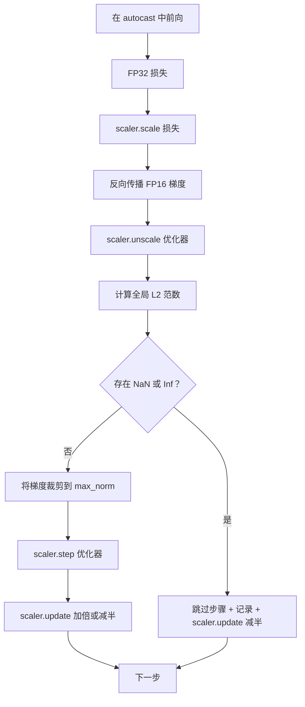

# 梯度裁剪与混合精度

> 上一课的优化器和调度器假设梯度是正常的。但通常并非如此。一个糟糕的批次就能让梯度范数飙升三个数量级。混合精度训练引入 FP16 在损失侧的溢出，进一步放大了这一问题。本课构建两个生产训练不可或缺的安全带：将梯度裁剪到配置的全局 L2 范数，以及一个包含 autocast 和 GradScaler 的混合精度循环——能够检测 NaN 和 Inf，干净地跳过步骤，并记录缩放因子以供事后分析。

**类型：** 构建
**语言：** Python
**前置条件：** 第 19 阶段 第 30–37 课
**预计时间：** ~90 分钟

## 学习目标

- 计算所有参数梯度的全局 L2 范数，并在其超过配置阈值时原地裁剪。
- 用 autocast 和 GradScaler 包装训练步骤，使 FP16 前向和反向传播能够应对溢出。
- 检测损失或梯度中的 NaN 和 Inf，跳过优化器步骤，并记录跳过的信息。
- 每一步报告 GradScaler 的缩放因子，使得长时间的连续跳过能够被即时发现。

## 问题描述

一个昨天还正常运行训练任务，在第 8,217 步时损失曲线突然垂直飙升。罪魁祸首是一个梯度范数高达 4,200 的批次——是之前峰值的二十倍。没有裁剪，优化器执行的一步更新就抹去了模型之前一个小时学到的一切。而使用全局 L2 裁剪（范数上限 1.0），同样的批次仅贡献了一个单位范数的更新；损失保持在趋势线上；训练得以存活。

混合精度训练通过在前向传播和大部分反向传播中使用 FP16，将吞吐量提升 2–3 倍。代价是 FP16 的指数范围很窄。一个在 FP16 中溢出的典型梯度会变成 Inf，并通过后续层传播为 NaN，最终在下一步优化器更新时将所有权重设为 NaN。PyTorch 的 GradScaler 解决了这一问题：在反向传播前将损失乘以一个较大的缩放因子，在优化器步骤前将梯度除以同样的因子。如果在反缩放（unscale）时发现任何梯度为 Inf 或 NaN，缩放器会跳过该步骤并将缩放因子减半；如果之前的 N 步都正常，缩放器则加倍该因子。随着训练的进行，该因子会找到 FP16 范围所允许的最高值。

构建的关键在于正确地衔接两者。如果在反缩放之前裁剪，阈值作用于的是缩放后的梯度；如果在反缩放之后裁剪，则 GradScaler 的操作顺序也很重要。正确的顺序是：`scaler.scale(loss).backward()`，然后 `scaler.unscale_(optimizer)`，接着 `clip_grad_norm_`，再 `scaler.step(optimizer)`，最后 `scaler.update()`。任何其他顺序都会导致一个无声崩溃的循环。

## 核心概念


```mermaid
flowchart TD
  Forward[在 autocast 中前向] --> Loss[FP32 损失]
  Loss --> Scale[scaler.scale 损失]
  Scale --> Backward[反向传播 FP16 梯度]
  Backward --> Unscale[scaler.unscale 优化器]
  Unscale --> NormCheck[计算全局 L2 范数]
  NormCheck --> Detect{存在 NaN 或 Inf？}
  Detect -- 是 --> Skip[跳过步骤 + 记录 + scaler.update 减半]
  Detect -- 否 --> Clip[将梯度裁剪到 max_norm]
  Clip --> StepOpt[scaler.step 优化器]
  StepOpt --> Update[scaler.update 加倍或减半]
  Update --> NextStep[下一步]
  Skip --> NextStep
```

### 全局 L2 范数

全局 L2 范数是拼接后的梯度向量的欧几里得范数，而非逐参数的范数。PyTorch 通过 `torch.nn.utils.clip_grad_norm_(parameters, max_norm)` 实现。该函数返回裁剪前的范数，以便本课可以同时记录自然值和裁剪后的值——这对于诊断"我们在每一步都在裁剪"的情况是必要的。

### autocast 和 GradScaler

`torch.amp.autocast(device_type)` 是一个上下文管理器，它选择性地将符合条件的操作（大多数矩阵乘法类操作）以 FP16 运行。`torch.amp.GradScaler(device_type)` 是一个辅助工具，在反向传播前缩放损失，并在优化器步骤前反向缩放梯度。两者是配套设计的；只用一个而不用另一个是测试应捕获的配置错误。

本课使用 CPU autocast，因为这是在 CI 中运行的方式；相同的模式可以通过将 `device_type="cpu"` 改为 `device_type="cuda"` 直接迁移到 CUDA。CPU 上的 GradScaler 是一个桩（stub，因为 CPU autocast 默认已使用 BF16，不需要损失缩放），但本课仍然包含了调用点，以确保接线方式与 GPU 循环完全一致。

### NaN 和 Inf 检测

检测在两个地方进行。首先，在反向传播前使用 `torch.isfinite` 检查损失本身；Inf 或 NaN 的损失不会产生有用的梯度，应在进入优化器之前跳过。其次，在 `scaler.unscale_(optimizer)` 之后，本课使用 `has_non_finite_grad(...)` 扫描反缩放后的梯度，将任何 Inf 或 NaN 视为跳过。两个检查共同覆盖了前向传播和反向传播两种故障模式。

### 缩放因子诊断

缩放因子是 GradScaler 的内部状态。每一步本课读取 `scaler.get_scale()` 并将其与学习率和梯度范数一起记录。一个健康的训练运行会显示缩放因子以 2 的幂次增长，直到在接近 $2^{17}$ 或 $2^{18}$ 时饱和。一个异常的运行会显示该因子在高值和低值之间振荡——这是模型梯度有时在范围内、有时不在的信号。没有日志记录，这个诊断信息是不可见的。

## 构建实现

`code/main.py` 实现了：

- `clip_global_l2_norm` — 对 `torch.nn.utils.clip_grad_norm_` 的一个封装，同时返回裁剪前和裁剪后的范数。
- `has_non_finite_grad` — 一个扫描梯度中 NaN 和 Inf 的辅助函数。
- `AmpTrainState` — 包装一个模型、一个 `AdamW` 优化器、一个 GradScaler 和一个 autocast 设备。暴露一个 `step(inputs, targets)` 方法，运行完整的裁剪、缩放和遇到 NaN 时跳过的流水线。
- `StepLog` 和 `SkipLog` — 结构化的逐步骤记录。
- 一个演示程序，训练一个小型 `nn.Linear` 模型 20 步，在第 5 步向梯度中注入一个 Inf 以触发跳过路径，并打印最终的日志。

运行方式：

```bash
python3 code/main.py
```

脚本以退出码 0 结束，并打印逐步骤的日志，每行标记为 `STEP` 或 `SKIP`；至少有一行为 `SKIP`。

## 生产环境模式

以下四个模式将循环提升为生产级训练步骤。

**跳过计数应作为告警，而非日志行。** 每次训练中少量跳过的步骤是正常的。但每个 epoch 数百次跳过则是严重告警：模型处于 FP16 无法支撑的状态，而循环正在无声地失败。本课跟踪一个 1,000 步的滚动跳过率，在生产环境中，如果超过 5% 则应当触发告警页面。

**裁剪阈值应位于配置中。** `max_norm = 1.0` 是当前语言模型训练的默认值。首先在小型模型上进行调参扫描；较大的阈值让模型能从真正困难的批次中恢复；较小的阈值则限制了最坏情况，代价是损失曲线更为嘈杂。该阈值应与第 44 课的调度器放在同一个 YAML 或 JSON 配置中。

**范数日志应与调度器日志放在同一个 CSV 中。** CSV 的列包括：`step, lr, grad_l2_pre_clip, grad_l2_post_clip, loss, skipped, skip_reason, scaler_scale`。评审者打开文件就能在一行中看到调度信息、梯度情况、缩放因子和跳过结果（含原因）。将这些列分散到多个文件会导致分析对不齐。

**`scaler.update()` 每一步都要执行，即使跳过了也要执行。** 在正常步骤上，缩放器读取其无 Inf 计数器，递增它，并可能加倍因子。在跳过的步骤上，缩放器将因子减半并重置计数器。在跳过路径上忘记调用 `update()` 是导致"缩放因子从未变化"的典型 bug。

## 使用建议

生产环境模式：

- **Autocast 设备应与优化器设备一致。** GPU 训练使用 `torch.amp.autocast(device_type="cuda")`；CPU 使用 `torch.amp.autocast(device_type="cpu")`。混用设备会产生静默的类型错误，表现为损失曲线看起来正常但模型没有在学习。
- **在反向传播前检查损失。** `torch.isfinite(loss).all()` 只是一个张量规约操作；其成本微不足道，而在 NaN 损失上节省的则是整个训练步骤。始终运行它。
- **`zero_grad` 使用 `set_to_none=True`。** 将梯度设为 `None` 而非零，这允许优化器跳过不受影响参数组的计算。这个设置能免费提升吞吐量，并略微减少 bug 出现的可能性。

## 交付产物

在实际项目中，`outputs/skill-clip-amp.md` 将描述训练步骤使用的裁剪阈值和 autocast 设备、逐步骤 CSV 在版本控制中的位置，以及生产环境中跳过率的告警阈值。本课交付的是引擎本身。

## 练习

1. 将人工注入 Inf 替换为真实的损失尖峰（将一个批次的目标值乘以 $10^8$），验证跳过路径被触发。
2. 添加一个 `--bf16` 模式，将 autocast 切换为 BF16 而非 FP16。BF16 的指数范围比 FP16 更宽，很少需要损失缩放；验证在同样的演示中跳过率降至零。
3. 添加一个单元测试，验证当不需要裁剪时，梯度裁剪封装能正确返回裁剪前和裁剪后的范数。
4. 添加一个滚动窗口跳过率计算，以及一个 CLI 标志，当跳过率连续 100 步超过配置阈值时，让训练运行失败。
5. 将循环改为写入规范的 CSV（`step, lr, grad_l2_pre_clip, grad_l2_post_clip, loss, skipped, skip_reason, scaler_scale`），并通过每行后刷新缓冲区来确认文件在 Ctrl-C 后不会丢失数据。

## 关键术语

| 术语 | 人们的说法 | 实际含义 |
|------|------------|---------|
| 全局 L2 范数 | "裁剪目标" | 所有可训练参数的拼接梯度向量的欧几里得范数 |
| autocast | "混合精度" | 在 `with` 块内选择性地以 FP16（或 BF16）执行符合条件的操作 |
| GradScaler | "损失缩放器" | 在反向传播前乘以损失、在优化器步骤前反缩放梯度的辅助工具 |
| 跳过（Skip） | "坏步骤" | 因梯度或损失非有限而被拒绝的优化器步骤；缩放器将因子减半 |
| 缩放因子 | "缩放器状态" | GradScaler 当前的乘数；在连续正常步骤后加倍，每次跳过后减半 |

## 扩展阅读

- [Micikevicius et al., Mixed Precision Training (arXiv 1710.03740)](https://arxiv.org/abs/1710.03740) — 原始损失缩放论文
- [Pascanu, Mikolov, Bengio, On the difficulty of training recurrent neural networks (arXiv 1211.5063)](https://arxiv.org/abs/1211.5063) — 梯度裁剪参考论文
- [PyTorch torch.amp.GradScaler](https://docs.pytorch.org/docs/stable/amp.html) — 本课封装的缩放器 API
- [PyTorch torch.nn.utils.clip_grad_norm_](https://docs.pytorch.org/docs/stable/generated/torch.nn.utils.clip_grad_norm_.html) — 本课使用的裁剪原语
- 第 19 阶段 · 第 42 课 — 为循环提供数据的下载器
- 第 19 阶段 · 第 43 课 — 循环消费的数据加载器
- 第 19 阶段 · 第 44 课 — 本循环组合使用的调度器
