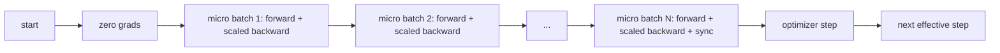
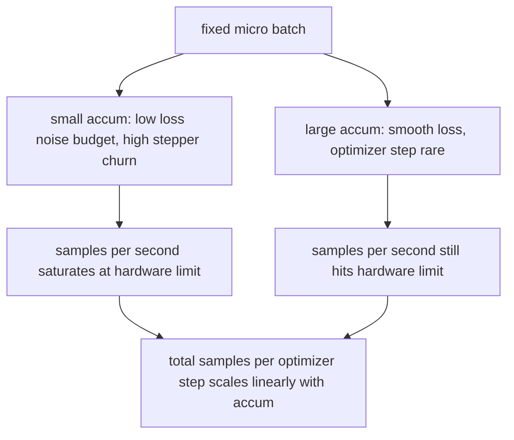

# Gradient Birikim

> Her seferinde bir mikro parti olmak üzere, gücünüzün yetmeyeceği etkili bir topluluğa eğitim verin. Kaybı ölçeklendirin, optimize edici adımını tutun ve gradient'ların birikmesine izin verin.

**Tür:** Yapım
**Diller:** Python
**Önkoşullar:** Aşama 19 dersleri 42 - 45
**Süre:** ~90 dakika

## Öğrenme Hedefleri

- Etkin toplu kimliği türetin: `effective_batch = micro_batch * accum_steps`.
- Birikmiş gradient'nin tek bir tam parti geriye doğru eşleşmesi için mikro parti başına kayıp ölçeklendirmesini uygulayın.
- Optimize edici senkronizasyonunu son mikro toplu işleme (son adımda senkronizasyon) kadar atlayın.
- Etkin parti eğrisine göre verimi okuyun ve azalan getiriyi açıklayın.

## Sorun

Etkili bir 512 kümesinde antrenman yapmak istiyorsunuz çünkü kayıp eğrisi daha yumuşaktır ve optimize edici adım bu ölçekte daha anlamlıdır. Masanın üzerindeki hızlandırıcının hafızası dolmadan önce 32 örnek tutar. Partiyi ikiye katlamak bir seçenek değil. Modeli yarıya indirmek bir seçenek değil. Alanın 2017'de ulaştığı ve asla kullanmayı bırakmadığı hile, 16 geriye doğru geçiş yapmak, gradient'ların parametre arabellekleri içinde birikmesine izin vermek ve optimize ediciyi yalnızca sayım hedefe ulaştığında adım atmaktır.

Risk, kaybın artık daha büyük partidekiyle aynı sayı olmamasıdır. Saf bir şekilde toplanan 16 mini partinin çapraz entropisi, bir tam partinin kaybının 16 katıdır. Ölçeklendirme olmadan gradient yönü doğrudur ancak büyüklük yanlıştır ve optimize edici adımı 16 kat fazla büyüktür. Düzeltme bir bölümdür. Düzeltmeyi unutmak da kolaydır.

## Konsept



Sözleşme kısa:

- Her mikro partinin kaybı, `backward()` öncesinde `accum_steps` 'ya bölünür. PyTorch varsayılan olarak gradient'ları `param.grad` 'ya toplar; bölme, toplam tutarı tekrar doğru ölçeğe iter.
- Optimize edici adım, son mikro parti geri döndükten sonra etkili parti başına bir kez tetiklenir. Birikimin ortasında adım atmak, çalışmanın geri kalanının bağlı olduğu her parametreyi çarpıtır.
- Optimize edicinin durumu (momentum tamponları, Adam momentleri), mikro parti başına bir kez değil, etkin adım başına bir kez ilerler. Aksi takdirde üstel hareketli ortalamalar yanlış frekansı görecek ve çizelgeyi bozacaktır.
- Tek bir cihazda bu defter tutmadır. Çok aşamalı bir kümede aynı model, nihai olmayan mikro yığınları, gradient all-reduce'u atlayan bir `no_sync` bağlamında sarar; son mikro-toplu, ağ maliyetini N kez ödemek yerine, birikmiş gradient miktarının tamamını tek geçişte azaltır.

### Koddaki eşdeğerlik kanıtı

```python
loss = criterion(model(x_full), y_full)
loss.backward()
opt.step()
```

eşdeğerdir

```python
for x, y in chunks(x_full, y_full, n):
    scaled = criterion(model(x), y) / n
    scaled.backward()
opt.step()
```

kayan nokta toplama sırasına kadar. Döngünün sonunda biriken gradient tamponu, tek bir tam toplu geriye doğru üretilecek olan tensörle aynıdır. Ders kodu bunu `equivalence_check`'da 1e-4'ün altında bir maksimum-karın farkıyla ileri sürer.

### Maliyet nereye gidiyor

Her mikro partinin bir ileri ve bir geri maliyeti vardır. Biriktirmeyle hafızayı zamanla değiştirirsiniz. `outputs/accum-curve.json` 'deki verim eğrisi, etkin parti sabit mikro partide büyüdükçe ne olacağını gösterir:



Bedava öğle yemeği yok. `accum_steps` değerinin iki katına çıkarılması, optimize edici adımı başına duvar süresini iki katına çıkarır. Değişiklikler, gradient tahmininin varyansıdır: aynı duvar bütçesiyle daha az optimize edici adım attınız ancak her birinin ortalaması daha fazla örnek üzerinden alındı. Literatür büyük partiyi ve küçük partiyi farklı optimizasyon problemleri olarak ele alır; Buradaki ders mekaniktir, istatistiksel değil.

## Build It — Kendin Geliştir

`code/main.py` çalıştırılabilir artifact'dır. Üç şey yapar.

### Adım 1: denklik kontrolü

`equivalence_check()` , aynı tohumla aynı ağın iki kopyasını oluşturur. Tek bir ileri geçişte 16 örneklik bir grup görülüyor. Diğeri, kaybın dörde bölündüğü dört adet 4 örnekli parça görüyor. İşlev, optimize edici adımdan önceki gradient arabelleklerini ve sonraki parametreleri karşılaştırır. İddia `max_abs_diff < 1e-4`'dir.

### Adım 2: son adımda senkronizasyon modeli

`train_one_optimizer_step` mikro partileri yürütüyor. Sonuncusu dışındaki her mikro parti için `no_sync_context(model)` girer. Tek bir süreçte bağlam işlem dışıdır; DDP'de gradient tümünü azaltmanın atlandığı yer burasıdır. Muhasebe ne olursa olsun aynıdır. Bir `sync_counter` , no_sync kapsamından kaç kez çıktığımızı kaydeder; N sayıda mikro parti için sayı, N değil, etkili adım başına birdir.

### Adım 3: üretim eğrisi

`sweep_effective_batches` aynı modeli sabit bir mikro parti ve birikim adımları listesiyle çalıştırır. Her ayar için günlüğe kaydeder:

- `samples_per_sec`: görülen toplam örneklerin duvar süresine bölümü
- `median_step_ms`: Etkili adım başına 50. yüzdelik dilim
- `sync_calls`: uygulanan toplu puanlar
- `avg_loss`: taramanın optimize edici adımlarındaki ortalama

Çıktı `outputs/accum-curve.json` 'ya ulaşır ve bir not defterinden yeniden kullanılabilir.

Çalıştır:

```bash
python3 code/main.py
```

Komut dosyası eşdeğerlik farkını, ardından süpürme tablosunu ve ardından JSON yolunu yazdırır. Sıfır koddan çıkın.

## Use It — Hazır Araçla Uygula

Üretim eğitiminde gradient birikimi tek düğmenin arkasında yaşar. PyTorch'un modeli `accumulation_steps = effective_batch // (micro_batch * world_size)` şeklindedir. Burada kullanmanıza izin verilmeyen Framework'ler aynı döngüyü sarar ancak adımlar aynıdır: kaybı ölçeklendirin, son olmayan mikrolarda senkronizasyonu atlayın, biriktirin, bir kez adım atın.

Vahşi doğada üç desen:

- Mikro parti boyutu, cihaz hafızasını doyurmak için seçilir. Daha küçük olan her şey hızlandırıcı döngülerini boşa harcar. Daha büyük olan her şey çöker.
- Etkin grup, öğrenme oranı çizelgesinden seçilir. Büyük etkili gruplar, ölçeklendirilmiş öğrenme oranlarına ve ısınmaya ihtiyaç duyar; bu, 2017'den beri konuşulan doğrusal ölçeklendirme kuralıdır.
- Biriktirme sayısı, ikisi arasındaki köprüdür ve çalışma zamanında veri yükleyiciyi yeniden yazmaya gerek kalmadan ayarlayabileceğiniz tek düğmedir.

## Ship It — Kullanıma Sun

`outputs/skill-gradient-accumulation.md` , bir eşin onu yeni bir depoya bırakabilmesi için tarifi yakalar: kaybı `accum_steps` ile ölçeklendirin, nihai olmayan mikrolar üzerinde optimize edici senkronizasyonunu atlayın, optimize ediciyi etkili toplu iş başına bir kez adımlayın, verimi JSON olarak etkili toplu iş karşısında günlüğe kaydedin, böylece ticaret görünür.

## Egzersizler

1. Taramayı `--num-steps 100` ile yeniden çalıştırın ve saniyedeki örnekleri etkin topluluğa göre çizin. Eğri nerede düzleşiyor?
2. Yanlış bir ölçeklendirme değişkeni ekleyin (bölme yok) ve 1. adımdaki diff parametresini referansa karşı gösterin.
3. SGD'yi AdamW ile değiştirin ve optimizer durumunun mikro parti başına bir kez değil, etkili adım başına bir kez ilerlediğini doğrulayın.
4. Gerçek bir `DistributedDataParallel` sarmalayıcısı ekleyin ve `no_sync_context` 'yi kendi yöntemine yönlendirin. Etkin toplu iş başına senkronizasyon_çağrılarının N-1 oranında düştüğünü doğrulayın.
5. İki farklı mikro bölmeyi (2'ye 8'e karşı 4'e 4) karşılaştırmak için eşdeğerlik kontrolünü değiştirin ve gevşemeniz gereken toleransı açıklayın.

## Anahtar Terimler

| Dönem | İnsanlar ne diyor | Aslında ne anlama geliyor |
|------|-----------------|------------------------|
| Mikro toplu | İlettiğiniz parti | Tek bir ileri geçişte belleğe sığan dilim |
| Biriktirme adımları | Adım başına geriye doğru paslar | Bir optimize edici adımdan önce geriye doğru toplananların sayısı |
| Etkili toplu | Toplu | Mikro toplu işlem süreleri, paralel dünya boyutundaki verilerin adım katları ile birleştirilir |
| Kayıp ölçeklendirme | N'ye Böl | Mikro grup başına bölünme, yani toplanan gradient'ler tam grupla eşleşir |
| En son senkronize et | Gerisini atla | gradient kollektifini yalnızca pencerenin sonuncusunda geriye doğru çalıştırın |

## Daha Fazla Okuma

- PyTorch, son adımda senkronizasyon hilesinin üretim sürümü için `DistributedDataParallel.no_sync` üzerinde belgeler.
- Goyal ve diğerleri, 2017, büyük toplu eğitim için doğrusal ölçeklendirme üzerine, etkili toplu işi önemsemenin kanonik nedeni.
- Karışık hassas ölçeklendirme ile gradient birikim etkileşimlerinde PyTorch sorun izleyicisi.
- Aşama 19 dersleri 42 ila 45, bu dersin üstlendiği modeli, veri yükleyiciyi, optimize ediciyi ve eğitmen iskelesini kapsar.
- Aşama 19 ders 47, kontrol noktasını ve devam etmeyi kapsar, böylece uzun bir biriktirme çalışması duvar saati sınırından sonra hayatta kalır.
