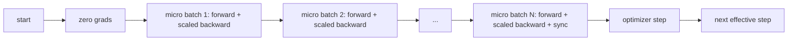
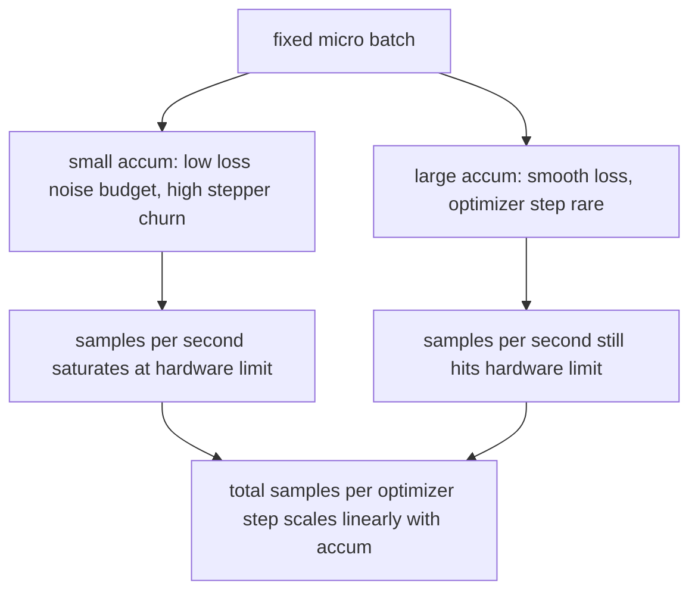

# 46 · 梯度累积

> 用你负担不起的有效批次大小来训练，一次一个微批次。缩放损失，推迟优化器步进，让梯度堆积起来。

**类型：** 构建
**语言：** Python
**前置：** 阶段 19 第 42 至 45 课
**时长：** 约 90 分钟

## 学习目标

- 推导有效批次恒等式：`effective_batch = micro_batch * accum_steps`。
- 实现每微批次损失缩放，使累积梯度与单次完整批次反向传播的结果一致。
- 跳过非最后一个微批次的优化器同步（sync-on-last-step，末步同步）。
- 阅读吞吐量相对有效批次的曲线，解释收益递减规律。

## 问题

你想以 512 的有效批次（effective batch）进行训练，因为损失曲线更平滑，优化器步进在该规模下也更有意义。但你桌上的加速器只能装 32 个样本就内存耗尽。加倍批次不可行，模型减半也不可行。业界在 2017 年找到并沿用至今的技巧是：执行 16 次反向传播（backward），让梯度在参数缓冲区中累积，当计数达到目标时才执行一次优化器步进。

风险在于，损失不再等于大批次时的那个数值。16 个小批次（mini-batch）的交叉熵简单求和，会是单次完整批次损失的 16 倍。不做缩放的话，梯度方向正确但幅度错误，优化器步进会大 16 倍。修正只需一次除法。但修正也很容易忘记。

## 概念



约定很简单：

- 每个微批次（micro-batch）的损失在 `backward()` 之前除以 `accum_steps`（累积步数）。PyTorch 默认将梯度累加到 `param.grad` 中；除法将运行总和拉回正确的尺度。
- 优化器步进在每个有效批次结束时触发一次，位于最后一个微批次的反向传播之后。在累积过程中执行步进会使后续运行所依赖的每个参数发生偏移。
- 优化器状态（动量缓冲区、Adam 矩）每有效步进更新一次，而非每个微批次更新一次。否则指数移动平均会以错误的频率观测，烧穿学习率调度。
- 在单设备上这只是簿记。在多卡集群上，同样的模式将非最后一个微批次包裹在 `no_sync` 上下文中，跳过梯度全规约（all-reduce）；最后一个微批次一次性规约完整的累积梯度，而不是支付 N 次网络开销。

### 代码中的等价性证明

```python
loss = criterion(model(x_full), y_full)
loss.backward()
opt.step()
```

等价于

```python
for x, y in chunks(x_full, y_full, n):
    scaled = criterion(model(x), y) / n
    scaled.backward()
opt.step()
```

两者差异仅限于浮点求和的顺序。循环结束时的累积梯度缓冲区与单次完整批次反向传播产生的张量相同。课程代码在 `equivalence_check` 中通过最大绝对差小于 1e-4 来断言这一点。

### 开销去向

每个微批次消耗一次前向传播和一次反向传播。通过累积，你用时间换取内存。`outputs/accum-curve.json` 中的吞吐量曲线展示了固定微批次下有效批次增长时的情况：



天下没有免费的午餐。将 `accum_steps` 翻倍，每个优化器步进的端到端耗时也翻倍。变化的是梯度估计的方差：在相同的端到端时间预算下，你执行了更少的优化器步进，但每一步都在更多样本上做了平均。文献中将大批次和小批次视为不同的优化问题；本课关注的是机制层面，而非统计层面。

## 动手构建

`code/main.py` 是可运行的产物。它做三件事。

### 步骤 1：等价性检查

`equivalence_check()` 使用相同种子构建同一网络的两个副本。一个以单次前向传播处理 16 个样本的批次。另一个以 4 次处理 4 个样本的切片，损失除以 4。该函数比较优化器步进前的梯度缓冲区和步进后的参数。断言为 `max_abs_diff < 1e-4`。

### 步骤 2：末步同步模式

`train_one_optimizer_step` 遍历微批次。对除最后一个之外的每个微批次，进入 `no_sync_context(model)`。在单进程中该上下文为空操作；在分布式数据并行（DistributedDataParallel，DDP）下，此处会跳过梯度全规约。无论哪种情况，簿记方式相同。`sync_counter` 记录离开 no_sync 作用域的次数；对于 N 个微批次，计数为每个有效步进一次，而非 N 次。

### 步骤 3：吞吐量曲线

`sweep_effective_batches` 以固定微批次和一系列累积步数运行同一模型。对每种配置，记录：

- `samples_per_sec`：已处理样本总数除以端到端耗时
- `median_step_ms`：每个有效步进的第 50 百分位耗时
- `sync_calls`：触发的集合通信次数
- `avg_loss`：横跨扫描中所有优化器步进的平均损失

输出写入 `outputs/accum-curve.json`，可在 notebook 中复用。

运行方式：

```bash
python3 code/main.py
```

脚本打印等价性差异，然后打印扫描表格，最后打印 JSON 路径。退出码为零。

## 实际使用

在生产训练中，梯度累积藏在一个旋钮背后。PyTorch 的模式是 `accumulation_steps = effective_batch // (micro_batch * world_size)`。此处不允许使用的框架封装了同样的循环，但步骤相同：缩放损失、跳过非最后一个微批次的同步、累积、步进一次。

实际中的三种模式：

- 微批次大小选择为使设备内存饱和。更小则浪费加速器周期，更大则崩溃。
- 有效批次根据学习率调度来选择。大有效批次需要缩放学习率和预热（warmup）；这是自 2017 年以来讨论的线性缩放规则（linear scaling rule）。
- 累积次数是二者之间的桥梁，也是运行时无需重写数据加载器即可调节的唯一旋钮。

## 交付

`outputs/skill-gradient-accumulation.md` 记录了这套配方，方便同事直接放入新仓库使用：损失除以 `accum_steps`、跳过非最后一个微批次的优化器同步、每个有效批次执行一次优化器步进、将吞吐量相对有效批次的数据记录为 JSON，使取舍可见。

## 练习

1. 用 `--num-steps 100` 重新运行扫描，绘制每秒样本数相对有效批次的曲线。曲线在哪里趋于平坦？
2. 添加一个错误的缩放变体（不做除法），展示第 1 步时与参考值的参数差异。
3. 将 SGD 替换为 AdamW，确认优化器状态每个有效步进更新一次，而非每个微批次更新一次。
4. 引入真正的 `DistributedDataParallel` 包装器，将 `no_sync_context` 路由到其方法。确认 `sync_calls` 每个有效批次降低 N-1 次。
5. 修改等价性检查，比较两种不同的微批次切分方式（2×8 对比 4×4），并说明需要放宽哪些容差。

## 关键术语

| 术语 | 人们的说法 | 实际含义 |
|------|-----------|----------|
| 微批次 | 你前向传播的批次 | 单次前向传播中能装入内存的切片 |
| 累积步数 | 每次步进的反向传播次数 | 一次优化器步进前累加的反向传播次数 |
| 有效批次 | 真正的批次 | 微批次 × 累积步数 × 数据并行世界大小 |
| 损失缩放 | 除以 N | 每个微批次除以 N，使累加梯度与完整批次一致 |
| 末步同步 | 跳过其余 | 仅在窗口内最后一次反向传播时执行梯度集合通信 |

## 延伸阅读

- PyTorch 文档中关于 `DistributedDataParallel.no_sync` 的内容，了解末步同步技巧的生产级实现。
- Goyal 等人，2017 年，关于大批次训练的线性缩放，关注有效批次的核心原因。
- PyTorch issue tracker 中关于梯度累积与混合精度（mixed precision） unscaling 交互的讨论。
- 阶段 19 第 42 至 45 课涵盖本课所依赖的模型、数据加载器、优化器和训练器框架。
- 阶段 19 第 47 课涵盖检查点与恢复，使长时间的累积运行能在端到端时限内存活。
