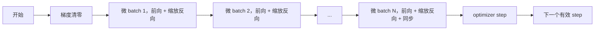
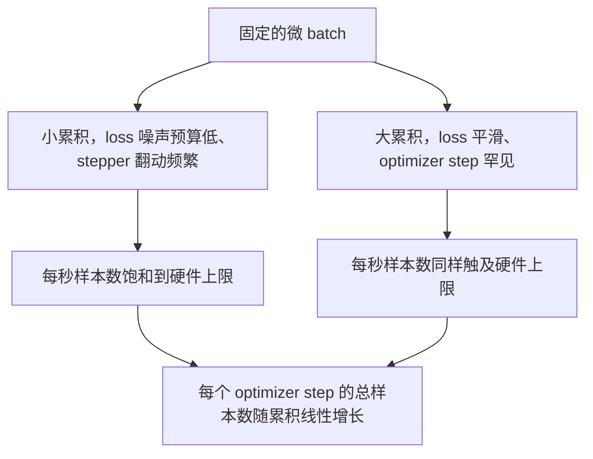

# 梯度累积（Gradient Accumulation）

> 译注：本文译自同目录 [`en.md`](./en.md)。术语遵循仓根 [TRANSLATION_GUIDE.md](../../../../TRANSLATION_GUIDE.md)。

> 用一次一个 micro-batch 的方式，训练你本来负担不起的 effective batch（等效批量）。把 loss（损失）缩放好，把 optimizer（优化器）的 step 攥在手里，让 gradient（梯度）一点一点堆起来。

**Type:** Build
**Languages:** Python
**Prerequisites:** Phase 19 lessons 42 to 45
**Time:** ~90 minutes

## 学习目标（Learning Objectives）

- 推导 effective batch 的恒等式：`effective_batch = micro_batch * accum_steps`。
- 实现「每个 micro-batch 上的 loss 缩放」，让累计后的 gradient 和单次完整 batch 的反向传播结果对齐。
- 在最后一个 micro-batch 之前跳过 optimizer 同步（sync-on-last-step）。
- 看懂「吞吐 vs effective batch」曲线，并解释收益递减的来由。

## 问题（The Problem）

你想以 512 的 effective batch 训练，因为这个尺度下 loss 曲线更平滑，optimizer 的 step 也更有意义。可桌上那块 accelerator（加速卡）一次最多塞下 32 个样本，再多就 OOM。把 batch 翻倍不可能，把模型砍半也不可能。2017 年这个领域捞到、之后再也没放下的招数是：跑 16 次反向传播，让 gradient 在参数 buffer 里累加，直到次数攒够才让 optimizer 走一步。

风险在于：现在算出来的 loss 已经不是大 batch 下的那个数了。把 16 个 mini-batch 的 cross entropy 直接相加，是单个完整 batch loss 的 16 倍。不缩放的话，gradient 方向是对的，但量级错了 16 倍，optimizer 的步子也就大了 16 倍。修法只是一次除法。这次除法也最容易忘。

## 概念（The Concept）



合约其实很短：

- 每个 micro-batch 的 loss 在 `backward()` 之前都要除以 `accum_steps`。PyTorch 默认会把 gradient 累加进 `param.grad`；这一除是把累计和拉回正确的尺度。
- optimizer 的 step 每个 effective batch 只触发一次，发生在最后一个 micro-batch 反向之后。在累积中途 step，会让接下来整轮训练所依赖的所有参数全跑偏。
- optimizer 的状态（动量 buffer、Adam 的 moment）每个 effective step 推进一次，不是每个 micro-batch 推进一次。否则那些指数滑动平均会看到错误的频率，把 schedule 烧穿。
- 单卡情形下这只是记账。多 rank 集群上，同样的写法会把非末尾的 micro-batch 包进 `no_sync` 上下文，跳过 gradient 的 all-reduce；最后一个 micro-batch 一次性把累积好的完整 gradient 做一次 reduce，省掉 N 次网络开销。

### 等价性的代码证明

```python
loss = criterion(model(x_full), y_full)
loss.backward()
opt.step()
```

等价于

```python
for x, y in chunks(x_full, y_full, n):
    scaled = criterion(model(x), y) / n
    scaled.backward()
opt.step()
```

差别只在浮点求和顺序。循环结束时累积下来的 gradient buffer，和单次完整 batch 反向传播得到的张量是同一个。课程代码用 `equivalence_check` 断言两者的最大绝对误差在 1e-4 以下。

### 代价花在哪里

每个 micro-batch 要付一次 forward 一次 backward。用累积换的是「内存换时间」。`outputs/accum-curve.json` 里的吞吐曲线展示了在固定 micro-batch、effective batch 不断变大时会发生什么：



天下没有免费的午餐。`accum_steps` 翻倍，每次 optimizer step 的 wall time 也翻倍。变化的是 gradient 估计的方差：在相同的 wall budget 下，你做了更少次 optimizer step，但每一步是在更多样本上平均出来的。文献把大 batch 和小 batch 当成两种不同的优化问题；本课讲的是机制，不是统计。

## 动手实现（Build It）

`code/main.py` 是可运行的产物，它做了三件事。

### Step 1：等价性检查（equivalence check）

`equivalence_check()` 用同一个 seed 构造两份相同的网络。一份在一次 forward 里看完 16 个样本。另一份分四个 4 样本的 chunk，每个 loss 除以 4。函数对比 optimizer step 之前的 gradient buffer 和 step 之后的参数。断言是 `max_abs_diff < 1e-4`。

### Step 2：sync-on-last-step 模式

`train_one_optimizer_step` 走每一个 micro-batch。除了最后一个，所有 micro-batch 都进入 `no_sync_context(model)`。单进程下这个上下文是 no-op；DDP 下就是在这里跳过 gradient 的 all-reduce。无论哪种，记账方式一样。`sync_counter` 记录我们离开 no_sync 作用域的次数；N 个 micro-batch，这个计数是「每个 effective step 一次」，而不是 N 次。

### Step 3：吞吐曲线

`sweep_effective_batches` 在固定 micro-batch、可变累积步数下跑同一个模型。每一档配置都会记录：

- `samples_per_sec`：总样本数除以 wall time
- `median_step_ms`：每个 effective step 的 50 分位耗时
- `sync_calls`：触发的集合通信点次数
- `avg_loss`：本次 sweep 中所有 optimizer step 的平均 loss

输出落在 `outputs/accum-curve.json`，可以从 notebook 里复用。

跑起来：

```bash
python3 code/main.py
```

脚本会先打印等价性差值，再打印 sweep 表格，最后是 JSON 路径。退出码 0。

## 用起来（Use It）

在生产训练里，梯度累积藏在一个旋钮后面。PyTorch 的写法是 `accumulation_steps = effective_batch // (micro_batch * world_size)`。那些这里不准用的框架，外面包的就是同一个循环，步骤一样：缩放 loss、非末尾 micro 跳过 sync、累积、step 一次。

野外常见的三种用法：

- micro-batch 的大小选在「刚好打满设备内存」的位置。再小就浪费 accelerator 周期，再大就崩。
- effective batch 由 learning rate schedule 决定。大的 effective batch 需要按比例放大学习率并配上 warmup；这就是 2017 年起一直在讲的 linear scaling rule。
- 累积步数是连接两者的桥梁，也是你在运行时唯一可以不重写 data loader 就调的旋钮。

## 上线部署（Ship It）

`outputs/skill-gradient-accumulation.md` 把这套 recipe（配方）记下来，方便同事直接搬到新仓里用：loss 除以 `accum_steps`、非末尾 micro 跳过 optimizer 同步、每个 effective batch 让 optimizer step 一次、把「吞吐 vs effective batch」以 JSON 落盘，让权衡看得见。

## 练习（Exercises）

1. 用 `--num-steps 100` 重跑 sweep，画出 samples per second 对 effective batch 的曲线。它在哪里开始平掉？
2. 加一个「错误缩放」变体（不除），并展示在第 1 步上和参考实现的参数差。
3. 把 SGD 换成 AdamW，确认 optimizer 状态是按 effective step 推进的，而不是按 micro-batch 推进。
4. 引入真正的 `DistributedDataParallel` 包装，把 `no_sync_context` 路由到它的方法上。验证每个 effective batch 的 sync_calls 减少了 N-1。
5. 改造等价性检查，对比两种不同的 micro 切分（2×8 vs 4×4），并解释你必须放宽哪些容差。

## 关键术语（Key Terms）

| 术语 | 大家嘴上说的 | 它实际指的是 |
|------|-----------------|------------------------|
| Micro batch | 你 forward 进去的那个 batch | 一次 forward 里能塞进内存的那一片 |
| Accum steps | 每个 step 跑几次反向 | 在一次 optimizer step 之前累加的反向传播次数 |
| Effective batch | 那个 batch | micro batch × accum steps × 数据并行 world size |
| Loss scaling | 除以 N | 在每个 micro-batch 上做一次除法，让累加的 gradient 对齐完整 batch |
| Sync on last | 别的都跳过 | 只在窗口内最后一次反向时执行 gradient 集合通信 |

## 延伸阅读（Further Reading）

- PyTorch 文档里 `DistributedDataParallel.no_sync` 的部分，是 sync-on-last-step 这招的生产级版本。
- Goyal et al., 2017，关于大 batch 训练的 linear scaling，正是「为什么要在意 effective batch」的经典依据。
- PyTorch issue tracker 上关于「梯度累积与混合精度 unscale 交互」的讨论。
- Phase 19 第 42–45 课，覆盖了本课假设你已经有的模型、data loader、optimizer 和 trainer 脚手架。
- Phase 19 第 47 课讲 checkpoint 与续训，让一次很长的累积训练能在 wallclock 上限下活下来。
